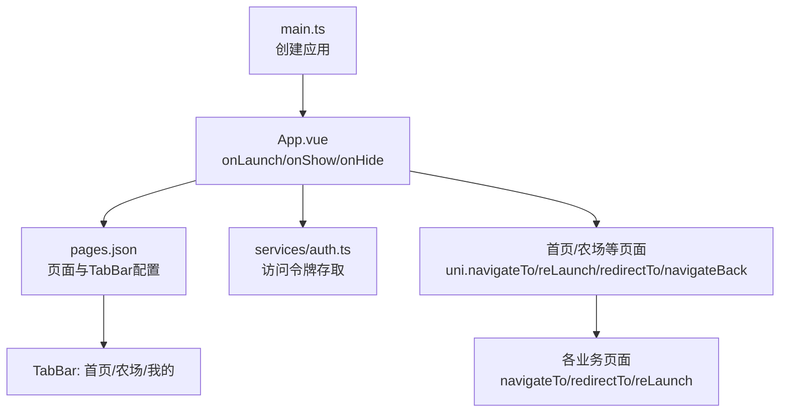
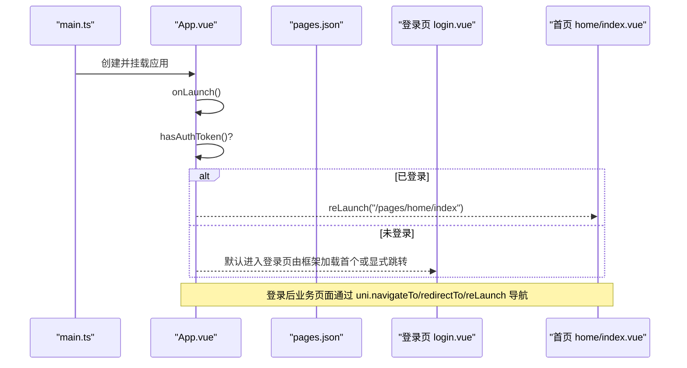
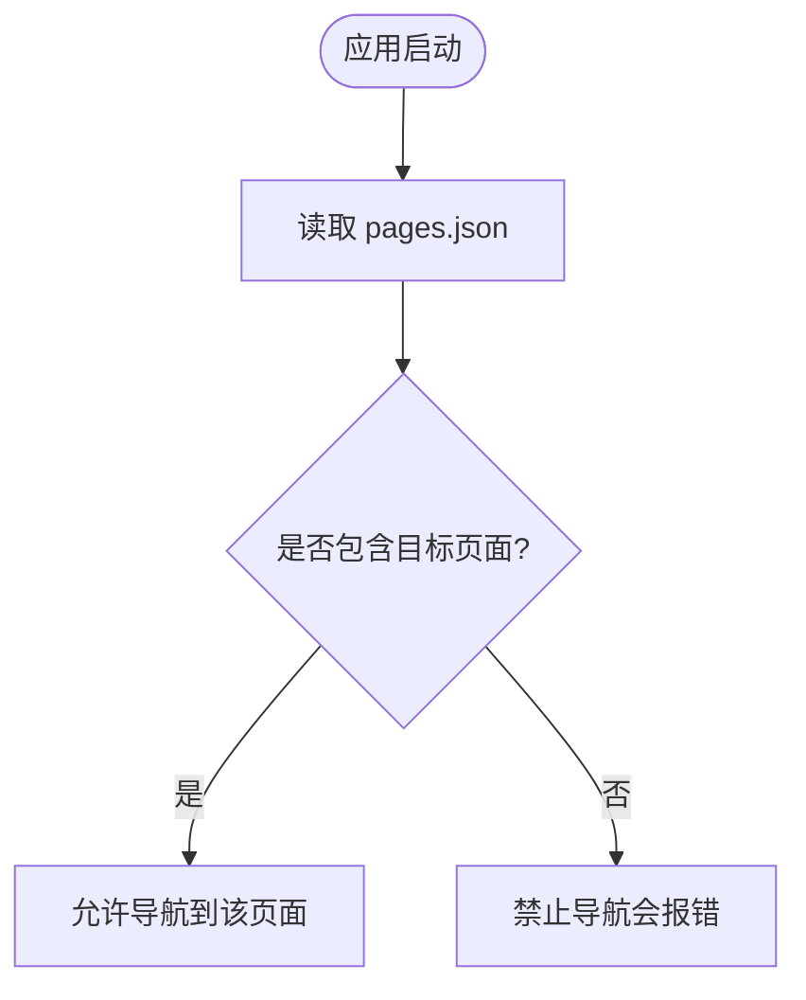
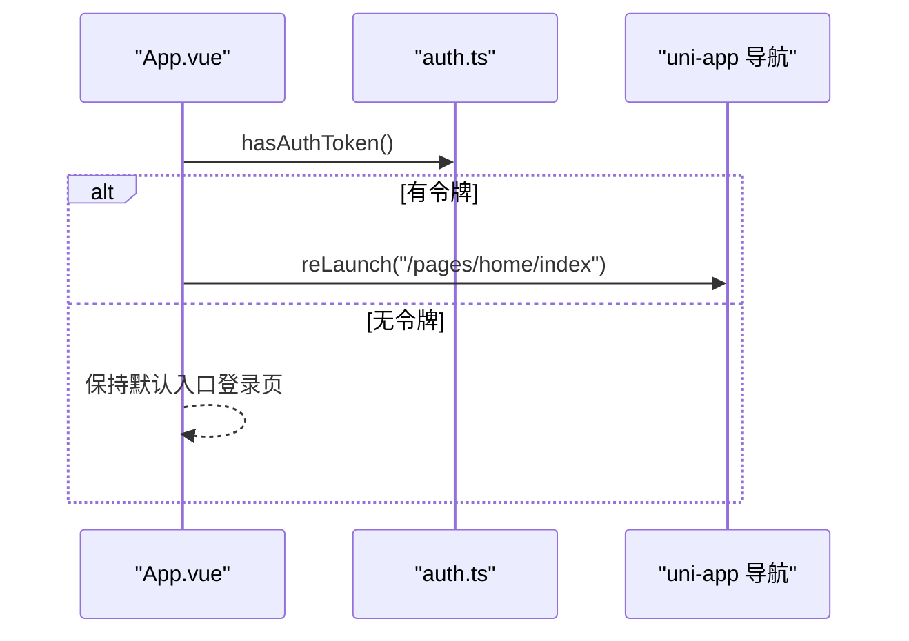
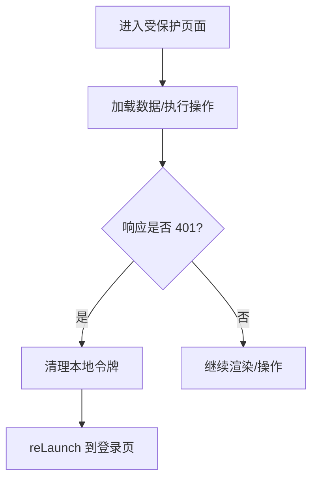
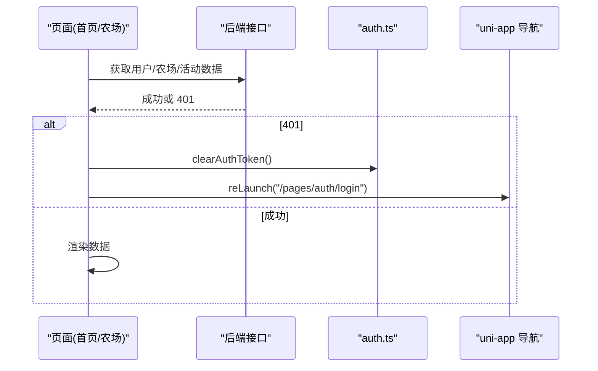
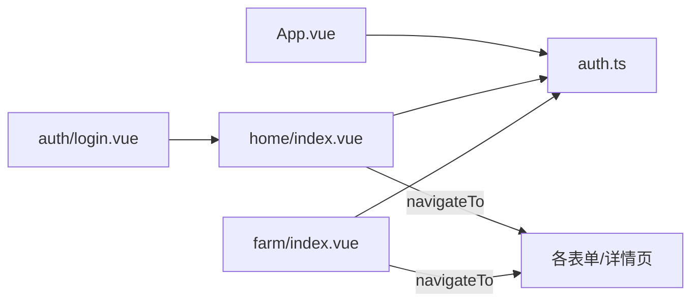

# 路由导航

<cite>
**本文引用的文件**
- [apps/miniapp/src/pages.json](file://apps/miniapp/src/pages.json)
- [apps/miniapp/src/App.vue](file://apps/miniapp/src/App.vue)
- [apps/miniapp/src/main.ts](file://apps/miniapp/src/main.ts)
- [apps/miniapp/src/services/auth.ts](file://apps/miniapp/src/services/auth.ts)
- [apps/miniapp/src/pages/auth/login.vue](file://apps/miniapp/src/pages/auth/login.vue)
- [apps/miniapp/src/pages/home/index.vue](file://apps/miniapp/src/pages/home/index.vue)
- [apps/miniapp/src/pages/farm/index.vue](file://apps/miniapp/src/pages/farm/index.vue)
- [apps/miniapp/src/components/PfPageHeader.vue](file://apps/miniapp/src/components/PfPageHeader.vue)
- [apps/miniapp/src/composables/useUnsavedChangesGuard.ts](file://apps/miniapp/src/composables/useUnsavedChangesGuard.ts)
</cite>

## 目录
1. [简介](#简介)
2. [项目结构](#项目结构)
3. [核心组件](#核心组件)
4. [架构总览](#架构总览)
5. [详细组件分析](#详细组件分析)
6. [依赖关系分析](#依赖关系分析)
7. [性能与优化](#性能与优化)
8. [故障排查](#故障排查)
9. [结论](#结论)
10. [附录：常见导航场景与最佳实践](#附录：常见导航场景与最佳实践)

## 简介
本文件面向 Pocket Farm 前端（UniApp）的路由导航系统，系统性说明基于 pages.json 的页面路由定义、应用启动流程、权限控制、页面间传参、路由守卫（数据预取与鉴权）、以及导航优化策略。文档以代码级事实为依据，配合图示帮助读者快速理解并正确扩展导航能力。

## 项目结构
Pocket Farm 小程序端采用 UniApp + Vue 3 技术栈，路由通过 pages.json 集中声明，TabBar 固定三个主入口；业务页面通过 uni-app 提供的导航 API 进行跳转与参数传递；全局生命周期在 App.vue 中处理初始跳转；认证状态与当前农场上下文分别通过 services/auth.ts 与 services/farm-context.ts 管理。

图表来源
- [apps/miniapp/src/main.ts:1-9](file://apps/miniapp/src/main.ts#L1-L9)
- [apps/miniapp/src/App.vue:1-25](file://apps/miniapp/src/App.vue#L1-L25)
- [apps/miniapp/src/pages.json:1-217](file://apps/miniapp/src/pages.json#L1-L217)

章节来源
- [apps/miniapp/src/pages.json:1-217](file://apps/miniapp/src/pages.json#L1-L217)
- [apps/miniapp/src/App.vue:1-25](file://apps/miniapp/src/App.vue#L1-L25)
- [apps/miniapp/src/main.ts:1-9](file://apps/miniapp/src/main.ts#L1-L9)

## 核心组件
- 路由配置中心：pages.json 声明所有页面路径、样式与 TabBar 列表。
- 应用启动器：App.vue 监听 onLaunch 并根据是否持有访问令牌决定初始路由。
- 认证服务：auth.ts 提供令牌读取、写入、清除与存在性判断。
- 页面导航：各页面使用 uni.navigateTo / redirectTo / reLaunch / navigateBack 完成跳转。
- 自定义头部：PfPageHeader.vue 封装返回按钮与标题区域，统一交互。
- 未保存变更保护：useUnsavedChangesGuard.ts 在非平台能力下降级，避免误拦截。

章节来源
- [apps/miniapp/src/pages.json:1-217](file://apps/miniapp/src/pages.json#L1-L217)
- [apps/miniapp/src/App.vue:1-25](file://apps/miniapp/src/App.vue#L1-L25)
- [apps/miniapp/src/services/auth.ts:1-18](file://apps/miniapp/src/services/auth.ts#L1-L18)
- [apps/miniapp/src/components/PfPageHeader.vue:1-130](file://apps/miniapp/src/components/PfPageHeader.vue#L1-L130)
- [apps/miniapp/src/composables/useUnsavedChangesGuard.ts:1-27](file://apps/miniapp/src/composables/useUnsavedChangesGuard.ts#L1-L27)

## 架构总览
下图展示从应用启动到首屏渲染与鉴权跳转的整体流程，以及后续页面间的导航关系。

图表来源
- [apps/miniapp/src/main.ts:1-9](file://apps/miniapp/src/main.ts#L1-L9)
- [apps/miniapp/src/App.vue:1-25](file://apps/miniapp/src/App.vue#L1-L25)
- [apps/miniapp/src/pages.json:1-217](file://apps/miniapp/src/pages.json#L1-L217)
- [apps/miniapp/src/pages/auth/login.vue:158-187](file://apps/miniapp/src/pages/auth/login.vue#L158-L187)
- [apps/miniapp/src/pages/home/index.vue:255-263](file://apps/miniapp/src/pages/home/index.vue#L255-L263)

## 详细组件分析

### 路由配置（pages.json）
- 页面注册：所有业务页面均在 pages 数组中声明 path 与 style，例如登录、首页、农场、我的及各类表单与详情页。
- 导航栏样式：每个页面可独立设置 navigationBarTitleText、navigationStyle 等。
- 全局样式：globalStyle 统一设置主题色、文字样式等。
- 底部 TabBar：list 中定义了三个主入口（首页、农场、我的），用于常驻切换。

图表来源
- [apps/miniapp/src/pages.json:1-217](file://apps/miniapp/src/pages.json#L1-L217)

章节来源
- [apps/miniapp/src/pages.json:1-217](file://apps/miniapp/src/pages.json#L1-L217)

### 应用启动与初始跳转（App.vue）
- onLaunch：检查本地是否存在访问令牌，若存在则直接跳转到首页；否则停留在登录页或等待用户登录。
- onShow/onHide：可用于后续的全局状态同步或埋点（当前为空实现）。

图表来源
- [apps/miniapp/src/App.vue:1-25](file://apps/miniapp/src/App.vue#L1-L25)
- [apps/miniapp/src/services/auth.ts:1-18](file://apps/miniapp/src/services/auth.ts#L1-L18)

章节来源
- [apps/miniapp/src/App.vue:1-25](file://apps/miniapp/src/App.vue#L1-L25)
- [apps/miniapp/src/services/auth.ts:1-18](file://apps/miniapp/src/services/auth.ts#L1-L18)

### 权限控制与受保护页面
- 登录态校验：多处页面在请求失败时检测 401 状态码，清理令牌并重定向至登录页。
- 典型位置：
  - 首页：onShow 中获取用户信息与仪表盘数据，若 401 则跳转登录。
  - 农场页：加载概览数据时若 401 则跳转登录。
  - 其他业务页：在关键操作后或数据加载失败时统一处理 401。

图表来源
- [apps/miniapp/src/pages/home/index.vue:159-203](file://apps/miniapp/src/pages/home/index.vue#L159-L203)
- [apps/miniapp/src/pages/farm/index.vue:155-197](file://apps/miniapp/src/pages/farm/index.vue#L155-L197)
- [apps/miniapp/src/services/auth.ts:1-18](file://apps/miniapp/src/services/auth.ts#L1-L18)

章节来源
- [apps/miniapp/src/pages/home/index.vue:159-203](file://apps/miniapp/src/pages/home/index.vue#L159-L203)
- [apps/miniapp/src/pages/farm/index.vue:155-197](file://apps/miniapp/src/pages/farm/index.vue#L155-L197)
- [apps/miniapp/src/services/auth.ts:1-18](file://apps/miniapp/src/services/auth.ts#L1-L18)

### 页面间传参与数据传递机制
- URL 查询参数：通过 navigateTo 的 url 拼接 query 参数，如 farmId、productionId、plotId 等，被目标页面通过 uni 的 page 参数获取。
- 示例路径：
  - 首页 -> 开始种养：携带 farmId
  - 首页 -> 记录农事：携带 farmId
  - 首页 -> 记录收获：携带 farmId
  - 首页 -> 地块列表：携带 farmId
  - 农场页 -> 地块详情：携带 plotId
  - 农场页 -> 生产详情：携带 productionId
- 注意事项：
  - 对敏感或复杂对象不建议仅通过 URL 传递，应结合本地存储或全局状态。
  - 跨 Tab 页面无法使用 navigateTo，需使用 switchTab。

章节来源
- [apps/miniapp/src/pages/home/index.vue:205-253](file://apps/miniapp/src/pages/home/index.vue#L205-L253)
- [apps/miniapp/src/pages/farm/index.vue:167-185](file://apps/miniapp/src/pages/farm/index.vue#L167-L185)

### 路由守卫：数据预取与权限验证
- 数据预取：
  - 首页：onShow 中并发获取当前用户信息、刷新农场上下文，并加载最近动态。
  - 农场页：onShow 中刷新农场上下文并加载概览数据。
- 权限验证：
  - 在数据加载过程中捕获 401，清理令牌并跳转登录。
  - 登录成功后，登录页使用 reLaunch 跳转到首页，清空历史栈。

图表来源
- [apps/miniapp/src/pages/home/index.vue:255-263](file://apps/miniapp/src/pages/home/index.vue#L255-L263)
- [apps/miniapp/src/pages/farm/index.vue:187-197](file://apps/miniapp/src/pages/farm/index.vue#L187-L197)
- [apps/miniapp/src/pages/auth/login.vue:158-187](file://apps/miniapp/src/pages/auth/login.vue#L158-L187)

章节来源
- [apps/miniapp/src/pages/home/index.vue:255-263](file://apps/miniapp/src/pages/home/index.vue#L255-L263)
- [apps/miniapp/src/pages/farm/index.vue:187-197](file://apps/miniapp/src/pages/farm/index.vue#L187-L197)
- [apps/miniapp/src/pages/auth/login.vue:158-187](file://apps/miniapp/src/pages/auth/login.vue#L158-L187)

### 导航优化策略：缓存与懒加载
- 页面缓存：
  - 使用 navigateTo 打开新页面会保留上一页在页面栈中，适合表单填写后返回列表的场景。
  - 使用 redirectTo 替换当前页面，适用于提交成功后不再需要返回原页面的场景。
  - 使用 reLaunch 关闭所有页面并打开新页面，适用于登录成功后的全局重置。
- 懒加载：
  - 将非首屏模块拆分为子页面，按需跳转加载，减少首屏资源体积。
  - 列表页采用分页加载，避免一次性拉取大量数据。
- 返回体验：
  - 自定义 PfPageHeader 统一返回行为，必要时结合 useUnsavedChangesGuard 提示未保存内容。

章节来源
- [apps/miniapp/src/components/PfPageHeader.vue:37-43](file://apps/miniapp/src/components/PfPageHeader.vue#L37-L43)
- [apps/miniapp/src/composables/useUnsavedChangesGuard.ts:1-27](file://apps/miniapp/src/composables/useUnsavedChangesGuard.ts#L1-L27)

## 依赖关系分析
- App.vue 依赖 auth.ts 进行令牌判断，并触发导航。
- 各业务页面依赖 services/* 进行数据请求，并在 401 时调用 auth.ts 清理令牌并导航。
- 页面之间通过 uni 导航 API 耦合，形成以 pages.json 为边界的弱耦合结构。

图表来源
- [apps/miniapp/src/App.vue:1-25](file://apps/miniapp/src/App.vue#L1-L25)
- [apps/miniapp/src/pages/home/index.vue:205-253](file://apps/miniapp/src/pages/home/index.vue#L205-L253)
- [apps/miniapp/src/pages/farm/index.vue:167-185](file://apps/miniapp/src/pages/farm/index.vue#L167-L185)
- [apps/miniapp/src/pages/auth/login.vue:158-187](file://apps/miniapp/src/pages/auth/login.vue#L158-L187)

章节来源
- [apps/miniapp/src/App.vue:1-25](file://apps/miniapp/src/App.vue#L1-L25)
- [apps/miniapp/src/pages/home/index.vue:205-253](file://apps/miniapp/src/pages/home/index.vue#L205-L253)
- [apps/miniapp/src/pages/farm/index.vue:167-185](file://apps/miniapp/src/pages/farm/index.vue#L167-L185)
- [apps/miniapp/src/pages/auth/login.vue:158-187](file://apps/miniapp/src/pages/auth/login.vue#L158-L187)

## 性能与优化
- 首屏优化：
  - 仅在 App.vue 中进行最小化初始化逻辑，避免阻塞启动。
  - 首页与农场页在 onShow 中并行请求必要数据，缩短感知加载时间。
- 导航选择：
  - 列表->详情：navigateTo（保留栈，支持返回）。
  - 提交成功：redirectTo（替换当前页，避免多余栈）。
  - 登录成功：reLaunch（清空栈，回到主入口）。
- 防抖与节流：
  - 对频繁触发的导航或数据加载建议增加防抖/节流，避免重复请求。
- 资源拆分：
  - 将大页面按功能拆分为子页面，按需加载，降低包体与内存占用。

[本节为通用指导，不直接分析具体文件]

## 故障排查
- 常见问题
  - 登录后仍停留在登录页：检查登录成功后是否正确调用 reLaunch 到首页。
  - 页面 401 未跳转：确认数据请求错误分支是否清理令牌并跳转。
  - 无法返回：检查是否使用了 redirectTo 替换了页面栈，或自定义返回逻辑是否覆盖默认行为。
  - 未保存内容丢失：在表单页启用 useUnsavedChangesGuard，确保离开前提示。
- 定位方法
  - 在 onShow/onLoad 中打印当前页面栈与参数，确认导航链路与传参是否正确。
  - 检查 pages.json 是否包含目标页面路径，避免非法跳转。

章节来源
- [apps/miniapp/src/pages/auth/login.vue:158-187](file://apps/miniapp/src/pages/auth/login.vue#L158-L187)
- [apps/miniapp/src/pages/home/index.vue:159-203](file://apps/miniapp/src/pages/home/index.vue#L159-L203)
- [apps/miniapp/src/pages/farm/index.vue:155-197](file://apps/miniapp/src/pages/farm/index.vue#L155-L197)
- [apps/miniapp/src/composables/useUnsavedChangesGuard.ts:1-27](file://apps/miniapp/src/composables/useUnsavedChangesGuard.ts#L1-L27)

## 结论
本项目采用 UniApp 原生路由体系，通过 pages.json 集中管理页面与 TabBar，结合 App.vue 的生命周期钩子实现启动期鉴权与初始跳转；业务页面在 onShow 中完成数据预取与权限校验，并通过 uni 导航 API 完成页面间跳转与传参。整体结构清晰、职责明确，便于扩展与维护。

[本节为总结，不直接分析具体文件]

## 附录：常见导航场景与最佳实践
- 登录成功后进入首页
  - 使用 reLaunch 跳转到首页，清空历史栈，避免回退到登录页。
  - 参考：登录页登录成功后跳转首页。
- 列表进入详情
  - 使用 navigateTo 并携带 id 参数，详情页根据参数加载数据。
  - 参考：首页/农场页跳转到生产详情、地块详情。
- 表单提交成功
  - 使用 redirectTo 替换当前页，避免多余页面栈。
  - 参考：创建农场后返回列表。
- 退出登录
  - 清理本地令牌并 reLaunch 到登录页。
  - 参考：多处在 401 时清理令牌并跳转。
- 返回确认
  - 在表单页启用未保存变更保护，防止误离开。
  - 参考：useUnsavedChangesGuard。

章节来源
- [apps/miniapp/src/pages/auth/login.vue:158-187](file://apps/miniapp/src/pages/auth/login.vue#L158-L187)
- [apps/miniapp/src/pages/home/index.vue:205-253](file://apps/miniapp/src/pages/home/index.vue#L205-L253)
- [apps/miniapp/src/pages/farm/index.vue:167-185](file://apps/miniapp/src/pages/farm/index.vue#L167-L185)
- [apps/miniapp/src/composables/useUnsavedChangesGuard.ts:1-27](file://apps/miniapp/src/composables/useUnsavedChangesGuard.ts#L1-L27)