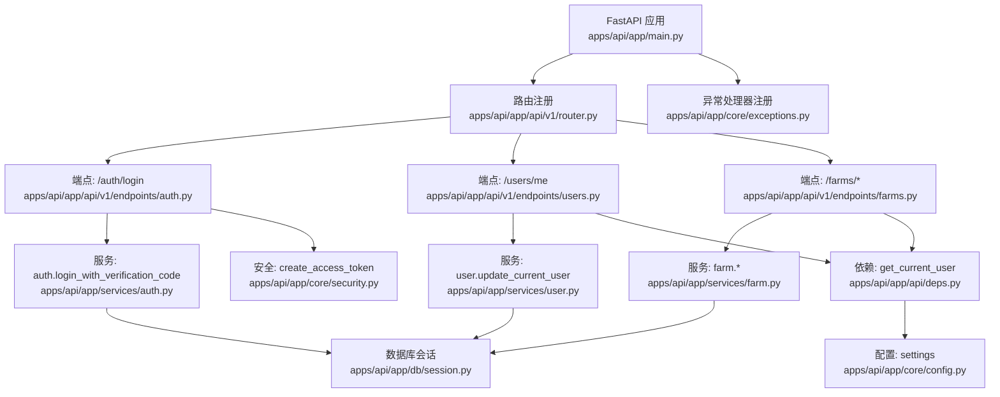
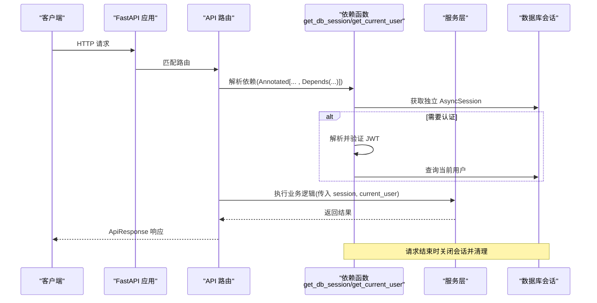
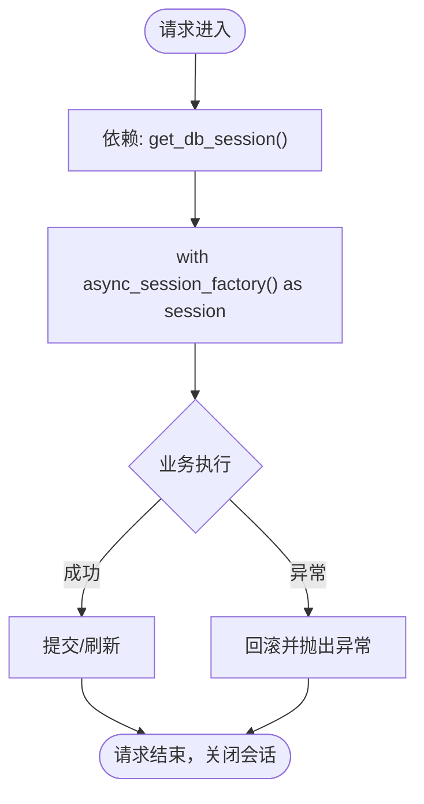
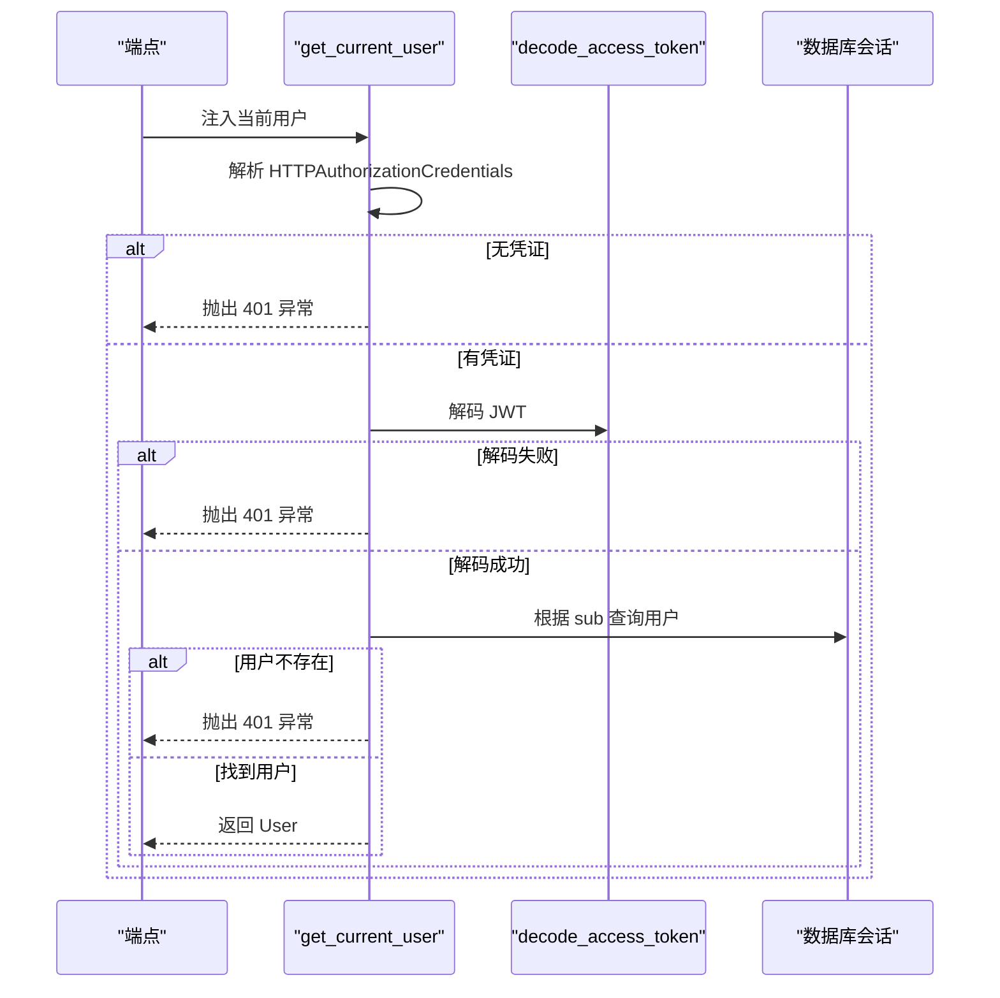
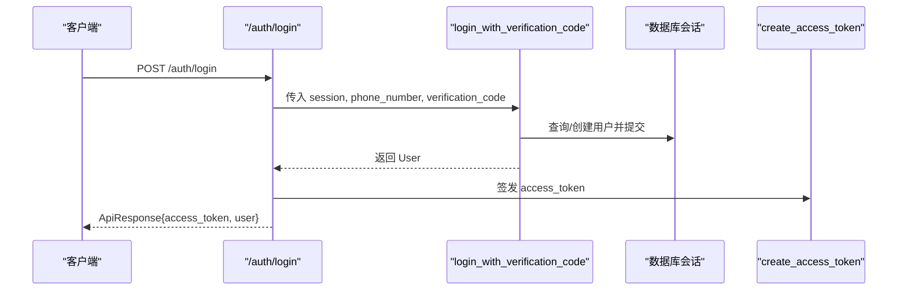
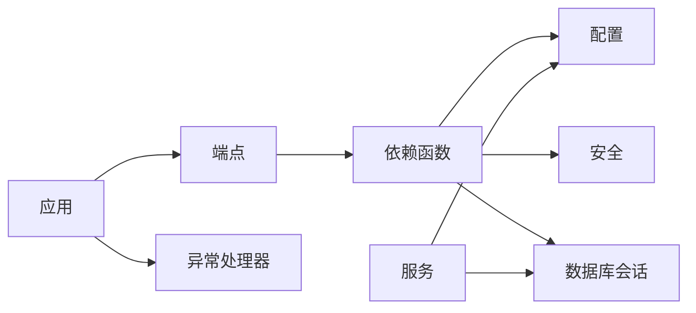

# 依赖注入容器

<cite>
**本文引用的文件**
- [main.py](file://apps/api/app/main.py)
- [deps.py](file://apps/api/app/api/deps.py)
- [config.py](file://apps/api/app/core/config.py)
- [session.py](file://apps/api/app/db/session.py)
- [security.py](file://apps/api/app/core/security.py)
- [auth.py](file://apps/api/app/services/auth.py)
- [users.py](file://apps/api/app/api/v1/endpoints/users.py)
- [farms.py](file://apps/api/app/api/v1/endpoints/farms.py)
- [exceptions.py](file://apps/api/app/core/exceptions.py)
- [error_codes.py](file://apps/api/app/core/error_codes.py)
- [response.py](file://apps/api/app/schemas/response.py)
</cite>

## 目录
1. [简介](#简介)
2. [项目结构](#项目结构)
3. [核心组件](#核心组件)
4. [架构总览](#架构总览)
5. [详细组件分析](#详细组件分析)
6. [依赖关系分析](#依赖关系分析)
7. [性能考量](#性能考量)
8. [故障排查指南](#故障排查指南)
9. [结论](#结论)
10. [附录](#附录)

## 简介
本文件面向 Pocket Farm 后端，系统化阐述基于 FastAPI 的依赖注入（DI）容器设计与使用模式。内容覆盖配置管理、数据库会话、认证服务等核心依赖的声明与注入方式；解释依赖生命周期与单例/作用域控制；给出扩展 DI 容器的实践方法；并通过具体代码路径示例展示依赖声明、注入与使用模式；最后总结 DI 的优势与最佳实践，包括解耦、可测试性、配置管理与性能优化。

## 项目结构
Pocket Farm 后端采用分层组织：应用入口负责创建 FastAPI 实例并注册路由与异常处理器；API 层通过依赖函数提供共享资源（如数据库会话、当前用户）；服务层封装业务逻辑；数据访问通过 SQLAlchemy 异步引擎与会话工厂；配置集中管理于 Settings。

图表来源
- [main.py:13-24](file://apps/api/app/main.py#L13-L24)
- [deps.py:19-65](file://apps/api/app/api/deps.py#L19-L65)
- [session.py:1-7](file://apps/api/app/db/session.py#L1-L7)
- [security.py:8-28](file://apps/api/app/core/security.py#L8-L28)
- [auth.py:11-46](file://apps/api/app/services/auth.py#L11-L46)
- [users.py:15-29](file://apps/api/app/api/v1/endpoints/users.py#L15-L29)
- [farms.py:58-199](file://apps/api/app/api/v1/endpoints/farms.py#L58-L199)

章节来源
- [main.py:13-24](file://apps/api/app/main.py#L13-L24)

## 核心组件
- 配置管理：通过 Pydantic Settings 集中加载环境变量与 .env，暴露 app_name、database_url、jwt_* 等关键配置项。
- 数据库会话：使用 SQLAlchemy 异步引擎与会话工厂，按请求范围提供独立 AsyncSession，并在异常时回滚。
- 认证服务：从请求头解析 JWT，校验签名与过期，查询当前用户；登录流程支持验证码登录并生成访问令牌。
- 安全工具：JWT 签发与解码，读取配置中的密钥与算法。
- 异常处理：统一 AppException 与错误码，注册全局异常处理器，输出一致的 ApiResponse 格式。

章节来源
- [config.py:5-22](file://apps/api/app/core/config.py#L5-L22)
- [session.py:1-7](file://apps/api/app/db/session.py#L1-L7)
- [deps.py:19-65](file://apps/api/app/api/deps.py#L19-L65)
- [security.py:8-28](file://apps/api/app/core/security.py#L8-L28)
- [exceptions.py:13-87](file://apps/api/app/core/exceptions.py#L13-L87)
- [error_codes.py:4-12](file://apps/api/app/core/error_codes.py#L4-L12)
- [response.py:16-39](file://apps/api/app/schemas/response.py#L16-L39)

## 架构总览
下图展示了 FastAPI 请求在依赖注入容器中的流转：端点声明依赖，框架按需解析依赖图，为每个请求提供独立的数据库会话与当前用户上下文，调用服务层完成业务逻辑，最终返回统一响应。

图表来源
- [deps.py:19-65](file://apps/api/app/api/deps.py#L19-L65)
- [session.py:1-7](file://apps/api/app/db/session.py#L1-L7)
- [users.py:15-29](file://apps/api/app/api/v1/endpoints/users.py#L15-L29)
- [farms.py:58-199](file://apps/api/app/api/v1/endpoints/farms.py#L58-L199)

## 详细组件分析

### 配置管理（Settings）
- 设计要点：使用 BaseSettings 集中管理配置，支持 .env 与环境变量；包含应用名、调试开关、API 前缀、数据库连接、JWT 密钥与算法、过期时间、时区、测试登录开关等。
- 使用位置：应用启动时用于构建 FastAPI 实例、注册路由前缀；安全模块用于签发与解码 JWT；服务中用于条件逻辑（如测试登录）。
- 扩展建议：新增配置项时保持命名一致，必要时增加默认值与类型约束；敏感信息使用 SecretStr。

章节来源
- [config.py:5-22](file://apps/api/app/core/config.py#L5-L22)
- [main.py:19-24](file://apps/api/app/main.py#L19-L24)
- [security.py:8-28](file://apps/api/app/core/security.py#L8-L28)
- [auth.py:11-22](file://apps/api/app/services/auth.py#L11-L22)

### 数据库会话（AsyncSession）
- 设计要点：通过 async_sessionmaker 创建会话工厂；依赖函数在每个请求内 yield 一个独立会话，异常时执行 rollback，确保事务一致性。
- 生命周期：请求开始创建，请求结束自动关闭；引擎在应用退出时 dispose。
- 使用位置：所有端点与服务通过 Depends(get_db_session) 注入；登录、用户更新、农场操作等均使用该会话。
- 扩展建议：如需跨请求共享只读连接或缓存，可在依赖中组合额外资源；注意避免在会话外访问 ORM 对象。

图表来源
- [deps.py:19-27](file://apps/api/app/api/deps.py#L19-L27)
- [session.py:1-7](file://apps/api/app/db/session.py#L1-L7)
- [main.py:13-16](file://apps/api/app/main.py#L13-L16)

章节来源
- [deps.py:19-27](file://apps/api/app/api/deps.py#L19-L27)
- [session.py:1-7](file://apps/api/app/db/session.py#L1-L7)
- [main.py:13-16](file://apps/api/app/main.py#L13-L16)

### 认证与鉴权（get_current_user）
- 设计要点：从请求头提取 Bearer Token，解码 JWT，校验 sub 为用户 ID，查询用户；未提供或无效则抛出统一异常。
- 使用位置：受保护端点通过 Annotated[..., Depends(get_current_user)] 注入当前用户。
- 错误处理：非法或缺失 Token 返回 401；用户不存在也返回 401。
- 扩展建议：可增加角色/权限检查；可将鉴权逻辑拆分为中间件或自定义依赖以复用。

图表来源
- [deps.py:29-65](file://apps/api/app/api/deps.py#L29-L65)
- [security.py:22-28](file://apps/api/app/core/security.py#L22-L28)

章节来源
- [deps.py:29-65](file://apps/api/app/api/deps.py#L29-L65)
- [security.py:22-28](file://apps/api/app/core/security.py#L22-L28)

### 登录流程（验证码登录 + 签发令牌）
- 设计要点：服务端根据配置允许测试登录；校验手机号与验证码后，查找或创建用户并提交事务；成功后使用安全模块签发访问令牌。
- 使用位置：/auth/login 端点接收登录请求，调用服务层完成认证与用户获取，再返回令牌与用户信息。
- 错误处理：验证码错误或测试登录未启用返回 401；并发创建冲突捕获并返回 409。

图表来源
- [auth.py:11-46](file://apps/api/app/services/auth.py#L11-L46)
- [security.py:8-19](file://apps/api/app/core/security.py#L8-L19)
- [users.py:15-29](file://apps/api/app/api/v1/endpoints/users.py#L15-L29)

章节来源
- [auth.py:11-46](file://apps/api/app/services/auth.py#L11-L46)
- [security.py:8-19](file://apps/api/app/core/security.py#L8-L19)

### 用户与农场端点的依赖注入使用
- 用户端点：/users/me 通过 get_current_user 获取当前用户；更新昵称时同时注入 session 进行持久化。
- 农场端点：列表、创建、详情、成员管理等均注入 current_user 与 session，体现“每请求一会话”的作用域。
- 模式总结：端点仅关注参数与返回值，业务细节下沉至服务层；依赖由框架自动解析与装配。

章节来源
- [users.py:15-29](file://apps/api/app/api/v1/endpoints/users.py#L15-L29)
- [farms.py:58-199](file://apps/api/app/api/v1/endpoints/farms.py#L58-L199)

### 异常与错误响应
- 设计要点：AppException 携带状态码、错误码与消息；全局异常处理器将其转换为 ApiResponse；统一处理请求校验与 HTTP 异常。
- 使用位置：认证、登录、业务冲突等场景抛出 AppException；框架统一收敛为一致的错误响应。
- 扩展建议：新增错误码时同步更新 ErrorCode 枚举；在异常处理器中可扩展日志记录与追踪。

章节来源
- [exceptions.py:13-87](file://apps/api/app/core/exceptions.py#L13-L87)
- [error_codes.py:4-12](file://apps/api/app/core/error_codes.py#L4-L12)
- [response.py:16-39](file://apps/api/app/schemas/response.py#L16-L39)

## 依赖关系分析
- 耦合与内聚：端点低耦合，依赖通过 Depends 注入；服务高内聚，专注业务；配置与安全模块被多处引用但职责清晰。
- 直接依赖：
  - 端点 -> 依赖函数（get_db_session, get_current_user）
  - 依赖函数 -> 配置（settings）、安全（decode_access_token）、数据库（AsyncSession）
  - 服务 -> 配置、模型、会话
  - 应用 -> 路由、异常处理器、引擎生命周期
- 潜在循环：未发现循环导入；依赖方向自顶向下（端点->依赖->服务->数据/配置）。

图表来源
- [deps.py:19-65](file://apps/api/app/api/deps.py#L19-L65)
- [config.py:5-22](file://apps/api/app/core/config.py#L5-L22)
- [security.py:8-28](file://apps/api/app/core/security.py#L8-L28)
- [session.py:1-7](file://apps/api/app/db/session.py#L1-L7)
- [exceptions.py:83-87](file://apps/api/app/core/exceptions.py#L83-L87)

章节来源
- [deps.py:19-65](file://apps/api/app/api/deps.py#L19-L65)
- [config.py:5-22](file://apps/api/app/core/config.py#L5-L22)
- [security.py:8-28](file://apps/api/app/core/security.py#L8-L28)
- [session.py:1-7](file://apps/api/app/db/session.py#L1-L7)
- [exceptions.py:83-87](file://apps/api/app/core/exceptions.py#L83-L87)

## 性能考量
- 会话作用域：每个请求独立 AsyncSession，减少锁竞争与内存占用；异常时及时回滚，避免脏数据。
- 引擎池：engine 使用 pool_pre_ping 提升连接健康检测；应用退出时 dispose 释放资源。
- 配置读取：Settings 为轻量级对象，频繁读取开销极低；JWT 解码使用固定算法，计算成本可控。
- 建议：
  - 对热点查询使用合适的索引与分页；
  - 避免在依赖中做昂贵初始化，将重资源放入应用级单例（如缓存客户端）；
  - 监控数据库连接池使用情况，合理设置超时与最大连接数。

## 故障排查指南
- 401 未授权：检查请求头是否携带有效 Bearer Token；确认 JWT 签名与过期时间；确认用户是否存在。
- 409 业务冲突：登录时并发创建用户导致唯一键冲突；已捕获并返回明确错误码。
- 数据库不可用：检查 database_url 与网络连通；观察引擎连接池与异常堆栈。
- 请求校验失败：查看统一校验异常处理器输出的 details 字段定位问题字段。
- 建议：
  - 在开发环境开启 debug；
  - 结合日志记录关键步骤（如 Token 解码、会话提交/回滚）；
  - 使用测试登录开关快速验证流程。

章节来源
- [deps.py:29-65](file://apps/api/app/api/deps.py#L29-L65)
- [auth.py:11-46](file://apps/api/app/services/auth.py#L11-L46)
- [exceptions.py:35-87](file://apps/api/app/core/exceptions.py#L35-L87)

## 结论
本项目通过 FastAPI 的依赖注入机制实现了清晰的资源管理与作用域控制：配置集中、会话隔离、认证解耦、异常统一。依赖函数作为“容器”的核心，将数据库、安全与配置串联到端点与服务之间，提升了可测试性与可维护性。遵循本文的最佳实践，可平滑扩展新的服务组件与依赖，保障系统稳定与高性能。

## 附录

### 依赖注入优势
- 解耦：端点不关心资源创建，仅声明依赖；便于替换实现（如 Mock 数据库）。
- 可测试性：通过替换 Depends 注入测试夹具，轻松编写单元测试与集成测试。
- 配置管理：集中式 Settings 降低分散配置带来的不一致风险。
- 生命周期控制：请求级会话与应用级引擎分离，避免资源泄漏。

### 最佳实践指南
- 依赖组织：
  - 将通用依赖集中在 deps 模块；
  - 服务层专注业务，不直接耦合框架细节；
  - 配置项命名规范，敏感信息使用 SecretStr。
- 错误处理：
  - 使用 AppException 统一错误语义；
  - 在依赖中尽早校验输入与权限；
  - 利用全局异常处理器输出一致的 ApiResponse。
- 性能优化：
  - 避免在依赖中进行阻塞 IO；
  - 合理使用分页与只读查询；
  - 监控连接池与慢查询。

### 如何扩展依赖注入容器以支持新服务
- 定义服务函数：在服务模块中实现异步函数，接受 AsyncSession 与必要参数。
- 声明依赖：在端点中使用 Annotated[..., Depends(get_db_session)] 注入会话；如需当前用户，注入 get_current_user。
- 组合依赖：若需多个依赖，可在端点中并列声明；或在 deps 中封装更高层的复合依赖。
- 测试替换：在测试中通过 fastapi.testclient 的 dependency_overrides 替换依赖，注入 Mock 会话或服务。
- 生命周期：对于应用级单例（如外部客户端），可在应用 lifespan 中初始化并在依赖中提供。