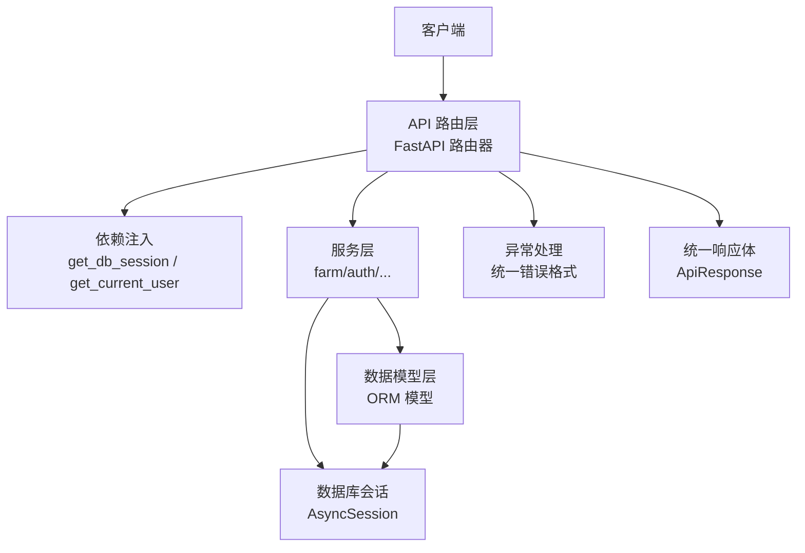
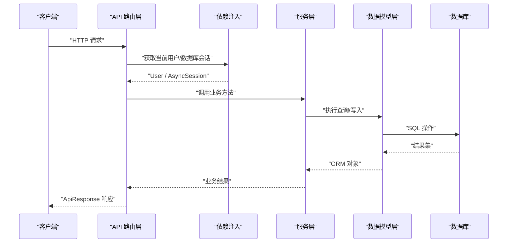
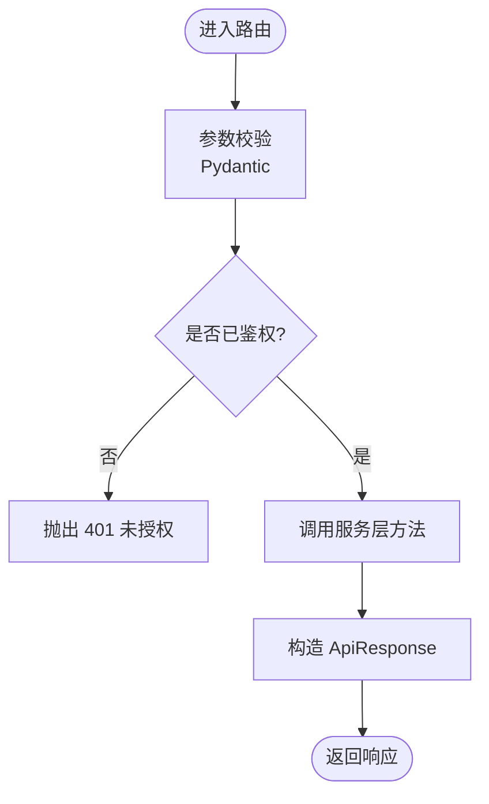
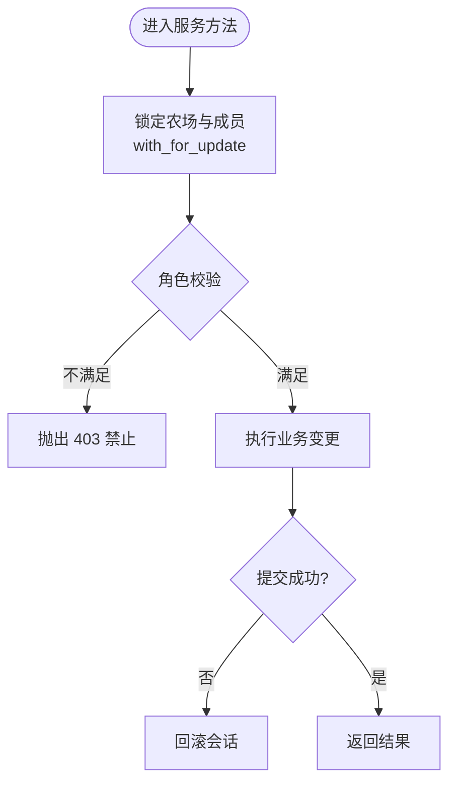
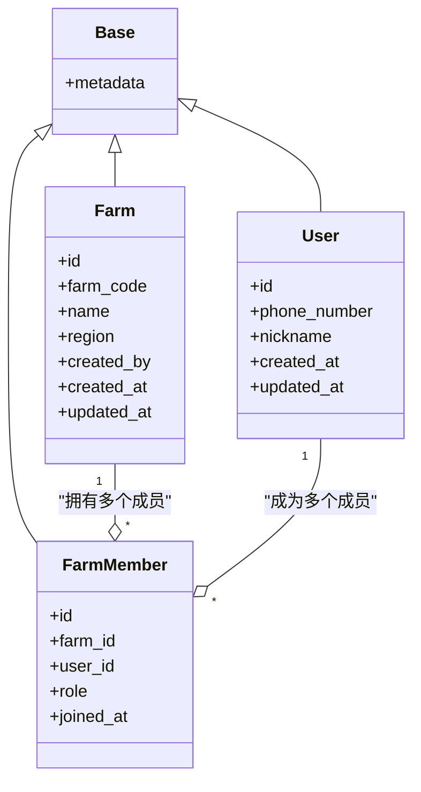
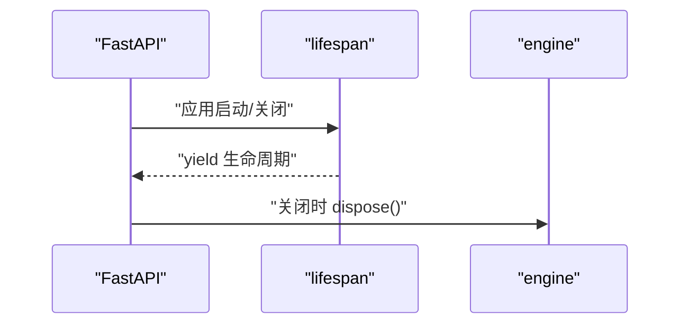
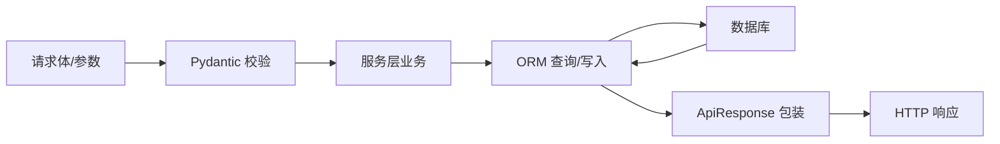
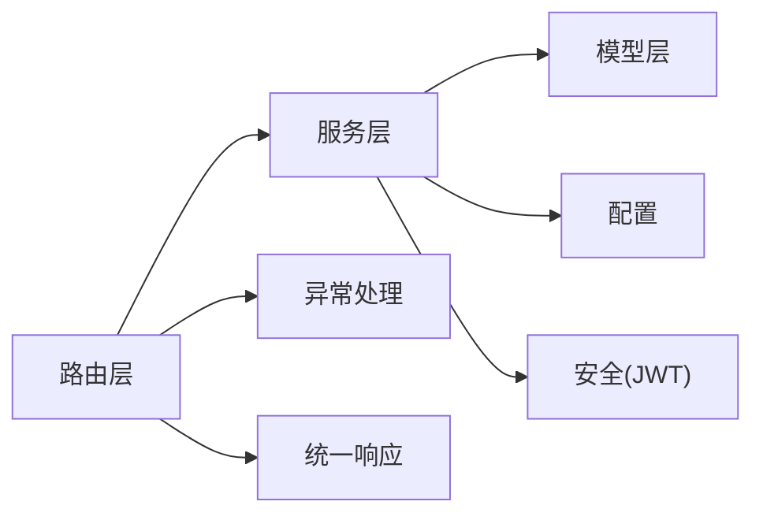

# 分层架构设计

<cite>
**本文引用的文件**
- [apps/api/app/main.py](file://apps/api/app/main.py)
- [apps/api/app/api/v1/router.py](file://apps/api/app/api/v1/router.py)
- [apps/api/app/api/deps.py](file://apps/api/app/api/deps.py)
- [apps/api/app/core/config.py](file://apps/api/app/core/config.py)
- [apps/api/app/db/session.py](file://apps/api/app/db/session.py)
- [apps/api/app/core/exceptions.py](file://apps/api/app/core/exceptions.py)
- [apps/api/app/core/security.py](file://apps/api/app/core/security.py)
- [apps/api/app/schemas/response.py](file://apps/api/app/schemas/response.py)
- [apps/api/app/models/farm.py](file://apps/api/app/models/farm.py)
- [apps/api/app/models/user.py](file://apps/api/app/models/user.py)
- [apps/api/app/schemas/farm.py](file://apps/api/app/schemas/farm.py)
- [apps/api/app/services/farm.py](file://apps/api/app/services/farm.py)
- [apps/api/app/api/v1/endpoints/farms.py](file://apps/api/app/api/v1/endpoints/farms.py)
</cite>

## 目录
1. [简介](#简介)
2. [项目结构](#项目结构)
3. [核心组件](#核心组件)
4. [架构总览](#架构总览)
5. [详细组件分析](#详细组件分析)
6. [依赖关系分析](#依赖关系分析)
7. [性能考量](#性能考量)
8. [故障排查指南](#故障排查指南)
9. [结论](#结论)
10. [附录](#附录)

## 简介
本文件面向 Pocket Farm 后端，系统化阐述其分层架构设计与实现：API 路由层、服务层、数据模型层的职责边界与交互模式；请求处理、业务逻辑封装与数据持久化的流程；依赖注入与服务生命周期管理；层间通信协议与数据流转机制。同时给出架构图、时序图与流程图，并讨论分层架构在可维护性、可测试性与可扩展性方面的优势，提供具体代码路径示例以便快速定位实现。

## 项目结构
后端基于 FastAPI 构建，采用清晰的分层组织：
- API 路由层：定义 HTTP 端点、参数校验、鉴权与响应包装
- 服务层：封装领域业务规则、事务与并发控制
- 数据模型层：SQLAlchemy ORM 模型与数据库会话管理
- 支撑模块：配置、异常、安全、统一响应体等

图表来源
- [apps/api/app/main.py:13-27](file://apps/api/app/main.py#L13-L27)
- [apps/api/app/api/v1/router.py:1-21](file://apps/api/app/api/v1/router.py#L1-L21)
- [apps/api/app/api/deps.py:19-66](file://apps/api/app/api/deps.py#L19-L66)
- [apps/api/app/services/farm.py:1-264](file://apps/api/app/services/farm.py#L1-L264)
- [apps/api/app/models/farm.py:1-59](file://apps/api/app/models/farm.py#L1-L59)
- [apps/api/app/db/session.py:1-7](file://apps/api/app/db/session.py#L1-L7)
- [apps/api/app/core/exceptions.py:13-88](file://apps/api/app/core/exceptions.py#L13-L88)
- [apps/api/app/schemas/response.py:16-40](file://apps/api/app/schemas/response.py#L16-L40)

章节来源
- [apps/api/app/main.py:13-27](file://apps/api/app/main.py#L13-L27)
- [apps/api/app/api/v1/router.py:1-21](file://apps/api/app/api/v1/router.py#L1-L21)

## 核心组件
- 应用启动与生命周期：创建 FastAPI 应用、注册全局异常处理器、挂载健康检查与 v1 路由、在应用关闭时释放数据库引擎资源
- 配置中心：集中管理应用名、调试开关、API 前缀、数据库连接串、JWT 密钥与过期时间、时区、测试登录开关等
- 数据库会话：异步引擎与会话工厂，按请求提供独立 AsyncSession，并在异常时回滚
- 鉴权与安全：基于 Bearer Token 的认证，解析 JWT 并加载当前用户
- 统一响应体：所有接口返回 ApiResponse 包裹的成功或失败结果
- 统一异常：自定义 AppException 及多种异常处理器，保证一致的错误格式

章节来源
- [apps/api/app/main.py:13-27](file://apps/api/app/main.py#L13-L27)
- [apps/api/app/core/config.py:5-23](file://apps/api/app/core/config.py#L5-L23)
- [apps/api/app/db/session.py:1-7](file://apps/api/app/db/session.py#L1-L7)
- [apps/api/app/api/deps.py:19-66](file://apps/api/app/api/deps.py#L19-L66)
- [apps/api/app/core/security.py:8-28](file://apps/api/app/core/security.py#L8-L28)
- [apps/api/app/schemas/response.py:16-40](file://apps/api/app/schemas/response.py#L16-L40)
- [apps/api/app/core/exceptions.py:13-88](file://apps/api/app/core/exceptions.py#L13-L88)

## 架构总览
分层职责与调用关系如下：
- API 路由层：负责接收请求、参数校验（Pydantic）、鉴权（Depends）、调用服务层、组装响应体
- 服务层：承载领域逻辑（权限校验、并发锁、事务提交）、调用 ORM 模型进行数据读写
- 数据模型层：定义表结构与字段约束，通过 SQLAlchemy 与数据库交互
- 支撑层：配置、异常、安全、统一响应体贯穿各层

图表来源
- [apps/api/app/api/v1/endpoints/farms.py:58-118](file://apps/api/app/api/v1/endpoints/farms.py#L58-L118)
- [apps/api/app/api/deps.py:19-66](file://apps/api/app/api/deps.py#L19-L66)
- [apps/api/app/services/farm.py:33-70](file://apps/api/app/services/farm.py#L33-L70)
- [apps/api/app/models/farm.py:18-59](file://apps/api/app/models/farm.py#L18-L59)
- [apps/api/app/db/session.py:1-7](file://apps/api/app/db/session.py#L1-L7)

## 详细组件分析

### API 路由层（以农场为例）
- 路由组织：v1 路由聚合器将各业务模块路由（auth、farms、harvests、operations、plots、productions、species、users）集中挂载
- 请求处理：使用 Pydantic 模型进行入参校验，使用 Depends 注入当前用户与数据库会话
- 响应包装：统一通过 ApiResponse.success_response 返回结构化数据
- 权限控制：通过 get_current_user 强制鉴权，未携带或无效令牌直接抛出 401

图表来源
- [apps/api/app/api/v1/router.py:12-21](file://apps/api/app/api/v1/router.py#L12-L21)
- [apps/api/app/api/v1/endpoints/farms.py:58-118](file://apps/api/app/api/v1/endpoints/farms.py#L58-L118)
- [apps/api/app/api/deps.py:29-66](file://apps/api/app/api/deps.py#L29-L66)
- [apps/api/app/schemas/response.py:16-40](file://apps/api/app/schemas/response.py#L16-L40)

章节来源
- [apps/api/app/api/v1/router.py:1-21](file://apps/api/app/api/v1/router.py#L1-L21)
- [apps/api/app/api/v1/endpoints/farms.py:58-118](file://apps/api/app/api/v1/endpoints/farms.py#L58-L118)

### 服务层（农场业务）
- 职责边界：封装农场创建、成员管理、权限校验、并发锁、事务提交与回滚
- 关键逻辑：
  - 生成唯一农场编码并尝试插入，冲突时重试
  - 使用 with_for_update 对农场与成员表加行级锁，避免竞态
  - 角色权限校验：仅 OWNER/ADMIN 可管理成员，禁止越权操作
  - 保证至少一个 OWNER 存在
- 数据流：从路由层接收 session 与用户上下文，执行业务后返回 ORM 对象或元组

图表来源
- [apps/api/app/services/farm.py:73-113](file://apps/api/app/services/farm.py#L73-L113)
- [apps/api/app/services/farm.py:137-155](file://apps/api/app/services/farm.py#L137-L155)
- [apps/api/app/services/farm.py:181-207](file://apps/api/app/services/farm.py#L181-L207)
- [apps/api/app/services/farm.py:210-231](file://apps/api/app/services/farm.py#L210-L231)
- [apps/api/app/services/farm.py:234-263](file://apps/api/app/services/farm.py#L234-L263)

章节来源
- [apps/api/app/services/farm.py:1-264](file://apps/api/app/services/farm.py#L1-L264)

### 数据模型层
- 模型定义：Farm、FarmMember、User 等，包含主键、外键、唯一约束、索引与默认值
- 命名约定：统一的索引、约束、外键命名规范，便于迁移与维护
- 会话管理：异步引擎与会话工厂，expire_on_commit=False 提升复用效率

图表来源
- [apps/api/app/db/base.py:1-15](file://apps/api/app/db/base.py#L1-L15)
- [apps/api/app/models/user.py:15-28](file://apps/api/app/models/user.py#L15-L28)
- [apps/api/app/models/farm.py:18-59](file://apps/api/app/models/farm.py#L18-L59)

章节来源
- [apps/api/app/models/farm.py:1-59](file://apps/api/app/models/farm.py#L1-L59)
- [apps/api/app/models/user.py:1-28](file://apps/api/app/models/user.py#L1-L28)
- [apps/api/app/db/base.py:1-15](file://apps/api/app/db/base.py#L1-L15)

### 依赖注入与服务生命周期
- 数据库会话：每个请求通过 get_db_session 提供独立的 AsyncSession，异常时自动回滚
- 当前用户：get_current_user 解析 Bearer Token，校验载荷并加载用户对象
- 应用生命周期：lifespan 钩子在应用关闭时释放引擎资源

图表来源
- [apps/api/app/main.py:13-27](file://apps/api/app/main.py#L13-L27)
- [apps/api/app/api/deps.py:19-27](file://apps/api/app/api/deps.py#L19-L27)
- [apps/api/app/api/deps.py:29-66](file://apps/api/app/api/deps.py#L29-L66)

章节来源
- [apps/api/app/api/deps.py:19-66](file://apps/api/app/api/deps.py#L19-L66)
- [apps/api/app/main.py:13-27](file://apps/api/app/main.py#L13-L27)

### 层间通信协议与数据流转
- 输入协议：Pydantic 模型校验请求体与查询参数，确保类型与约束
- 输出协议：统一 ApiResponse 包裹 data/error，便于前端一致处理
- 数据流转：路由层 -> 服务层 -> 模型层 -> 数据库，再反向返回 ORM 对象，路由层转换为响应模型

图表来源
- [apps/api/app/schemas/response.py:16-40](file://apps/api/app/schemas/response.py#L16-L40)
- [apps/api/app/api/v1/endpoints/farms.py:58-118](file://apps/api/app/api/v1/endpoints/farms.py#L58-L118)
- [apps/api/app/services/farm.py:33-70](file://apps/api/app/services/farm.py#L33-L70)

## 依赖关系分析
- 松耦合：路由层仅依赖服务层接口，不直接访问数据库；服务层依赖模型层与配置；模型层仅依赖基础 Base
- 内聚性：服务层集中业务规则与事务；路由层专注协议转换与鉴权；模型层专注数据映射
- 外部依赖：FastAPI、SQLAlchemy、Pydantic、JWT；通过配置集中管理

图表来源
- [apps/api/app/api/v1/router.py:1-21](file://apps/api/app/api/v1/router.py#L1-L21)
- [apps/api/app/services/farm.py:1-264](file://apps/api/app/services/farm.py#L1-L264)
- [apps/api/app/core/config.py:5-23](file://apps/api/app/core/config.py#L5-L23)
- [apps/api/app/core/security.py:8-28](file://apps/api/app/core/security.py#L8-L28)
- [apps/api/app/core/exceptions.py:13-88](file://apps/api/app/core/exceptions.py#L13-L88)
- [apps/api/app/schemas/response.py:16-40](file://apps/api/app/schemas/response.py#L16-L40)

章节来源
- [apps/api/app/api/v1/router.py:1-21](file://apps/api/app/api/v1/router.py#L1-L21)
- [apps/api/app/services/farm.py:1-264](file://apps/api/app/services/farm.py#L1-L264)

## 性能考量
- 异步 I/O：FastAPI 与 SQLAlchemy 异步会话减少阻塞，提高吞吐
- 会话复用：expire_on_commit=False 减少重复加载开销
- 数据库锁：with_for_update 避免并发写冲突，保障一致性
- 分页查询：服务层使用 offset/limit 控制返回量，降低网络与内存压力
- 连接池：engine 启用 pool_pre_ping 检测连接有效性

[本节为通用指导，无需特定文件引用]

## 故障排查指南
- 401 未授权：检查 Bearer Token 是否存在、是否有效、载荷 sub 是否为数字且对应用户存在
- 403 禁止：检查当前用户在农场中的角色是否具备操作权限
- 404 未找到：确认农场/成员是否存在
- 409 冲突：农场码生成冲突、重复成员、最后一名 OWNER 不能离开等
- 422 验证失败：检查请求体是否符合 Pydantic 校验规则
- 500 内部错误：查看日志与异常堆栈，定位未捕获异常

章节来源
- [apps/api/app/api/deps.py:29-66](file://apps/api/app/api/deps.py#L29-L66)
- [apps/api/app/services/farm.py:21-31](file://apps/api/app/services/farm.py#L21-L31)
- [apps/api/app/core/exceptions.py:35-88](file://apps/api/app/core/exceptions.py#L35-L88)

## 结论
Pocket Farm 后端采用清晰的三层架构：API 路由层负责协议与鉴权，服务层封装业务与事务，数据模型层专注持久化。通过依赖注入与统一异常/响应，实现了高内聚、低耦合的设计，提升了可维护性、可测试性与可扩展性。结合并发锁与分页策略，保证了在高并发场景下的数据一致性与性能。

[本节为总结，无需特定文件引用]

## 附录
- 典型调用链路参考路径：
  - 路由到服务：[apps/api/app/api/v1/endpoints/farms.py:58-118](file://apps/api/app/api/v1/endpoints/farms.py#L58-L118)
  - 服务到模型：[apps/api/app/services/farm.py:33-70](file://apps/api/app/services/farm.py#L33-L70)
  - 会话管理：[apps/api/app/db/session.py:1-7](file://apps/api/app/db/session.py#L1-L7)
  - 鉴权流程：[apps/api/app/api/deps.py:29-66](file://apps/api/app/api/deps.py#L29-L66)
  - 统一响应：[apps/api/app/schemas/response.py:16-40](file://apps/api/app/schemas/response.py#L16-L40)
  - 异常处理：[apps/api/app/core/exceptions.py:13-88](file://apps/api/app/core/exceptions.py#L13-L88)