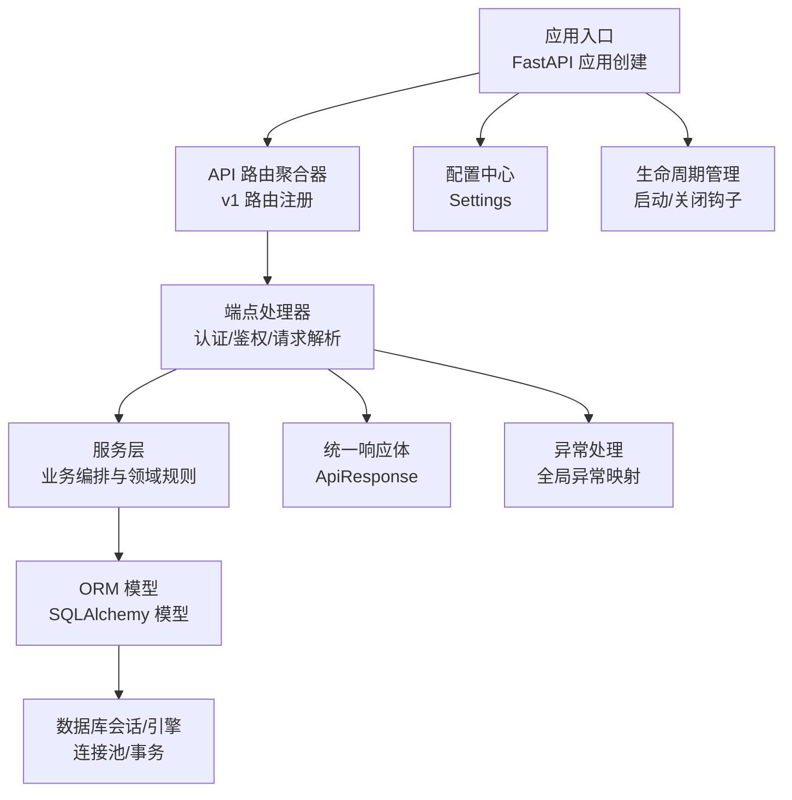
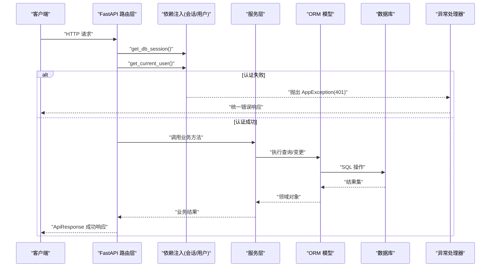
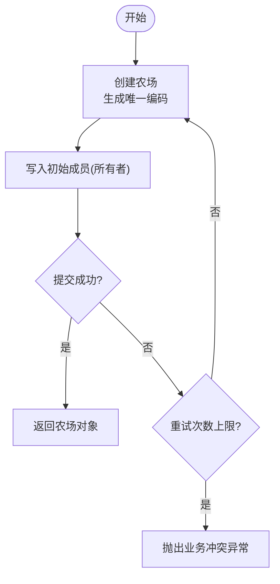
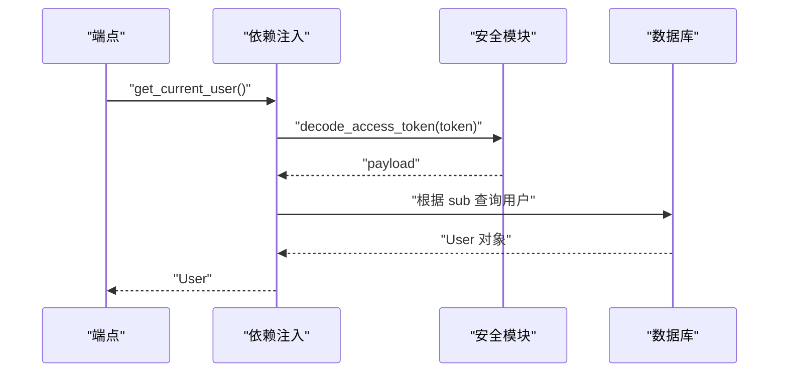
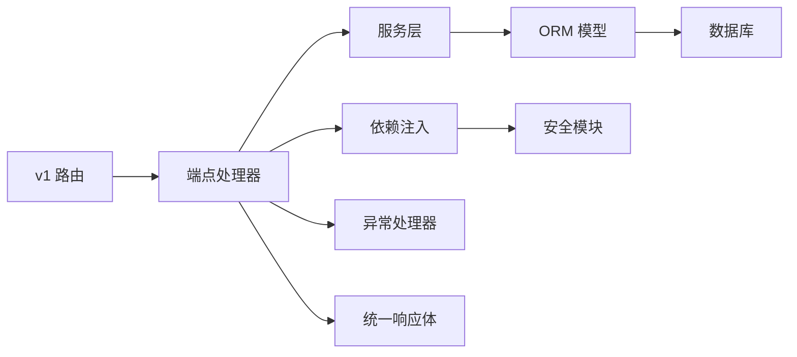

# 后端架构

<cite>
**本文引用的文件**
- [main.py](file://apps/api/app/main.py)
- [config.py](file://apps/api/app/core/config.py)
- [session.py](file://apps/api/app/db/session.py)
- [router.py](file://apps/api/app/api/v1/router.py)
- [deps.py](file://apps/api/app/api/deps.py)
- [security.py](file://apps/api/app/core/security.py)
- [exceptions.py](file://apps/api/app/core/exceptions.py)
- [error_codes.py](file://apps/api/app/core/error_codes.py)
- [base.py](file://apps/api/app/db/base.py)
- [user.py](file://apps/api/app/models/user.py)
- [farm.py](file://apps/api/app/models/farm.py)
- [user_service.py](file://apps/api/app/services/user.py)
- [farm_service.py](file://apps/api/app/services/farm.py)
- [users_endpoint.py](file://apps/api/app/api/v1/endpoints/users.py)
- [response_schema.py](file://apps/api/app/schemas/response.py)
</cite>

## 目录
1. [简介](#简介)
2. [项目结构](#项目结构)
3. [核心组件](#核心组件)
4. [架构总览](#架构总览)
5. [详细组件分析](#详细组件分析)
6. [依赖关系分析](#依赖关系分析)
7. [性能考量](#性能考量)
8. [故障排查指南](#故障排查指南)
9. [结论](#结论)
10. [附录](#附录)

## 简介
本文件为 Pocket Farm 后端（FastAPI）的架构文档，聚焦分层架构设计、依赖注入容器、配置与数据库会话管理、领域驱动设计在业务逻辑中的落地、异步编程模式以及性能优化策略。通过架构图与流程图展示各层职责与数据流转，帮助读者快速理解系统设计与实现要点。

## 项目结构
后端采用清晰的分层组织：
- API 路由层：定义 HTTP 端点、参数校验、调用服务层并返回统一响应体。
- 服务层：封装领域规则与业务流程，协调模型与外部资源。
- 数据模型层：基于 SQLAlchemy 的 ORM 模型，映射数据库表结构。
- 基础设施层：配置、安全、异常处理、数据库会话等横切关注点。



图表来源
- [main.py:13-27](file://apps/api/app/main.py#L13-L27)
- [router.py:1-21](file://apps/api/app/api/v1/router.py#L1-L21)
- [deps.py:19-65](file://apps/api/app/api/deps.py#L19-L65)
- [session.py:1-7](file://apps/api/app/db/session.py#L1-L7)
- [config.py:5-22](file://apps/api/app/core/config.py#L5-L22)
- [response_schema.py:16-39](file://apps/api/app/schemas/response.py#L16-L39)
- [exceptions.py:35-87](file://apps/api/app/core/exceptions.py#L35-L87)

章节来源
- [main.py:13-27](file://apps/api/app/main.py#L13-L27)
- [router.py:1-21](file://apps/api/app/api/v1/router.py#L1-L21)
- [config.py:5-22](file://apps/api/app/core/config.py#L5-L22)
- [session.py:1-7](file://apps/api/app/db/session.py#L1-L7)
- [response_schema.py:16-39](file://apps/api/app/schemas/response.py#L16-L39)
- [exceptions.py:35-87](file://apps/api/app/core/exceptions.py#L35-L87)

## 核心组件
- FastAPI 应用与生命周期：集中创建应用、注册路由、挂载健康检查、设置异常处理器，并在应用关闭时释放数据库引擎。
- 配置管理：使用 Pydantic Settings 从环境变量或 .env 加载应用名、调试开关、API 前缀、数据库 URL、JWT 密钥与过期时间、时区等。
- 数据库会话：基于 SQLAlchemy 异步引擎与 sessionmaker，提供 per-request 的 AsyncSession，自动回滚与提交控制。
- 依赖注入：通过 FastAPI Depends 提供数据库会话与当前用户；认证流程包含 JWT 解码与用户查询。
- 统一响应体：ApiResponse 泛型包装成功/失败响应，配合错误码枚举形成一致的错误语义。
- 异常处理：全局注册 AppException、请求校验异常、HTTP 异常与未捕获异常的处理器，统一输出 ApiResponse。

章节来源
- [main.py:13-27](file://apps/api/app/main.py#L13-L27)
- [config.py:5-22](file://apps/api/app/core/config.py#L5-L22)
- [session.py:1-7](file://apps/api/app/db/session.py#L1-L7)
- [deps.py:19-65](file://apps/api/app/api/deps.py#L19-L65)
- [response_schema.py:16-39](file://apps/api/app/schemas/response.py#L16-L39)
- [exceptions.py:35-87](file://apps/api/app/core/exceptions.py#L35-L87)

## 架构总览
下图展示了从请求进入至响应返回的完整链路，包括认证、鉴权、服务调用、数据库访问与异常处理。



图表来源
- [deps.py:19-65](file://apps/api/app/api/deps.py#L19-L65)
- [security.py:8-28](file://apps/api/app/core/security.py#L8-L28)
- [farm_service.py:33-53](file://apps/api/app/services/farm.py#L33-L53)
- [exceptions.py:35-87](file://apps/api/app/core/exceptions.py#L35-L87)
- [response_schema.py:16-39](file://apps/api/app/schemas/response.py#L16-L39)

## 详细组件分析

### API 路由层
- 路由聚合：v1 路由集中注册各业务模块路由，便于版本化管理与扩展。
- 端点示例：用户接口演示了“获取当前用户”和“更新昵称”，通过 Depends 注入当前用户与会话，调用服务层完成持久化，并以统一响应体返回。
- 职责边界：仅负责参数解析、权限校验、调用服务层与响应组装，不包含业务规则。

章节来源
- [router.py:1-21](file://apps/api/app/api/v1/router.py#L1-L21)
- [users_endpoint.py:12-29](file://apps/api/app/api/v1/endpoints/users.py#L12-L29)

### 服务层
- 用户服务：封装当前用户信息更新，保持简单清晰的单实体变更流程。
- 农场服务：实现农场创建、成员管理、权限校验、并发安全（行级锁）与一致性约束（至少一个 OWNER）。
- 领域规则：角色枚举、权限判定、冲突检测、唯一性约束与重试策略（农场编码生成）。



图表来源
- [farm_service.py:33-53](file://apps/api/app/services/farm.py#L33-L53)

章节来源
- [user_service.py:6-15](file://apps/api/app/services/user.py#L6-L15)
- [farm_service.py:33-53](file://apps/api/app/services/farm.py#L33-L53)
- [farm_service.py:115-134](file://apps/api/app/services/farm.py#L115-L134)
- [farm_service.py:181-207](file://apps/api/app/services/farm.py#L181-L207)
- [farm_service.py:210-231](file://apps/api/app/services/farm.py#L210-L231)
- [farm_service.py:234-263](file://apps/api/app/services/farm.py#L234-L263)

### 数据模型层
- 基础模型：Base 定义命名约定，确保索引、外键、主键等命名规范一致。
- 用户模型：包含手机号、昵称、时间戳等字段，默认值使用 UTC 时间。
- 农场与成员：农场包含编码、名称、区域、创建者；成员表维护多对多关系与角色，具备唯一约束防止重复加入。

```mermaid
classDiagram
class User {
+int id
+string phone_number
+string nickname
+datetime created_at
+datetime updated_at
}
class Farm {
+int id
+string farm_code
+string name
+string region
+int created_by
+datetime created_at
+datetime updated_at
}
class FarmMember {
+int id
+int farm_id
+int user_id
+string role
+datetime joined_at
}
User <|-- Farm : "created_by -> users.id"
Farm ||--o{ FarmMember : "拥有多个成员"
User ||--o{ FarmMember : "作为成员"
```

图表来源
- [base.py:1-15](file://apps/api/app/db/base.py#L1-L15)
- [user.py:15-27](file://apps/api/app/models/user.py#L15-L27)
- [farm.py:18-59](file://apps/api/app/models/farm.py#L18-L59)

章节来源
- [base.py:1-15](file://apps/api/app/db/base.py#L1-L15)
- [user.py:15-27](file://apps/api/app/models/user.py#L15-L27)
- [farm.py:18-59](file://apps/api/app/models/farm.py#L18-L59)

### 依赖注入容器
- 数据库会话：per-request 的 AsyncSession，异常时自动回滚，保证事务一致性。
- 当前用户：从请求头提取 Bearer Token，解码 JWT，校验载荷并查询用户，缺失或无效则抛出 401。
- 可组合性：Depends 支持嵌套依赖，端点只需声明所需依赖即可。



图表来源
- [deps.py:29-65](file://apps/api/app/api/deps.py#L29-L65)
- [security.py:22-28](file://apps/api/app/core/security.py#L22-L28)

章节来源
- [deps.py:19-65](file://apps/api/app/api/deps.py#L19-L65)
- [security.py:8-28](file://apps/api/app/core/security.py#L8-L28)

### 配置管理系统
- 使用 BaseSettings 加载环境变量或 .env，支持额外忽略未知字段。
- 关键配置项：应用名、调试开关、API 前缀、数据库 URL、JWT 密钥与算法、过期时间、时区、测试登录开关与代码。
- 安全性：敏感字段以 SecretStr 存储，避免日志泄露。

章节来源
- [config.py:5-22](file://apps/api/app/core/config.py#L5-L22)

### 数据库会话管理
- 异步引擎：create_async_engine 启用连接池与 pre-ping，提升健壮性。
- Session 工厂：async_sessionmaker 配置 expire_on_commit=False，减少刷新开销。
- 生命周期：应用关闭时 dispose 引擎，释放连接。

章节来源
- [session.py:1-7](file://apps/api/app/db/session.py#L1-L7)
- [main.py:13-27](file://apps/api/app/main.py#L13-L27)

### 领域驱动设计实践
- 聚合根：Farm 作为聚合根，管理农场信息与成员集合；成员角色与权限规则内聚在服务层中。
- 值对象：FarmMemberRole 枚举表达角色，增强类型安全与可读性。
- 领域服务：农场服务封装复杂业务规则（如成员管理、权限校验、并发锁），对外暴露原子操作。
- 不变式保障：至少保留一个 OWNER、禁止越权操作、唯一性约束与冲突处理。

章节来源
- [farm.py:12-15](file://apps/api/app/models/farm.py#L12-L15)
- [farm_service.py:94-113](file://apps/api/app/services/farm.py#L94-L113)
- [farm_service.py:210-231](file://apps/api/app/services/farm.py#L210-L231)
- [farm_service.py:234-263](file://apps/api/app/services/farm.py#L234-L263)

### 异步编程模式
- 全栈异步：FastAPI 端点、服务层、数据库访问均使用 async/await，充分利用事件循环并发能力。
- 并发策略：每个请求独立会话，避免共享状态；数据库操作通过连接池并发执行。
- 事务边界：服务层显式 commit/refresh，确保数据一致性与可见性。

章节来源
- [deps.py:19-27](file://apps/api/app/api/deps.py#L19-L27)
- [farm_service.py:33-53](file://apps/api/app/services/farm.py#L33-L53)
- [user_service.py:6-15](file://apps/api/app/services/user.py#L6-L15)

## 依赖关系分析
- 低耦合：API 层仅依赖服务层接口，服务层依赖模型与基础设施，层次清晰。
- 内聚性：农场相关规则集中在服务层，模型仅承载数据结构。
- 外部依赖：JWT、SQLAlchemy、Pydantic Settings 等第三方库通过配置与模块解耦。



图表来源
- [router.py:1-21](file://apps/api/app/api/v1/router.py#L1-L21)
- [deps.py:19-65](file://apps/api/app/api/deps.py#L19-L65)
- [security.py:8-28](file://apps/api/app/core/security.py#L8-L28)
- [exceptions.py:35-87](file://apps/api/app/core/exceptions.py#L35-L87)
- [response_schema.py:16-39](file://apps/api/app/schemas/response.py#L16-L39)

章节来源
- [router.py:1-21](file://apps/api/app/api/v1/router.py#L1-L21)
- [deps.py:19-65](file://apps/api/app/api/deps.py#L19-L65)
- [security.py:8-28](file://apps/api/app/core/security.py#L8-L28)
- [exceptions.py:35-87](file://apps/api/app/core/exceptions.py#L35-L87)
- [response_schema.py:16-39](file://apps/api/app/schemas/response.py#L16-L39)

## 性能考量
- 连接池管理：使用 create_async_engine 的连接池与 pool_pre_ping=True，降低连接失效影响。
- 会话优化：expire_on_commit=False 减少不必要的刷新，提高批量写性能。
- 查询优化：分页查询使用 limit/offset，计数查询使用 func.count，避免全表扫描。
- 并发安全：使用 with_for_update() 进行行级锁定，避免竞态条件。
- 缓存机制：可在服务层引入内存缓存（如本地字典或 Redis）缓存热点数据（如角色枚举、配置项），减少数据库压力。
- 异步 I/O：全栈异步避免阻塞，提升吞吐；合理拆分长耗时任务为后台任务或消息队列。

[本节为通用性能建议，不直接分析具体文件]

## 故障排查指南
- 认证失败：检查请求头是否携带有效 Bearer Token，确认 JWT 密钥与算法配置正确。
- 数据库不可用：检查 database_url 与网络连通性，查看连接池状态与异常堆栈。
- 业务冲突：如重复加入农场、最后一名 OWNER 离开等，会抛出业务冲突异常，需调整请求参数或权限。
- 请求校验失败：查看统一响应中的 details 字段，定位字段校验错误。
- 未捕获异常：全局异常处理器将返回内部服务器错误，结合日志定位问题。

章节来源
- [deps.py:29-65](file://apps/api/app/api/deps.py#L29-L65)
- [exceptions.py:35-87](file://apps/api/app/core/exceptions.py#L35-L87)
- [error_codes.py:4-12](file://apps/api/app/core/error_codes.py#L4-L12)
- [response_schema.py:16-39](file://apps/api/app/schemas/response.py#L16-L39)

## 结论
Pocket Farm 后端采用清晰的分层架构与依赖注入，实现了 API 路由、服务层与数据模型的职责分离。通过统一的配置管理、会话管理与异常处理，提升了系统的可维护性与健壮性。领域驱动设计在农场与成员管理中得到体现，确保了业务规则的内聚与不变式的保障。异步编程模式贯穿全栈，结合连接池与查询优化，具备良好的性能表现。未来可进一步引入缓存与异步任务队列，以支撑更高并发与更复杂的业务流程。

## 附录
- 统一响应体：ApiResponse 提供 success/data/error 三字段，便于前端统一处理。
- 错误码枚举：ErrorCode 定义稳定机器可读的错误码，便于监控与排障。
- 安全模块：JWT 创建与解码，支持自定义算法与过期时间。

章节来源
- [response_schema.py:16-39](file://apps/api/app/schemas/response.py#L16-L39)
- [error_codes.py:4-12](file://apps/api/app/core/error_codes.py#L4-L12)
- [security.py:8-28](file://apps/api/app/core/security.py#L8-L28)