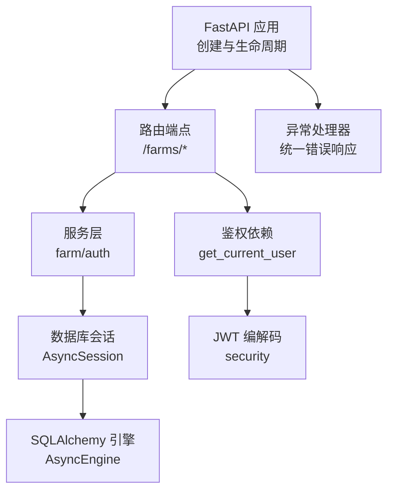
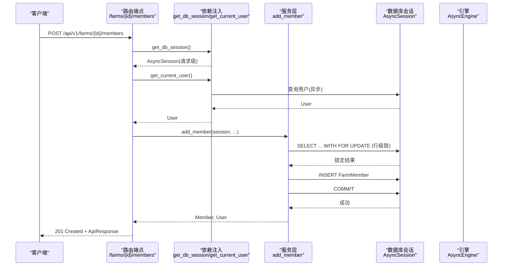
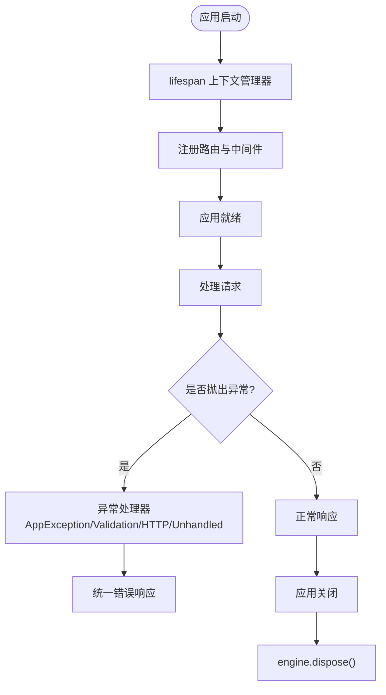
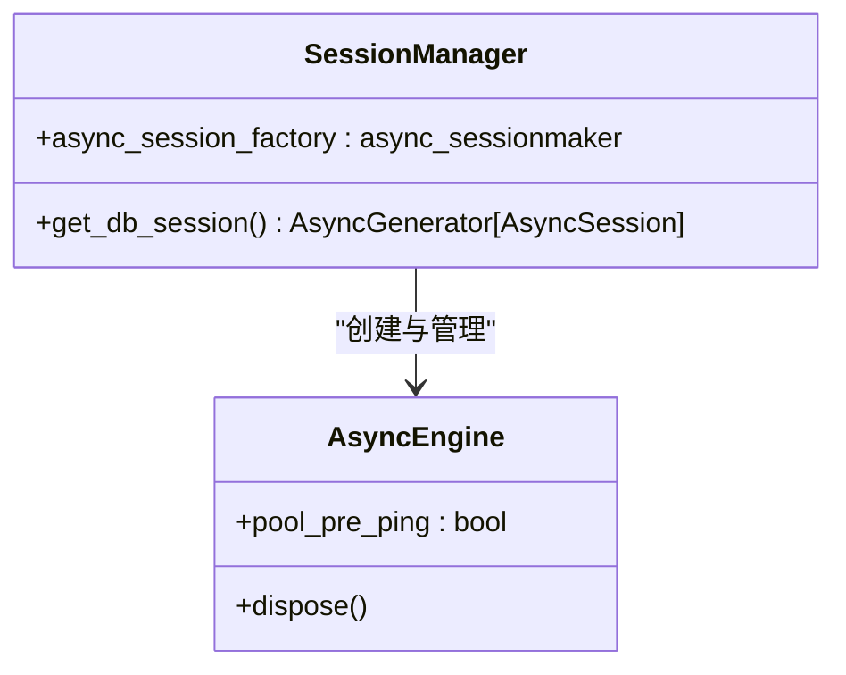
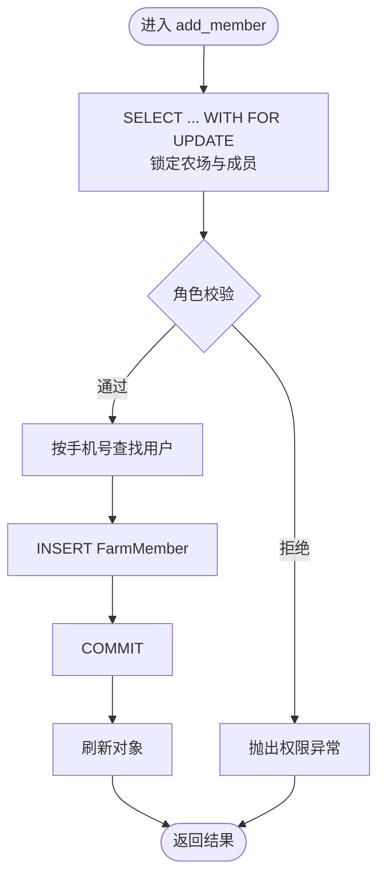
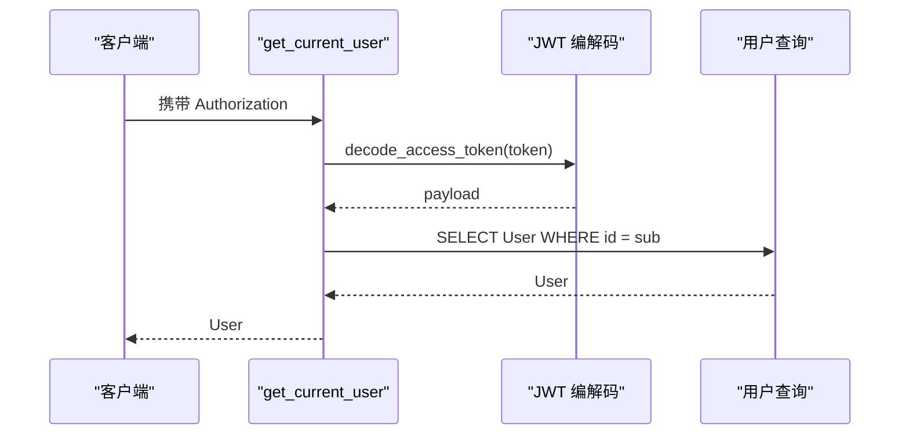
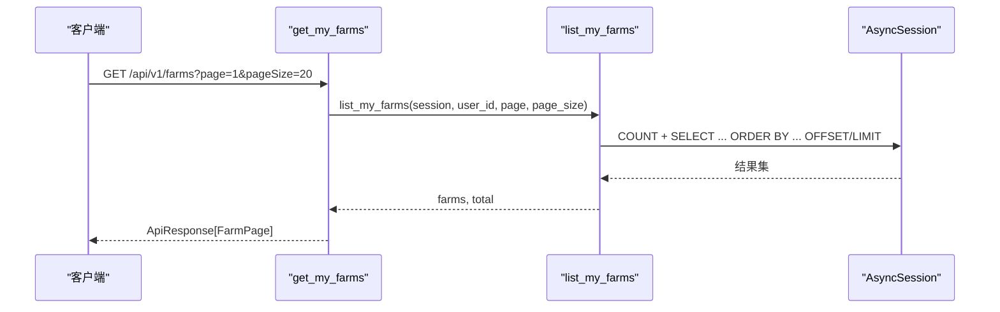
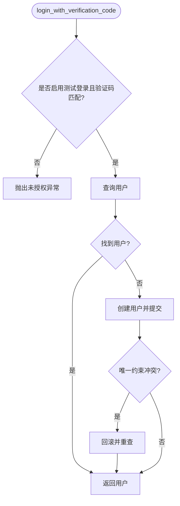
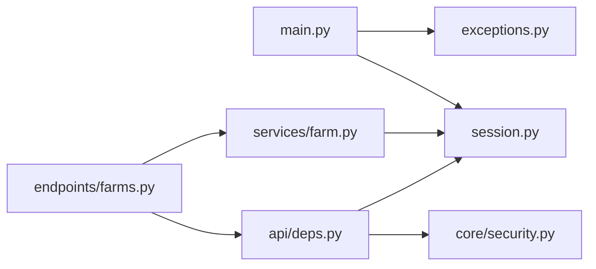

# 异步编程模式

<cite>
**本文引用的文件**
- [apps/api/app/main.py](file://apps/api/app/main.py)
- [apps/api/app/db/session.py](file://apps/api/app/db/session.py)
- [apps/api/app/db/base.py](file://apps/api/app/db/base.py)
- [apps/api/app/api/deps.py](file://apps/api/app/api/deps.py)
- [apps/api/app/core/exceptions.py](file://apps/api/app/core/exceptions.py)
- [apps/api/app/services/farm.py](file://apps/api/app/services/farm.py)
- [apps/api/app/api/v1/endpoints/farms.py](file://apps/api/app/api/v1/endpoints/farms.py)
- [apps/api/app/services/auth.py](file://apps/api/app/services/auth.py)
- [apps/api/app/core/security.py](file://apps/api/app/core/security.py)
- [apps/api/pyproject.toml](file://apps/api/pyproject.toml)
</cite>

## 目录
1. [简介](#简介)
2. [项目结构](#项目结构)
3. [核心组件](#核心组件)
4. [架构总览](#架构总览)
5. [详细组件分析](#详细组件分析)
6. [依赖关系分析](#依赖关系分析)
7. [性能考量](#性能考量)
8. [故障排查指南](#故障排查指南)
9. [结论](#结论)
10. [附录](#附录)

## 简介
本文件面向 Pocket Farm 后端，系统化阐述 FastAPI 与 asyncio 的异步编程模式。内容涵盖：
- FastAPI 异步处理机制与生命周期管理
- 基于 SQLAlchemy AsyncEngine/AsyncSession 的异步 I/O 最佳实践
- 并发策略：任务调度、协程管理与资源竞争控制
- 异步上下文管理与错误处理模式
- 代码示例路径（函数定义、调用、异常处理）
- 性能优化：避免阻塞、内存管理与 CPU 密集型任务处理
- 调试与监控：日志记录与性能分析建议

## 项目结构
后端采用分层组织：入口应用、路由端点、服务层、数据访问（会话）、配置与安全、异常处理。关键异步点包括：
- 应用生命周期：使用 asynccontextmanager 管理引擎资源释放
- 请求级数据库会话：通过依赖注入提供独立 AsyncSession
- 服务层：全部为 async 函数，执行异步查询与事务
- 安全模块：同步 JWT 编解码（CPU 密集但轻量），在异步上下文中安全调用

图表来源
- [apps/api/app/main.py:13-24](file://apps/api/app/main.py#L13-L24)
- [apps/api/app/api/v1/endpoints/farms.py:58-199](file://apps/api/app/api/v1/endpoints/farms.py#L58-L199)
- [apps/api/app/services/farm.py:33-263](file://apps/api/app/services/farm.py#L33-L263)
- [apps/api/app/db/session.py:1-7](file://apps/api/app/db/session.py#L1-L7)
- [apps/api/app/core/exceptions.py:35-87](file://apps/api/app/core/exceptions.py#L35-L87)
- [apps/api/app/api/deps.py:19-65](file://apps/api/app/api/deps.py#L19-L65)
- [apps/api/app/core/security.py:8-28](file://apps/api/app/core/security.py#L8-L28)

章节来源
- [apps/api/app/main.py:13-24](file://apps/api/app/main.py#L13-L24)
- [apps/api/app/db/session.py:1-7](file://apps/api/app/db/session.py#L1-L7)
- [apps/api/app/api/deps.py:19-65](file://apps/api/app/api/deps.py#L19-L65)
- [apps/api/app/core/exceptions.py:35-87](file://apps/api/app/core/exceptions.py#L35-L87)

## 核心组件
- 应用启动与生命周期
  - 使用 asynccontextmanager 定义 lifespan，确保在应用关闭时释放数据库连接池
  - 注册全局异常处理器，统一错误响应格式
- 数据库会话管理
  - 通过 async_sessionmaker 创建工厂，每个请求一个独立的 AsyncSession
  - 自动回滚异常场景，保证事务一致性
- 服务层
  - 所有业务逻辑封装为 async 函数，使用 await 进行数据库操作
  - 使用 with_for_update 实现行级锁，避免并发写冲突
- 鉴权与令牌
  - 同步 JWT 编解码，在异步上下文中安全调用
  - 依赖注入获取当前用户并校验权限
- 路由端点
  - 全量使用 async def 暴露 API，调用服务层异步方法

章节来源
- [apps/api/app/main.py:13-24](file://apps/api/app/main.py#L13-L24)
- [apps/api/app/db/session.py:1-7](file://apps/api/app/db/session.py#L1-L7)
- [apps/api/app/api/deps.py:19-65](file://apps/api/app/api/deps.py#L19-L65)
- [apps/api/app/services/farm.py:33-263](file://apps/api/app/services/farm.py#L33-L263)
- [apps/api/app/core/security.py:8-28](file://apps/api/app/core/security.py#L8-L28)

## 架构总览
下图展示一次农场成员添加请求的完整异步调用链：从 HTTP 请求进入，到鉴权、服务层加锁与写入，再到数据库提交与响应返回。

图表来源
- [apps/api/app/api/v1/endpoints/farms.py:142-160](file://apps/api/app/api/v1/endpoints/farms.py#L142-L160)
- [apps/api/app/api/deps.py:19-65](file://apps/api/app/api/deps.py#L19-L65)
- [apps/api/app/services/farm.py:181-207](file://apps/api/app/services/farm.py#L181-L207)
- [apps/api/app/db/session.py:1-7](file://apps/api/app/db/session.py#L1-L7)

## 详细组件分析

### 应用生命周期与异常处理
- 生命周期
  - 使用 asynccontextmanager 包裹应用启动/关闭流程，确保在退出时调用 engine.dispose() 释放连接池
- 异常处理
  - 自定义 AppException 携带稳定机器可读的错误码
  - 注册多个异常处理器：应用异常、请求验证异常、HTTP 异常、未捕获异常
  - 所有异常均转换为统一的 ApiResponse JSON 格式

图表来源
- [apps/api/app/main.py:13-24](file://apps/api/app/main.py#L13-L24)
- [apps/api/app/core/exceptions.py:35-87](file://apps/api/app/core/exceptions.py#L35-L87)

章节来源
- [apps/api/app/main.py:13-24](file://apps/api/app/main.py#L13-L24)
- [apps/api/app/core/exceptions.py:35-87](file://apps/api/app/core/exceptions.py#L35-L87)

### 数据库会话与异步 I/O
- 引擎与会话
  - 使用 create_async_engine 创建异步引擎，启用 pool_pre_ping 提高连接健壮性
  - 使用 async_sessionmaker 创建会话工厂，expire_on_commit=False 减少额外刷新开销
- 请求级会话
  - get_db_session 以异步生成器形式提供会话，异常时自动回滚
- 最佳实践
  - 所有数据库操作使用 await session.execute(...) 等异步接口
  - 复杂写操作使用 with_for_update 进行行级锁，避免竞态条件

图表来源
- [apps/api/app/db/session.py:1-7](file://apps/api/app/db/session.py#L1-L7)
- [apps/api/app/api/deps.py:19-26](file://apps/api/app/api/deps.py#L19-L26)

章节来源
- [apps/api/app/db/session.py:1-7](file://apps/api/app/db/session.py#L1-L7)
- [apps/api/app/api/deps.py:19-26](file://apps/api/app/api/deps.py#L19-L26)

### 服务层并发与资源竞争控制
- 并发策略
  - 使用 with_for_update 对农场与成员表进行行级锁定，确保并发写的一致性
  - 在事务中先 flush 再 commit，失败时 rollback
- 典型流程：添加成员
  - 锁定农场与成员列表
  - 校验角色权限
  - 查找目标用户并插入成员记录
  - 提交事务并刷新对象

图表来源
- [apps/api/app/services/farm.py:73-91](file://apps/api/app/services/farm.py#L73-L91)
- [apps/api/app/services/farm.py:181-207](file://apps/api/app/services/farm.py#L181-L207)

章节来源
- [apps/api/app/services/farm.py:73-91](file://apps/api/app/services/farm.py#L73-L91)
- [apps/api/app/services/farm.py:181-207](file://apps/api/app/services/farm.py#L181-L207)

### 鉴权与令牌处理
- 依赖注入
  - get_current_user 解析 Authorization 头，解码 JWT，查询用户并返回
- 令牌编解码
  - create_access_token 生成包含过期时间的 JWT
  - decode_access_token 验证并解码令牌
- 注意事项
  - JWT 编解码为 CPU 密集型但轻量，可在异步上下文中直接调用
  - 若未来扩展为外部认证服务，应替换为异步 HTTP 调用

图表来源
- [apps/api/app/api/deps.py:29-65](file://apps/api/app/api/deps.py#L29-L65)
- [apps/api/app/core/security.py:8-28](file://apps/api/app/core/security.py#L8-L28)

章节来源
- [apps/api/app/api/deps.py:29-65](file://apps/api/app/api/deps.py#L29-L65)
- [apps/api/app/core/security.py:8-28](file://apps/api/app/core/security.py#L8-L28)

### 路由端点与异步调用
- 端点设计
  - 所有端点使用 async def，参数通过 Depends 注入当前用户与数据库会话
  - 调用服务层异步函数，组装统一响应体
- 示例：获取我的农场
  - 分页查询，统计总数，映射为响应模型

图表来源
- [apps/api/app/api/v1/endpoints/farms.py:58-75](file://apps/api/app/api/v1/endpoints/farms.py#L58-L75)
- [apps/api/app/services/farm.py:115-134](file://apps/api/app/services/farm.py#L115-L134)

章节来源
- [apps/api/app/api/v1/endpoints/farms.py:58-75](file://apps/api/app/api/v1/endpoints/farms.py#L58-L75)
- [apps/api/app/services/farm.py:115-134](file://apps/api/app/services/farm.py#L115-L134)

### 登录流程（验证码测试模式）
- 流程说明
  - 根据配置决定是否允许验证码登录
  - 查询或创建用户，处理唯一约束冲突
- 关键点
  - 使用 IntegrityError 捕获重复插入，回滚后重试查询
  - 返回用户对象供后续签发令牌使用

图表来源
- [apps/api/app/services/auth.py:11-46](file://apps/api/app/services/auth.py#L11-L46)

章节来源
- [apps/api/app/services/auth.py:11-46](file://apps/api/app/services/auth.py#L11-L46)

## 依赖关系分析
- 运行时依赖
  - FastAPI、Uvicorn、SQLAlchemy、aiomysql、PyJWT、Pydantic Settings
- 模块耦合
  - main.py 依赖 session、router、exception handlers
  - endpoints 依赖 services、deps、schemas
  - services 依赖 db session、models、core exceptions/config
  - deps 依赖 security、db session、models
- 潜在循环依赖
  - 当前结构清晰，未见循环导入；保持分层边界有助于避免

图表来源
- [apps/api/app/main.py:13-24](file://apps/api/app/main.py#L13-L24)
- [apps/api/app/api/v1/endpoints/farms.py:58-199](file://apps/api/app/api/v1/endpoints/farms.py#L58-L199)
- [apps/api/app/services/farm.py:33-263](file://apps/api/app/services/farm.py#L33-L263)
- [apps/api/app/api/deps.py:19-65](file://apps/api/app/api/deps.py#L19-L65)
- [apps/api/app/core/security.py:8-28](file://apps/api/app/core/security.py#L8-L28)

章节来源
- [apps/api/pyproject.toml:1-15](file://apps/api/pyproject.toml#L1-L15)
- [apps/api/app/main.py:13-24](file://apps/api/app/main.py#L13-L24)

## 性能考量
- 避免阻塞
  - 所有 I/O 操作使用异步接口（SQLAlchemy AsyncEngine/AsyncSession）
  - 避免在事件循环中执行耗时同步 I/O（如阻塞网络请求、同步文件读写）
- 内存管理
  - 使用 expire_on_commit=False 减少不必要的对象刷新
  - 合理分页与限制查询范围，避免一次性加载大量数据
- CPU 密集型任务
  - JWT 编解码为轻量 CPU 操作，可直接在异步上下文中运行
  - 若未来引入重计算（图像处理、加密解密批量），考虑：
    - 使用线程池 executor 或进程池隔离
    - 将任务放入后台队列（如 Celery/RQ）异步执行
- 连接池与超时
  - 启用 pool_pre_ping 提升连接健康检查
  - 根据数据库负载调整连接池大小与超时参数
- 并发策略
  - 使用 with_for_update 控制写竞争，必要时结合业务幂等键
  - 读多写少场景可考虑缓存热点数据（Redis/Memcached）

[本节为通用指导，不直接分析具体文件]

## 故障排查指南
- 常见异常与处理
  - 未授权：令牌缺失、无效或过期，依赖注入会抛出统一异常
  - 业务冲突：唯一约束冲突（如重复成员），服务层捕获并转换为用户友好消息
  - 验证失败：请求体不符合 Pydantic Schema，由框架统一处理
  - 未捕获异常：兜底处理器返回 500 与标准错误体
- 定位问题
  - 检查异常处理器是否正确注册
  - 确认数据库会话是否在异常时回滚
  - 查看服务层事务边界与锁的使用是否合理
- 建议
  - 为关键路径增加结构化日志（请求 ID、用户 ID、操作类型）
  - 使用性能剖析工具（如 py-spy、cProfile）定位热点
  - 对慢查询添加索引与分页优化

章节来源
- [apps/api/app/core/exceptions.py:35-87](file://apps/api/app/core/exceptions.py#L35-L87)
- [apps/api/app/api/deps.py:19-26](file://apps/api/app/api/deps.py#L19-L26)
- [apps/api/app/services/farm.py:181-207](file://apps/api/app/services/farm.py#L181-L207)

## 结论
本项目采用 FastAPI + SQLAlchemy Async 的异步 I/O 模式，具备清晰的层次结构与一致的异常处理。通过请求级会话、行级锁与统一错误响应，实现了高并发下的数据一致性与可维护性。未来可扩展异步网络调用、缓存与后台任务，进一步提升吞吐与弹性。

[本节为总结，不直接分析具体文件]

## 附录
- 代码示例路径（函数定义、调用、异常处理）
  - 应用生命周期与异常注册：[apps/api/app/main.py:13-24](file://apps/api/app/main.py#L13-L24)、[apps/api/app/core/exceptions.py:35-87](file://apps/api/app/core/exceptions.py#L35-L87)
  - 数据库会话与依赖注入：[apps/api/app/db/session.py:1-7](file://apps/api/app/db/session.py#L1-L7)、[apps/api/app/api/deps.py:19-26](file://apps/api/app/api/deps.py#L19-L26)
  - 服务层异步函数与事务：[apps/api/app/services/farm.py:33-54](file://apps/api/app/services/farm.py#L33-L54)、[apps/api/app/services/farm.py:181-207](file://apps/api/app/services/farm.py#L181-L207)
  - 路由端点异步调用：[apps/api/app/api/v1/endpoints/farms.py:58-75](file://apps/api/app/api/v1/endpoints/farms.py#L58-L75)、[apps/api/app/api/v1/endpoints/farms.py:142-160](file://apps/api/app/api/v1/endpoints/farms.py#L142-L160)
  - 鉴权与令牌：[apps/api/app/api/deps.py:29-65](file://apps/api/app/api/deps.py#L29-L65)、[apps/api/app/core/security.py:8-28](file://apps/api/app/core/security.py#L8-L28)
  - 登录流程（验证码）：[apps/api/app/services/auth.py:11-46](file://apps/api/app/services/auth.py#L11-L46)

[本节为参考索引，不直接分析具体文件]