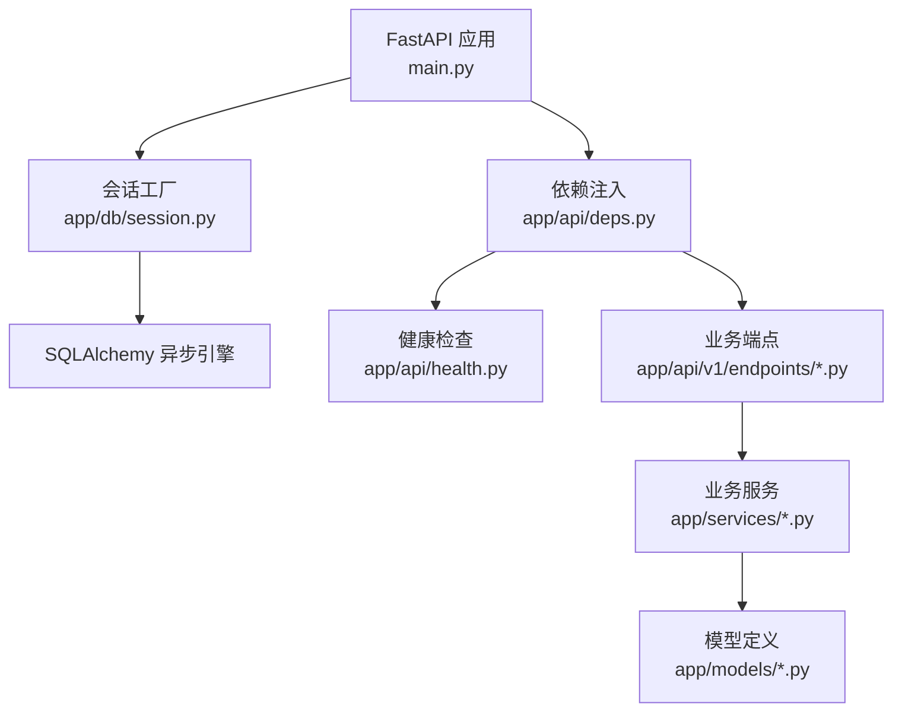
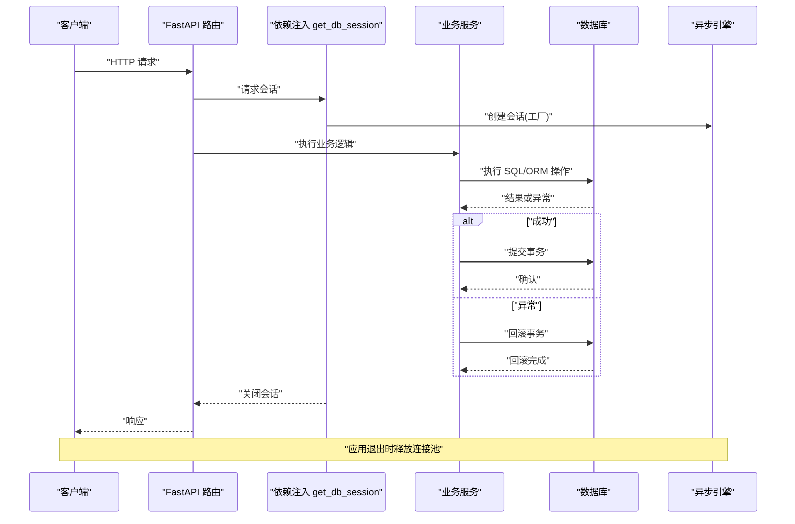
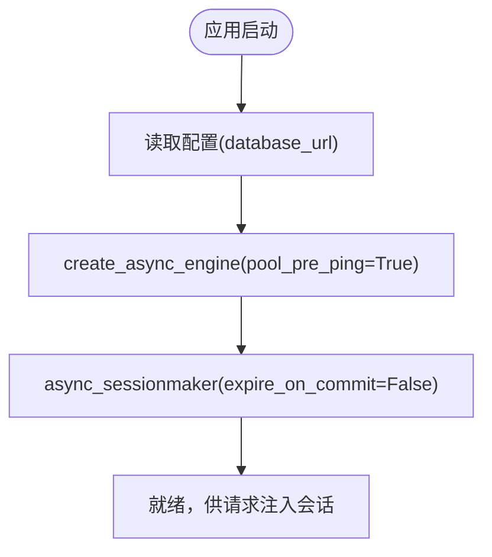
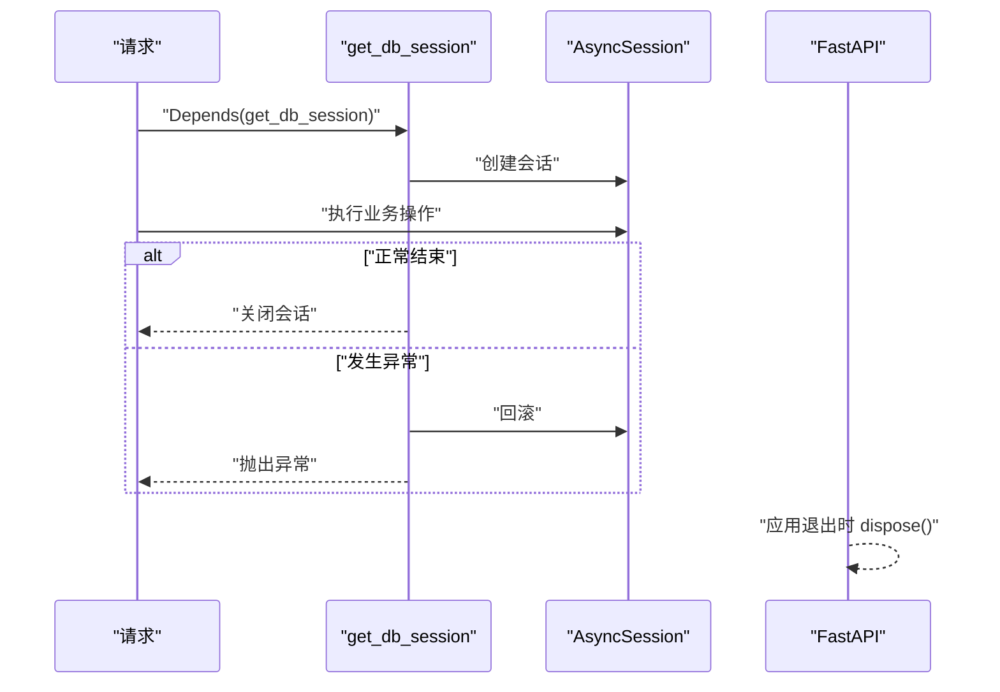
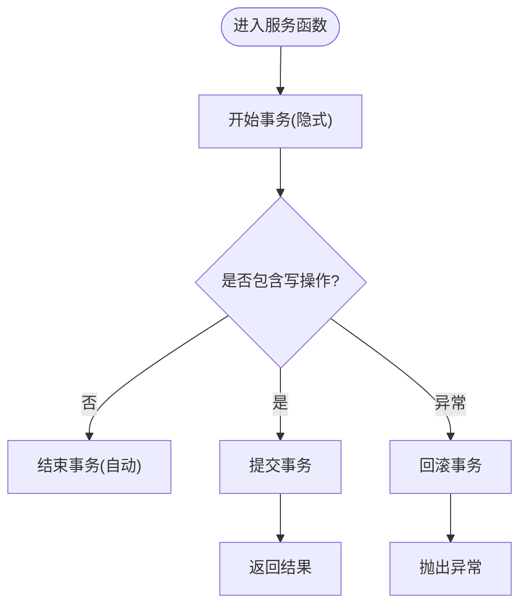
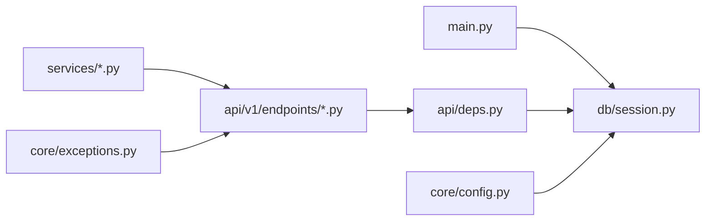

# 数据库会话管理

<cite>
**本文引用的文件**
- [session.py](file://apps/api/app/db/session.py)
- [base.py](file://apps/api/app/db/base.py)
- [config.py](file://apps/api/app/core/config.py)
- [main.py](file://apps/api/app/main.py)
- [deps.py](file://apps/api/app/api/deps.py)
- [health.py](file://apps/api/app/api/health.py)
- [farms.py](file://apps/api/app/api/v1/endpoints/farms.py)
- [farm.py](file://apps/api/app/services/farm.py)
- [exceptions.py](file://apps/api/app/core/exceptions.py)
- [error_codes.py](file://apps/api/app/core/error_codes.py)
</cite>

## 目录
1. [简介](#简介)
2. [项目结构](#项目结构)
3. [核心组件](#核心组件)
4. [架构总览](#架构总览)
5. [详细组件分析](#详细组件分析)
6. [依赖关系分析](#依赖关系分析)
7. [性能考虑](#性能考虑)
8. [故障排查指南](#故障排查指南)
9. [结论](#结论)
10. [附录](#附录)

## 简介
本文件面向 Pocket Farm 后端，系统化阐述基于 SQLAlchemy 的异步数据库会话设计与实现。内容涵盖连接池配置、会话生命周期管理、事务处理机制、安全性与一致性保障、连接泄漏防护、异常处理策略，以及性能优化（连接复用、查询优化、批量操作）和故障排查方法。文档通过代码级图示与路径引用，帮助读者快速定位并理解关键实现。

## 项目结构
本项目在 FastAPI 应用中使用 SQLAlchemy 异步引擎与会话工厂，按“基础设施层（db）—依赖注入（api/deps）—业务服务（services）—接口端点（endpoints）”分层组织。会话由全局引擎创建并通过 async_sessionmaker 提供，请求级别通过依赖注入获取独立会话，并在请求结束时自动关闭。

图表来源
- [main.py:13-24](file://apps/api/app/main.py#L13-L24)
- [session.py:1-7](file://apps/api/app/db/session.py#L1-L7)
- [deps.py:19-26](file://apps/api/app/api/deps.py#L19-L26)
- [health.py:19-35](file://apps/api/app/api/health.py#L19-L35)
- [farms.py:60-200](file://apps/api/app/api/v1/endpoints/farms.py#L60-L200)
- [farm.py:33-53](file://apps/api/app/services/farm.py#L33-L53)

章节来源
- [main.py:13-24](file://apps/api/app/main.py#L13-L24)
- [session.py:1-7](file://apps/api/app/db/session.py#L1-L7)
- [deps.py:19-26](file://apps/api/app/api/deps.py#L19-L26)

## 核心组件
- 异步引擎与会话工厂：使用 create_async_engine 创建引擎，并通过 async_sessionmaker 生成会话工厂；启用 pool_pre_ping 提升连接健壮性；设置 expire_on_commit=False 避免提交后属性失效带来的额外查询。
- 命名约定与基类：统一约束索引、唯一键、外键、主键命名，便于识别与维护。
- 请求级会话注入：get_db_session 为每个请求提供一个独立的 AsyncSession，异常时自动回滚。
- 应用生命周期：应用启动时创建引擎，退出时调用 engine.dispose() 释放连接池资源。
- 健康检查：通过执行简单 SQL 验证数据库可用性，失败时返回 503。

章节来源
- [session.py:1-7](file://apps/api/app/db/session.py#L1-L7)
- [base.py:1-15](file://apps/api/app/db/base.py#L1-L15)
- [deps.py:19-26](file://apps/api/app/api/deps.py#L19-L26)
- [main.py:13-24](file://apps/api/app/main.py#L13-L24)
- [health.py:19-35](file://apps/api/app/api/health.py#L19-L35)

## 架构总览
下图展示了从 HTTP 请求到数据库操作的完整流程，包括会话获取、事务边界、异常处理与资源释放。

图表来源
- [deps.py:19-26](file://apps/api/app/api/deps.py#L19-L26)
- [farms.py:60-200](file://apps/api/app/api/v1/endpoints/farms.py#L60-L200)
- [farm.py:33-53](file://apps/api/app/services/farm.py#L33-L53)
- [main.py:13-24](file://apps/api/app/main.py#L13-L24)

## 详细组件分析

### 会话工厂与连接池配置
- 引擎创建：使用 settings.database_url 初始化异步引擎，并开启 pool_pre_ping 以在每次使用前探测连接有效性，降低死连接风险。
- 会话工厂：async_sessionmaker 绑定引擎，expire_on_commit=False 减少提交后的惰性加载开销；class_=AsyncSession 确保异步语义。
- 配置来源：database_url 等来自 Settings，支持环境变量或 .env 文件。

图表来源
- [session.py:1-7](file://apps/api/app/db/session.py#L1-L7)
- [config.py:5-22](file://apps/api/app/core/config.py#L5-L22)

章节来源
- [session.py:1-7](file://apps/api/app/db/session.py#L1-L7)
- [config.py:5-22](file://apps/api/app/core/config.py#L5-L22)

### 会话生命周期管理
- 请求级会话：get_db_session 使用 async with 管理会话生命周期，确保进入请求时创建、退出时关闭。
- 异常安全：捕获异常后执行 session.rollback()，防止脏数据残留。
- 应用级资源释放：lifespan 钩子在应用退出时调用 engine.dispose()，回收底层连接池。

图表来源
- [deps.py:19-26](file://apps/api/app/api/deps.py#L19-L26)
- [main.py:13-24](file://apps/api/app/main.py#L13-L24)

章节来源
- [deps.py:19-26](file://apps/api/app/api/deps.py#L19-L26)
- [main.py:13-24](file://apps/api/app/main.py#L13-L24)

### 事务处理机制
- 显式事务边界：服务层在需要多步写操作时使用 session.commit() 明确提交；出现异常时进行 rollback。
- 示例：农场创建在单个事务中写入农场与初始成员，遇到唯一冲突重试有限次数。
- 读操作：查询通常不提交，依赖请求级会话的默认事务边界。

图表来源
- [farm.py:33-53](file://apps/api/app/services/farm.py#L33-L53)

章节来源
- [farm.py:33-53](file://apps/api/app/services/farm.py#L33-L53)

### 安全性与一致性保障
- 行级锁：对关键表使用 with_for_update() 加锁，避免并发修改导致的数据不一致（如农场成员管理）。
- 权限校验：在服务层根据角色判断是否允许操作，防止越权。
- 唯一性约束：通过数据库唯一约束与重试机制保证农场编码唯一。
- 异常映射：将数据库异常转换为统一的 AppException，配合全局异常处理器输出稳定错误码。

章节来源
- [farm.py:73-91](file://apps/api/app/services/farm.py#L73-L91)
- [farm.py:94-113](file://apps/api/app/services/farm.py#L94-L113)
- [farm.py:33-53](file://apps/api/app/services/farm.py#L33-L53)
- [exceptions.py:13-88](file://apps/api/app/core/exceptions.py#L13-L88)
- [error_codes.py:1-13](file://apps/api/app/core/error_codes.py#L1-L13)

### 连接泄漏防护与异常处理策略
- 泄漏防护：
  - 请求级会话通过 async with 自动关闭，避免会话未释放。
  - 应用退出时 engine.dispose() 强制释放连接池。
  - pool_pre_ping 检测死连接，降低连接泄漏导致的假象。
- 异常处理：
  - 健康检查捕获 SQLAlchemyError，回滚并返回 503。
  - 全局异常处理器将 AppException、请求校验异常、HTTP 异常统一转为 ApiResponse。
  - 服务层对特定异常（如 IntegrityError）进行捕获并回滚，必要时重试或返回业务冲突。

章节来源
- [deps.py:19-26](file://apps/api/app/api/deps.py#L19-L26)
- [main.py:13-24](file://apps/api/app/main.py#L13-L24)
- [health.py:19-35](file://apps/api/app/api/health.py#L19-L35)
- [exceptions.py:31-88](file://apps/api/app/core/exceptions.py#L31-L88)
- [farm.py:33-53](file://apps/api/app/services/farm.py#L33-L53)

### 会话创建、使用与管理模式（代码示例路径）
- 会话工厂与引擎：[session.py:1-7](file://apps/api/app/db/session.py#L1-L7)
- 请求级会话注入：[deps.py:19-26](file://apps/api/app/api/deps.py#L19-L26)
- 健康检查中的会话使用：[health.py:19-35](file://apps/api/app/api/health.py#L19-L35)
- 端点中注入会话并调用服务：[farms.py:60-200](file://apps/api/app/api/v1/endpoints/farms.py#L60-L200)
- 服务层事务与锁：[farm.py:33-53](file://apps/api/app/services/farm.py#L33-L53), [farm.py:73-91](file://apps/api/app/services/farm.py#L73-L91)

## 依赖关系分析
- 模块耦合：
  - main.py 依赖 db.session.engine 用于生命周期管理。
  - api.deps.get_db_session 依赖 db.session.async_session_factory。
  - 端点与服务通过 AsyncSession 解耦具体数据库实现。
  - 异常处理集中在 core.exceptions，统一对外错误格式。
- 外部依赖：
  - SQLAlchemy 异步驱动与连接池。
  - Pydantic Settings 管理配置。

图表来源
- [main.py:1-24](file://apps/api/app/main.py#L1-L24)
- [session.py:1-7](file://apps/api/app/db/session.py#L1-L7)
- [deps.py:1-26](file://apps/api/app/api/deps.py#L1-L26)
- [farms.py:60-200](file://apps/api/app/api/v1/endpoints/farms.py#L60-L200)
- [exceptions.py:13-88](file://apps/api/app/core/exceptions.py#L13-L88)
- [config.py:5-22](file://apps/api/app/core/config.py#L5-L22)

章节来源
- [main.py:1-24](file://apps/api/app/main.py#L1-L24)
- [session.py:1-7](file://apps/api/app/db/session.py#L1-L7)
- [deps.py:1-26](file://apps/api/app/api/deps.py#L1-L26)
- [exceptions.py:13-88](file://apps/api/app/core/exceptions.py#L13-L88)
- [config.py:5-22](file://apps/api/app/core/config.py#L5-L22)

## 性能考虑
- 连接复用：
  - 使用连接池与 pool_pre_ping 提高连接利用率与健壮性。
  - 应用级 engine.dispose() 仅在退出时释放，避免频繁重建。
- 会话优化：
  - expire_on_commit=False 减少提交后的惰性加载开销。
  - 请求级会话确保短生命周期，避免长事务占用连接。
- 查询优化：
  - 使用 select + limit/offset 分页，减少数据传输量。
  - 必要场景使用 with_for_update() 控制并发，避免热点竞争。
- 批量操作：
  - 对于大量写入，可考虑分批 add 与 flush，结合 commit 控制事务大小，避免单次事务过大导致锁竞争与内存压力。
- 监控建议：
  - 关注连接池使用率、慢查询日志、事务时长与锁等待情况。

[本节为通用指导，不直接分析具体文件]

## 故障排查指南
- 数据库不可用：
  - 现象：健康检查返回 503。
  - 排查：检查 database_url、网络连通、数据库状态；查看 SQLAlchemyError 堆栈。
  - 参考：[health.py:19-35](file://apps/api/app/api/health.py#L19-L35)
- 连接泄漏：
  - 现象：连接数持续增长、超时增多。
  - 排查：确认所有请求均通过 get_db_session 注入；检查是否有未关闭的会话；观察应用退出时 engine.dispose() 是否执行。
  - 参考：[deps.py:19-26](file://apps/api/app/api/deps.py#L19-L26), [main.py:13-24](file://apps/api/app/main.py#L13-L24)
- 事务异常：
  - 现象：IntegrityError 或其他数据库异常。
  - 排查：检查唯一约束、外键约束；确认服务层是否正确回滚与重试；查看异常映射。
  - 参考：[farm.py:33-53](file://apps/api/app/services/farm.py#L33-L53), [exceptions.py:31-88](file://apps/api/app/core/exceptions.py#L31-L88)
- 权限与并发问题：
  - 现象：并发修改导致数据不一致。
  - 排查：确认是否使用 with_for_update() 加锁；检查角色权限校验逻辑。
  - 参考：[farm.py:73-91](file://apps/api/app/services/farm.py#L73-L91), [farm.py:94-113](file://apps/api/app/services/farm.py#L94-L113)

章节来源
- [health.py:19-35](file://apps/api/app/api/health.py#L19-L35)
- [deps.py:19-26](file://apps/api/app/api/deps.py#L19-L26)
- [main.py:13-24](file://apps/api/app/main.py#L13-L24)
- [farm.py:33-53](file://apps/api/app/services/farm.py#L33-L53)
- [farm.py:73-91](file://apps/api/app/services/farm.py#L73-L91)
- [farm.py:94-113](file://apps/api/app/services/farm.py#L94-L113)
- [exceptions.py:31-88](file://apps/api/app/core/exceptions.py#L31-L88)

## 结论
Pocket Farm 后端采用 SQLAlchemy 异步引擎与会话工厂，结合 FastAPI 依赖注入实现了请求级会话管理。通过连接池、pool_pre_ping、显式事务边界、行级锁与统一异常处理，保障了数据库操作的安全性与一致性。建议在大规模写入场景中引入批量操作与事务分片，并结合监控指标持续优化性能与稳定性。

[本节为总结性内容，不直接分析具体文件]

## 附录
- 命名约定：统一索引、唯一键、外键、主键命名，便于维护与排障。
- 配置项：database_url、jwt_secret_key、app_timezone 等通过 Settings 管理。
- 健康检查：提供 /health 接口用于快速验证数据库连通性。

章节来源
- [base.py:1-15](file://apps/api/app/db/base.py#L1-L15)
- [config.py:5-22](file://apps/api/app/core/config.py#L5-L22)
- [health.py:19-35](file://apps/api/app/api/health.py#L19-L35)