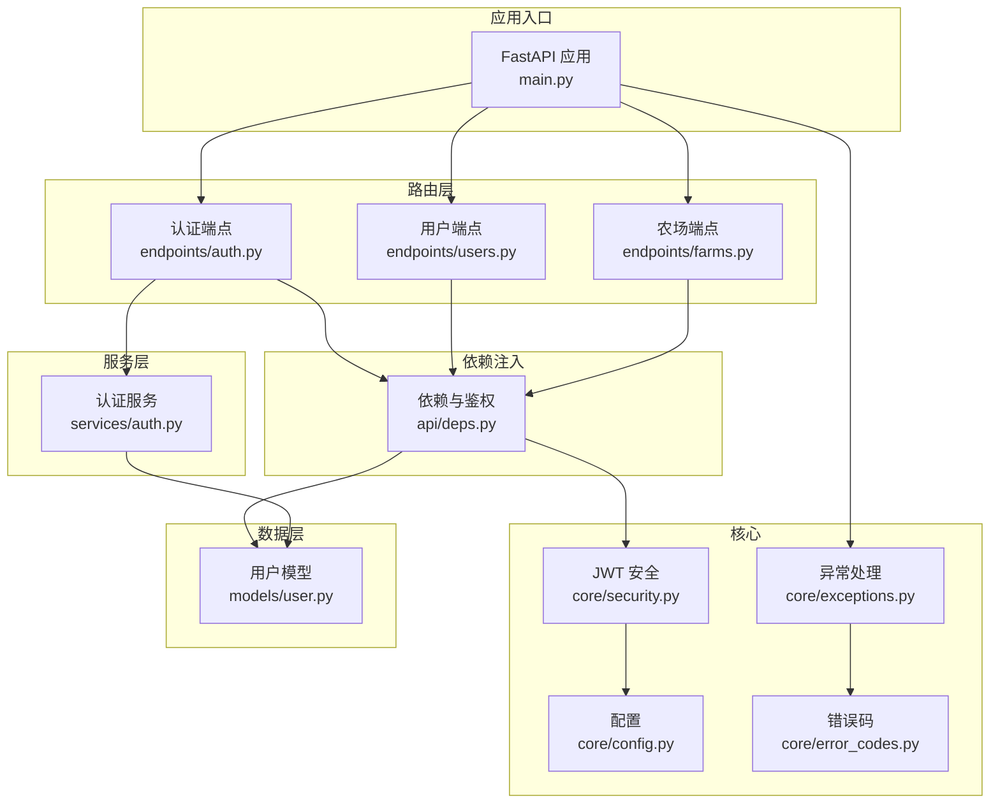
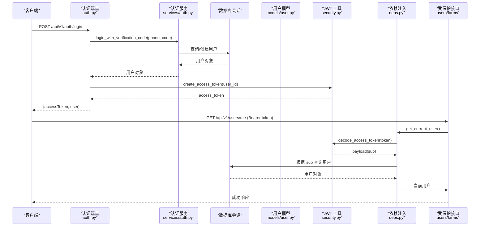
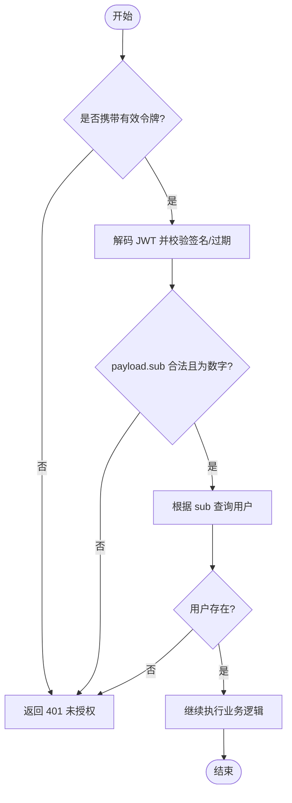
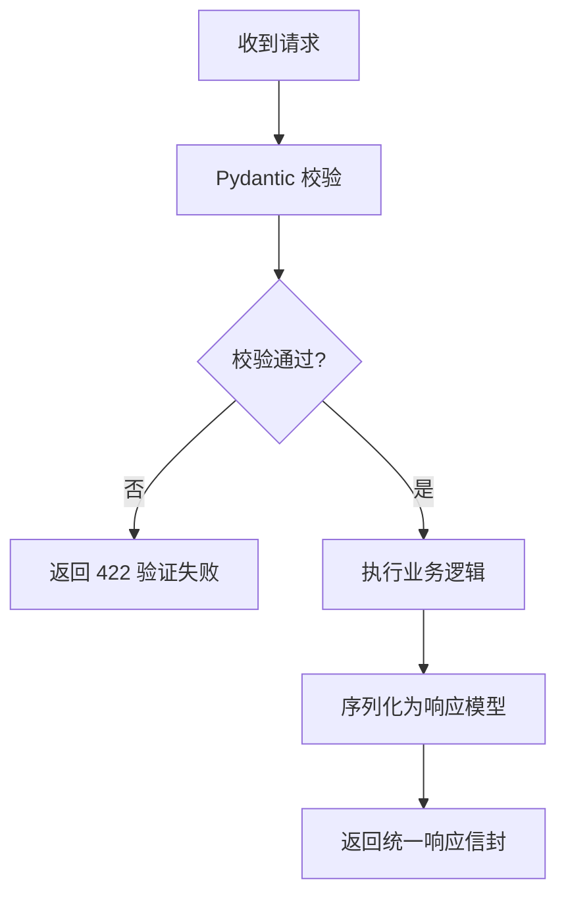
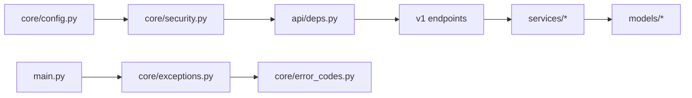

# 安全架构

<cite>
**本文引用的文件**
- [apps/api/app/core/security.py](file://apps/api/app/core/security.py)
- [apps/api/app/core/config.py](file://apps/api/app/core/config.py)
- [apps/api/app/api/deps.py](file://apps/api/app/api/deps.py)
- [apps/api/app/api/v1/endpoints/auth.py](file://apps/api/app/api/v1/endpoints/auth.py)
- [apps/api/app/services/auth.py](file://apps/api/app/services/auth.py)
- [apps/api/app/models/user.py](file://apps/api/app/models/user.py)
- [apps/api/app/schemas/user.py](file://apps/api/app/schemas/user.py)
- [apps/api/app/api/v1/endpoints/users.py](file://apps/api/app/api/v1/endpoints/users.py)
- [apps/api/app/api/v1/endpoints/farms.py](file://apps/api/app/api/v1/endpoints/farms.py)
- [apps/api/app/core/exceptions.py](file://apps/api/app/core/exceptions.py)
- [apps/api/app/core/error_codes.py](file://apps/api/app/core/error_codes.py)
- [apps/api/app/main.py](file://apps/api/app/main.py)
</cite>

## 目录
1. [简介](#简介)
2. [项目结构](#项目结构)
3. [核心组件](#核心组件)
4. [架构总览](#架构总览)
5. [详细组件分析](#详细组件分析)
6. [依赖关系分析](#依赖关系分析)
7. [性能与安全考量](#性能与安全考量)
8. [故障排查指南](#故障排查指南)
9. [结论](#结论)
10. [附录：配置与最佳实践](#附录配置与最佳实践)

## 简介
本安全架构文档聚焦 Pocket Farm API 的认证、授权、输入验证、输出过滤、密码安全、API 防护（速率限制、请求签名、CORS）、日志审计与监控、应急响应，以及常见安全问题与解决方案。基于现有代码实现，本文给出可落地的安全设计说明与改进建议，帮助团队在演进过程中持续提升安全性与可维护性。

## 项目结构
Pocket Farm API 采用 FastAPI 构建，按功能分层组织：
- 路由层：v1 端点（如 auth、users、farms）负责接收请求并调用服务层
- 依赖注入：统一鉴权与数据库会话管理
- 服务层：业务逻辑封装（登录、农场成员管理等）
- 模型与模式：数据模型与 Pydantic 校验/序列化
- 核心模块：安全（JWT）、配置、异常处理、错误码

图表来源
- [apps/api/app/main.py:19-24](file://apps/api/app/main.py#L19-L24)
- [apps/api/app/api/v1/endpoints/auth.py:13-28](file://apps/api/app/api/v1/endpoints/auth.py#L13-L28)
- [apps/api/app/api/deps.py:29-65](file://apps/api/app/api/deps.py#L29-L65)
- [apps/api/app/core/security.py:8-28](file://apps/api/app/core/security.py#L8-L28)
- [apps/api/app/core/config.py:5-22](file://apps/api/app/core/config.py#L5-L22)
- [apps/api/app/core/exceptions.py:83-87](file://apps/api/app/core/exceptions.py#L83-L87)
- [apps/api/app/core/error_codes.py:4-12](file://apps/api/app/core/error_codes.py#L4-L12)

章节来源
- [apps/api/app/main.py:19-24](file://apps/api/app/main.py#L19-L24)

## 核心组件
- JWT 令牌管理：生成与解码访问令牌，使用 HS256 算法与可配置的密钥和过期时间
- 认证流程：手机号+验证码登录，成功后返回 JWT；后续请求通过 Bearer Token 鉴权
- 资源级授权：基于当前用户与领域角色（如农场成员角色）进行资源访问控制
- 输入验证：Pydantic 严格校验请求参数，防止非法输入进入业务层
- 输出过滤：响应模型仅暴露必要字段，避免敏感信息泄露
- 异常与错误码：统一异常类型与错误码，保证一致的客户端错误处理体验

章节来源
- [apps/api/app/core/security.py:8-28](file://apps/api/app/core/security.py#L8-L28)
- [apps/api/app/api/v1/endpoints/auth.py:13-28](file://apps/api/app/api/v1/endpoints/auth.py#L13-L28)
- [apps/api/app/api/deps.py:29-65](file://apps/api/app/api/deps.py#L29-L65)
- [apps/api/app/schemas/user.py:4-34](file://apps/api/app/schemas/user.py#L4-L34)
- [apps/api/app/core/exceptions.py:13-87](file://apps/api/app/core/exceptions.py#L13-L87)
- [apps/api/app/core/error_codes.py:4-12](file://apps/api/app/core/error_codes.py#L4-L12)

## 架构总览
下图展示从登录到受保护接口调用的完整安全链路，包括 JWT 签发、依赖注入中的令牌校验、以及资源级权限检查。

图表来源
- [apps/api/app/api/v1/endpoints/auth.py:13-28](file://apps/api/app/api/v1/endpoints/auth.py#L13-L28)
- [apps/api/app/services/auth.py:11-46](file://apps/api/app/services/auth.py#L11-L46)
- [apps/api/app/models/user.py:15-27](file://apps/api/app/models/user.py#L15-L27)
- [apps/api/app/core/security.py:8-28](file://apps/api/app/core/security.py#L8-L28)
- [apps/api/app/api/deps.py:29-65](file://apps/api/app/api/deps.py#L29-L65)
- [apps/api/app/api/v1/endpoints/users.py:15-29](file://apps/api/app/api/v1/endpoints/users.py#L15-L29)

## 详细组件分析

### 认证与授权机制
- 登录流程：手机号+验证码校验通过后，签发 JWT 访问令牌；支持测试环境开关与固定验证码
- 鉴权流程：所有受保护接口通过依赖注入获取当前用户，解析并校验 JWT，再查询数据库确认用户存在
- 资源级授权：以农场为例，接口传入当前用户 ID，在服务层依据成员角色决定读写权限

图表来源
- [apps/api/app/api/deps.py:29-65](file://apps/api/app/api/deps.py#L29-L65)
- [apps/api/app/core/security.py:8-28](file://apps/api/app/core/security.py#L8-L28)

章节来源
- [apps/api/app/api/v1/endpoints/auth.py:13-28](file://apps/api/app/api/v1/endpoints/auth.py#L13-L28)
- [apps/api/app/services/auth.py:11-46](file://apps/api/app/services/auth.py#L11-L46)
- [apps/api/app/api/deps.py:29-65](file://apps/api/app/api/deps.py#L29-L65)
- [apps/api/app/api/v1/endpoints/farms.py:58-200](file://apps/api/app/api/v1/endpoints/farms.py#L58-L200)

### 输入验证与输出过滤
- 输入验证：使用 Pydantic 对请求体进行强类型校验与约束（如手机号格式、长度、正则），不合法请求直接返回 422
- 输出过滤：响应模型仅包含必要字段，避免将内部字段或敏感信息暴露给客户端
- 统一错误响应：所有异常经统一处理器转换为标准错误信封，便于前端一致处理

图表来源
- [apps/api/app/schemas/user.py:4-34](file://apps/api/app/schemas/user.py#L4-L34)
- [apps/api/app/core/exceptions.py:47-56](file://apps/api/app/core/exceptions.py#L47-L56)

章节来源
- [apps/api/app/schemas/user.py:4-34](file://apps/api/app/schemas/user.py#L4-L34)
- [apps/api/app/core/exceptions.py:47-56](file://apps/api/app/core/exceptions.py#L47-L56)

### 密码安全策略
- 现状：当前登录方式为“手机号+验证码”，未涉及密码存储与哈希
- 建议：若未来引入密码登录，应使用 bcrypt/argon2 等抗碰撞、抗暴力破解的哈希算法，并为每个用户生成独立盐值；禁止明文存储与弱哈希

[本节为通用安全建议，不直接分析具体文件]

### API 安全防护措施
- 速率限制：当前未实现全局或接口级限流；建议在网关或中间件层增加 IP/用户维度限流，防止暴力破解与滥用
- 请求签名：当前未实现请求签名；建议在关键写操作引入签名或一次性令牌，增强防重放能力
- CORS：当前未在应用内显式配置 CORS；生产环境应在网关或反向代理中精确配置允许的源、方法与头

[本节为通用安全建议，不直接分析具体文件]

### 资源访问验证（示例：农场）
- 所有农场相关接口均要求已认证用户，并在服务层根据当前用户与农场成员角色进行权限判断
- 典型场景：创建农场时记录创建者；编辑农场/成员时校验是否为所有者或具备相应角色

章节来源
- [apps/api/app/api/v1/endpoints/farms.py:58-200](file://apps/api/app/api/v1/endpoints/farms.py#L58-L200)

## 依赖关系分析
- 认证依赖：端点依赖 deps.get_current_user，后者依赖 security.decode_access_token 与数据库会话
- 配置依赖：JWT 算法、密钥、过期时间来自 core.config.Settings
- 异常依赖：统一异常处理器注册于应用启动时，确保错误响应一致性

图表来源
- [apps/api/app/core/config.py:5-22](file://apps/api/app/core/config.py#L5-L22)
- [apps/api/app/core/security.py:8-28](file://apps/api/app/core/security.py#L8-L28)
- [apps/api/app/api/deps.py:29-65](file://apps/api/app/api/deps.py#L29-L65)
- [apps/api/app/main.py:19-24](file://apps/api/app/main.py#L19-L24)
- [apps/api/app/core/exceptions.py:83-87](file://apps/api/app/core/exceptions.py#L83-L87)
- [apps/api/app/core/error_codes.py:4-12](file://apps/api/app/core/error_codes.py#L4-L12)

章节来源
- [apps/api/app/core/config.py:5-22](file://apps/api/app/core/config.py#L5-L22)
- [apps/api/app/core/security.py:8-28](file://apps/api/app/core/security.py#L8-L28)
- [apps/api/app/api/deps.py:29-65](file://apps/api/app/api/deps.py#L29-L65)
- [apps/api/app/main.py:19-24](file://apps/api/app/main.py#L19-L24)

## 性能与安全考量
- 令牌生命周期：JWT 过期时间较长（默认一周），需结合刷新令牌或短期访问令牌策略平衡安全与体验
- 数据库会话：每次请求独立会话，异常时回滚，避免状态污染
- 输入校验：前置校验减少无效请求进入业务层，降低攻击面
- 输出最小化：响应模型仅暴露必要字段，降低信息泄露风险
- 可扩展性：在网关层集中实现限流、WAF、CORS 与审计日志，减轻应用负担

[本节提供通用指导，不直接分析具体文件]

## 故障排查指南
- 401 未授权：检查请求是否携带 Bearer Token；确认 JWT 未过期且签名正确；确认用户仍存在
- 422 验证失败：检查请求体是否符合 Pydantic 约束（如手机号格式、长度）
- 409 冲突：并发创建用户时可能触发唯一键冲突，服务层已做回滚与重试查询
- 500 内部错误：未捕获异常将被统一处理器转为标准错误响应，便于定位

章节来源
- [apps/api/app/api/deps.py:29-65](file://apps/api/app/api/deps.py#L29-L65)
- [apps/api/app/services/auth.py:11-46](file://apps/api/app/services/auth.py#L11-L46)
- [apps/api/app/core/exceptions.py:35-87](file://apps/api/app/core/exceptions.py#L35-L87)

## 结论
Pocket Farm API 已实现基础的认证与授权机制：基于 JWT 的无状态鉴权、严格的输入验证与统一的错误响应。资源级权限通过服务层对用户与领域角色进行控制。为进一步强化安全性，建议在生产环境中补充速率限制、请求签名、CORS 白名单、审计日志与安全监控，并完善密码安全策略（如引入密码登录时的强哈希与盐值管理）。

[本节总结性内容，不直接分析具体文件]

## 附录：配置与最佳实践
- 配置项（环境变量或 .env）
  - jwt_secret_key：JWT 签名密钥（建议使用高强度随机字符串）
  - jwt_algorithm：JWT 算法（当前默认 HS256）
  - jwt_expire_minutes：JWT 过期时间（分钟）
  - test_login_enabled/test_login_code：测试登录开关与验证码
- 安全最佳实践
  - 日志审计：记录登录成功/失败、鉴权失败、关键写操作（建议脱敏敏感信息）
  - 安全监控：告警异常登录、高频失败、越权访问尝试
  - 应急响应：快速吊销可疑令牌、临时封禁恶意 IP、滚动更新密钥
  - 安全加固：在网关层启用 WAF、HTTPS、CORS 白名单、请求大小限制
  - 开发规范：遵循最小权限原则、输入即不可信、输出即最小化

[本节为通用指导，不直接分析具体文件]