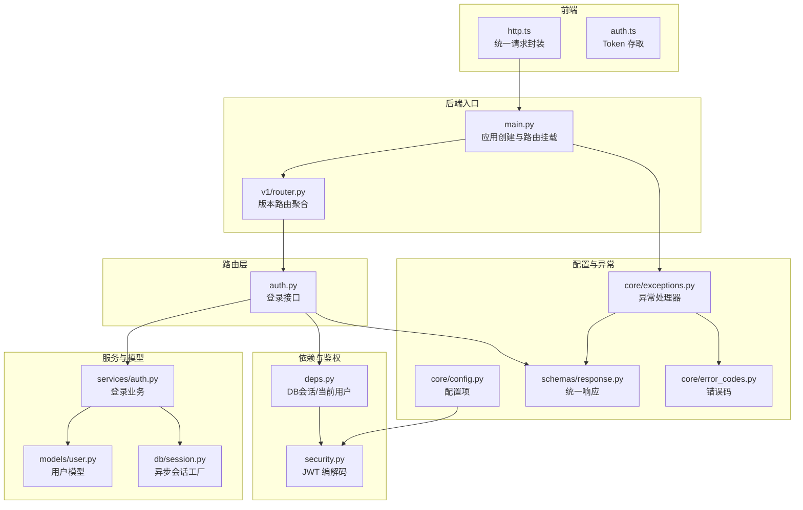
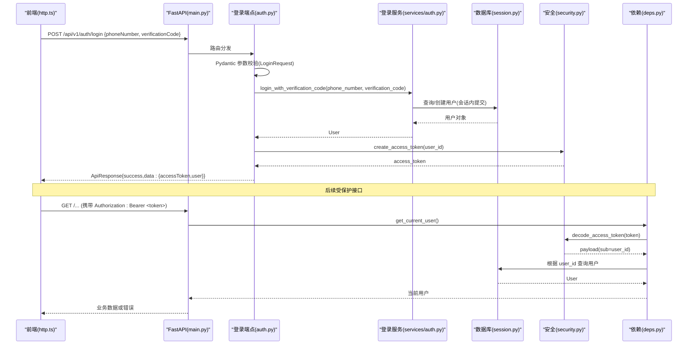
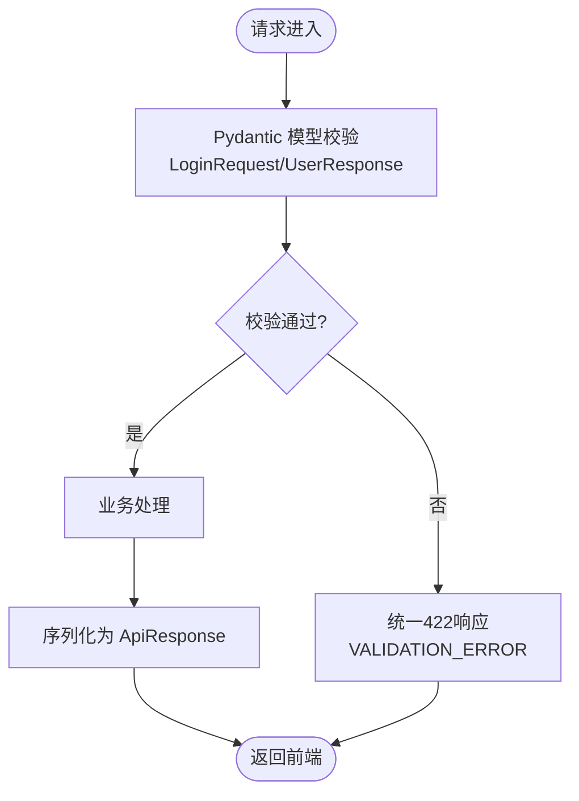
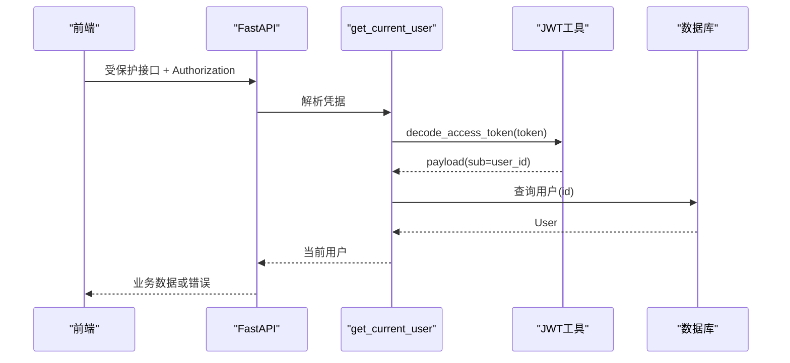
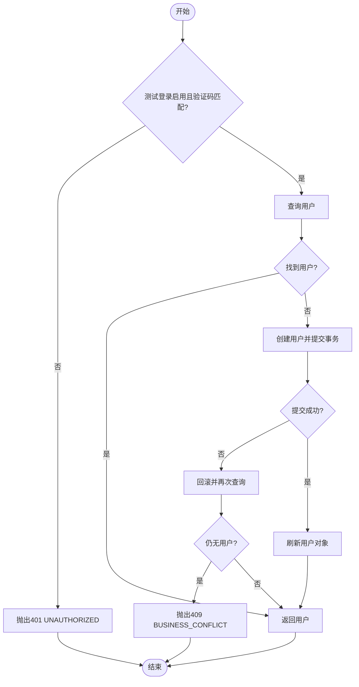
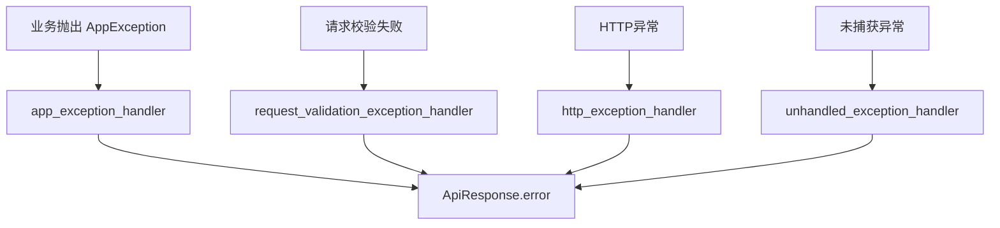
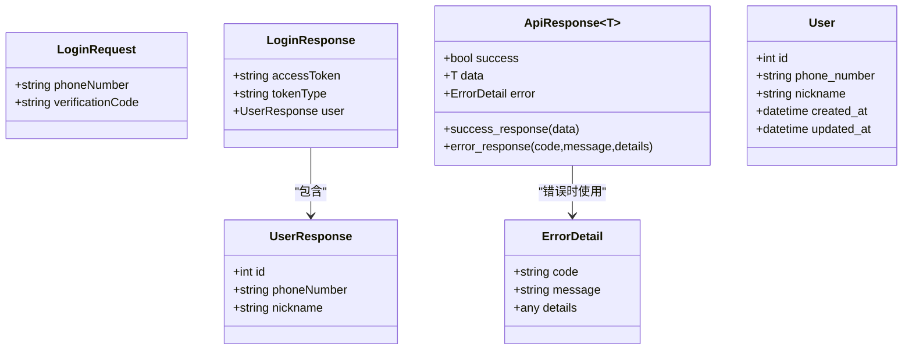
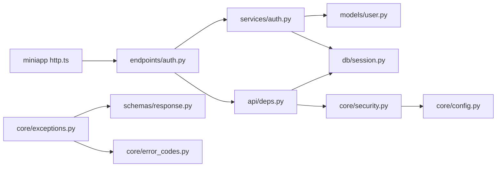
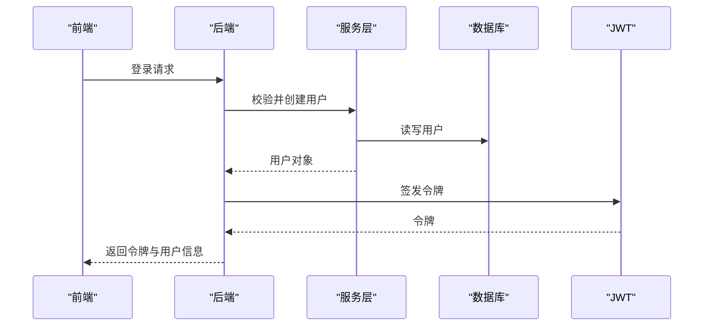

# 数据流设计

<cite>
**本文引用的文件**
- [apps/api/app/main.py](file://apps/api/app/main.py)
- [apps/api/app/core/config.py](file://apps/api/app/core/config.py)
- [apps/api/app/core/security.py](file://apps/api/app/core/security.py)
- [apps/api/app/core/exceptions.py](file://apps/api/app/core/exceptions.py)
- [apps/api/app/core/error_codes.py](file://apps/api/app/core/error_codes.py)
- [apps/api/app/api/deps.py](file://apps/api/app/api/deps.py)
- [apps/api/app/api/v1/router.py](file://apps/api/app/api/v1/router.py)
- [apps/api/app/api/v1/endpoints/auth.py](file://apps/api/app/api/v1/endpoints/auth.py)
- [apps/api/app/schemas/response.py](file://apps/api/app/schemas/response.py)
- [apps/api/app/schemas/user.py](file://apps/api/app/schemas/user.py)
- [apps/api/app/services/auth.py](file://apps/api/app/services/auth.py)
- [apps/api/app/models/user.py](file://apps/api/app/models/user.py)
- [apps/api/app/db/session.py](file://apps/api/app/db/session.py)
- [apps/miniapp/src/services/http.ts](file://apps/miniapp/src/services/http.ts)
- [apps/miniapp/src/services/auth.ts](file://apps/miniapp/src/services/auth.ts)
</cite>

## 目录
1. [简介](#简介)
2. [项目结构](#项目结构)
3. [核心组件](#核心组件)
4. [架构总览](#架构总览)
5. [详细组件分析](#详细组件分析)
6. [依赖关系分析](#依赖关系分析)
7. [性能考虑](#性能考虑)
8. [故障排查指南](#故障排查指南)
9. [结论](#结论)
10. [附录](#附录)

## 简介
本文件面向 Pocket Farm 的数据流设计，覆盖从前端请求到后端响应的完整流转过程，包括：
- 请求验证与响应序列化（Pydantic 模型在前端与后端的统一约定）
- 认证授权数据流（JWT 令牌生成、校验与权限检查）
- 错误处理与异常传播（保证数据一致性与事务完整性）
- 关键业务场景的数据流图
- 数据安全考量（敏感信息加密、传输安全、存储安全）

## 项目结构
后端采用 FastAPI 分层架构：路由层（endpoints）、依赖注入（deps）、服务层（services）、领域模型（models）、数据访问（db/session）、配置与安全（core），并通过统一的响应封装（schemas/response）和错误码（core/error_codes）规范前后端交互。前端基于 uni-app，使用统一的 HTTP 客户端与服务模块进行鉴权与网络请求。

图表来源
- [apps/api/app/main.py:13-27](file://apps/api/app/main.py#L13-L27)
- [apps/api/app/api/v1/router.py:1-21](file://apps/api/app/api/v1/router.py#L1-L21)
- [apps/api/app/api/v1/endpoints/auth.py:1-29](file://apps/api/app/api/v1/endpoints/auth.py#L1-L29)
- [apps/api/app/api/deps.py:1-66](file://apps/api/app/api/deps.py#L1-L66)
- [apps/api/app/services/auth.py:1-47](file://apps/api/app/services/auth.py#L1-L47)
- [apps/api/app/models/user.py:1-28](file://apps/api/app/models/user.py#L1-L28)
- [apps/api/app/db/session.py:1-7](file://apps/api/app/db/session.py#L1-L7)
- [apps/api/app/core/config.py:1-23](file://apps/api/app/core/config.py#L1-L23)
- [apps/api/app/core/exceptions.py:1-88](file://apps/api/app/core/exceptions.py#L1-L88)
- [apps/api/app/schemas/response.py:1-40](file://apps/api/app/schemas/response.py#L1-L40)
- [apps/api/app/core/error_codes.py:1-13](file://apps/api/app/core/error_codes.py#L1-L13)

章节来源
- [apps/api/app/main.py:13-27](file://apps/api/app/main.py#L13-L27)
- [apps/api/app/api/v1/router.py:1-21](file://apps/api/app/api/v1/router.py#L1-L21)

## 核心组件
- 统一响应体：ApiResponse 提供 success/data/error 的统一结构，便于前后端契约一致。
- 错误码枚举：ErrorCode 定义稳定可机器解析的错误码，配合异常处理器输出一致错误格式。
- 配置中心：Settings 集中管理数据库连接、JWT 密钥、过期时间等敏感或环境相关配置。
- 会话管理：异步引擎与会话工厂，按请求生命周期提供独立会话并自动回滚。
- 鉴权依赖：get_current_user 负责从 Bearer Token 中解析用户身份并加载用户对象。
- 安全工具：create_access_token/decode_access_token 实现 JWT 的签发与校验。
- 登录服务：根据验证码策略完成用户查找或创建，并处理并发冲突。
- 前端 HTTP：统一封装请求、附加 Authorization、处理 401 清理本地 Token、将后端 ApiResponse 转换为前端错误。

章节来源
- [apps/api/app/schemas/response.py:1-40](file://apps/api/app/schemas/response.py#L1-L40)
- [apps/api/app/core/error_codes.py:1-13](file://apps/api/app/core/error_codes.py#L1-L13)
- [apps/api/app/core/config.py:1-23](file://apps/api/app/core/config.py#L1-L23)
- [apps/api/app/db/session.py:1-7](file://apps/api/app/db/session.py#L1-L7)
- [apps/api/app/api/deps.py:1-66](file://apps/api/app/api/deps.py#L1-L66)
- [apps/api/app/core/security.py:1-29](file://apps/api/app/core/security.py#L1-L29)
- [apps/api/app/services/auth.py:1-47](file://apps/api/app/services/auth.py#L1-L47)
- [apps/miniapp/src/services/http.ts:1-106](file://apps/miniapp/src/services/http.ts#L1-L106)

## 架构总览
下图展示一次“手机号+验证码登录”的端到端数据流：前端发起请求，后端路由进入登录端点，调用服务层完成用户校验与创建，返回包含 JWT 的用户信息；后续受保护接口通过依赖注入解析 Token 并获取当前用户。

图表来源
- [apps/miniapp/src/services/http.ts:46-105](file://apps/miniapp/src/services/http.ts#L46-L105)
- [apps/api/app/main.py:19-24](file://apps/api/app/main.py#L19-L24)
- [apps/api/app/api/v1/endpoints/auth.py:13-28](file://apps/api/app/api/v1/endpoints/auth.py#L13-L28)
- [apps/api/app/services/auth.py:11-46](file://apps/api/app/services/auth.py#L11-L46)
- [apps/api/app/db/session.py:1-7](file://apps/api/app/db/session.py#L1-L7)
- [apps/api/app/core/security.py:8-28](file://apps/api/app/core/security.py#L8-L28)
- [apps/api/app/api/deps.py:19-65](file://apps/api/app/api/deps.py#L19-L65)

## 详细组件分析

### 请求验证与响应序列化（Pydantic 统一策略）
- 后端使用 Pydantic BaseModel 对入参与出参进行强类型校验与转换，如 LoginRequest 支持驼峰/下划线双别名，确保与前端字段命名一致。
- 统一响应体 ApiResponse 以 success/data/error 三字段对外暴露，错误路径由异常处理器统一包装为同一结构。
- 前端 http.ts 将后端 ApiResponse 解包为业务数据或抛出 ApiRequestError，保持错误信息一致性。

图表来源
- [apps/api/app/schemas/user.py:4-29](file://apps/api/app/schemas/user.py#L4-L29)
- [apps/api/app/schemas/response.py:16-39](file://apps/api/app/schemas/response.py#L16-L39)
- [apps/api/app/core/exceptions.py:47-56](file://apps/api/app/core/exceptions.py#L47-L56)
- [apps/miniapp/src/services/http.ts:68-98](file://apps/miniapp/src/services/http.ts#L68-L98)

章节来源
- [apps/api/app/schemas/user.py:4-29](file://apps/api/app/schemas/user.py#L4-L29)
- [apps/api/app/schemas/response.py:16-39](file://apps/api/app/schemas/response.py#L16-L39)
- [apps/api/app/core/exceptions.py:47-56](file://apps/api/app/core/exceptions.py#L47-L56)
- [apps/miniapp/src/services/http.ts:68-98](file://apps/miniapp/src/services/http.ts#L68-L98)

### 认证授权数据流（JWT 签发、校验与权限检查）
- 登录成功后服务端签发 JWT，包含用户标识与过期时间，返回给前端。
- 前端在后续请求头中携带 Authorization: Bearer <token>。
- 受保护接口通过依赖注入 get_current_user 解析 Token，校验签名与有效期，并加载当前用户。
- 未携带或无效 Token 时，统一抛出 401 错误。

图表来源
- [apps/api/app/api/deps.py:29-65](file://apps/api/app/api/deps.py#L29-L65)
- [apps/api/app/core/security.py:22-28](file://apps/api/app/core/security.py#L22-L28)
- [apps/api/app/db/session.py:1-7](file://apps/api/app/db/session.py#L1-L7)

章节来源
- [apps/api/app/api/deps.py:29-65](file://apps/api/app/api/deps.py#L29-L65)
- [apps/api/app/core/security.py:8-28](file://apps/api/app/core/security.py#L8-L28)

### 登录业务流程与事务完整性
- 登录流程优先校验测试模式下的验证码策略；若关闭测试模式或未命中验证码，直接拒绝。
- 查询用户不存在则创建新用户并提交事务；若发生唯一键冲突，回滚并重试查询，避免竞态导致的不一致。
- 成功登录后返回用户信息与 JWT。

图表来源
- [apps/api/app/services/auth.py:11-46](file://apps/api/app/services/auth.py#L11-L46)
- [apps/api/app/models/user.py:15-28](file://apps/api/app/models/user.py#L15-L28)
- [apps/api/app/db/session.py:1-7](file://apps/api/app/db/session.py#L1-L7)

章节来源
- [apps/api/app/services/auth.py:11-46](file://apps/api/app/services/auth.py#L11-L46)
- [apps/api/app/models/user.py:15-28](file://apps/api/app/models/user.py#L15-L28)

### 错误处理与异常传播机制
- 自定义 AppException 携带稳定错误码与消息，被全局异常处理器捕获并转为 ApiResponse.error。
- 请求校验失败统一返回 422，附带详细校验错误。
- 未捕获异常统一返回 500，避免泄露内部细节。
- 前端将 401 视为失效，清除本地 Token，并将后端错误映射为 ApiRequestError，便于上层统一处理。

图表来源
- [apps/api/app/core/exceptions.py:13-88](file://apps/api/app/core/exceptions.py#L13-L88)
- [apps/api/app/schemas/response.py:16-39](file://apps/api/app/schemas/response.py#L16-L39)
- [apps/miniapp/src/services/http.ts:68-101](file://apps/miniapp/src/services/http.ts#L68-L101)

章节来源
- [apps/api/app/core/exceptions.py:13-88](file://apps/api/app/core/exceptions.py#L13-L88)
- [apps/api/app/schemas/response.py:16-39](file://apps/api/app/schemas/response.py#L16-L39)
- [apps/miniapp/src/services/http.ts:68-101](file://apps/miniapp/src/services/http.ts#L68-L101)

### 数据模型与序列化（类图）

图表来源
- [apps/api/app/schemas/user.py:4-29](file://apps/api/app/schemas/user.py#L4-L29)
- [apps/api/app/schemas/response.py:10-39](file://apps/api/app/schemas/response.py#L10-L39)
- [apps/api/app/models/user.py:15-28](file://apps/api/app/models/user.py#L15-L28)

章节来源
- [apps/api/app/schemas/user.py:4-29](file://apps/api/app/schemas/user.py#L4-L29)
- [apps/api/app/schemas/response.py:10-39](file://apps/api/app/schemas/response.py#L10-L39)
- [apps/api/app/models/user.py:15-28](file://apps/api/app/models/user.py#L15-L28)

## 依赖关系分析
- 路由层依赖服务层与依赖注入；服务层依赖模型与数据库会话；安全模块依赖配置；异常处理器依赖统一响应与错误码。
- 前端依赖后端统一响应结构与错误码，形成稳定的契约。

图表来源
- [apps/api/app/api/v1/endpoints/auth.py:1-29](file://apps/api/app/api/v1/endpoints/auth.py#L1-L29)
- [apps/api/app/services/auth.py:1-47](file://apps/api/app/services/auth.py#L1-L47)
- [apps/api/app/models/user.py:1-28](file://apps/api/app/models/user.py#L1-L28)
- [apps/api/app/db/session.py:1-7](file://apps/api/app/db/session.py#L1-L7)
- [apps/api/app/api/deps.py:1-66](file://apps/api/app/api/deps.py#L1-L66)
- [apps/api/app/core/security.py:1-29](file://apps/api/app/core/security.py#L1-L29)
- [apps/api/app/core/config.py:1-23](file://apps/api/app/core/config.py#L1-L23)
- [apps/api/app/core/exceptions.py:1-88](file://apps/api/app/core/exceptions.py#L1-L88)
- [apps/api/app/schemas/response.py:1-40](file://apps/api/app/schemas/response.py#L1-L40)
- [apps/api/app/core/error_codes.py:1-13](file://apps/api/app/core/error_codes.py#L1-L13)
- [apps/miniapp/src/services/http.ts:1-106](file://apps/miniapp/src/services/http.ts#L1-L106)

章节来源
- [apps/api/app/api/v1/endpoints/auth.py:1-29](file://apps/api/app/api/v1/endpoints/auth.py#L1-L29)
- [apps/api/app/services/auth.py:1-47](file://apps/api/app/services/auth.py#L1-L47)
- [apps/api/app/api/deps.py:1-66](file://apps/api/app/api/deps.py#L1-L66)
- [apps/api/app/core/security.py:1-29](file://apps/api/app/core/security.py#L1-L29)
- [apps/api/app/core/config.py:1-23](file://apps/api/app/core/config.py#L1-L23)
- [apps/api/app/core/exceptions.py:1-88](file://apps/api/app/core/exceptions.py#L1-L88)
- [apps/api/app/schemas/response.py:1-40](file://apps/api/app/schemas/response.py#L1-L40)
- [apps/api/app/core/error_codes.py:1-13](file://apps/api/app/core/error_codes.py#L1-L13)
- [apps/miniapp/src/services/http.ts:1-106](file://apps/miniapp/src/services/http.ts#L1-L106)

## 性能考虑
- 数据库会话按请求生命周期隔离，自动回滚异常分支，减少长事务与锁竞争。
- 登录流程在唯一键冲突时回滚并二次查询，避免重复写入与额外开销。
- 使用异步引擎与异步会话，提升并发处理能力。
- 建议在生产环境开启连接池预检与合理的超时配置，降低数据库压力。

[本节为通用性能建议，不直接分析具体文件]

## 故障排查指南
- 401 未授权：检查前端是否携带有效 Token；确认服务端 JWT 密钥与算法配置正确；确认 Token 未过期。
- 422 参数校验失败：核对前端字段名与后端 Pydantic 模型别名；查看错误详情定位具体字段问题。
- 409 业务冲突：多实例并发创建用户时可能出现，重试逻辑已内置；若仍失败，检查数据库唯一约束与索引。
- 500 内部错误：查看服务端日志；确认数据库连接与配置是否正确。

章节来源
- [apps/api/app/core/exceptions.py:35-88](file://apps/api/app/core/exceptions.py#L35-L88)
- [apps/api/app/api/deps.py:29-65](file://apps/api/app/api/deps.py#L29-L65)
- [apps/api/app/services/auth.py:11-46](file://apps/api/app/services/auth.py#L11-L46)
- [apps/miniapp/src/services/http.ts:68-101](file://apps/miniapp/src/services/http.ts#L68-L101)

## 结论
Pocket Farm 通过 Pydantic 模型与统一响应体实现了前后端一致的请求/响应契约；借助 FastAPI 依赖注入与 JWT 工具完成了安全的认证授权流程；通过全局异常处理器与事务回滚保证了错误处理的稳定性与数据一致性。整体数据流清晰、可扩展性强，适合持续迭代与团队协作。

[本节为总结性内容，不直接分析具体文件]

## 附录

### 关键业务场景数据流图（登录）

图表来源
- [apps/api/app/api/v1/endpoints/auth.py:13-28](file://apps/api/app/api/v1/endpoints/auth.py#L13-L28)
- [apps/api/app/services/auth.py:11-46](file://apps/api/app/services/auth.py#L11-L46)
- [apps/api/app/core/security.py:8-19](file://apps/api/app/core/security.py#L8-L19)

### 数据安全考虑
- 敏感配置：JWT 密钥、数据库 URL 等通过环境变量或 .env 管理，避免硬编码。
- 传输安全：生产环境建议使用 HTTPS 保障传输加密；前端可通过环境变量配置 API 基础地址。
- 存储安全：Token 仅保存在本地存储中，必要时结合平台安全能力（如小程序安全存储）；服务端不持久化明文密码（当前为验证码登录）。
- 最小权限：仅暴露必要字段；对用户信息进行序列化控制，避免泄露敏感信息。

[本节为通用安全建议，不直接分析具体文件]