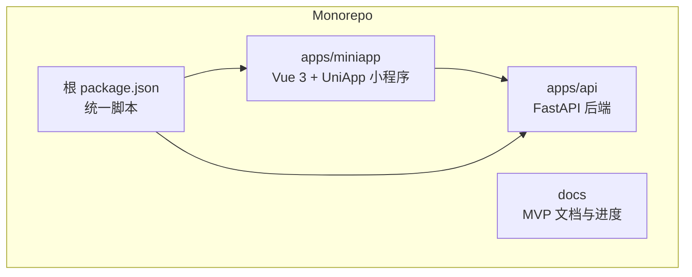
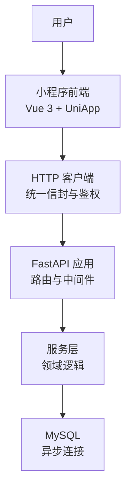
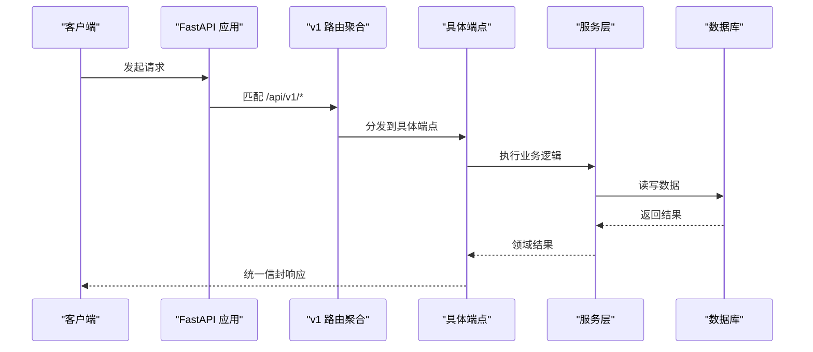
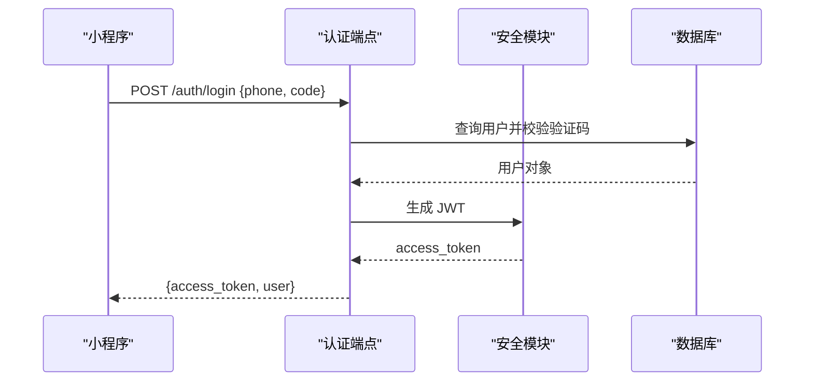
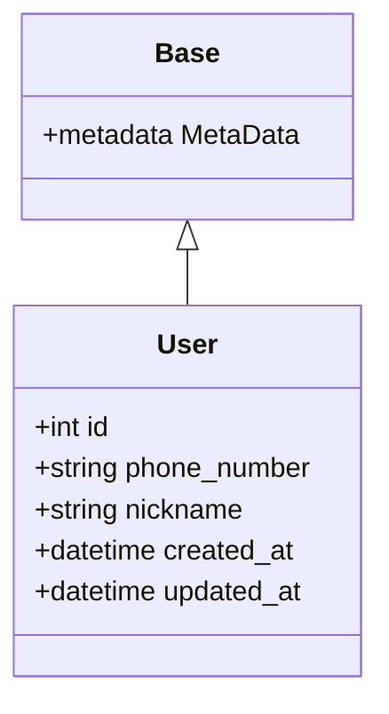
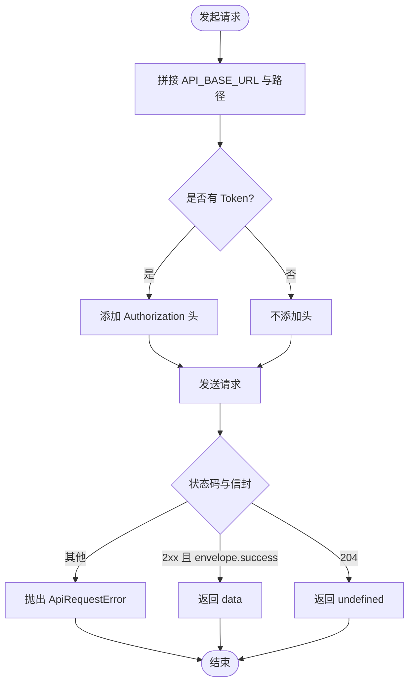
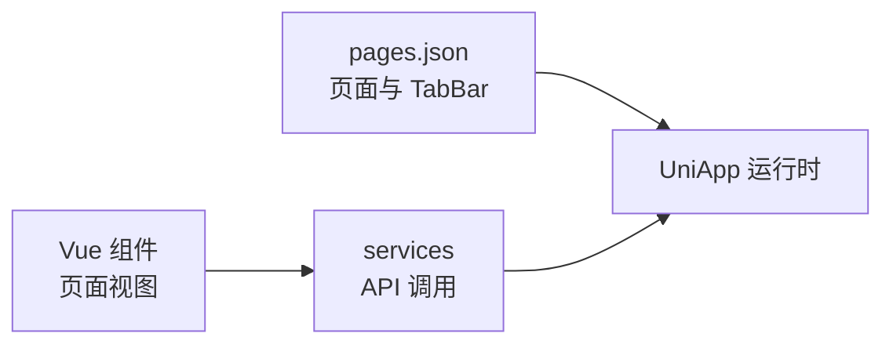
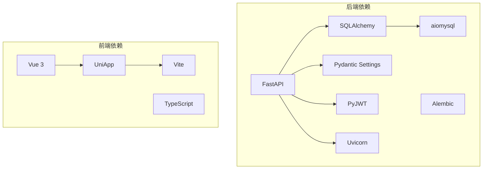
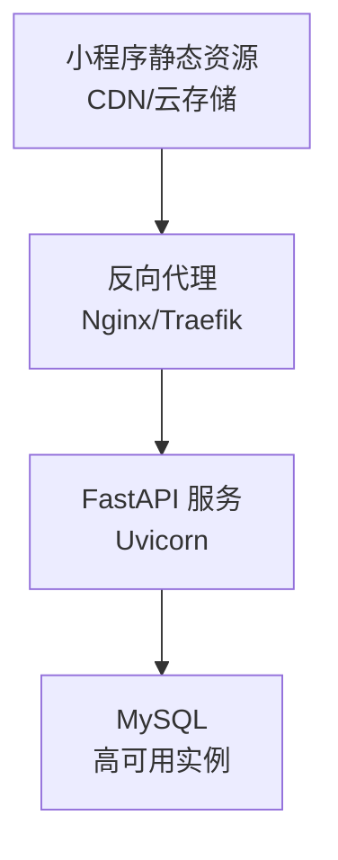

# 整体架构设计

<cite>
**本文引用的文件**
- [apps/api/app/main.py](file://apps/api/app/main.py)
- [apps/api/app/core/config.py](file://apps/api/app/core/config.py)
- [apps/api/app/db/base.py](file://apps/api/app/db/base.py)
- [apps/api/app/api/v1/router.py](file://apps/api/app/api/v1/router.py)
- [apps/api/app/api/v1/endpoints/auth.py](file://apps/api/app/api/v1/endpoints/auth.py)
- [apps/api/app/models/user.py](file://apps/api/app/models/user.py)
- [apps/miniapp/src/main.ts](file://apps/miniapp/src/main.ts)
- [apps/miniapp/src/services/http.ts](file://apps/miniapp/src/services/http.ts)
- [apps/miniapp/src/pages.json](file://apps/miniapp/src/pages.json)
- [apps/miniapp/package.json](file://apps/miniapp/package.json)
- [apps/api/pyproject.toml](file://apps/api/pyproject.toml)
- [package.json](file://package.json)
- [docs/mvp/06-development-progress.md](file://docs/mvp/06-development-progress.md)
</cite>

## 目录
1. [简介](#简介)
2. [项目结构](#项目结构)
3. [核心组件](#核心组件)
4. [架构总览](#架构总览)
5. [详细组件分析](#详细组件分析)
6. [依赖关系分析](#依赖关系分析)
7. [性能与可扩展性](#性能与可扩展性)
8. [部署拓扑](#部署拓扑)
9. [故障排查指南](#故障排查指南)
10. [结论](#结论)

## 简介
本架构文档面向 Pocket Farm 的 Monorepo 工程，覆盖前后端分离的设计原则、API 版本管理（v1）、系统边界划分、技术选型决策以及可扩展性与部署拓扑。后端采用 FastAPI + SQLAlchemy + Alembic，提供 v1 REST API；前端采用 Vue 3 + UniApp，构建微信小程序等多端小程序。数据持久化通过异步 MySQL 访问，统一响应体与错误码贯穿全链路。

## 项目结构
仓库为 Monorepo，根目录使用 pnpm workspace 组织多应用：
- apps/api：后端服务，基于 FastAPI，包含路由、领域模型、服务层、数据库会话与配置。
- apps/miniapp：前端小程序，基于 Vue 3 + UniApp，按页面、组件、服务分层组织。
- docs：项目文档与 MVP 进度记录。
- 根 package.json：提供统一脚本，如启动 API、构建小程序等。

**图表来源**
- [apps/api/app/main.py:19-24](file://apps/api/app/main.py#L19-L24)
- [apps/miniapp/src/main.ts:1-9](file://apps/miniapp/src/main.ts#L1-L9)
- [package.json:5-11](file://package.json#L5-L11)

**章节来源**
- [package.json:1-32](file://package.json#L1-L32)
- [apps/api/pyproject.toml:1-35](file://apps/api/pyproject.toml#L1-L35)
- [apps/miniapp/package.json:1-73](file://apps/miniapp/package.json#L1-L73)

## 核心组件
- 应用入口与生命周期：FastAPI 应用创建、异常处理器注册、健康检查与健康探针、v1 路由挂载、引擎资源释放。
- 配置中心：集中式 Settings，支持环境变量与 .env，定义 API 前缀、JWT 参数、时区、测试登录开关等。
- 数据访问层：SQLAlchemy DeclarativeBase 与命名约定，异步 Engine 与 Session 管理。
- API 路由：v1 路由聚合器，按业务域拆分 endpoints（认证、农场、地块、种养、农事、收获、用户）。
- 前端请求封装：统一 HTTP 客户端，处理鉴权头、统一信封响应、错误转换与 401 清理。
- 小程序路由与页面：pages.json 声明页面与 TabBar，组件与服务按功能模块组织。

**章节来源**
- [apps/api/app/main.py:13-27](file://apps/api/app/main.py#L13-L27)
- [apps/api/app/core/config.py:5-22](file://apps/api/app/core/config.py#L5-L22)
- [apps/api/app/db/base.py:1-15](file://apps/api/app/db/base.py#L1-L15)
- [apps/api/app/api/v1/router.py:1-21](file://apps/api/app/api/v1/router.py#L1-L21)
- [apps/miniapp/src/services/http.ts:1-106](file://apps/miniapp/src/services/http.ts#L1-L106)
- [apps/miniapp/src/pages.json:1-217](file://apps/miniapp/src/pages.json#L1-L217)

## 架构总览
系统采用前后端分离架构：
- 用户界面层（小程序）：负责交互、导航、表单与展示，调用后端 v1 API。
- 业务逻辑层（后端）：承载领域规则、权限校验、事务控制与数据一致性。
- 数据持久化层（MySQL）：通过 SQLAlchemy ORM 与 Alembic 管理 schema 演进。

**图表来源**
- [apps/miniapp/src/services/http.ts:46-105](file://apps/miniapp/src/services/http.ts#L46-L105)
- [apps/api/app/main.py:19-24](file://apps/api/app/main.py#L19-L24)
- [apps/api/app/api/v1/router.py:12-20](file://apps/api/app/api/v1/router.py#L12-L20)

## 详细组件分析

### 后端应用与路由装配
- 应用创建：在应用启动时注册异常处理器、健康检查路由与 v1 路由，并在生命周期结束时释放数据库引擎。
- 版本策略：所有业务接口以 /api/v1 前缀暴露，便于后续版本演进与兼容。
- 健康检查：提供 GET /health，用于运行期探测与运维监控。

**图表来源**
- [apps/api/app/main.py:19-24](file://apps/api/app/main.py#L19-L24)
- [apps/api/app/api/v1/router.py:12-20](file://apps/api/app/api/v1/router.py#L12-L20)

**章节来源**
- [apps/api/app/main.py:13-27](file://apps/api/app/main.py#L13-L27)
- [apps/api/app/core/config.py:10-17](file://apps/api/app/core/config.py#L10-L17)

### 认证流程（v1）
- 登录端点：POST /api/v1/auth/login，接收手机号与验证码，验证后签发 JWT，并返回用户信息。
- 鉴权方式：客户端在后续请求中携带 Authorization: Bearer <token>。
- 安全策略：JWT 算法、过期时间、密钥由配置集中管理；生产环境关闭测试登录。

**图表来源**
- [apps/api/app/api/v1/endpoints/auth.py:13-28](file://apps/api/app/api/v1/endpoints/auth.py#L13-L28)
- [apps/api/app/core/config.py:14-17](file://apps/api/app/core/config.py#L14-L17)

**章节来源**
- [apps/api/app/api/v1/endpoints/auth.py:1-29](file://apps/api/app/api/v1/endpoints/auth.py#L1-L29)
- [apps/api/app/core/config.py:5-22](file://apps/api/app/core/config.py#L5-L22)

### 数据模型与持久化
- 基础基类：DeclarativeBase 与命名约定，确保索引、约束、主键命名一致。
- 用户模型：users 表，BIGINT 自增主键，唯一手机号，时间戳字段默认 UTC 无时区时间。
- 迁移管理：Alembic 维护 schema 演进，每个 Phase 对应 migration，保证可回滚与可追踪。

**图表来源**
- [apps/api/app/db/base.py:1-15](file://apps/api/app/db/base.py#L1-L15)
- [apps/api/app/models/user.py:15-28](file://apps/api/app/models/user.py#L15-L28)

**章节来源**
- [apps/api/app/db/base.py:1-15](file://apps/api/app/db/base.py#L1-L15)
- [apps/api/app/models/user.py:1-28](file://apps/api/app/models/user.py#L1-L28)
- [docs/mvp/06-development-progress.md:61-76](file://docs/mvp/06-development-progress.md#L61-L76)

### 前端请求与错误处理
- 统一请求：封装 uni.request，自动附加 Authorization 头，解析统一信封响应。
- 错误处理：将服务端错误转换为结构化 ApiRequestError，包含 code、message、details；401 自动清理本地 token。
- 配置：API_BASE_URL 可通过环境变量注入，默认指向本地开发地址。

**图表来源**
- [apps/miniapp/src/services/http.ts:3-105](file://apps/miniapp/src/services/http.ts#L3-L105)

**章节来源**
- [apps/miniapp/src/services/http.ts:1-106](file://apps/miniapp/src/services/http.ts#L1-L106)

### 小程序页面与导航
- 页面路由：pages.json 声明所有页面与 TabBar，首页、农场、我的为核心入口。
- 组件与服务：页面通过 services 调用后端 API，组件复用表单与展示逻辑。
- 构建与平台：支持多端构建（微信小程序、H5、各小程序平台），开发命令与构建命令清晰。

**图表来源**
- [apps/miniapp/src/pages.json:1-217](file://apps/miniapp/src/pages.json#L1-L217)
- [apps/miniapp/package.json:4-37](file://apps/miniapp/package.json#L4-L37)

**章节来源**
- [apps/miniapp/src/pages.json:1-217](file://apps/miniapp/src/pages.json#L1-L217)
- [apps/miniapp/package.json:1-73](file://apps/miniapp/package.json#L1-L73)

## 依赖关系分析
- 后端依赖：FastAPI、SQLAlchemy、aiomysql、Alembic、Pydantic Settings、PyJWT、Uvicorn。
- 前端依赖：Vue 3、UniApp 多端运行时、TypeScript、Vite。
- 工作区脚本：根 package.json 提供 api:dev、miniapp:dev/build 等统一命令。

**图表来源**
- [apps/api/pyproject.toml:5-15](file://apps/api/pyproject.toml#L5-L15)
- [apps/miniapp/package.json:39-70](file://apps/miniapp/package.json#L39-L70)
- [package.json:5-11](file://package.json#L5-L11)

**章节来源**
- [apps/api/pyproject.toml:1-35](file://apps/api/pyproject.toml#L1-L35)
- [apps/miniapp/package.json:1-73](file://apps/miniapp/package.json#L1-L73)
- [package.json:1-32](file://package.json#L1-L32)

## 性能与可扩展性
- 异步 I/O：后端使用 aiomysql 与 SQLAlchemy 异步模式，提升并发能力与吞吐。
- 连接池与生命周期：应用启动时初始化引擎，生命周期结束时释放，避免连接泄漏。
- 路由模块化：v1 路由聚合器按业务域拆分，便于横向扩展与维护。
- 前端请求封装：统一信封与错误处理减少重复代码，提高可维护性。
- 可扩展建议：
  - 引入缓存层（如 Redis）缓解热点读取压力。
  - 对写操作进行幂等设计与重试策略。
  - 增加限流与熔断保护后端稳定性。
  - 前端按需加载与分页优化列表性能。

[本节为通用指导，不直接分析具体文件]

## 部署拓扑
- 开发环境：
  - 后端：uvicorn 启动 FastAPI，监听 0.0.0.0:8000。
  - 前端：uni 开发服务器，支持多端调试。
- 生产环境建议：
  - 反向代理（Nginx/Traefik）将 /api/v1 转发至后端服务。
  - 小程序静态资源托管于 CDN 或云存储。
  - 数据库使用高可用 MySQL 实例，启用备份与监控。
  - 日志与指标接入统一采集平台。

[本节为概念性拓扑，不直接映射具体源码文件]

## 故障排查指南
- 健康检查：通过 GET /health 验证数据库连通性与服务可用性。
- 认证失败：检查 Authorization 头是否正确携带，确认 401 时是否已清理本地 token。
- 请求错误：查看前端 ApiRequestError 的 code、message、details，定位服务端错误原因。
- 数据库问题：确认数据库 URL、连接池与迁移状态，使用 alembic current/check 验证。
- 构建问题：前端使用 vue-tsc 类型检查与 uni build 构建，关注 Sass 弃用警告与依赖版本。

**章节来源**
- [docs/mvp/06-development-progress.md:42-76](file://docs/mvp/06-development-progress.md#L42-L76)
- [apps/miniapp/src/services/http.ts:68-105](file://apps/miniapp/src/services/http.ts#L68-L105)

## 结论
Pocket Farm 采用清晰的 Monorepo 结构与前后端分离架构，后端以 FastAPI 提供稳定、可演进的 v1 API，前端以 Vue 3 + UniApp 实现跨端小程序。通过统一响应、集中配置与模块化路由，系统在可维护性、可扩展性与可观测性方面具备良好基础。后续可在缓存、限流、监控与自动化测试等方面持续增强，以满足更大规模的生产需求。