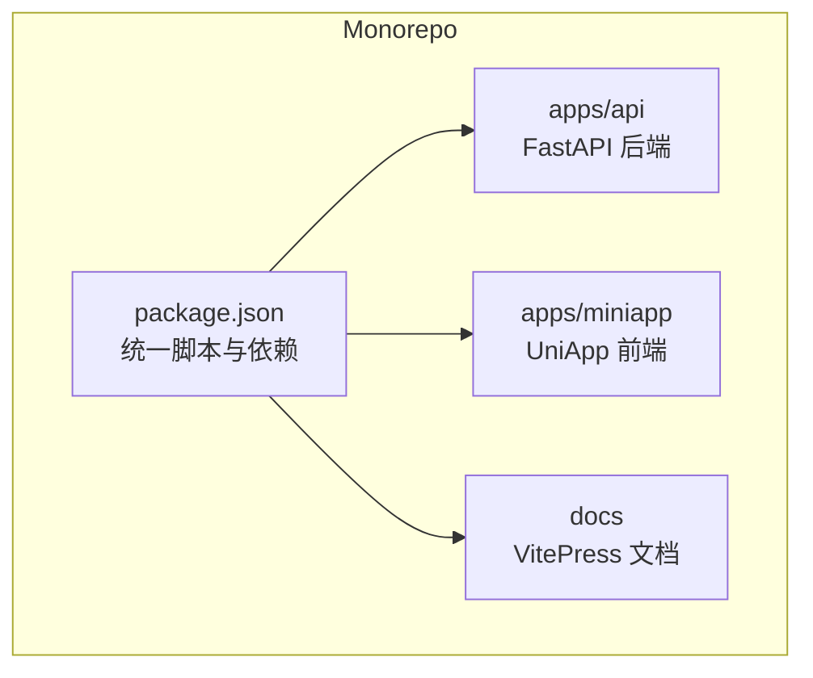
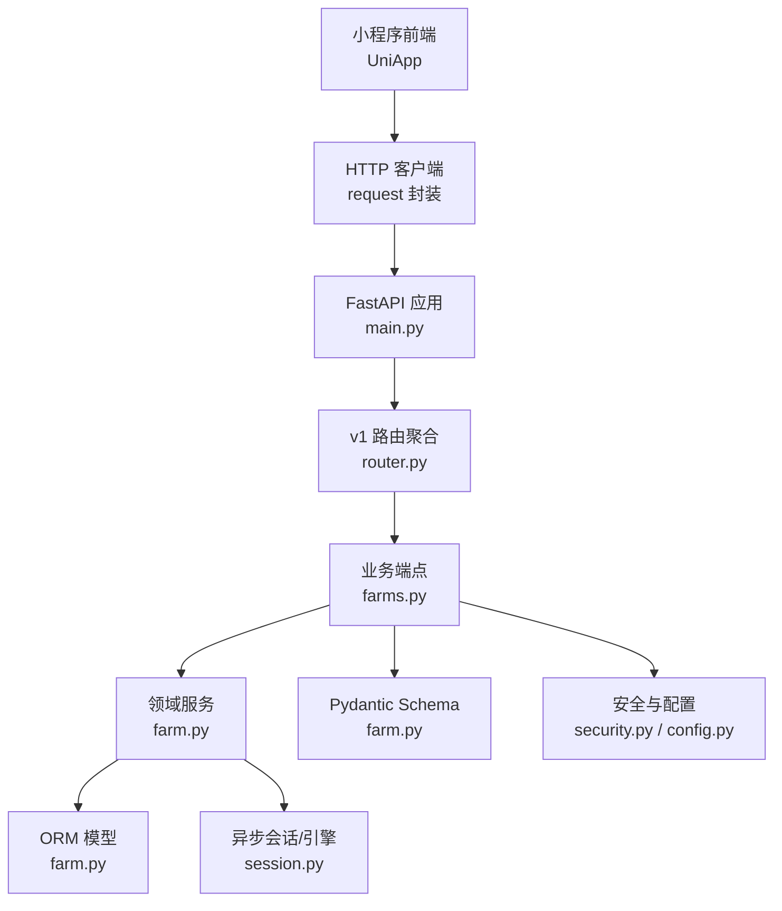
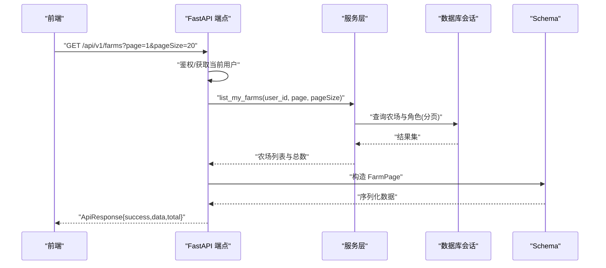
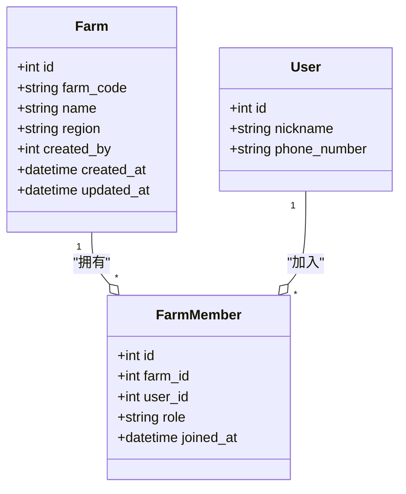
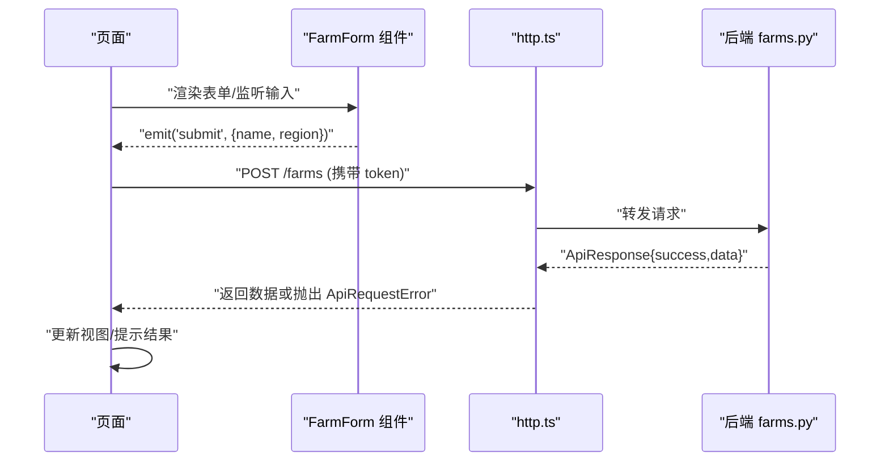
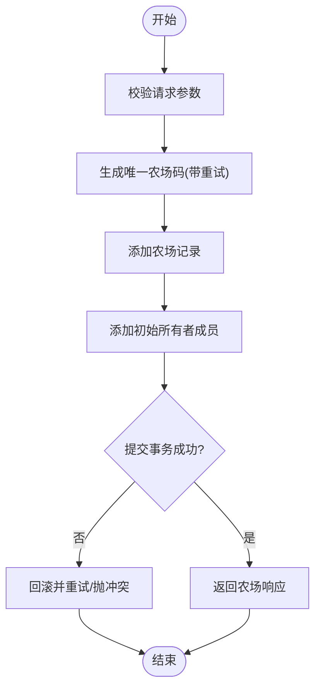
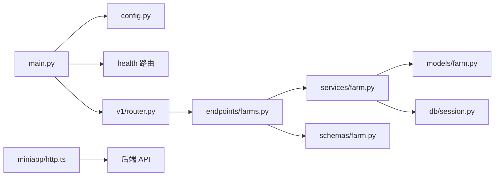

# 系统架构

<cite>
**本文引用的文件**
- [apps/api/app/main.py](file://apps/api/app/main.py)
- [apps/api/app/api/v1/router.py](file://apps/api/app/api/v1/router.py)
- [apps/api/app/api/v1/endpoints/farms.py](file://apps/api/app/api/v1/endpoints/farms.py)
- [apps/api/app/services/farm.py](file://apps/api/app/services/farm.py)
- [apps/api/app/models/farm.py](file://apps/api/app/models/farm.py)
- [apps/api/app/schemas/farm.py](file://apps/api/app/schemas/farm.py)
- [apps/api/app/core/config.py](file://apps/api/app/core/config.py)
- [apps/api/app/core/security.py](file://apps/api/app/core/security.py)
- [apps/api/app/db/session.py](file://apps/api/app/db/session.py)
- [apps/miniapp/src/main.ts](file://apps/miniapp/src/main.ts)
- [apps/miniapp/src/pages.json](file://apps/miniapp/src/pages.json)
- [apps/miniapp/src/services/http.ts](file://apps/miniapp/src/services/http.ts)
- [apps/miniapp/src/components/FarmForm.vue](file://apps/miniapp/src/components/FarmForm.vue)
- [apps/miniapp/src/composables/useCustomHeader.ts](file://apps/miniapp/src/composables/useCustomHeader.ts)
- [package.json](file://package.json)
</cite>

## 目录
1. [简介](#简介)
2. [项目结构](#项目结构)
3. [核心组件](#核心组件)
4. [架构总览](#架构总览)
5. [详细组件分析](#详细组件分析)
6. [依赖关系分析](#依赖关系分析)
7. [性能考虑](#性能考虑)
8. [故障排查指南](#故障排查指南)
9. [结论](#结论)
10. [附录](#附录)

## 简介
本架构文档面向 Pocket Farm 系统，覆盖前后端分离的整体设计、Monorepo 组织方式与技术选型。后端基于 FastAPI 的分层架构（API 层、服务层、数据模型层），前端采用 UniApp + Vue 的组件化设计。文档重点阐述依赖注入与领域驱动思想在系统中的落地，明确系统边界、组件交互和数据流向，并讨论可扩展性、性能优化与安全架构。

## 项目结构
本项目采用 Monorepo 管理多应用：
- apps/api：FastAPI 后端服务，包含路由、服务、模型、Schema、配置与安全等模块。
- apps/miniapp：UniApp 小程序前端，包含页面、组件、服务封装与通用逻辑。
- docs：VitePress 文档站点。
- 根级 package.json：统一脚本与工具链（pnpm workspace）。

图表来源
- [package.json:1-32](file://package.json#L1-L32)

章节来源
- [package.json:1-32](file://package.json#L1-L32)

## 核心组件
- 后端入口与生命周期：FastAPI 应用创建、异常处理器注册、路由挂载、数据库引擎生命周期管理。
- API 路由聚合：v1 版本路由集中装配各业务子路由。
- 农场领域服务：农场创建、成员管理、权限校验、事务与并发安全。
- 数据模型与 Schema：ORM 模型定义与 Pydantic 请求/响应模型。
- 安全与配置：JWT 令牌签发与解析、应用配置加载。
- 前端应用：Vue 应用初始化、页面路由配置、HTTP 客户端封装、表单组件与平台适配。

章节来源
- [apps/api/app/main.py:13-27](file://apps/api/app/main.py#L13-L27)
- [apps/api/app/api/v1/router.py:1-21](file://apps/api/app/api/v1/router.py#L1-L21)
- [apps/api/app/services/farm.py:17-264](file://apps/api/app/services/farm.py#L17-L264)
- [apps/api/app/models/farm.py:12-59](file://apps/api/app/models/farm.py#L12-L59)
- [apps/api/app/schemas/farm.py:14-166](file://apps/api/app/schemas/farm.py#L14-L166)
- [apps/api/app/core/config.py:5-22](file://apps/api/app/core/config.py#L5-L22)
- [apps/api/app/core/security.py:8-28](file://apps/api/app/core/security.py#L8-L28)
- [apps/miniapp/src/main.ts:1-9](file://apps/miniapp/src/main.ts#L1-L9)
- [apps/miniapp/src/pages.json:1-217](file://apps/miniapp/src/pages.json#L1-L217)
- [apps/miniapp/src/services/http.ts:1-106](file://apps/miniapp/src/services/http.ts#L1-L106)
- [apps/miniapp/src/components/FarmForm.vue:1-150](file://apps/miniapp/src/components/FarmForm.vue#L1-L150)
- [apps/miniapp/src/composables/useCustomHeader.ts:1-39](file://apps/miniapp/src/composables/useCustomHeader.ts#L1-L39)

## 架构总览
系统采用前后端分离架构：
- 前端通过 HTTP 客户端调用后端 RESTful API，统一信封格式返回成功/错误信息。
- 后端以 FastAPI 为入口，按 v1 路由聚合到具体业务端点；依赖注入提供当前用户与会话；服务层实现领域逻辑；模型层映射数据库表；Schema 层负责输入输出校验与序列化。
- 安全由 JWT 保障，配置集中管理。

图表来源
- [apps/api/app/main.py:13-27](file://apps/api/app/main.py#L13-L27)
- [apps/api/app/api/v1/router.py:1-21](file://apps/api/app/api/v1/router.py#L1-L21)
- [apps/api/app/api/v1/endpoints/farms.py:58-200](file://apps/api/app/api/v1/endpoints/farms.py#L58-L200)
- [apps/api/app/services/farm.py:33-264](file://apps/api/app/services/farm.py#L33-L264)
- [apps/api/app/models/farm.py:18-59](file://apps/api/app/models/farm.py#L18-L59)
- [apps/api/app/schemas/farm.py:14-166](file://apps/api/app/schemas/farm.py#L14-L166)
- [apps/api/app/db/session.py:1-7](file://apps/api/app/db/session.py#L1-L7)
- [apps/api/app/core/security.py:8-28](file://apps/api/app/core/security.py#L8-L28)
- [apps/api/app/core/config.py:5-22](file://apps/api/app/core/config.py#L5-L22)
- [apps/miniapp/src/services/http.ts:46-106](file://apps/miniapp/src/services/http.ts#L46-L106)

## 详细组件分析

### 后端分层架构（API/服务/模型）
- API 层：FastAPI 路由定义参数校验、鉴权、分页、响应封装；通过 Depends 注入当前用户与数据库会话。
- 服务层：封装领域规则与事务边界，处理并发与一致性（如农场码唯一性重试、成员操作权限校验、行级锁 with_for_update）。
- 模型层：SQLAlchemy ORM 模型定义表结构与约束；Pydantic Schema 负责请求/响应校验与字段别名序列化。

图表来源
- [apps/api/app/api/v1/endpoints/farms.py:58-75](file://apps/api/app/api/v1/endpoints/farms.py#L58-L75)
- [apps/api/app/services/farm.py:115-134](file://apps/api/app/services/farm.py#L115-L134)
- [apps/api/app/schemas/farm.py:24-42](file://apps/api/app/schemas/farm.py#L24-L42)

章节来源
- [apps/api/app/api/v1/endpoints/farms.py:58-200](file://apps/api/app/api/v1/endpoints/farms.py#L58-L200)
- [apps/api/app/services/farm.py:33-264](file://apps/api/app/services/farm.py#L33-L264)
- [apps/api/app/models/farm.py:18-59](file://apps/api/app/models/farm.py#L18-L59)
- [apps/api/app/schemas/farm.py:14-166](file://apps/api/app/schemas/farm.py#L14-L166)

### 依赖注入与领域驱动实践
- 依赖注入：通过 FastAPI 的 Depends 注入当前用户与会话，避免全局状态，提升可测试性与解耦。
- 领域驱动：服务层围绕“农场”这一核心领域对象组织用例（创建、编辑、成员管理、离开），并通过权限函数与约束保证领域不变量（至少一个 OWNER、ADMIN 不能操作 OWNER 等）。

图表来源
- [apps/api/app/models/farm.py:18-59](file://apps/api/app/models/farm.py#L18-L59)

章节来源
- [apps/api/app/api/deps.py](file://apps/api/app/api/deps.py)
- [apps/api/app/services/farm.py:73-113](file://apps/api/app/services/farm.py#L73-L113)

### 前端组件化设计与数据流
- 应用初始化：Vue 应用通过 createSSRApp 启动。
- 页面路由：pages.json 声明所有页面与 tabBar，支持自定义导航栏样式。
- HTTP 客户端：统一封装 request，自动附加 Authorization 头、处理 401 清理 token、统一信封解析与错误抛出。
- 表单组件：FarmForm 使用 uv-input 与事件发射，将表单数据提交给上层页面或组合式逻辑。
- 平台适配：useCustomHeader 计算状态栏与胶囊按钮空间，确保跨平台一致体验。

图表来源
- [apps/miniapp/src/components/FarmForm.vue:53-104](file://apps/miniapp/src/components/FarmForm.vue#L53-L104)
- [apps/miniapp/src/services/http.ts:46-106](file://apps/miniapp/src/services/http.ts#L46-L106)
- [apps/api/app/api/v1/endpoints/farms.py:78-90](file://apps/api/app/api/v1/endpoints/farms.py#L78-L90)

章节来源
- [apps/miniapp/src/main.ts:1-9](file://apps/miniapp/src/main.ts#L1-L9)
- [apps/miniapp/src/pages.json:1-217](file://apps/miniapp/src/pages.json#L1-L217)
- [apps/miniapp/src/services/http.ts:1-106](file://apps/miniapp/src/services/http.ts#L1-L106)
- [apps/miniapp/src/components/FarmForm.vue:1-150](file://apps/miniapp/src/components/FarmForm.vue#L1-L150)
- [apps/miniapp/src/composables/useCustomHeader.ts:1-39](file://apps/miniapp/src/composables/useCustomHeader.ts#L1-L39)

### 关键业务流程：创建农场

图表来源
- [apps/api/app/services/farm.py:33-53](file://apps/api/app/services/farm.py#L33-L53)

章节来源
- [apps/api/app/services/farm.py:33-53](file://apps/api/app/services/farm.py#L33-L53)

## 依赖关系分析
- 应用入口 main.py 依赖配置、异常处理器、健康检查与 v1 路由。
- v1 路由聚合依赖各业务端点（认证、农场、地块、生产、收获、物种、用户）。
- 农场端点依赖服务层、模型与 Schema。
- 服务层依赖模型与数据库会话，必要时进行并发控制与权限校验。
- 前端 http.ts 依赖认证信息与环境变量，统一处理请求与错误。

图表来源
- [apps/api/app/main.py:13-27](file://apps/api/app/main.py#L13-L27)
- [apps/api/app/api/v1/router.py:1-21](file://apps/api/app/api/v1/router.py#L1-L21)
- [apps/api/app/api/v1/endpoints/farms.py:1-32](file://apps/api/app/api/v1/endpoints/farms.py#L1-L32)
- [apps/api/app/services/farm.py:1-16](file://apps/api/app/services/farm.py#L1-L16)
- [apps/api/app/models/farm.py:1-17](file://apps/api/app/models/farm.py#L1-L17)
- [apps/api/app/db/session.py:1-7](file://apps/api/app/db/session.py#L1-L7)
- [apps/api/app/schemas/farm.py:1-13](file://apps/api/app/schemas/farm.py#L1-L13)
- [apps/miniapp/src/services/http.ts:1-18](file://apps/miniapp/src/services/http.ts#L1-L18)

章节来源
- [apps/api/app/main.py:13-27](file://apps/api/app/main.py#L13-L27)
- [apps/api/app/api/v1/router.py:1-21](file://apps/api/app/api/v1/router.py#L1-L21)
- [apps/api/app/api/v1/endpoints/farms.py:1-32](file://apps/api/app/api/v1/endpoints/farms.py#L1-L32)
- [apps/api/app/services/farm.py:1-16](file://apps/api/app/services/farm.py#L1-L16)
- [apps/api/app/models/farm.py:1-17](file://apps/api/app/models/farm.py#L1-L17)
- [apps/api/app/db/session.py:1-7](file://apps/api/app/db/session.py#L1-L7)
- [apps/api/app/schemas/farm.py:1-13](file://apps/api/app/schemas/farm.py#L1-L13)
- [apps/miniapp/src/services/http.ts:1-18](file://apps/miniapp/src/services/http.ts#L1-L18)

## 性能考虑
- 数据库连接池与异步会话：使用异步引擎与 sessionmaker，减少阻塞，提高并发能力。
- 分页与计数：列表接口通过 offset/limit 与 count 查询控制数据量，避免全表扫描。
- 并发安全：成员管理使用 with_for_update 锁定相关行，防止竞态条件。
- 唯一性重试：农场码生成失败时有限重试，降低冲突概率。
- 前端网络：统一请求封装，减少重复代码；401 自动清理 token，避免无效请求。
- 构建与开发：根脚本提供 api:dev 与 miniapp:dev，便于本地快速迭代。

章节来源
- [apps/api/app/db/session.py:1-7](file://apps/api/app/db/session.py#L1-L7)
- [apps/api/app/services/farm.py:73-91](file://apps/api/app/services/farm.py#L73-L91)
- [apps/api/app/services/farm.py:41-53](file://apps/api/app/services/farm.py#L41-L53)
- [apps/miniapp/src/services/http.ts:71-77](file://apps/miniapp/src/services/http.ts#L71-L77)
- [package.json:5-11](file://package.json#L5-L11)

## 故障排查指南
- 401 未授权：前端会在收到 401 时清理本地 token，建议检查登录流程与 token 有效期。
- 请求失败：http.ts 会抛出 ApiRequestError，包含 code、statusCode 与 details，便于定位问题。
- 业务冲突：服务层对唯一性约束与权限限制抛出冲突或禁止异常，需检查输入与角色权限。
- 数据库异常：IntegrityError 捕获后回滚并重试或抛出冲突，关注唯一键与外键约束。
- 配置问题：确认 .env 或环境变量中 database_url、jwt_secret_key 等必要项已正确设置。

章节来源
- [apps/miniapp/src/services/http.ts:71-106](file://apps/miniapp/src/services/http.ts#L71-L106)
- [apps/api/app/services/farm.py:41-53](file://apps/api/app/services/farm.py#L41-L53)
- [apps/api/app/services/farm.py:199-207](file://apps/api/app/services/farm.py#L199-L207)
- [apps/api/app/core/config.py:5-22](file://apps/api/app/core/config.py#L5-L22)

## 结论
Pocket Farm 采用清晰的 Monorepo 与前后端分离架构，后端以 FastAPI 分层组织，服务层承载领域逻辑与并发安全，前端以 UniApp 组件化与统一 HTTP 封装提升可维护性。依赖注入与领域驱动思想贯穿系统，确保安全、可扩展与易测试。通过分页、异步会话、行级锁与统一错误处理，系统在性能与稳定性方面具备良好基础。

## 附录
- 技术选型要点
  - 后端：FastAPI、SQLAlchemy 异步、Pydantic、JWT。
  - 前端：UniApp、Vue 3、uv-ui 组件库。
  - 工程化：pnpm workspace、VitePress 文档。
- 扩展建议
  - 引入缓存层（如 Redis）用于热点数据与会话存储。
  - 增加审计日志与指标采集，完善可观测性。
  - 强化输入校验与国际化支持，提升用户体验。