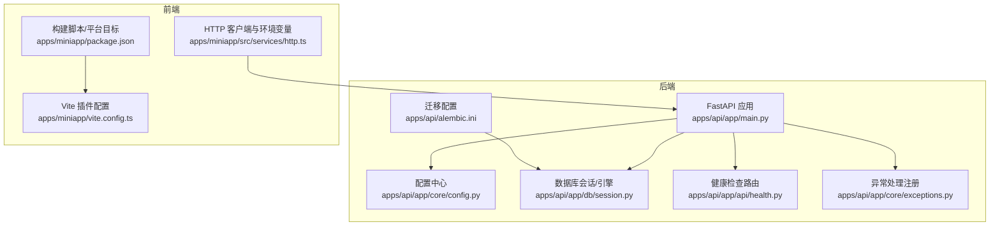
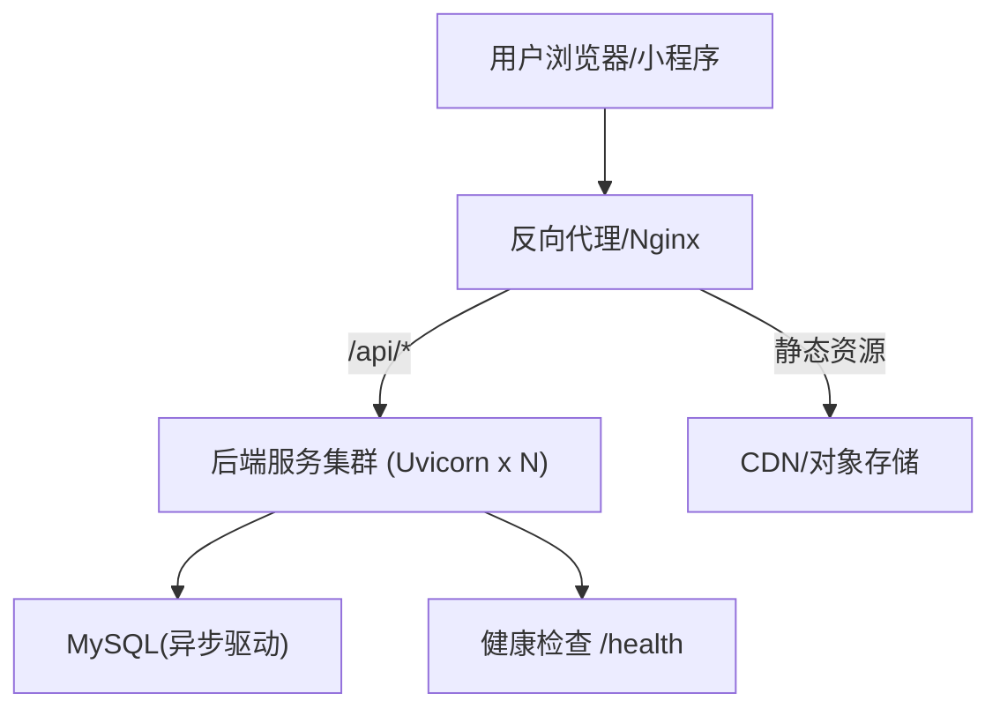
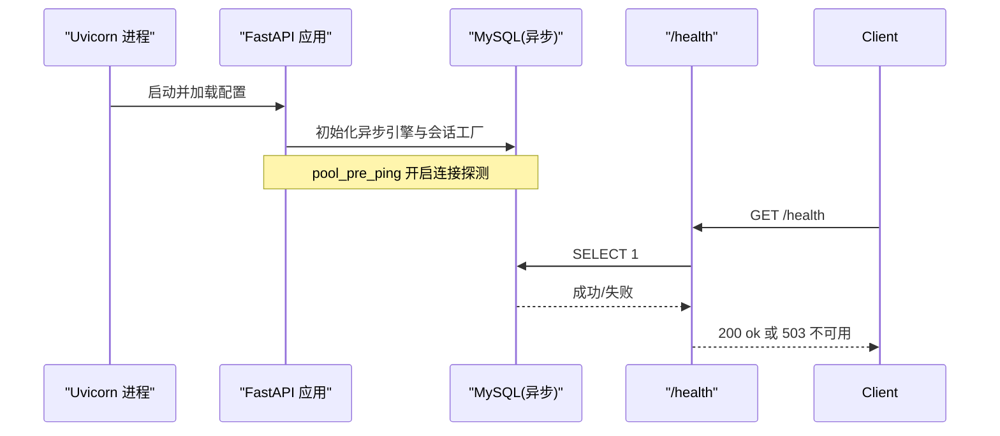
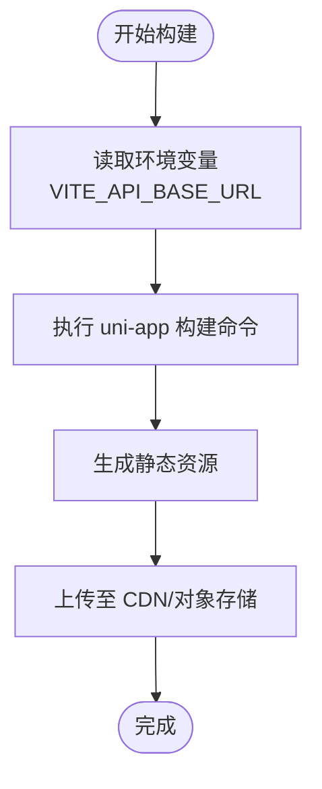
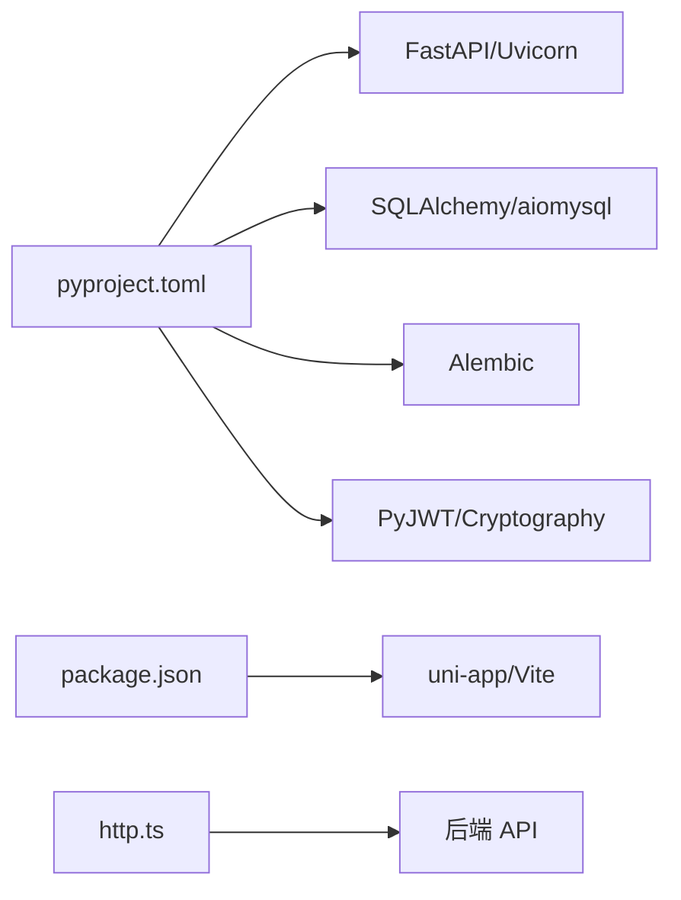

# 部署指南

<cite>
**本文引用的文件**
- [apps/api/pyproject.toml](file://apps/api/pyproject.toml)
- [apps/api/app/core/config.py](file://apps/api/app/core/config.py)
- [apps/api/app/main.py](file://apps/api/app/main.py)
- [apps/api/app/db/session.py](file://apps/api/app/db/session.py)
- [apps/api/alembic.ini](file://apps/api/alembic.ini)
- [apps/api/app/api/health.py](file://apps/api/app/api/health.py)
- [apps/api/app/core/exceptions.py](file://apps/api/app/core/exceptions.py)
- [apps/miniapp/package.json](file://apps/miniapp/package.json)
- [apps/miniapp/vite.config.ts](file://apps/miniapp/vite.config.ts)
- [apps/miniapp/src/services/http.ts](file://apps/miniapp/src/services/http.ts)
</cite>

## 目录
1. [简介](#简介)
2. [项目结构](#项目结构)
3. [核心组件](#核心组件)
4. [架构总览](#架构总览)
5. [详细组件分析](#详细组件分析)
6. [依赖关系分析](#依赖关系分析)
7. [性能考虑](#性能考虑)
8. [故障排查指南](#故障排查指南)
9. [结论](#结论)
10. [附录](#附录)

## 简介
本指南面向生产环境，提供 Pocket Farm 系统的完整部署说明。内容涵盖服务器要求、环境变量与依赖管理、后端服务容器化、数据库配置与迁移、负载均衡与反向代理、前端构建发布与静态资源优化、CI/CD 流水线建议、自动化部署脚本思路以及监控告警与故障排查、性能优化建议等。文档严格基于仓库现有代码与配置进行说明，确保可落地执行。

## 项目结构
本项目采用多应用工作区组织：
- 后端 API（FastAPI + SQLAlchemy Async + Alembic）位于 apps/api
- 前端小程序/H5（uni-app + Vite）位于 apps/miniapp
- 根目录使用 pnpm workspace 管理多包

图表来源
- [apps/api/app/main.py:1-28](file://apps/api/app/main.py#L1-L28)
- [apps/api/app/core/config.py:1-23](file://apps/api/app/core/config.py#L1-L23)
- [apps/api/app/db/session.py:1-7](file://apps/api/app/db/session.py#L1-L7)
- [apps/api/app/api/health.py:1-35](file://apps/api/app/api/health.py#L1-L35)
- [apps/api/app/core/exceptions.py:1-88](file://apps/api/app/core/exceptions.py#L1-L88)
- [apps/api/alembic.ini:1-150](file://apps/api/alembic.ini#L1-L150)
- [apps/miniapp/package.json:1-73](file://apps/miniapp/package.json#L1-L73)
- [apps/miniapp/vite.config.ts:1-8](file://apps/miniapp/vite.config.ts#L1-L8)
- [apps/miniapp/src/services/http.ts:1-106](file://apps/miniapp/src/services/http.ts#L1-L106)

章节来源
- [apps/api/app/main.py:1-28](file://apps/api/app/main.py#L1-L28)
- [apps/api/app/core/config.py:1-23](file://apps/api/app/core/config.py#L1-L23)
- [apps/api/app/db/session.py:1-7](file://apps/api/app/db/session.py#L1-L7)
- [apps/api/app/api/health.py:1-35](file://apps/api/app/api/health.py#L1-L35)
- [apps/api/app/core/exceptions.py:1-88](file://apps/api/app/core/exceptions.py#L1-L88)
- [apps/api/alembic.ini:1-150](file://apps/api/alembic.ini#L1-L150)
- [apps/miniapp/package.json:1-73](file://apps/miniapp/package.json#L1-L73)
- [apps/miniapp/vite.config.ts:1-8](file://apps/miniapp/vite.config.ts#L1-L8)
- [apps/miniapp/src/services/http.ts:1-106](file://apps/miniapp/src/services/http.ts#L1-L106)

## 核心组件
- 后端应用入口与生命周期管理：创建 FastAPI 实例、注册异常处理器、挂载健康检查与 v1 路由、在进程退出时释放数据库连接池。
- 配置加载：通过 pydantic-settings 从环境变量或 .env 读取应用名、调试开关、API 前缀、数据库 URL、JWT 密钥与过期时间、时区、测试登录开关等。
- 数据库连接：异步 SQLAlchemy 引擎与会话工厂，启用连接前探测（pool_pre_ping）。
- 健康检查：通过执行 SELECT 1 验证数据库连通性，失败返回 503。
- 异常处理：统一将应用异常、请求校验异常、HTTP 异常与未捕获异常转换为标准 JSON 响应体。
- 迁移工具：Alembic 配置文件指向 alembic 目录，默认日志级别与输出格式已定义。
- 前端构建：uni-app 提供多端构建命令（H5、微信小程序等），Vite 插件集成；HTTP 客户端通过环境变量注入后端基础地址。

章节来源
- [apps/api/app/main.py:1-28](file://apps/api/app/main.py#L1-L28)
- [apps/api/app/core/config.py:1-23](file://apps/api/app/core/config.py#L1-L23)
- [apps/api/app/db/session.py:1-7](file://apps/api/app/db/session.py#L1-L7)
- [apps/api/app/api/health.py:1-35](file://apps/api/app/api/health.py#L1-L35)
- [apps/api/app/core/exceptions.py:1-88](file://apps/api/app/core/exceptions.py#L1-L88)
- [apps/api/alembic.ini:1-150](file://apps/api/alembic.ini#L1-L150)
- [apps/miniapp/package.json:1-73](file://apps/miniapp/package.json#L1-L73)
- [apps/miniapp/vite.config.ts:1-8](file://apps/miniapp/vite.config.ts#L1-L8)
- [apps/miniapp/src/services/http.ts:1-106](file://apps/miniapp/src/services/http.ts#L1-L106)

## 架构总览
生产环境典型拓扑：
- 用户通过域名访问前端静态站点（H5/小程序），由 CDN 加速并缓存静态资源。
- 前端通过环境变量配置的后端 API 基础地址发起请求。
- 反向代理（如 Nginx）将 /api/* 转发到后端服务集群，同时托管静态资源或重定向至 CDN。
- 后端以多进程方式运行（Uvicorn），连接异步 MySQL 数据库。
- 健康检查端点用于探针探测服务可用性。

图表来源
- [apps/api/app/api/health.py:1-35](file://apps/api/app/api/health.py#L1-L35)
- [apps/api/app/db/session.py:1-7](file://apps/api/app/db/session.py#L1-L7)
- [apps/miniapp/src/services/http.ts:1-106](file://apps/miniapp/src/services/http.ts#L1-L106)

## 详细组件分析

### 后端服务部署与容器化
- 运行时与依赖
  - Python >= 3.12，依赖包括 FastAPI、SQLAlchemy 异步、aiomysql、Alembic、Uvicorn、PyJWT、Cryptography 等。
  - 开发依赖包含 httpx、pytest、ruff。
- 启动方式
  - 使用 Uvicorn 作为 ASGI 服务器，推荐多 worker 模式以提升并发能力。
  - 通过环境变量注入数据库连接串、JWT 密钥、应用名、调试开关、API 前缀、时区等。
- 容器镜像建议
  - 基础镜像选择官方 Python 精简版。
  - 安装依赖后以非 root 用户运行 Uvicorn。
  - 暴露端口（默认 8000），设置健康检查命令调用 /health。
- 环境变量清单（来自配置模块）
  - database_url：数据库连接串（异步 MySQL）
  - jwt_secret_key：JWT 签名密钥
  - jwt_algorithm：算法（默认 HS256）
  - jwt_expire_minutes：令牌有效期（分钟）
  - app_name：应用名称
  - debug：调试开关
  - api_v1_prefix：API 版本前缀（默认 /api/v1）
  - app_timezone：时区（默认 Asia/Shanghai）
  - test_login_enabled/test_login_code：测试登录开关与验证码
- 数据库迁移
  - 使用 Alembic 管理 schema 变更，配置文件指定脚本位置与日志级别。
  - 在生产环境中，建议在部署流程中先执行迁移再启动服务。

图表来源
- [apps/api/app/main.py:1-28](file://apps/api/app/main.py#L1-L28)
- [apps/api/app/db/session.py:1-7](file://apps/api/app/db/session.py#L1-L7)
- [apps/api/app/api/health.py:1-35](file://apps/api/app/api/health.py#L1-L35)

章节来源
- [apps/api/pyproject.toml:1-35](file://apps/api/pyproject.toml#L1-L35)
- [apps/api/app/core/config.py:1-23](file://apps/api/app/core/config.py#L1-L23)
- [apps/api/app/main.py:1-28](file://apps/api/app/main.py#L1-L28)
- [apps/api/app/db/session.py:1-7](file://apps/api/app/db/session.py#L1-L7)
- [apps/api/app/api/health.py:1-35](file://apps/api/app/api/health.py#L1-L35)
- [apps/api/alembic.ini:1-150](file://apps/api/alembic.ini#L1-L150)

### 数据库配置与迁移
- 连接参数
  - 通过环境变量 database_url 注入，使用 aiomysql 异步驱动。
  - 引擎启用 pool_pre_ping，避免长连接失效导致的错误。
- 迁移策略
  - 使用 Alembic 维护版本化迁移脚本。
  - 生产环境建议“先迁移，后启动”，并在回滚方案中保留旧版本迁移能力。
- 日志与可观测性
  - Alembic 日志级别已配置，便于追踪迁移过程。

章节来源
- [apps/api/app/db/session.py:1-7](file://apps/api/app/db/session.py#L1-L7)
- [apps/api/alembic.ini:1-150](file://apps/api/alembic.ini#L1-L150)

### 负载均衡与反向代理
- 反向代理职责
  - 终止 TLS、Gzip/Brotli 压缩、静态资源缓存、限流与访问控制。
  - 将 /api/* 请求转发到后端服务集群，支持健康检查与优雅重启。
- 负载均衡建议
  - 多进程 Uvicorn 配合反向代理实现水平扩展。
  - 根据 CPU 核数与业务负载调整 worker 数量。
- 健康检查
  - 使用 /health 端点进行存活与就绪探针，结合数据库连通性检测。

章节来源
- [apps/api/app/api/health.py:1-35](file://apps/api/app/api/health.py#L1-L35)
- [apps/api/app/main.py:1-28](file://apps/api/app/main.py#L1-L28)

### 前端构建发布与静态资源优化
- 构建目标
  - 使用 uni-app 提供的多端构建命令，按需构建 H5 或各小程序平台。
  - 生产构建建议使用对应 build:* 脚本。
- 环境变量
  - 前端通过环境变量 VITE_API_BASE_URL 指定后端 API 基础地址，默认指向本地调试地址。
  - 生产环境应替换为实际域名或 CDN 路径。
- 静态资源优化
  - 利用 CDN 缓存静态资源，开启 HTTP 缓存头与版本化文件名。
  - 对图片等资源进行压缩与懒加载。
- 构建产物
  - 将构建产物上传至对象存储或 CDN，并通过反向代理或域名直接访问。

图表来源
- [apps/miniapp/package.json:1-73](file://apps/miniapp/package.json#L1-L73)
- [apps/miniapp/vite.config.ts:1-8](file://apps/miniapp/vite.config.ts#L1-L8)
- [apps/miniapp/src/services/http.ts:1-106](file://apps/miniapp/src/services/http.ts#L1-L106)

章节来源
- [apps/miniapp/package.json:1-73](file://apps/miniapp/package.json#L1-L73)
- [apps/miniapp/vite.config.ts:1-8](file://apps/miniapp/vite.config.ts#L1-L8)
- [apps/miniapp/src/services/http.ts:1-106](file://apps/miniapp/src/services/http.ts#L1-L106)

### CI/CD 流水线建议
- 触发条件
  - 推送至主分支或创建合并请求时触发。
- 阶段设计
  - 依赖安装与缓存：Python 依赖与 Node 依赖缓存。
  - 质量检查：Ruff 检查、类型检查（前端）、单元测试。
  - 构建：后端镜像构建、前端多端构建。
  - 部署：按环境（staging/prod）执行迁移与发布。
- 安全与凭据
  - 敏感信息（数据库密码、JWT 密钥）通过 CI/CD 平台的 Secret 管理。
  - 禁止将密钥写入代码库。

[本节为通用实践建议，不直接引用具体文件]

### 自动化部署脚本思路
- 后端
  - 拉取最新镜像 -> 执行数据库迁移 -> 滚动更新服务 -> 健康检查通过后切换流量。
- 前端
  - 构建产物上传至 CDN -> 刷新缓存 -> 灰度发布或全量发布。
- 回滚
  - 保留上一版本镜像与前端资源，出现问题快速回滚。

[本节为通用实践建议，不直接引用具体文件]

### 监控与告警
- 指标采集
  - 后端：请求延迟、错误率、QPS、数据库连接池状态。
  - 前端：页面加载耗时、接口成功率、错误上报。
- 日志收集
  - 集中式日志系统收集应用与反向代理日志。
- 告警规则
  - 健康检查失败、错误率超过阈值、数据库不可用、内存/CPU 超阈。

[本节为通用实践建议，不直接引用具体文件]

## 依赖关系分析
- 后端依赖
  - FastAPI 提供 Web 框架能力，Uvicorn 作为 ASGI 服务器。
  - SQLAlchemy 异步与 aiomysql 提供异步数据库访问。
  - Alembic 负责数据库迁移。
  - PyJWT、Cryptography 用于认证与安全。
- 前端依赖
  - uni-app 生态提供跨端构建能力。
  - Vite 作为构建工具，插件集成 uni-app。
  - 通过环境变量注入后端 API 地址。

图表来源
- [apps/api/pyproject.toml:1-35](file://apps/api/pyproject.toml#L1-L35)
- [apps/miniapp/package.json:1-73](file://apps/miniapp/package.json#L1-L73)
- [apps/miniapp/src/services/http.ts:1-106](file://apps/miniapp/src/services/http.ts#L1-L106)

章节来源
- [apps/api/pyproject.toml:1-35](file://apps/api/pyproject.toml#L1-L35)
- [apps/miniapp/package.json:1-73](file://apps/miniapp/package.json#L1-L73)
- [apps/miniapp/src/services/http.ts:1-106](file://apps/miniapp/src/services/http.ts#L1-L106)

## 性能考虑
- 后端
  - 使用异步数据库访问与连接池，减少阻塞。
  - 合理设置 Uvicorn worker 数量，匹配 CPU 核数与 I/O 模型。
  - 启用连接前探测，避免无效连接带来的超时。
- 前端
  - 静态资源走 CDN，开启缓存与压缩。
  - 按需构建目标平台，减小包体积。
  - 接口请求统一封装，减少重复逻辑与错误处理成本。
- 数据库
  - 索引与查询优化，避免慢查询。
  - 连接池大小与超时参数调优。

[本节为通用性能建议，不直接引用具体文件]

## 故障排查指南
- 健康检查失败
  - 检查数据库连接串与网络连通性。
  - 查看健康检查端点返回码与消息。
- 认证与授权问题
  - 确认 JWT 密钥与算法一致。
  - 检查前端是否正确携带 Authorization 头。
- 请求校验失败
  - 关注 422 响应中的校验错误详情。
- 未捕获异常
  - 统一异常处理器会返回 500 与标准错误体，检查服务端日志定位堆栈。

章节来源
- [apps/api/app/api/health.py:1-35](file://apps/api/app/api/health.py#L1-L35)
- [apps/api/app/core/exceptions.py:1-88](file://apps/api/app/core/exceptions.py#L1-L88)
- [apps/miniapp/src/services/http.ts:1-106](file://apps/miniapp/src/services/http.ts#L1-L106)

## 结论
Pocket Farm 系统在后端采用 FastAPI 异步架构与 SQLAlchemy 异步数据库访问，具备完善的配置管理、异常处理与健康检查能力；前端基于 uni-app 与 Vite，支持多端构建并通过环境变量灵活对接后端 API。生产环境建议结合反向代理与 CDN 提升性能与稳定性，使用 Alembic 管理数据库迁移，并通过 CI/CD 实现自动化构建与发布。配合监控与告警体系，可有效保障系统高可用与可观测性。

## 附录
- 环境变量速查（后端）
  - database_url、jwt_secret_key、jwt_algorithm、jwt_expire_minutes、app_name、debug、api_v1_prefix、app_timezone、test_login_enabled、test_login_code
- 前端环境变量
  - VITE_API_BASE_URL：后端 API 基础地址
- 常用命令
  - 后端：安装依赖、运行服务、执行迁移
  - 前端：开发、构建多端产物、类型检查

[本节为补充信息，不直接引用具体文件]