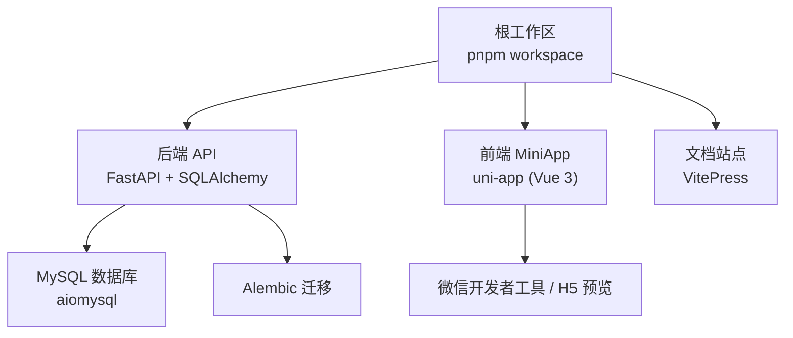
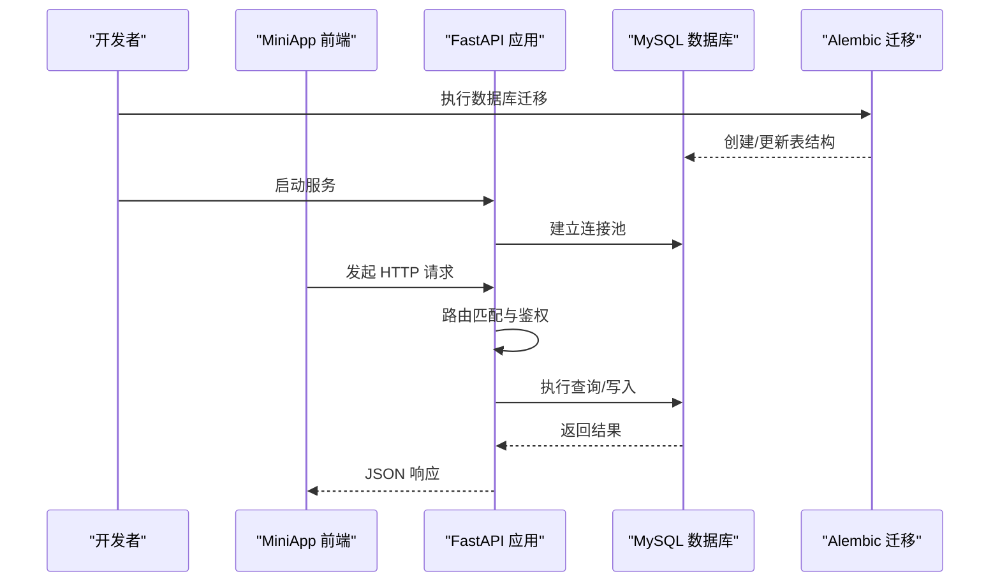
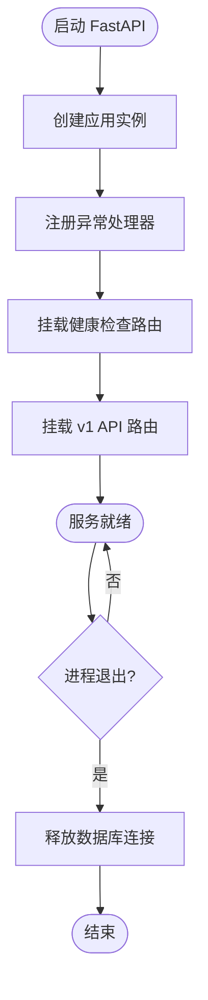
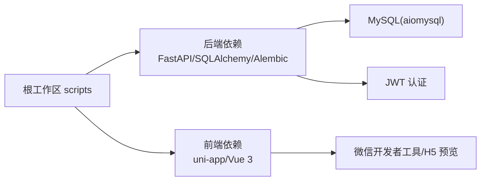

# 快速开始

<cite>
**本文引用的文件**
- [package.json](file://package.json)
- [pnpm-workspace.yaml](file://pnpm-workspace.yaml)
- [apps/api/pyproject.toml](file://apps/api/pyproject.toml)
- [apps/miniapp/package.json](file://apps/miniapp/package.json)
- [apps/api/app/main.py](file://apps/api/app/main.py)
- [apps/api/app/core/config.py](file://apps/api/app/core/config.py)
- [apps/api/alembic.ini](file://apps/api/alembic.ini)
- [apps/api/app/db/base.py](file://apps/api/app/db/base.py)
- [apps/api/tests/conftest.py](file://apps/api/tests/conftest.py)
- [apps/miniapp/src/pages.json](file://apps/miniapp/src/pages.json)
- [apps/miniapp/src/main.ts](file://apps/miniapp/src/main.ts)
- [docs/index.md](file://docs/index.md)
</cite>

## 目录
1. [简介](#简介)
2. [项目结构](#项目结构)
3. [核心组件](#核心组件)
4. [架构总览](#架构总览)
5. [详细组件分析](#详细组件分析)
6. [依赖关系分析](#依赖关系分析)
7. [性能与稳定性建议](#性能与稳定性建议)
8. [故障排查指南](#故障排查指南)
9. [结论](#结论)
10. [附录：常用命令与环境配置](#附录：常用命令与环境配置)

## 简介
本指南面向首次参与 Pocket Farm 项目的开发者，目标是帮助你在最短时间内完成环境搭建、数据库初始化并启动本地开发服务，随后通过一个“创建农场”的示例走通前后端联调流程。项目采用 monorepo 管理，后端使用 FastAPI + SQLAlchemy + Alembic，前端为基于 uni-app 的小程序应用，文档站点使用 VitePress。

## 项目结构
- 根目录使用 pnpm workspace 管理多包，包含 API 服务与小程序两个主要应用，以及文档站点。
- 后端位于 apps/api，使用 Python 3.12+、FastAPI、SQLAlchemy 异步驱动 aiomysql，并通过 Alembic 做数据库迁移。
- 前端位于 apps/miniapp，基于 uni-app（Vue 3）构建微信小程序等多端应用。
- 文档位于 docs，使用 VitePress。

图表来源
- [package.json:1-32](file://package.json#L1-L32)
- [pnpm-workspace.yaml:1-7](file://pnpm-workspace.yaml#L1-L7)
- [apps/api/pyproject.toml:1-35](file://apps/api/pyproject.toml#L1-L35)
- [apps/miniapp/package.json:1-73](file://apps/miniapp/package.json#L1-L73)

章节来源
- [package.json:1-32](file://package.json#L1-L32)
- [pnpm-workspace.yaml:1-7](file://pnpm-workspace.yaml#L1-L7)

## 核心组件
- 后端应用入口与路由挂载：FastAPI 应用创建、健康检查与 v1 API 路由注册。
- 配置中心：从环境变量或 .env 加载数据库连接、JWT 密钥等关键配置。
- 数据库层：SQLAlchemy 异步引擎与 Base 模型定义。
- 迁移系统：Alembic 用于数据库版本管理与数据演进。
- 前端应用：uni-app 页面路由与多端构建脚本。

章节来源
- [apps/api/app/main.py:1-28](file://apps/api/app/main.py#L1-L28)
- [apps/api/app/core/config.py:1-23](file://apps/api/app/core/config.py#L1-L23)
- [apps/api/app/db/base.py:1-15](file://apps/api/app/db/base.py#L1-L15)
- [apps/api/alembic.ini:1-150](file://apps/api/alembic.ini#L1-L150)
- [apps/miniapp/src/pages.json:1-217](file://apps/miniapp/src/pages.json#L1-L217)

## 架构总览
下图展示了请求从前端到后端再到数据库的完整链路，包括鉴权、路由分发与服务生命周期管理。

图表来源
- [apps/api/app/main.py:13-27](file://apps/api/app/main.py#L13-L27)
- [apps/api/app/core/config.py:5-22](file://apps/api/app/core/config.py#L5-L22)
- [apps/api/alembic.ini:86-89](file://apps/api/alembic.ini#L86-L89)

## 详细组件分析

### 后端服务启动与路由
- 应用通过 lifespan 管理引擎生命周期，在关闭时释放连接。
- 健康检查与健康路由独立挂载，便于运维探测。
- v1 API 路由统一前缀，便于版本化管理。

图表来源
- [apps/api/app/main.py:13-27](file://apps/api/app/main.py#L13-L27)

章节来源
- [apps/api/app/main.py:1-28](file://apps/api/app/main.py#L1-L28)

### 配置与环境变量
- 配置类从环境变量或 .env 文件加载，支持数据库 URL、JWT 密钥、算法、过期时间、时区、测试登录开关等。
- 测试场景可通过环境变量覆盖默认值，便于隔离运行。

章节来源
- [apps/api/app/core/config.py:1-23](file://apps/api/app/core/config.py#L1-L23)
- [apps/api/tests/conftest.py:7-11](file://apps/api/tests/conftest.py#L7-L11)

### 数据库与迁移
- 使用 SQLAlchemy 异步驱动 aiomysql，Base 定义了命名约定，保证约束命名一致性。
- Alembic 配置文件指向迁移脚本目录，sqlalchemy.url 占位符由运行时 env 注入。
- 建议在本地先创建数据库，再执行迁移生成初始 schema。

章节来源
- [apps/api/app/db/base.py:1-15](file://apps/api/app/db/base.py#L1-L15)
- [apps/api/alembic.ini:86-89](file://apps/api/alembic.ini#L86-L89)

### 前端应用与页面路由
- uni-app 工程提供多端构建脚本，支持微信小程序、H5 等。
- pages.json 定义了所有页面路径与导航栏样式，tabBar 配置了底部导航。
- main.ts 创建 SSR 应用实例，作为小程序/H5 的入口。

章节来源
- [apps/miniapp/package.json:1-73](file://apps/miniapp/package.json#L1-L73)
- [apps/miniapp/src/pages.json:1-217](file://apps/miniapp/src/pages.json#L1-L217)
- [apps/miniapp/src/main.ts:1-9](file://apps/miniapp/src/main.ts#L1-L9)

## 依赖关系分析
- 根工作区通过 pnpm workspace 聚合子包，scripts 中提供了统一的开发命令。
- 后端依赖 FastAPI、SQLAlchemy、aiomysql、Alembic、Pydantic Settings、JWT 等。
- 前端依赖 uni-app 全家桶与 Vue 3，并提供多端构建脚本。

图表来源
- [package.json:5-11](file://package.json#L5-L11)
- [apps/api/pyproject.toml:1-35](file://apps/api/pyproject.toml#L1-L35)
- [apps/miniapp/package.json:1-73](file://apps/miniapp/package.json#L1-L73)

章节来源
- [package.json:1-32](file://package.json#L1-L32)
- [apps/api/pyproject.toml:1-35](file://apps/api/pyproject.toml#L1-L35)
- [apps/miniapp/package.json:1-73](file://apps/miniapp/package.json#L1-L73)

## 性能与稳定性建议
- 数据库连接池：确保使用异步引擎并合理设置连接池大小，避免在高并发下耗尽连接。
- 迁移顺序：生产环境务必按顺序执行迁移，并在每次迁移后验证数据完整性。
- 日志与监控：开启必要日志级别，结合健康检查接口进行服务可用性探测。
- 前端缓存与懒加载：合理使用 uni-app 的页面级缓存与按需加载，提升首屏性能。

[本节为通用建议，不直接分析具体文件]

## 故障排查指南
- 无法连接数据库
  - 检查 DATABASE_URL 是否正确，端口、用户名、密码、数据库名是否一致。
  - 确认 MySQL 服务已启动且允许本机访问。
- 迁移失败
  - 检查 alembic.ini 中的 sqlalchemy.url 是否与运行时环境变量一致。
  - 确认当前数据库用户具备创建/修改表的权限。
- 鉴权错误
  - 检查 JWT_SECRET_KEY 长度与算法是否满足要求。
  - 测试环境下可启用 test_login_enabled 并使用指定 code 快速登录。
- 前端无法调用后端
  - 确认后端服务监听地址与端口，前端请求地址需与之匹配。
  - 在浏览器或小程序控制台查看网络请求与跨域情况。

章节来源
- [apps/api/app/core/config.py:5-22](file://apps/api/app/core/config.py#L5-L22)
- [apps/api/alembic.ini:86-89](file://apps/api/alembic.ini#L86-L89)
- [apps/api/tests/conftest.py:7-11](file://apps/api/tests/conftest.py#L7-L11)

## 结论
通过本指南，你应能完成 Pocket Farm 的开发环境搭建、数据库初始化与本地服务启动，并理解前后端的基本交互方式。建议后续按照模块逐步扩展功能，保持迁移与代码同步，持续完善测试与文档。

[本节为总结性内容，不直接分析具体文件]

## 附录：常用命令与环境配置

### 环境准备
- Node.js：建议使用与 pnpm 兼容的版本（根 package.json 指定 devEngines）。
- Python：3.12+，用于后端开发与测试。
- 数据库：MySQL 5.7+/8.x，创建数据库 pocket_farm。

### 安装依赖
- 根工作区：
  - 安装 pnpm 并执行安装命令以拉取前端与工作区依赖。
- 后端：
  - 进入 apps/api，使用 uv 或 pip 安装依赖（pyproject.toml 声明了依赖列表）。

章节来源
- [package.json:16-21](file://package.json#L16-L21)
- [apps/api/pyproject.toml:1-35](file://apps/api/pyproject.toml#L1-L35)

### 数据库初始化
- 创建数据库 pocket_farm。
- 配置环境变量 DATABASE_URL 指向你的数据库。
- 执行 Alembic 迁移以生成初始表结构。

章节来源
- [apps/api/alembic.ini:86-89](file://apps/api/alembic.ini#L86-L89)
- [apps/api/app/core/config.py:10-17](file://apps/api/app/core/config.py#L10-L17)

### 启动本地开发服务
- 后端：
  - 使用根脚本启动 API 服务，监听 0.0.0.0:8000。
- 前端：
  - 使用根脚本启动微信小程序开发模式；如需 H5 预览可使用对应脚本。

章节来源
- [package.json:5-11](file://package.json#L5-L11)
- [apps/miniapp/package.json:4-37](file://apps/miniapp/package.json#L4-L37)

### 第一个功能开发示例：创建农场
目标：新增“创建农场”的前后端联调能力。

步骤概览
- 后端
  - 在 models 层定义农场相关模型（若尚未存在），确保与数据库映射正确。
  - 在 schemas 层定义输入输出校验结构。
  - 在 services 层实现业务逻辑（如权限校验、关联成员等）。
  - 在 api/v1/endpoints 下新增 farms 路由，暴露 POST /api/v1/farms 接口。
  - 在 app/main.py 中确认 v1 路由前缀已挂载。
- 前端
  - 在 pages/farms/create.vue 中实现表单与提交逻辑。
  - 在 services/farm.ts 中封装 HTTP 调用，统一处理错误与鉴权头。
  - 在 pages.json 中确认路由路径与导航配置。
- 联调
  - 启动后端与前端，打开小程序或 H5 预览，填写表单并提交。
  - 通过数据库或日志确认记录已持久化。

章节来源
- [apps/api/app/main.py:19-27](file://apps/api/app/main.py#L19-L27)
- [apps/miniapp/src/pages.json:33-49](file://apps/miniapp/src/pages.json#L33-L49)
- [apps/miniapp/package.json:4-37](file://apps/miniapp/package.json#L4-L37)

### 调试技巧
- 后端
  - 使用 debug 模式启动以便获取更详细的错误堆栈。
  - 通过健康检查接口验证服务状态。
  - 使用 pytest 运行单元测试，必要时在 conftest.py 中调整测试数据库与密钥。
- 前端
  - 在微信开发者工具或浏览器控制台查看网络请求与错误信息。
  - 使用 uni-app 的调试面板定位页面渲染与数据绑定问题。

章节来源
- [apps/api/app/core/config.py:10-12](file://apps/api/app/core/config.py#L10-L12)
- [apps/api/tests/conftest.py:7-11](file://apps/api/tests/conftest.py#L7-L11)
- [apps/miniapp/src/main.ts:1-9](file://apps/miniapp/src/main.ts#L1-L9)

### 最佳实践
- 使用 pnpm workspace 统一管理脚本与依赖，避免重复安装。
- 数据库变更一律通过 Alembic 迁移，禁止手动改库。
- 接口设计遵循 RESTful 风格，统一错误码与响应格式。
- 前端按页面组织代码，复用组件与组合式函数，减少重复逻辑。
- 编写并维护测试用例，保障核心业务流程稳定。

[本节为通用实践建议，不直接分析具体文件]