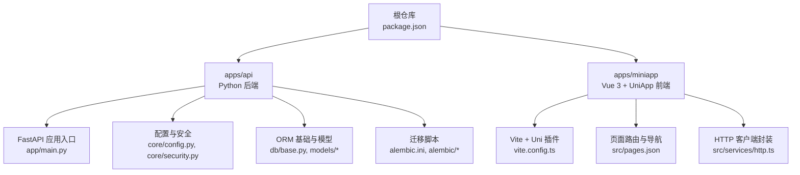
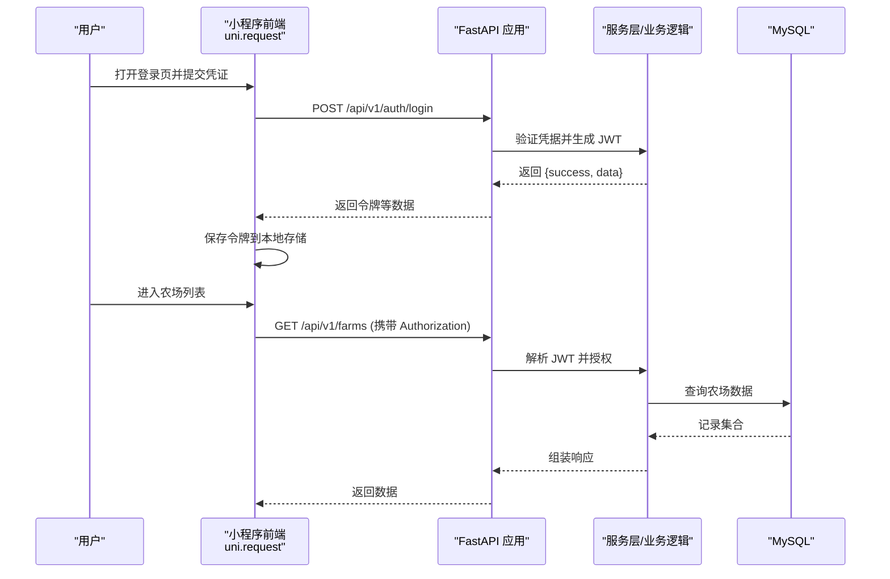
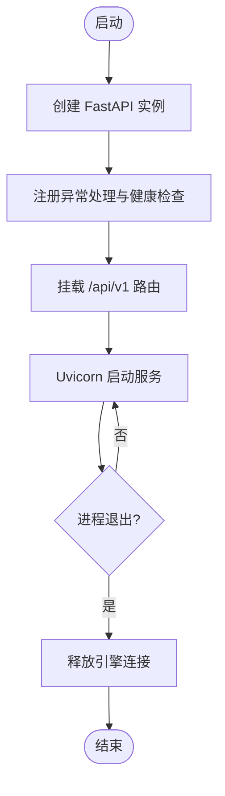
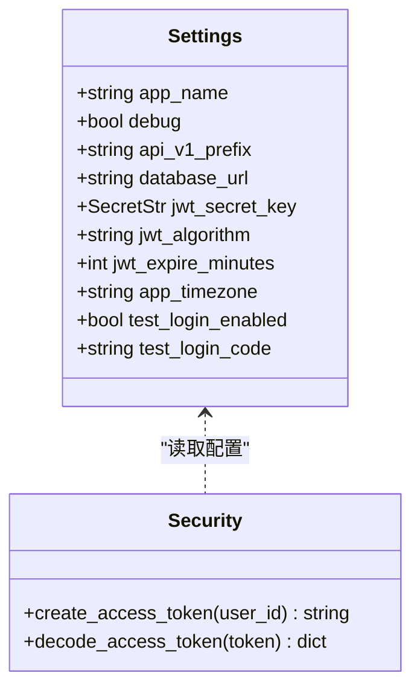
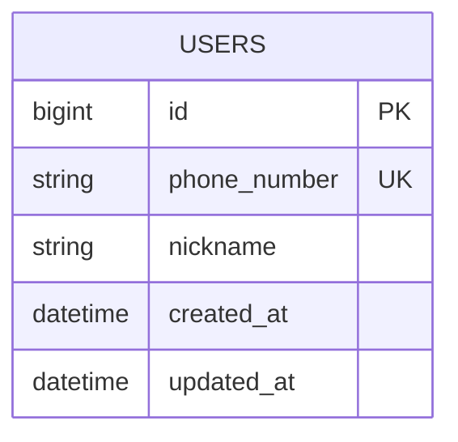
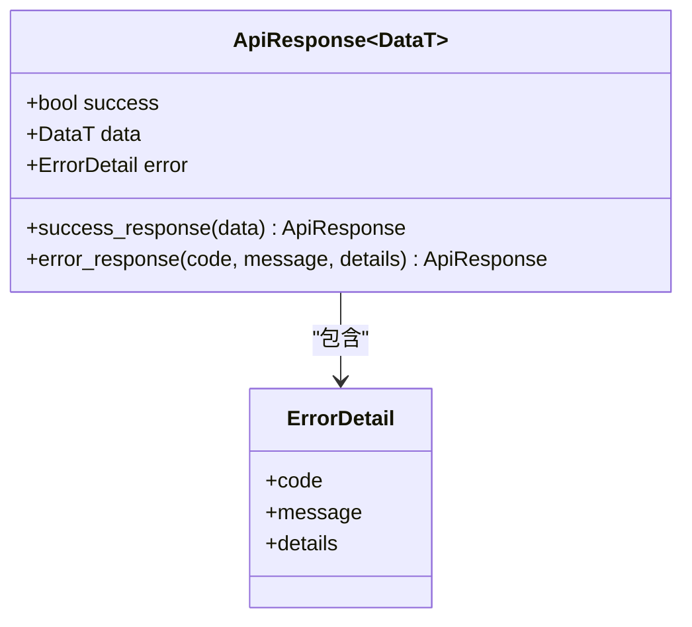
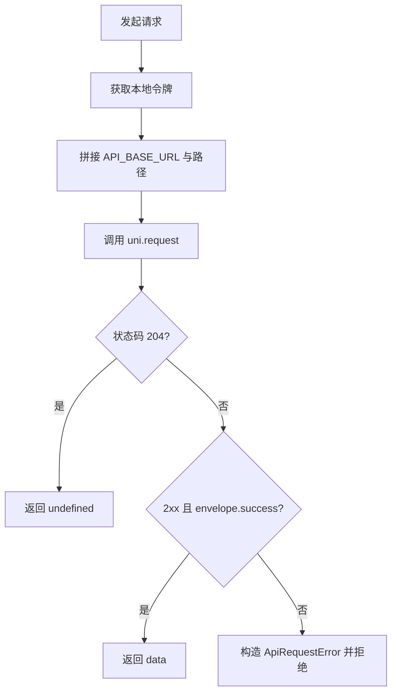
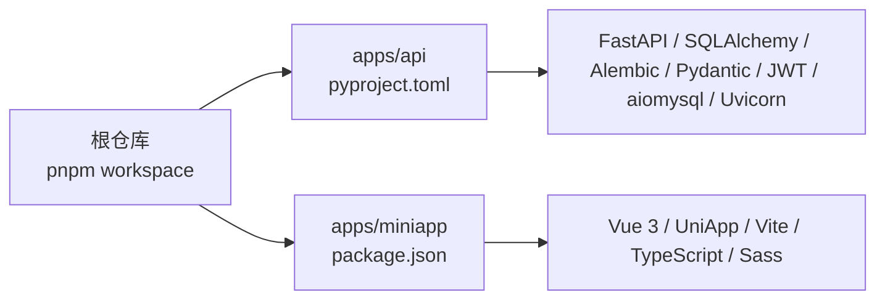

# 技术栈

<cite>
**本文引用的文件**
- [package.json](file://package.json)
- [pnpm-workspace.yaml](file://pnpm-workspace.yaml)
- [apps/api/pyproject.toml](file://apps/api/pyproject.toml)
- [apps/api/alembic.ini](file://apps/api/alembic.ini)
- [apps/api/app/main.py](file://apps/api/app/main.py)
- [apps/api/app/core/config.py](file://apps/api/app/core/config.py)
- [apps/api/app/core/security.py](file://apps/api/app/core/security.py)
- [apps/api/app/db/base.py](file://apps/api/app/db/base.py)
- [apps/api/app/models/user.py](file://apps/api/app/models/user.py)
- [apps/api/app/schemas/response.py](file://apps/api/app/schemas/response.py)
- [apps/miniapp/package.json](file://apps/miniapp/package.json)
- [apps/miniapp/vite.config.ts](file://apps/miniapp/vite.config.ts)
- [apps/miniapp/src/pages.json](file://apps/miniapp/src/pages.json)
- [apps/miniapp/src/services/http.ts](file://apps/miniapp/src/services/http.ts)
</cite>

## 目录
1. [简介](#简介)
2. [项目结构](#项目结构)
3. [核心组件](#核心组件)
4. [架构总览](#架构总览)
5. [详细组件分析](#详细组件分析)
6. [依赖分析](#依赖分析)
7. [性能考虑](#性能考虑)
8. [故障排查指南](#故障排查指南)
9. [结论](#结论)
10. [附录](#附录)

## 简介
本技术栈文档面向 Pocket Farm 项目的后端与前端，系统梳理并解释所选技术及其在 Monorepo 下的协作方式。后端采用 FastAPI + SQLAlchemy + Alembic + Pydantic + JWT，数据库为 MySQL（通过 aiomysql），服务由 Uvicorn 驱动；前端基于 Vue 3 与 UniApp，使用 TypeScript 与 Vite 构建，并通过 uni.request 调用后端 API。文档同时涵盖开发工具链（Ruff、Pytest）、Monorepo 依赖管理策略、版本兼容性与升级建议，以及常见问题的排查方法。

## 项目结构
本项目采用 Monorepo 组织：根目录通过 pnpm workspace 管理多个应用，包含后端 API 应用与前端小程序应用。

图表来源
- [package.json:1-32](file://package.json#L1-L32)
- [apps/api/app/main.py:1-28](file://apps/api/app/main.py#L1-L28)
- [apps/api/app/core/config.py:1-23](file://apps/api/app/core/config.py#L1-L23)
- [apps/api/app/core/security.py:1-29](file://apps/api/app/core/security.py#L1-L29)
- [apps/api/app/db/base.py:1-15](file://apps/api/app/db/base.py#L1-L15)
- [apps/api/alembic.ini:1-150](file://apps/api/alembic.ini#L1-L150)
- [apps/miniapp/vite.config.ts:1-8](file://apps/miniapp/vite.config.ts#L1-L8)
- [apps/miniapp/src/pages.json:1-217](file://apps/miniapp/src/pages.json#L1-L217)
- [apps/miniapp/src/services/http.ts:1-106](file://apps/miniapp/src/services/http.ts#L1-L106)

章节来源
- [package.json:1-32](file://package.json#L1-L32)
- [pnpm-workspace.yaml:1-7](file://pnpm-workspace.yaml#L1-L7)

## 核心组件
- 后端框架：FastAPI，提供异步高性能 Web 能力，配合 Uvicorn 运行。
- ORM 与迁移：SQLAlchemy 2.x 声明式模型，Alembic 管理数据库迁移。
- 数据校验与配置：Pydantic v2（BaseSettings）用于配置加载与响应体校验。
- 认证：JWT（PyJWT）实现无状态令牌签发与校验。
- 数据库：MySQL（aiomysql 异步驱动）。
- 前端：Vue 3 + UniApp（多端小程序/H5），TypeScript 类型安全，Vite 构建。
- 测试与代码质量：Pytest 测试框架，Ruff 进行 Python 代码检查与格式化。

章节来源
- [apps/api/pyproject.toml:1-35](file://apps/api/pyproject.toml#L1-L35)
- [apps/api/app/main.py:1-28](file://apps/api/app/main.py#L1-L28)
- [apps/api/app/core/config.py:1-23](file://apps/api/app/core/config.py#L1-L23)
- [apps/api/app/core/security.py:1-29](file://apps/api/app/core/security.py#L1-L29)
- [apps/api/app/db/base.py:1-15](file://apps/api/app/db/base.py#L1-L15)
- [apps/miniapp/package.json:1-73](file://apps/miniapp/package.json#L1-L73)
- [apps/miniapp/vite.config.ts:1-8](file://apps/miniapp/vite.config.ts#L1-L8)

## 架构总览
后端以 FastAPI 作为 HTTP 服务器，统一注册健康检查与业务路由；通过 SQLAlchemy 访问 MySQL，使用 Alembic 维护 schema 演进；JWT 负责鉴权。前端通过 uni.request 封装的 HTTP 客户端调用后端 API，携带 Authorization 头完成鉴权。

图表来源
- [apps/miniapp/src/services/http.ts:1-106](file://apps/miniapp/src/services/http.ts#L1-L106)
- [apps/api/app/main.py:1-28](file://apps/api/app/main.py#L1-L28)
- [apps/api/app/core/security.py:1-29](file://apps/api/app/core/security.py#L1-L29)
- [apps/api/app/db/base.py:1-15](file://apps/api/app/db/base.py#L1-L15)

## 详细组件分析

### 后端：FastAPI 应用与生命周期
- 应用创建：通过 create_application 初始化 FastAPI，注册异常处理器与健康检查路由，挂载 v1 路由前缀。
- 生命周期：使用 lifespan 钩子在应用关闭时释放数据库引擎连接。

图表来源
- [apps/api/app/main.py:1-28](file://apps/api/app/main.py#L1-L28)

章节来源
- [apps/api/app/main.py:1-28](file://apps/api/app/main.py#L1-L28)

### 配置与安全：Pydantic Settings 与 JWT
- 配置：使用 BaseSettings 从环境变量或 .env 加载应用名、调试开关、API 前缀、数据库 URL、JWT 密钥与过期时间等。
- 安全：提供创建与解码访问令牌的函数，使用 HS256 算法与可配置的过期时长。

图表来源
- [apps/api/app/core/config.py:1-23](file://apps/api/app/core/config.py#L1-L23)
- [apps/api/app/core/security.py:1-29](file://apps/api/app/core/security.py#L1-L29)

章节来源
- [apps/api/app/core/config.py:1-23](file://apps/api/app/core/config.py#L1-L23)
- [apps/api/app/core/security.py:1-29](file://apps/api/app/core/security.py#L1-L29)

### ORM 与数据模型：SQLAlchemy 与 Alembic
- 基础：定义命名约定与 DeclarativeBase，确保一致的索引、约束命名。
- 模型示例：User 模型包含自增主键、手机号、昵称与时间戳字段，时间使用 UTC 转换后写入 DATETIME。
- 迁移：Alembic 配置文件指向迁移脚本目录，支持日志级别与路径分隔符等设置。

图表来源
- [apps/api/app/db/base.py:1-15](file://apps/api/app/db/base.py#L1-L15)
- [apps/api/app/models/user.py:1-28](file://apps/api/app/models/user.py#L1-L28)
- [apps/api/alembic.ini:1-150](file://apps/api/alembic.ini#L1-L150)

章节来源
- [apps/api/app/db/base.py:1-15](file://apps/api/app/db/base.py#L1-L15)
- [apps/api/app/models/user.py:1-28](file://apps/api/app/models/user.py#L1-L28)
- [apps/api/alembic.ini:1-150](file://apps/api/alembic.ini#L1-L150)

### 响应规范：Pydantic 统一响应体
- 统一信封：ApiResponse 泛型封装 success/data/error，便于前后端一致交互。
- 错误细节：ErrorDetail 包含错误码、消息与可选详情。

图表来源
- [apps/api/app/schemas/response.py:1-40](file://apps/api/app/schemas/response.py#L1-L40)

章节来源
- [apps/api/app/schemas/response.py:1-40](file://apps/api/app/schemas/response.py#L1-L40)

### 前端：UniApp + Vue 3 + TypeScript + Vite
- 构建：Vite 配合 @dcloudio/vite-plugin-uni 提供多端开发与构建能力。
- 路由与导航：pages.json 定义页面路径、导航栏样式与 TabBar。
- HTTP 客户端：封装 uni.request，自动附加 Authorization 头，统一处理成功/失败与 204 空响应。

图表来源
- [apps/miniapp/vite.config.ts:1-8](file://apps/miniapp/vite.config.ts#L1-L8)
- [apps/miniapp/src/pages.json:1-217](file://apps/miniapp/src/pages.json#L1-L217)
- [apps/miniapp/src/services/http.ts:1-106](file://apps/miniapp/src/services/http.ts#L1-L106)

章节来源
- [apps/miniapp/package.json:1-73](file://apps/miniapp/package.json#L1-L73)
- [apps/miniapp/vite.config.ts:1-8](file://apps/miniapp/vite.config.ts#L1-L8)
- [apps/miniapp/src/pages.json:1-217](file://apps/miniapp/src/pages.json#L1-L217)
- [apps/miniapp/src/services/http.ts:1-106](file://apps/miniapp/src/services/http.ts#L1-L106)

## 依赖分析
- Monorepo 管理：pnpm workspace 将 apps/api 与 apps/miniapp 纳入同一仓库统一管理，便于统一脚本与共享配置。
- 后端依赖：FastAPI、SQLAlchemy、Alembic、Pydantic、PyJWT、aiomysql、Uvicorn 等，均在 pyproject.toml 中声明。
- 前端依赖：@dcloudio/uni-* 系列、Vue 3、Vite、TypeScript、sass 等，均在 miniapp 的 package.json 中声明。

图表来源
- [pnpm-workspace.yaml:1-7](file://pnpm-workspace.yaml#L1-L7)
- [apps/api/pyproject.toml:1-35](file://apps/api/pyproject.toml#L1-L35)
- [apps/miniapp/package.json:1-73](file://apps/miniapp/package.json#L1-L73)

章节来源
- [pnpm-workspace.yaml:1-7](file://pnpm-workspace.yaml#L1-L7)
- [apps/api/pyproject.toml:1-35](file://apps/api/pyproject.toml#L1-L35)
- [apps/miniapp/package.json:1-73](file://apps/miniapp/package.json#L1-L73)

## 性能考虑
- 后端并发：FastAPI + Uvicorn 基于异步事件循环，适合高并发 IO 场景；aiomysql 提供异步数据库访问，减少阻塞。
- 数据库连接：应用生命周期结束时释放引擎连接，避免连接泄漏。
- 前端网络：统一封装请求，集中处理鉴权与错误，减少重复逻辑；合理设置超时与重试策略可提升用户体验。
- 构建优化：Vite 提供快速热更新与按需编译，有助于前端开发效率。

[本节为通用指导，不直接分析具体文件]

## 故障排查指南
- 认证失败（401）：前端在收到 401 时会清除本地令牌，需重新登录；检查后端 JWT 密钥与算法是否一致。
- 请求失败：前端会抛出 ApiRequestError，包含 code、statusCode 与 details；根据错误码定位问题。
- 数据库连接：确认数据库 URL 正确，Alembic 迁移已执行；必要时查看 Alembic 日志级别。
- 端口与路由：确认后端监听端口与前端 API_BASE_URL 一致，路由前缀匹配。

章节来源
- [apps/miniapp/src/services/http.ts:1-106](file://apps/miniapp/src/services/http.ts#L1-L106)
- [apps/api/app/core/security.py:1-29](file://apps/api/app/core/security.py#L1-L29)
- [apps/api/alembic.ini:1-150](file://apps/api/alembic.ini#L1-L150)

## 结论
Pocket Farm 采用现代、高效且生态完善的技术栈：后端以 FastAPI 为核心，结合 SQLAlchemy/Alembic 与 Pydantic/JWT，提供高性能、易维护的 API；前端基于 Vue 3 与 UniApp，借助 Vite 与 TypeScript 实现跨端开发与类型安全。Monorepo 通过 pnpm workspace 统一管理依赖与脚本，提升了团队协作效率。建议在后续迭代中持续跟踪各依赖版本兼容性，逐步引入更严格的 lint 规则与自动化测试，以提升代码质量与稳定性。

[本节为总结性内容，不直接分析具体文件]

## 附录

### 技术选型原因与优势
- FastAPI：异步、高性能、自动生成 OpenAPI 文档，易于集成 Pydantic 与 SQLAlchemy。
- SQLAlchemy 2.x：声明式模型、丰富的关系映射与扩展能力；配合 Alembic 实现可追踪的数据库变更。
- Pydantic v2：强大的数据校验与序列化能力，BaseSettings 简化配置管理。
- JWT：无状态鉴权，适合分布式与移动端场景；HS256 简单可靠。
- MySQL（aiomysql）：成熟稳定，异步驱动提升吞吐。
- Vue 3 + UniApp：一套代码多端发布，生态丰富，学习成本低。
- TypeScript：类型安全，提升大型项目可维护性。
- Vite：极速开发体验与构建速度。
- Ruff/Pytest：快速代码检查与测试框架，保障代码质量。

[本节为概念说明，不直接分析具体文件]

### Monorepo 依赖管理策略
- 使用 pnpm workspace 将后端与前端纳入同一仓库，统一脚本入口（如 dev/build）。
- 各子应用独立维护依赖，避免冲突；根级 scripts 提供便捷的一键命令。
- 允许特定构建依赖（如 puppeteer）在 workspace 中显式启用。

章节来源
- [package.json:1-32](file://package.json#L1-L32)
- [pnpm-workspace.yaml:1-7](file://pnpm-workspace.yaml#L1-L7)

### 版本兼容性与升级建议
- Python 后端
  - Python >= 3.12；FastAPI、SQLAlchemy、Alembic、Pydantic、PyJWT、aiomysql、Uvicorn 均保持较新版本。
  - 升级建议：关注 SQLAlchemy 2.x 迁移指南；定期升级 Alembic 以利用新特性；JWT 算法与密钥轮换需同步更新配置。
- 前端
  - Vue 3、UniApp、Vite、TypeScript、Sass 均为主流版本；注意 uni-app 与平台 SDK 的兼容性矩阵。
  - 升级建议：优先跟随官方 LTS 或稳定版；在升级 Vite 与 Uni 插件时留意 breaking changes。
- 数据库
  - MySQL 版本需与 aiomysql 驱动兼容；Alembic 迁移脚本应谨慎回滚策略。
- 工具链
  - Ruff 与 Pytest 保持最新稳定版以获得更好的性能与规则集。

[本节为通用指导，不直接分析具体文件]