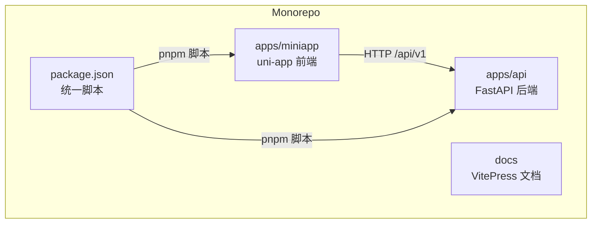
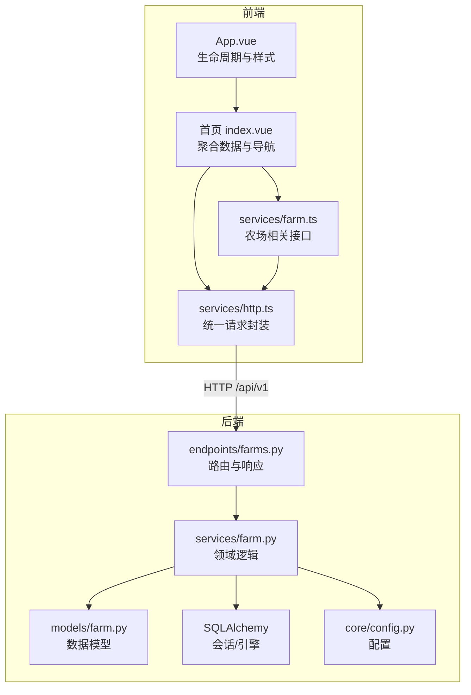
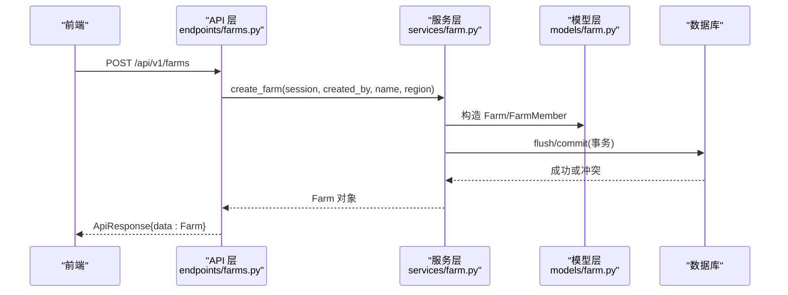
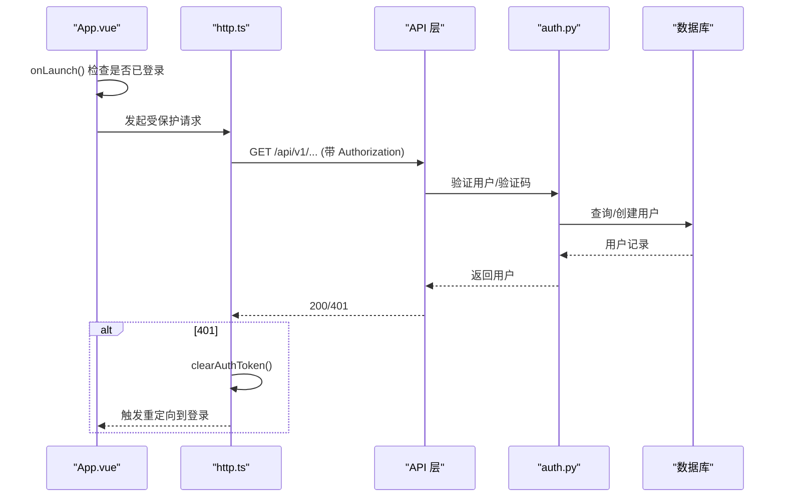
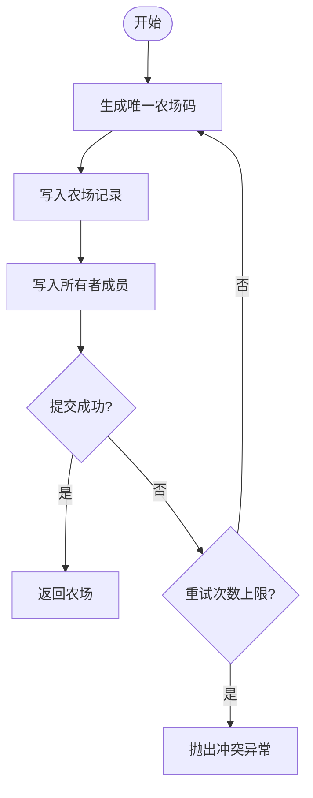
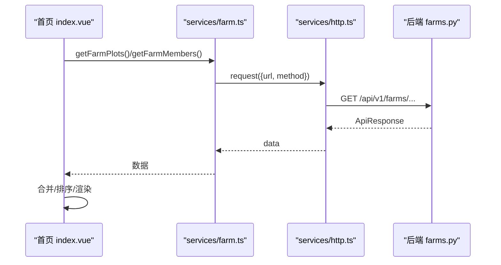
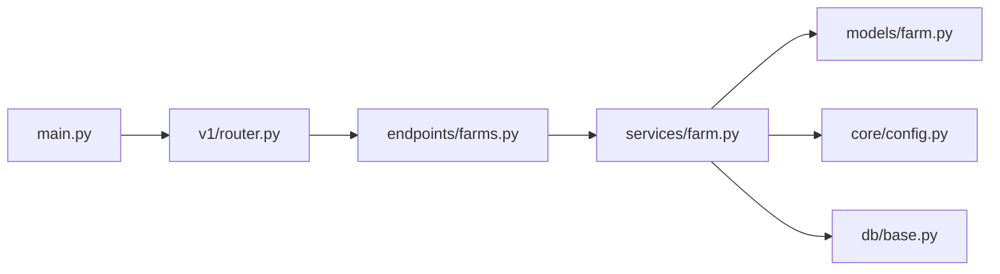

# 架构概览

<cite>
**本文引用的文件**
- [apps/api/app/main.py](file://apps/api/app/main.py)
- [apps/api/app/api/v1/router.py](file://apps/api/app/api/v1/router.py)
- [apps/api/app/core/config.py](file://apps/api/app/core/config.py)
- [apps/api/app/db/base.py](file://apps/api/app/db/base.py)
- [apps/api/app/models/user.py](file://apps/api/app/models/user.py)
- [apps/api/app/models/farm.py](file://apps/api/app/models/farm.py)
- [apps/api/app/schemas/user.py](file://apps/api/app/schemas/user.py)
- [apps/api/app/services/auth.py](file://apps/api/app/services/auth.py)
- [apps/api/app/services/farm.py](file://apps/api/app/services/farm.py)
- [apps/api/app/api/v1/endpoints/farms.py](file://apps/api/app/api/v1/endpoints/farms.py)
- [apps/miniapp/src/main.ts](file://apps/miniapp/src/main.ts)
- [apps/miniapp/src/App.vue](file://apps/miniapp/src/App.vue)
- [apps/miniapp/src/services/http.ts](file://apps/miniapp/src/services/http.ts)
- [apps/miniapp/src/pages/home/index.vue](file://apps/miniapp/src/pages/home/index.vue)
- [apps/miniapp/src/services/farm.ts](file://apps/miniapp/src/services/farm.ts)
- [package.json](file://package.json)
</cite>

## 目录
1. [简介](#简介)
2. [项目结构](#项目结构)
3. [核心组件](#核心组件)
4. [架构总览](#架构总览)
5. [详细组件分析](#详细组件分析)
6. [依赖关系分析](#依赖关系分析)
7. [性能考虑](#性能考虑)
8. [故障排查指南](#故障排查指南)
9. [结论](#结论)
10. [附录](#附录)

## 简介
本架构概览面向 Pocket Farm 项目的初学者与高级开发者，系统性地阐述前后端分离、Monorepo 组织方式与模块化设计原则；深入解析后端分层架构（API 层、服务层、数据模型层）与前端组件化架构；说明领域驱动设计、RESTful API 设计与响应式数据绑定等关键决策；给出系统边界、组件交互关系与数据流向图，并讨论可扩展性与集成点。

## 项目结构
本项目采用 Monorepo 管理多应用：
- apps/api：基于 FastAPI 的后端服务，提供 RESTful API，使用 SQLAlchemy + Alembic 进行异步数据库访问与迁移。
- apps/miniapp：基于 uni-app + Vue 的微信小程序前端，封装 HTTP 请求、页面路由与业务服务。
- docs：文档站点（VitePress）。
- 根级 package.json：统一脚本与工具链配置。

图表来源
- [package.json:5-11](file://package.json#L5-L11)

章节来源
- [package.json:1-32](file://package.json#L1-L32)

## 核心组件
- 后端入口与路由装配：应用启动时注册健康检查与 v1 API 路由，集中挂载各业务模块路由。
- 配置与安全：集中管理应用名、调试开关、API 前缀、数据库连接、JWT 密钥与过期时间等。
- 数据模型与持久化：以 SQLAlchemy ORM 定义实体，统一命名约定与基础类。
- 服务层：封装领域逻辑（如农场创建、成员管理、登录流程），处理事务与并发安全。
- API 层：声明式路由、参数校验、权限依赖注入、统一响应包装。
- 前端应用：uni-app 入口与全局生命周期，按页面与组件拆分，服务层封装 HTTP 调用与错误处理。

章节来源
- [apps/api/app/main.py:13-27](file://apps/api/app/main.py#L13-L27)
- [apps/api/app/api/v1/router.py:1-21](file://apps/api/app/api/v1/router.py#L1-L21)
- [apps/api/app/core/config.py:5-22](file://apps/api/app/core/config.py#L5-L22)
- [apps/api/app/db/base.py:1-15](file://apps/api/app/db/base.py#L1-L15)
- [apps/api/app/models/user.py:15-28](file://apps/api/app/models/user.py#L15-L28)
- [apps/api/app/models/farm.py:18-59](file://apps/api/app/models/farm.py#L18-L59)
- [apps/api/app/services/auth.py:11-47](file://apps/api/app/services/auth.py#L11-L47)
- [apps/api/app/services/farm.py:33-54](file://apps/api/app/services/farm.py#L33-L54)
- [apps/api/app/api/v1/endpoints/farms.py:58-90](file://apps/api/app/api/v1/endpoints/farms.py#L58-L90)
- [apps/miniapp/src/main.ts:1-9](file://apps/miniapp/src/main.ts#L1-L9)
- [apps/miniapp/src/App.vue:1-25](file://apps/miniapp/src/App.vue#L1-L25)
- [apps/miniapp/src/services/http.ts:1-106](file://apps/miniapp/src/services/http.ts#L1-L106)

## 架构总览
Pocket Farm 采用前后端分离与分层架构：
- 前端（uni-app + Vue）通过统一 HTTP 客户端调用后端 REST API，携带 JWT 令牌进行鉴权。
- 后端（FastAPI）在 API 层做参数校验与响应封装，服务层实现领域逻辑与事务控制，数据模型层通过 SQLAlchemy 映射到数据库。
- 配置与安全由集中配置模块管理，支持环境变量与本地 .env。

图表来源
- [apps/miniapp/src/App.vue:1-25](file://apps/miniapp/src/App.vue#L1-L25)
- [apps/miniapp/src/pages/home/index.vue:164-203](file://apps/miniapp/src/pages/home/index.vue#L164-L203)
- [apps/miniapp/src/services/http.ts:46-105](file://apps/miniapp/src/services/http.ts#L46-L105)
- [apps/miniapp/src/services/farm.ts:48-94](file://apps/miniapp/src/services/farm.ts#L48-L94)
- [apps/api/app/api/v1/endpoints/farms.py:58-90](file://apps/api/app/api/v1/endpoints/farms.py#L58-L90)
- [apps/api/app/services/farm.py:33-54](file://apps/api/app/services/farm.py#L33-L54)
- [apps/api/app/models/farm.py:18-59](file://apps/api/app/models/farm.py#L18-L59)
- [apps/api/app/core/config.py:5-22](file://apps/api/app/core/config.py#L5-L22)

## 详细组件分析

### 后端分层架构
- API 层：使用 FastAPI 声明式路由，依赖注入当前用户与会话，统一响应格式 ApiResponse。
- 服务层：封装领域规则（如农场代码生成、成员角色权限、事务与并发锁），抛出结构化异常。
- 数据模型层：SQLAlchemy ORM 模型，统一命名约定与时间戳策略。

图表来源
- [apps/api/app/api/v1/endpoints/farms.py:78-90](file://apps/api/app/api/v1/endpoints/farms.py#L78-L90)
- [apps/api/app/services/farm.py:33-54](file://apps/api/app/services/farm.py#L33-L54)
- [apps/api/app/models/farm.py:18-59](file://apps/api/app/models/farm.py#L18-L59)

章节来源
- [apps/api/app/api/v1/endpoints/farms.py:58-90](file://apps/api/app/api/v1/endpoints/farms.py#L58-L90)
- [apps/api/app/services/farm.py:33-54](file://apps/api/app/services/farm.py#L33-L54)
- [apps/api/app/models/farm.py:18-59](file://apps/api/app/models/farm.py#L18-L59)

### 认证与鉴权流程
- 前端在每次请求中附加 Authorization: Bearer <token>，并在 401 时清理令牌并跳转登录页。
- 后端通过依赖注入获取当前用户与会话，服务层根据配置与验证码执行登录逻辑，必要时自动注册用户。

图表来源
- [apps/miniapp/src/App.vue:5-9](file://apps/miniapp/src/App.vue#L5-L9)
- [apps/miniapp/src/services/http.ts:51-105](file://apps/miniapp/src/services/http.ts#L51-L105)
- [apps/api/app/services/auth.py:11-47](file://apps/api/app/services/auth.py#L11-L47)

章节来源
- [apps/miniapp/src/App.vue:5-9](file://apps/miniapp/src/App.vue#L5-L9)
- [apps/miniapp/src/services/http.ts:51-105](file://apps/miniapp/src/services/http.ts#L51-L105)
- [apps/api/app/services/auth.py:11-47](file://apps/api/app/services/auth.py#L11-L47)

### 农场与成员管理（领域逻辑）
- 农场创建：生成唯一农场码，原子写入农场与初始成员（所有者），失败重试与回滚。
- 成员管理：加锁读取农场与成员列表，校验操作者角色与目标角色约束，保证至少保留一个所有者。
- 分页与排序：对农场列表与成员列表进行分页与排序，提升大数据量下的性能。

图表来源
- [apps/api/app/services/farm.py:33-54](file://apps/api/app/services/farm.py#L33-L54)

章节来源
- [apps/api/app/services/farm.py:33-54](file://apps/api/app/services/farm.py#L33-L54)
- [apps/api/app/services/farm.py:181-207](file://apps/api/app/services/farm.py#L181-L207)
- [apps/api/app/services/farm.py:210-231](file://apps/api/app/services/farm.py#L210-L231)
- [apps/api/app/services/farm.py:234-263](file://apps/api/app/services/farm.py#L234-L263)

### 前端组件化与响应式数据流
- 应用入口：uni-app 创建 SSR 应用，App.vue 监听生命周期并根据登录状态导航。
- 首页聚合：home/index.vue 并行加载地块、生产、农事与收获数据，合并为最近动态，展示空态与错误态。
- 服务层：farm.ts 将业务接口封装为函数，http.ts 统一处理请求、错误与令牌管理。

图表来源
- [apps/miniapp/src/pages/home/index.vue:164-203](file://apps/miniapp/src/pages/home/index.vue#L164-L203)
- [apps/miniapp/src/services/farm.ts:48-94](file://apps/miniapp/src/services/farm.ts#L48-L94)
- [apps/miniapp/src/services/http.ts:46-105](file://apps/miniapp/src/services/http.ts#L46-L105)
- [apps/api/app/api/v1/endpoints/farms.py:58-90](file://apps/api/app/api/v1/endpoints/farms.py#L58-L90)

章节来源
- [apps/miniapp/src/main.ts:1-9](file://apps/miniapp/src/main.ts#L1-L9)
- [apps/miniapp/src/App.vue:1-25](file://apps/miniapp/src/App.vue#L1-L25)
- [apps/miniapp/src/pages/home/index.vue:164-203](file://apps/miniapp/src/pages/home/index.vue#L164-L203)
- [apps/miniapp/src/services/http.ts:46-105](file://apps/miniapp/src/services/http.ts#L46-L105)
- [apps/miniapp/src/services/farm.ts:48-94](file://apps/miniapp/src/services/farm.ts#L48-L94)

### 数据模型与响应式绑定
- 数据模型：User、Farm、FarmMember 等实体定义主键、外键、唯一约束与时间戳。
- 响应式绑定：Vue 组合式 API 在页面中通过 ref/computed 管理状态，结合 uni-app 生命周期触发数据加载与导航。

章节来源
- [apps/api/app/models/user.py:15-28](file://apps/api/app/models/user.py#L15-L28)
- [apps/api/app/models/farm.py:18-59](file://apps/api/app/models/farm.py#L18-L59)
- [apps/miniapp/src/pages/home/index.vue:120-140](file://apps/miniapp/src/pages/home/index.vue#L120-L140)

## 依赖关系分析
- 应用装配：main.py 注册健康检查与 v1 路由，v1/router.py 聚合各业务路由。
- 配置依赖：所有模块通过 core/config.py 获取运行时配置。
- 数据依赖：服务层依赖模型与数据库会话，API 层依赖服务层与依赖注入。

图表来源
- [apps/api/app/main.py:13-27](file://apps/api/app/main.py#L13-L27)
- [apps/api/app/api/v1/router.py:1-21](file://apps/api/app/api/v1/router.py#L1-L21)
- [apps/api/app/api/v1/endpoints/farms.py:58-90](file://apps/api/app/api/v1/endpoints/farms.py#L58-L90)
- [apps/api/app/services/farm.py:33-54](file://apps/api/app/services/farm.py#L33-L54)
- [apps/api/app/models/farm.py:18-59](file://apps/api/app/models/farm.py#L18-L59)
- [apps/api/app/core/config.py:5-22](file://apps/api/app/core/config.py#L5-L22)
- [apps/api/app/db/base.py:1-15](file://apps/api/app/db/base.py#L1-L15)

章节来源
- [apps/api/app/main.py:13-27](file://apps/api/app/main.py#L13-L27)
- [apps/api/app/api/v1/router.py:1-21](file://apps/api/app/api/v1/router.py#L1-L21)

## 性能考虑
- 并发与事务：服务层使用 with_for_update 锁定行，避免竞态条件；创建农场时重试生成唯一码，减少冲突概率。
- 分页与排序：列表接口支持分页与排序，降低单次响应体积与数据库压力。
- 前端并行请求：首页使用 Promise.all 并行拉取多个资源，缩短首屏加载时间。
- 统一错误处理：前端 http.ts 统一处理网络错误与业务错误，减少重复逻辑。

[本节为通用指导，不直接分析具体文件]

## 故障排查指南
- 认证失败（401）：检查前端是否正确附加 Authorization 头；确认后端 JWT 配置与过期时间；出现 401 时前端会清理令牌并重定向登录。
- 农场码冲突：创建农场时若发生唯一性冲突，服务层会回滚并重试；若超过重试次数则抛出冲突异常。
- 成员权限不足：修改成员角色或删除成员时，需满足角色约束（如不能删除最后一个所有者）；否则抛出禁止或冲突异常。
- 网络错误：http.ts 捕获网络异常并抛出 ApiRequestError，页面应显示友好提示并提供重试入口。

章节来源
- [apps/miniapp/src/services/http.ts:68-105](file://apps/miniapp/src/services/http.ts#L68-L105)
- [apps/api/app/services/farm.py:41-54](file://apps/api/app/services/farm.py#L41-L54)
- [apps/api/app/services/farm.py:210-231](file://apps/api/app/services/farm.py#L210-L231)
- [apps/api/app/services/farm.py:234-263](file://apps/api/app/services/farm.py#L234-L263)

## 结论
Pocket Farm 通过前后端分离与清晰的分层架构实现了高内聚、低耦合的系统设计。后端以 FastAPI + SQLAlchemy 构建稳定的 REST API，服务层承载领域逻辑与事务控制；前端以 uni-app + Vue 提供响应式界面与服务封装。Monorepo 与统一脚本提升了开发与维护效率。该架构具备良好的可扩展性与可维护性，适合持续演进与功能扩展。

## 附录
- 开发脚本：根级 package.json 提供 api:dev、miniapp:dev、miniapp:build 等命令，便于快速启动与构建。
- 文档站点：docs 目录使用 VitePress，支持 mermaid 渲染，便于可视化架构图。

章节来源
- [package.json:5-11](file://package.json#L5-L11)