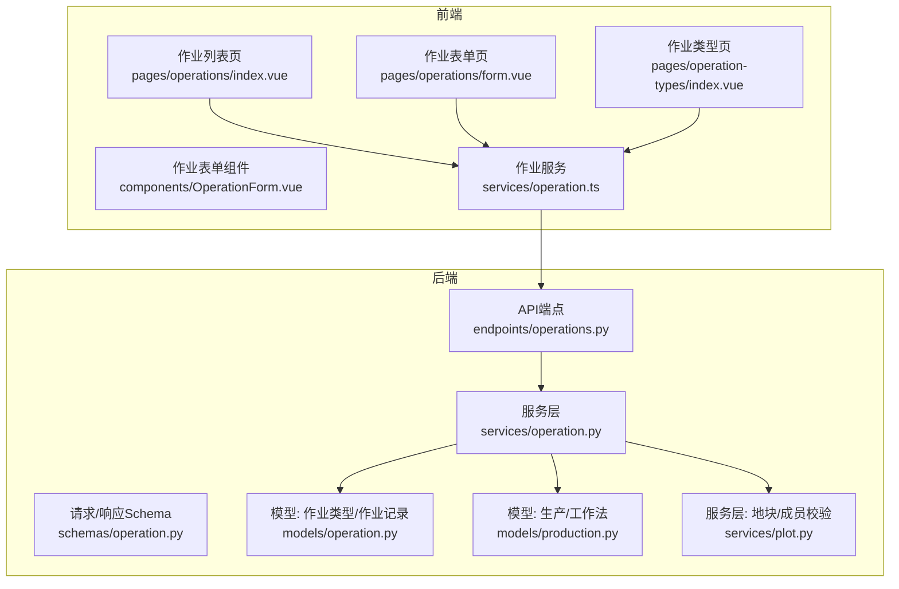
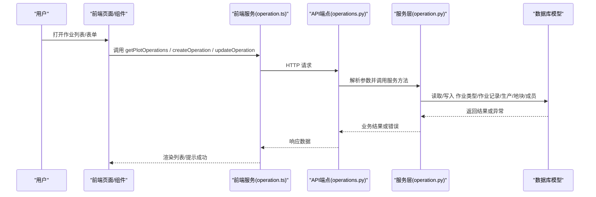
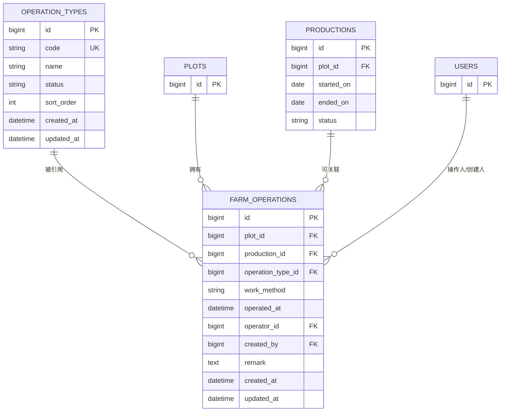
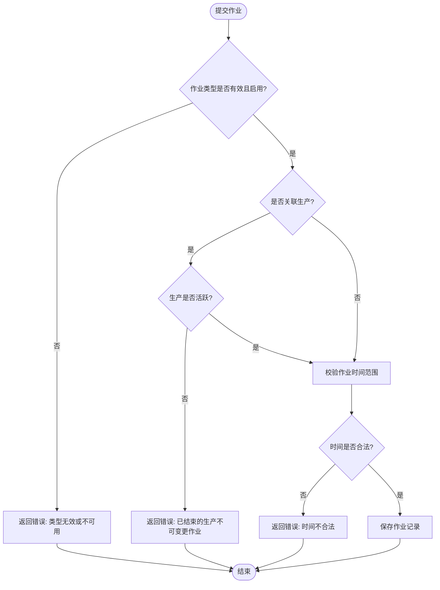
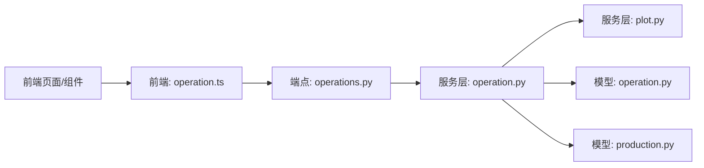

# 农事活动记录

<cite>
**本文引用的文件**
- [operation.py](file://apps/api/app/models/operation.py)
- [operation.py](file://apps/api/app/schemas/operation.py)
- [operation.py](file://apps/api/app/services/operation.py)
- [operations.py](file://apps/api/app/api/v1/endpoints/operations.py)
- [production.py](file://apps/api/app/models/production.py)
- [plot.py](file://apps/api/app/services/plot.py)
- [index.vue](file://apps/miniapp/src/pages/operations/index.vue)
- [form.vue](file://apps/miniapp/src/pages/operations/form.vue)
- [OperationForm.vue](file://apps/miniapp/src/components/OperationForm.vue)
- [operation.ts](file://apps/miniapp/src/services/operation.ts)
- [index.vue](file://apps/miniapp/src/pages/operation-types/index.vue)
</cite>

## 目录
1. [简介](#简介)
2. [项目结构](#项目结构)
3. [核心组件](#核心组件)
4. [架构总览](#架构总览)
5. [详细组件分析](#详细组件分析)
6. [依赖关系分析](#依赖关系分析)
7. [性能与可扩展性](#性能与可扩展性)
8. [故障排查指南](#故障排查指南)
9. [结论](#结论)
10. [附录：标准化记录方法与数据分析方案](#附录标准化记录方法与数据分析方案)

## 简介
本模块为农场“农事活动记录”提供完整的前后端实现，覆盖作业类型定义、作业记录的创建/更新/删除、作业与生产（批次）的关联管理，以及地块维度的列表展示与表单录入。系统通过严格的模型约束与服务层校验保证数据完整性，并通过前端交互提升农事记录的易用性与一致性。

## 项目结构
围绕农事活动记录的核心代码分布在以下位置：
- 后端模型与Schema：定义作业类型与作业记录的数据结构与接口契约
- 后端服务层：封装业务规则、权限校验、时间有效性校验、与生产/地块/成员的关联校验
- 后端API端点：暴露REST接口，负责参数绑定、响应包装与分页
- 前端页面与组件：地块维度的作业列表、作业创建/编辑表单、作业类型选择页
- 前端服务层：统一HTTP调用与类型定义

**图表来源**
- [operations.py:63-168](file://apps/api/app/api/v1/endpoints/operations.py#L63-L168)
- [operation.py:139-307](file://apps/api/app/services/operation.py#L139-L307)
- [operation.py:18-80](file://apps/api/app/models/operation.py#L18-L80)
- [production.py:29-32](file://apps/api/app/models/production.py#L29-L32)
- [plot.py:107-121](file://apps/api/app/services/plot.py#L107-L121)

**章节来源**
- [operations.py:63-168](file://apps/api/app/api/v1/endpoints/operations.py#L63-L168)
- [operation.py:139-307](file://apps/api/app/services/operation.py#L139-L307)
- [operation.py:18-80](file://apps/api/app/models/operation.py#L18-L80)
- [production.py:29-32](file://apps/api/app/models/production.py#L29-L32)
- [plot.py:107-121](file://apps/api/app/services/plot.py#L107-L121)

## 核心组件
- 作业类型（OperationType）：用于标准化农事活动的分类，支持启用/禁用状态与排序
- 作业记录（FarmOperation）：记录一次农事操作，包含地块、可选的生产批次、作业类型、作业方式、作业时间、操作人、备注等
- 作业服务：负责创建、查询、更新、删除作业，并执行跨实体校验（地块权限、生产状态、时间有效性、操作人归属等）
- 前端作业列表：按地块维度展示作业记录，支持删除与编辑（受锁定策略限制）
- 前端作业表单：支持选择作业类型、关联生产批次、作业方式、日期时间、操作人与备注
- 作业类型管理页：供用户在表单中选择可用的作业类型

**章节来源**
- [operation.py:18-80](file://apps/api/app/models/operation.py#L18-L80)
- [operation.py:139-307](file://apps/api/app/services/operation.py#L139-L307)
- [index.vue:1-359](file://apps/miniapp/src/pages/operations/index.vue#L1-L359)
- [form.vue:1-335](file://apps/miniapp/src/pages/operations/form.vue#L1-L335)
- [OperationForm.vue:1-364](file://apps/miniapp/src/components/OperationForm.vue#L1-L364)
- [index.vue:1-83](file://apps/miniapp/src/pages/operation-types/index.vue#L1-L83)

## 架构总览
从用户操作到数据落库的端到端流程如下：

**图表来源**
- [operations.py:63-168](file://apps/api/app/api/v1/endpoints/operations.py#L63-L168)
- [operation.py:139-307](file://apps/api/app/services/operation.py#L139-L307)
- [operation.ts:55-90](file://apps/miniapp/src/services/operation.ts#L55-L90)

## 详细组件分析

### 数据模型设计
- 作业类型（OperationType）
  - 字段：唯一编码、名称、状态（ACTIVE/DISABLED）、排序号、创建/更新时间
  - 用途：标准化农事活动分类，便于前端展示与筛选
- 作业记录（FarmOperation）
  - 关键字段：地块ID、可选的生产批次ID、作业类型ID、作业方式（MANUAL/MECHANICAL）、作业时间、操作人ID、创建人ID、备注
  - 外键约束：与地块、生产、作业类型、用户建立强关联，确保引用完整性
- 生产（Production）与工作法（WorkMethod）
  - 生产包含状态（ACTIVE/ENDED）、开始/结束日期等；作业时间与生产开始日期的前后关系在服务层校验

**图表来源**
- [operation.py:18-80](file://apps/api/app/models/operation.py#L18-L80)
- [production.py:43-79](file://apps/api/app/models/production.py#L43-L79)

**章节来源**
- [operation.py:18-80](file://apps/api/app/models/operation.py#L18-L80)
- [production.py:43-79](file://apps/api/app/models/production.py#L43-L79)

### 类型与状态管理
- 作业类型状态：仅 ACTIVE 类型可用于新建/更新作业；DISABLED 类型不可选
- 生产状态：若作业关联的生产已结束（ENDED），则不允许再修改该作业
- 作业时间约束：
  - 不能晚于当前时间
  - 若关联生产，不能早于生产的开始日期

**图表来源**
- [operation.py:83-96](file://apps/api/app/services/operation.py#L83-L96)
- [operation.py:33-44](file://apps/api/app/services/operation.py#L33-L44)
- [operation.py:139-181](file://apps/api/app/services/operation.py#L139-L181)
- [operation.py:207-219](file://apps/api/app/services/operation.py#L207-L219)

**章节来源**
- [operation.py:83-96](file://apps/api/app/services/operation.py#L83-L96)
- [operation.py:33-44](file://apps/api/app/services/operation.py#L33-L44)
- [operation.py:139-181](file://apps/api/app/services/operation.py#L139-L181)
- [operation.py:207-219](file://apps/api/app/services/operation.py#L207-L219)

### 数据完整性保证
- 外键约束：作业记录必须关联有效的地块、作业类型、用户；生产可选但需满足所属地块一致
- 权限校验：
  - 操作人必须是地块所属农场的成员
  - 查询/编辑/删除均需验证当前用户对地块的访问权限
- 并发安全：
  - 更新/删除时采用行级锁（with_for_update）防止竞态条件
  - 对关联生产进行锁定检查，避免在并发下误改已结束生产
- 时间一致性：
  - 服务端强制将带时区的时间转换为无时区的UTC表示存储
  - 前端提交时需携带时区信息，否则校验失败

**章节来源**
- [operation.py:46-59](file://apps/api/app/services/operation.py#L46-L59)
- [operation.py:61-80](file://apps/api/app/services/operation.py#L61-L80)
- [operation.py:184-204](file://apps/api/app/services/operation.py#L184-L204)
- [operation.py:222-289](file://apps/api/app/services/operation.py#L222-L289)
- [operation.py:292-307](file://apps/api/app/services/operation.py#L292-L307)

### 作业列表展示（前端）
- 功能要点：
  - 加载地块的作业列表、活跃生产、农场成员
  - 根据生产状态显示“已锁定”标记，禁止编辑/删除
  - 支持删除确认与错误提示
- 交互细节：
  - 未登录或令牌过期自动跳转登录
  - 空状态引导创建第一条记录
  - 图标映射不同作业类型

**章节来源**
- [index.vue:1-359](file://apps/miniapp/src/pages/operations/index.vue#L1-L359)

### 作业创建与编辑（前端）
- 表单字段：作业类型、关联生产、作业方式、作业日期、作业时间、操作人、备注
- 前置校验：
  - 必填项校验（作业类型、操作人、时间等）
  - 作业时间不得早于关联生产的开始日期
  - 作业时间不得晚于当前时间
- 数据来源：
  - 作业类型来自后端分页接口
  - 活跃生产列表用于限定可选范围
  - 农场成员列表用于选择操作人
- 提交逻辑：
  - 新增：POST /plots/{plotId}/operations
  - 编辑：PATCH /operations/{operationId}
  - 成功后返回并关闭页面

**章节来源**
- [form.vue:1-335](file://apps/miniapp/src/pages/operations/form.vue#L1-L335)
- [OperationForm.vue:1-364](file://apps/miniapp/src/components/OperationForm.vue#L1-L364)
- [operation.ts:55-90](file://apps/miniapp/src/services/operation.ts#L55-L90)

### 作业类型管理（前端）
- 作用：在作业表单中提供作业类型选择入口
- 行为：加载可用作业类型网格，点击后回传选中类型给父页面

**章节来源**
- [index.vue:1-83](file://apps/miniapp/src/pages/operation-types/index.vue#L1-L83)

### API 端点与响应
- 获取作业列表：GET /plots/{plot_id}/operations
- 创建作业：POST /plots/{plot_id}/operations
- 更新作业：PATCH /operations/{operation_id}
- 删除作业：DELETE /operations/{operation_id}
- 获取作业类型：GET /operation-types
- 统一响应格式：ApiResponse[data]，分页字段包含 items/page/pageSize/total

**章节来源**
- [operations.py:63-168](file://apps/api/app/api/v1/endpoints/operations.py#L63-L168)

## 依赖关系分析
- 服务层依赖：
  - 地块服务：校验用户对地块的访问权限
  - 生产服务：校验生产状态与所属地块一致性
  - 用户/农场成员：校验操作人归属
- 模型依赖：
  - 作业类型枚举与状态控制
  - 生产状态与工作法枚举
- 前端依赖：
  - 作业服务封装HTTP调用
  - 页面与组件通过事件与props传递上下文（地块、生产、成员、当前用户）

**图表来源**
- [operation.py:139-307](file://apps/api/app/services/operation.py#L139-L307)
- [plot.py:107-121](file://apps/api/app/services/plot.py#L107-L121)
- [operations.py:63-168](file://apps/api/app/api/v1/endpoints/operations.py#L63-L168)
- [operation.ts:55-90](file://apps/miniapp/src/services/operation.ts#L55-L90)

**章节来源**
- [operation.py:139-307](file://apps/api/app/services/operation.py#L139-L307)
- [plot.py:107-121](file://apps/api/app/services/plot.py#L107-L121)
- [operations.py:63-168](file://apps/api/app/api/v1/endpoints/operations.py#L63-L168)
- [operation.ts:55-90](file://apps/miniapp/src/services/operation.ts#L55-L90)

## 性能与可扩展性
- 分页查询：作业列表与作业类型均支持分页，减少单次传输数据量
- 索引优化：作业记录对地块、生产、作业类型、操作人建立索引，提升查询效率
- 并发控制：更新/删除使用行级锁，避免并发写冲突
- 扩展建议：
  - 可按作业类型统计频次与成本，增加聚合视图
  - 可增加批量导入/导出能力，便于历史数据迁移
  - 可为作业记录增加附件（图片/视频）以增强现场记录

[本节为通用指导，无需特定文件来源]

## 故障排查指南
- 常见错误与定位：
  - 作业类型无效或不可用：检查类型是否存在且状态为ACTIVE
  - 操作人不属于地块所属农场：确认操作人是否在农场成员列表中
  - 作业时间非法：检查是否晚于当前时间或与生产开始日期冲突
  - 已结束生产不可变更：确认关联生产状态是否为ACTIVE
  - 未授权（401）：检查登录态与令牌是否有效
- 处理建议：
  - 前端捕获ApiRequestError并提示用户重试或重新登录
  - 后端通过统一的错误码与消息便于前端展示
  - 日志记录关键校验失败路径，便于问题复现

**章节来源**
- [operation.py:17-27](file://apps/api/app/services/operation.py#L17-L27)
- [operation.py:33-44](file://apps/api/app/services/operation.py#L33-L44)
- [operation.py:46-59](file://apps/api/app/services/operation.py#L46-L59)
- [operation.py:61-80](file://apps/api/app/services/operation.py#L61-L80)
- [index.vue:107-110](file://apps/miniapp/src/pages/operations/index.vue#L107-L110)
- [form.vue:97-100](file://apps/miniapp/src/pages/operations/form.vue#L97-L100)

## 结论
本模块通过清晰的模型设计与严格的服务层校验，实现了农事活动记录的标准化与安全性。前端界面提供了直观的作业列表与表单，结合生产状态与权限控制，确保数据的一致性与可追溯性。后续可在统计分析、附件扩展与批量操作方面进一步增强用户体验与业务价值。

[本节为总结性内容，无需特定文件来源]

## 附录：标准化记录方法与数据分析方案
- 标准化记录方法
  - 作业类型：统一使用系统预置的类型（如施肥、灌溉、打药、消毒、换水等），避免自由文本导致统计困难
  - 作业方式：区分人工与机械，便于成本核算与效率分析
  - 作业时间：精确到分钟，并保证时区正确，避免跨时区数据混乱
  - 操作人：明确记录实际执行人与记录人，便于责任追溯
  - 关联生产：尽量关联到具体批次，以便按批次统计投入与产出
- 数据分析方案
  - 作业频次统计：按作业类型、地块、时间段统计次数，识别高频作业与资源消耗点
  - 作业成本估算：结合作业方式与单位成本，计算地块/批次的投入成本
  - 作业与产出的关联：将作业与生产批次关联，分析投入对产量与质量的影响
  - 人员绩效：按操作人统计作业数量与类型分布，评估工作量与技能结构
  - 趋势分析：按月/季度汇总作业总量与类型占比，辅助生产计划与资源调度

[本节为方法论说明，无需特定文件来源]