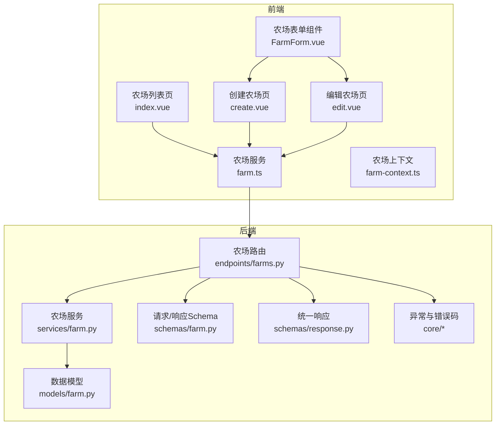
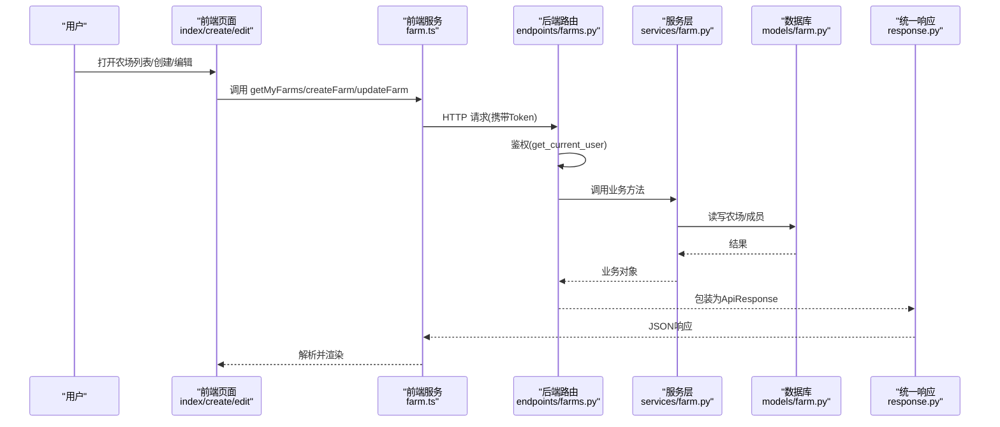
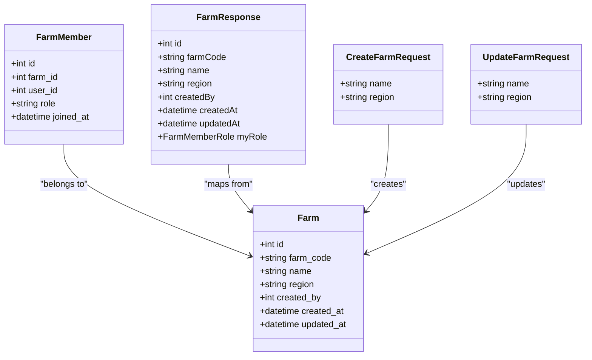
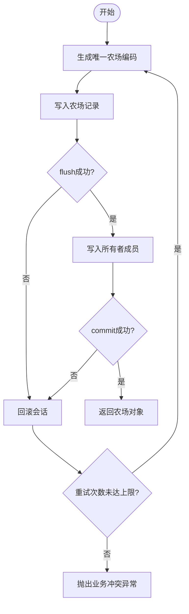
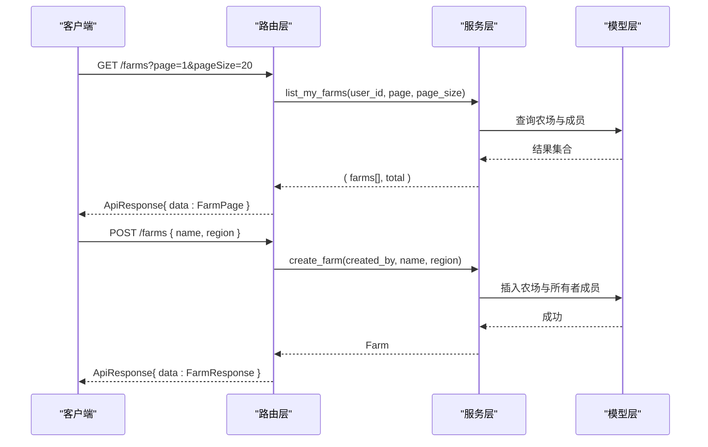
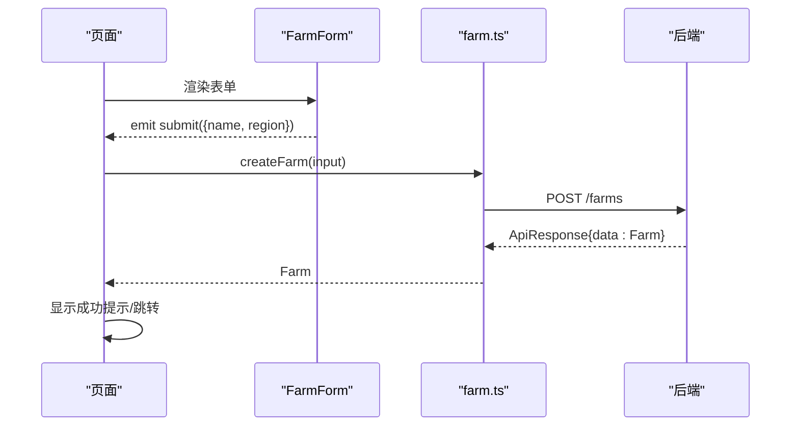
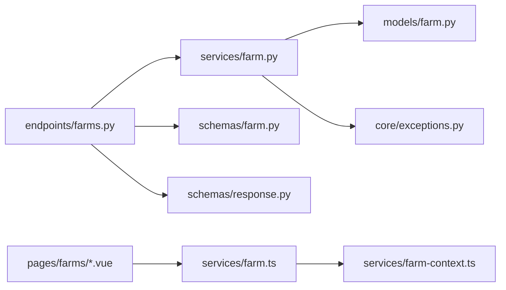

# 农场CRUD操作

<cite>
**本文引用的文件**
- [apps/api/app/models/farm.py](file://apps/api/app/models/farm.py)
- [apps/api/app/schemas/farm.py](file://apps/api/app/schemas/farm.py)
- [apps/api/app/services/farm.py](file://apps/api/app/services/farm.py)
- [apps/api/app/api/v1/endpoints/farms.py](file://apps/api/app/api/v1/endpoints/farms.py)
- [apps/api/app/core/error_codes.py](file://apps/api/app/core/error_codes.py)
- [apps/api/app/core/exceptions.py](file://apps/api/app/core/exceptions.py)
- [apps/api/app/schemas/response.py](file://apps/api/app/schemas/response.py)
- [apps/miniapp/src/pages/farms/index.vue](file://apps/miniapp/src/pages/farms/index.vue)
- [apps/miniapp/src/pages/farms/create.vue](file://apps/miniapp/src/pages/farms/create.vue)
- [apps/miniapp/src/pages/farms/edit.vue](file://apps/miniapp/src/pages/farms/edit.vue)
- [apps/miniapp/src/components/FarmForm.vue](file://apps/miniapp/src/components/FarmForm.vue)
- [apps/miniapp/src/services/farm.ts](file://apps/miniapp/src/services/farm.ts)
- [apps/miniapp/src/services/farm-context.ts](file://apps/miniapp/src/services/farm-context.ts)
</cite>

## 目录
1. [简介](#简介)
2. [项目结构](#项目结构)
3. [核心组件](#核心组件)
4. [架构总览](#架构总览)
5. [详细组件分析](#详细组件分析)
6. [依赖关系分析](#依赖关系分析)
7. [性能考虑](#性能考虑)
8. [故障排查指南](#故障排查指南)
9. [结论](#结论)
10. [附录](#附录)

## 简介
本文件围绕“农场”实体的完整CRUD能力，系统梳理后端API端点、数据模型、服务层业务逻辑与前端页面实现。内容覆盖：
- 后端：农场创建、查询、更新、删除（成员管理）的接口设计、校验规则、权限控制与错误处理。
- 前端：农场列表展示、创建表单、编辑界面等交互流程与用户体验优化。
- 数据验证：前后端一致的字段校验与约束。
- 错误处理：统一响应格式、异常分类与用户提示策略。

## 项目结构
本项目采用前后端分离架构：
- 后端（FastAPI + SQLAlchemy）：提供RESTful API，包含路由层、服务层、数据模型与Schema定义。
- 前端（uni-app + Vue）：提供农场列表、创建与编辑页面，封装HTTP请求与上下文状态管理。

图表来源
- [apps/miniapp/src/pages/farms/index.vue:1-233](file://apps/miniapp/src/pages/farms/index.vue#L1-L233)
- [apps/miniapp/src/pages/farms/create.vue:1-77](file://apps/miniapp/src/pages/farms/create.vue#L1-L77)
- [apps/miniapp/src/pages/farms/edit.vue:1-150](file://apps/miniapp/src/pages/farms/edit.vue#L1-L150)
- [apps/miniapp/src/components/FarmForm.vue:1-150](file://apps/miniapp/src/components/FarmForm.vue#L1-L150)
- [apps/miniapp/src/services/farm.ts:1-121](file://apps/miniapp/src/services/farm.ts#L1-L121)
- [apps/miniapp/src/services/farm-context.ts:1-94](file://apps/miniapp/src/services/farm-context.ts#L1-L94)
- [apps/api/app/api/v1/endpoints/farms.py:1-200](file://apps/api/app/api/v1/endpoints/farms.py#L1-L200)
- [apps/api/app/services/farm.py:1-264](file://apps/api/app/services/farm.py#L1-L264)
- [apps/api/app/models/farm.py:1-59](file://apps/api/app/models/farm.py#L1-L59)
- [apps/api/app/schemas/farm.py:1-166](file://apps/api/app/schemas/farm.py#L1-L166)
- [apps/api/app/schemas/response.py:1-40](file://apps/api/app/schemas/response.py#L1-L40)
- [apps/api/app/core/error_codes.py:1-13](file://apps/api/app/core/error_codes.py#L1-L13)
- [apps/api/app/core/exceptions.py:1-88](file://apps/api/app/core/exceptions.py#L1-L88)

章节来源
- [apps/api/app/api/v1/endpoints/farms.py:1-200](file://apps/api/app/api/v1/endpoints/farms.py#L1-L200)
- [apps/api/app/services/farm.py:1-264](file://apps/api/app/services/farm.py#L1-L264)
- [apps/api/app/models/farm.py:1-59](file://apps/api/app/models/farm.py#L1-L59)
- [apps/api/app/schemas/farm.py:1-166](file://apps/api/app/schemas/farm.py#L1-L166)
- [apps/miniapp/src/pages/farms/index.vue:1-233](file://apps/miniapp/src/pages/farms/index.vue#L1-L233)
- [apps/miniapp/src/pages/farms/create.vue:1-77](file://apps/miniapp/src/pages/farms/create.vue#L1-L77)
- [apps/miniapp/src/pages/farms/edit.vue:1-150](file://apps/miniapp/src/pages/farms/edit.vue#L1-L150)
- [apps/miniapp/src/components/FarmForm.vue:1-150](file://apps/miniapp/src/components/FarmForm.vue#L1-L150)
- [apps/miniapp/src/services/farm.ts:1-121](file://apps/miniapp/src/services/farm.ts#L1-L121)
- [apps/miniapp/src/services/farm-context.ts:1-94](file://apps/miniapp/src/services/farm-context.ts#L1-L94)

## 核心组件
- 数据模型
  - 农场实体：包含唯一农场编码、名称、区域、创建人及时间戳。
  - 农场成员：记录用户与农场的关联角色（所有者、管理员、成员），并保证唯一性约束。
- 请求/响应Schema
  - 创建/更新农场请求体，带长度与必填校验。
  - 农场分页响应、成员分页响应等。
- 服务层
  - 创建农场：生成唯一农场编码，事务内写入农场与初始所有者成员。
  - 查询我的农场：按用户维度分页返回可访问农场及其角色。
  - 更新农场：仅所有者可编辑农场信息。
  - 成员管理：添加、修改角色、移除、退出农场，含权限与一致性校验。
- 路由层
  - RESTful端点：GET /farms, POST /farms, GET /farms/:id, PATCH /farms/:id, 以及成员相关端点。
- 前端
  - 列表页：加载、空态、错误重试、选择当前农场。
  - 创建页：表单提交、成功反馈、自动切换当前农场。
  - 编辑页：加载详情、保存修改、未保存变更保护。
  - 表单组件：复用输入、聚焦样式、双向绑定与变更事件。
  - 服务与上下文：统一HTTP调用、当前农场持久化与同步。

章节来源
- [apps/api/app/models/farm.py:18-59](file://apps/api/app/models/farm.py#L18-L59)
- [apps/api/app/schemas/farm.py:14-42](file://apps/api/app/schemas/farm.py#L14-L42)
- [apps/api/app/services/farm.py:33-155](file://apps/api/app/services/farm.py#L33-L155)
- [apps/api/app/api/v1/endpoints/farms.py:58-118](file://apps/api/app/api/v1/endpoints/farms.py#L58-L118)
- [apps/miniapp/src/pages/farms/index.vue:63-114](file://apps/miniapp/src/pages/farms/index.vue#L63-L114)
- [apps/miniapp/src/pages/farms/create.vue:13-56](file://apps/miniapp/src/pages/farms/create.vue#L13-L56)
- [apps/miniapp/src/pages/farms/edit.vue:38-121](file://apps/miniapp/src/pages/farms/edit.vue#L38-L121)
- [apps/miniapp/src/components/FarmForm.vue:53-103](file://apps/miniapp/src/components/FarmForm.vue#L53-L103)
- [apps/miniapp/src/services/farm.ts:48-72](file://apps/miniapp/src/services/farm.ts#L48-L72)
- [apps/miniapp/src/services/farm-context.ts:41-94](file://apps/miniapp/src/services/farm-context.ts#L41-L94)

## 架构总览
下图展示了从前端到后端的完整调用链，包括认证、路由、服务、数据库与统一响应。

图表来源
- [apps/miniapp/src/pages/farms/index.vue:81-97](file://apps/miniapp/src/pages/farms/index.vue#L81-L97)
- [apps/miniapp/src/pages/farms/create.vue:33-56](file://apps/miniapp/src/pages/farms/create.vue#L33-L56)
- [apps/miniapp/src/pages/farms/edit.vue:65-117](file://apps/miniapp/src/pages/farms/edit.vue#L65-L117)
- [apps/miniapp/src/services/farm.ts:48-72](file://apps/miniapp/src/services/farm.ts#L48-L72)
- [apps/api/app/api/v1/endpoints/farms.py:58-118](file://apps/api/app/api/v1/endpoints/farms.py#L58-L118)
- [apps/api/app/services/farm.py:33-155](file://apps/api/app/services/farm.py#L33-L155)
- [apps/api/app/models/farm.py:18-59](file://apps/api/app/models/farm.py#L18-L59)
- [apps/api/app/schemas/response.py:16-39](file://apps/api/app/schemas/response.py#L16-L39)

## 详细组件分析

### 数据模型与Schema
- 农场模型
  - 主键自增ID、唯一农场编码、名称、可选区域、创建人与时间戳。
- 农场成员模型
  - 唯一约束(farm_id, user_id)，角色枚举，加入时间。
- 请求/响应Schema
  - 创建农场：name必填且长度限制，region可选。
  - 更新农场：name/region可选但满足最小长度。
  - 农场响应：包含myRole用于前端权限判断。
  - 成员相关：手机号校验、角色枚举、分页结构。

图表来源
- [apps/api/app/models/farm.py:18-59](file://apps/api/app/models/farm.py#L18-L59)
- [apps/api/app/schemas/farm.py:14-42](file://apps/api/app/schemas/farm.py#L14-L42)

章节来源
- [apps/api/app/models/farm.py:18-59](file://apps/api/app/models/farm.py#L18-L59)
- [apps/api/app/schemas/farm.py:14-42](file://apps/api/app/schemas/farm.py#L14-L42)

### 服务层业务逻辑
- 创建农场
  - 生成唯一农场编码，在事务中写入农场与初始所有者成员；冲突时重试直至成功或达到上限。
- 查询我的农场
  - 基于用户维度聚合农场与其角色，支持分页。
- 更新农场
  - 锁定农场与成员行，仅允许所有者编辑；选择性更新name/region。
- 成员管理
  - 添加成员：校验手机号、查找用户、避免重复加入。
  - 修改角色：禁止越权操作，确保至少保留一个所有者。
  - 移除成员/退出农场：防止最后一个所有者被移除。

图表来源
- [apps/api/app/services/farm.py:33-54](file://apps/api/app/services/farm.py#L33-L54)

章节来源
- [apps/api/app/services/farm.py:33-155](file://apps/api/app/services/farm.py#L33-L155)

### 后端API端点设计
- 列表与创建
  - GET /farms：分页获取当前用户可访问的农场及其角色。
  - POST /farms：创建农场，返回新农场与所有者角色。
- 详情与更新
  - GET /farms/:id：校验用户是否属于该农场，返回农场信息与角色。
  - PATCH /farms/:id：仅所有者可更新农场信息。
- 成员管理
  - GET /farms/:id/members：分页列出成员。
  - POST /farms/:id/members：添加成员（手机号+角色）。
  - PATCH /farms/:id/members/:member_id：修改成员角色。
  - DELETE /farms/:id/members/me：退出农场。
  - DELETE /farms/:id/members/:member_id：移除成员。

图表来源
- [apps/api/app/api/v1/endpoints/farms.py:58-118](file://apps/api/app/api/v1/endpoints/farms.py#L58-L118)
- [apps/api/app/services/farm.py:33-155](file://apps/api/app/services/farm.py#L33-L155)
- [apps/api/app/models/farm.py:18-59](file://apps/api/app/models/farm.py#L18-L59)

章节来源
- [apps/api/app/api/v1/endpoints/farms.py:58-118](file://apps/api/app/api/v1/endpoints/farms.py#L58-L118)

### 前端页面与交互
- 农场列表页
  - 加载状态、错误状态与重试按钮。
  - 空态引导创建农场。
  - 点击条目选择当前农场并返回上一页。
- 创建农场页
  - 使用FarmForm组件收集name/region。
  - 提交成功后提示并跳转列表，必要时自动设置当前农场。
- 编辑农场页
  - 加载当前农场信息，支持保存修改。
  - 未保存变更保护，避免误离开。
- 表单组件
  - 输入框聚焦高亮、清空、最大长度限制。
  - 通过事件将变更通知父组件。
- 服务与上下文
  - 统一HTTP封装，类型化请求/响应。
  - 当前农场持久化存储，列表刷新时智能恢复或回退。

图表来源
- [apps/miniapp/src/pages/farms/create.vue:33-56](file://apps/miniapp/src/pages/farms/create.vue#L33-L56)
- [apps/miniapp/src/components/FarmForm.vue:91-103](file://apps/miniapp/src/components/FarmForm.vue#L91-L103)
- [apps/miniapp/src/services/farm.ts:54-60](file://apps/miniapp/src/services/farm.ts#L54-L60)
- [apps/api/app/api/v1/endpoints/farms.py:78-90](file://apps/api/app/api/v1/endpoints/farms.py#L78-L90)

章节来源
- [apps/miniapp/src/pages/farms/index.vue:63-114](file://apps/miniapp/src/pages/farms/index.vue#L63-L114)
- [apps/miniapp/src/pages/farms/create.vue:13-56](file://apps/miniapp/src/pages/farms/create.vue#L13-L56)
- [apps/miniapp/src/pages/farms/edit.vue:38-121](file://apps/miniapp/src/pages/farms/edit.vue#L38-L121)
- [apps/miniapp/src/components/FarmForm.vue:53-103](file://apps/miniapp/src/components/FarmForm.vue#L53-L103)
- [apps/miniapp/src/services/farm.ts:48-72](file://apps/miniapp/src/services/farm.ts#L48-L72)
- [apps/miniapp/src/services/farm-context.ts:41-94](file://apps/miniapp/src/services/farm-context.ts#L41-L94)

### 数据验证规则
- 后端
  - 名称：必填，长度1-100。
  - 区域：可选，长度不超过100。
  - 成员手机号：固定11位，匹配中国大陆手机号格式。
  - 边界坐标：仅支持GCJ02坐标系（在相关Schema中校验）。
- 前端
  - 表单输入限制最大长度，提交前进行非空校验。
  - 对网络错误与未授权进行分支处理。

章节来源
- [apps/api/app/schemas/farm.py:14-22](file://apps/api/app/schemas/farm.py#L14-L22)
- [apps/api/app/schemas/farm.py:44-56](file://apps/api/app/schemas/farm.py#L44-L56)
- [apps/miniapp/src/pages/farms/create.vue:33-56](file://apps/miniapp/src/pages/farms/create.vue#L33-L56)
- [apps/miniapp/src/pages/farms/edit.vue:88-117](file://apps/miniapp/src/pages/farms/edit.vue#L88-L117)

### 错误处理机制
- 后端
  - 统一异常处理器：应用异常、请求校验异常、HTTP异常、未捕获异常均返回标准ApiResponse。
  - 错误码枚举：如NOT_FOUND、FORBIDDEN、BUSINESS_CONFLICT、VALIDATION_ERROR等。
- 前端
  - 区分401未授权：清除令牌并重定向登录。
  - 其他错误：显示友好提示并提供重试入口。

章节来源
- [apps/api/app/core/exceptions.py:35-88](file://apps/api/app/core/exceptions.py#L35-L88)
- [apps/api/app/core/error_codes.py:4-13](file://apps/api/app/core/error_codes.py#L4-L13)
- [apps/api/app/schemas/response.py:16-39](file://apps/api/app/schemas/response.py#L16-L39)
- [apps/miniapp/src/pages/farms/index.vue:76-97](file://apps/miniapp/src/pages/farms/index.vue#L76-L97)
- [apps/miniapp/src/pages/farms/create.vue:28-56](file://apps/miniapp/src/pages/farms/create.vue#L28-L56)
- [apps/miniapp/src/pages/farms/edit.vue:60-117](file://apps/miniapp/src/pages/farms/edit.vue#L60-L117)

### 用户体验优化方案
- 列表页
  - 加载中占位、失败重试、空态引导。
  - 当前农场标识，便于快速识别。
- 创建/编辑
  - 表单聚焦高亮、输入长度限制、提交中禁用按钮。
  - 成功后短暂延迟跳转，提升感知。
- 上下文
  - 当前农场本地持久化，刷新时智能恢复或回退。
  - 未保存变更保护，避免意外丢失编辑内容。

章节来源
- [apps/miniapp/src/pages/farms/index.vue:4-57](file://apps/miniapp/src/pages/farms/index.vue#L4-L57)
- [apps/miniapp/src/pages/farms/create.vue:3-10](file://apps/miniapp/src/pages/farms/create.vue#L3-L10)
- [apps/miniapp/src/pages/farms/edit.vue:3-35](file://apps/miniapp/src/pages/farms/edit.vue#L3-L35)
- [apps/miniapp/src/components/FarmForm.vue:5-49](file://apps/miniapp/src/components/FarmForm.vue#L5-L49)
- [apps/miniapp/src/services/farm-context.ts:16-62](file://apps/miniapp/src/services/farm-context.ts#L16-L62)

## 依赖关系分析
- 模块耦合
  - 路由层依赖服务层与Schema，服务层依赖模型与异常工具。
  - 前端页面依赖服务层与上下文，服务层依赖统一HTTP封装。
- 外部依赖
  - FastAPI、SQLAlchemy异步会话、Pydantic校验。
  - uni-app生态组件与存储API。

图表来源
- [apps/api/app/api/v1/endpoints/farms.py:1-200](file://apps/api/app/api/v1/endpoints/farms.py#L1-L200)
- [apps/api/app/services/farm.py:1-264](file://apps/api/app/services/farm.py#L1-L264)
- [apps/api/app/models/farm.py:1-59](file://apps/api/app/models/farm.py#L1-L59)
- [apps/api/app/schemas/farm.py:1-166](file://apps/api/app/schemas/farm.py#L1-L166)
- [apps/api/app/schemas/response.py:1-40](file://apps/api/app/schemas/response.py#L1-L40)
- [apps/api/app/core/exceptions.py:1-88](file://apps/api/app/core/exceptions.py#L1-L88)
- [apps/miniapp/src/pages/farms/index.vue:1-233](file://apps/miniapp/src/pages/farms/index.vue#L1-L233)
- [apps/miniapp/src/pages/farms/create.vue:1-77](file://apps/miniapp/src/pages/farms/create.vue#L1-L77)
- [apps/miniapp/src/pages/farms/edit.vue:1-150](file://apps/miniapp/src/pages/farms/edit.vue#L1-L150)
- [apps/miniapp/src/services/farm.ts:1-121](file://apps/miniapp/src/services/farm.ts#L1-L121)
- [apps/miniapp/src/services/farm-context.ts:1-94](file://apps/miniapp/src/services/farm-context.ts#L1-L94)

章节来源
- [apps/api/app/api/v1/endpoints/farms.py:1-200](file://apps/api/app/api/v1/endpoints/farms.py#L1-L200)
- [apps/api/app/services/farm.py:1-264](file://apps/api/app/services/farm.py#L1-L264)
- [apps/miniapp/src/services/farm.ts:1-121](file://apps/miniapp/src/services/farm.ts#L1-L121)
- [apps/miniapp/src/services/farm-context.ts:1-94](file://apps/miniapp/src/services/farm-context.ts#L1-L94)

## 性能考虑
- 后端
  - 使用with_for_update锁定行，避免并发下成员管理的竞态条件。
  - 分页查询减少数据传输量，提高列表加载速度。
  - 唯一编码生成带重试，降低冲突概率。
- 前端
  - 列表加载时显示骨架/加载态，提升感知性能。
  - 当前农场本地缓存，减少重复请求。
  - 表单输入限制与即时校验，降低无效请求。

[本节为通用指导，不直接分析具体文件]

## 故障排查指南
- 401未授权
  - 前端检测到401时清除令牌并跳转登录。
- 404未找到
  - 检查农场ID是否正确，用户是否已加入该农场。
- 403禁止操作
  - 检查当前用户角色是否为所有者或管理员，尝试操作是否越权。
- 409业务冲突
  - 农场编码冲突（极少见）、重复添加成员、试图移除最后一个所有者等。
- 422校验失败
  - 检查请求体字段是否符合Schema约束（如名称长度、手机号格式）。

章节来源
- [apps/api/app/core/exceptions.py:35-88](file://apps/api/app/core/exceptions.py#L35-L88)
- [apps/api/app/core/error_codes.py:4-13](file://apps/api/app/core/error_codes.py#L4-L13)
- [apps/miniapp/src/pages/farms/index.vue:76-97](file://apps/miniapp/src/pages/farms/index.vue#L76-L97)
- [apps/miniapp/src/pages/farms/create.vue:28-56](file://apps/miniapp/src/pages/farms/create.vue#L28-L56)
- [apps/miniapp/src/pages/farms/edit.vue:60-117](file://apps/miniapp/src/pages/farms/edit.vue#L60-L117)

## 结论
本方案实现了农场实体的完整CRUD能力，涵盖后端API、数据模型、服务层业务逻辑与前端页面交互。通过严格的校验与权限控制、统一的错误处理与友好的用户体验设计，确保了系统的健壮性与易用性。后续可扩展更多农场相关功能（如地块、生产、收获等）并保持现有架构的一致性。

[本节为总结，不直接分析具体文件]

## 附录
- API端点速查
  - GET /farms：获取我的农场（分页）
  - POST /farms：创建农场
  - GET /farms/:id：获取农场详情
  - PATCH /farms/:id：更新农场信息
  - GET /farms/:id/members：获取成员列表（分页）
  - POST /farms/:id/members：添加成员
  - PATCH /farms/:id/members/:member_id：修改成员角色
  - DELETE /farms/:id/members/me：退出农场
  - DELETE /farms/:id/members/:member_id：移除成员

章节来源
- [apps/api/app/api/v1/endpoints/farms.py:58-200](file://apps/api/app/api/v1/endpoints/farms.py#L58-L200)