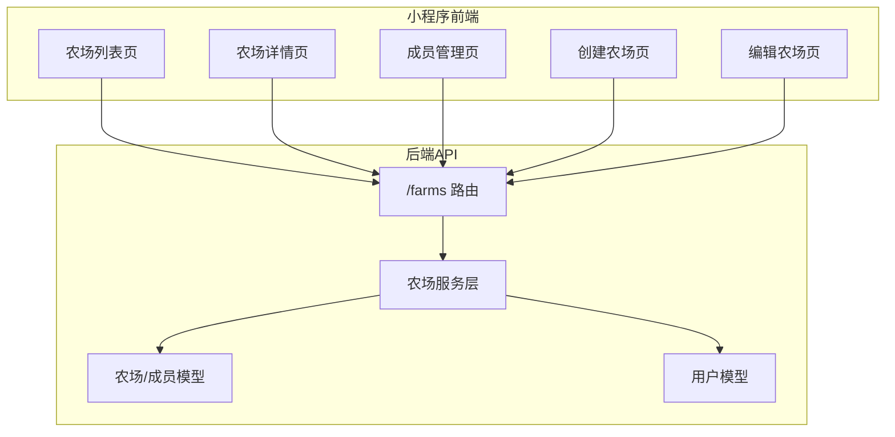
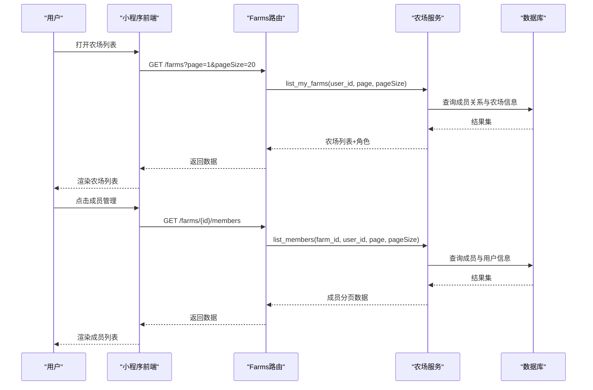
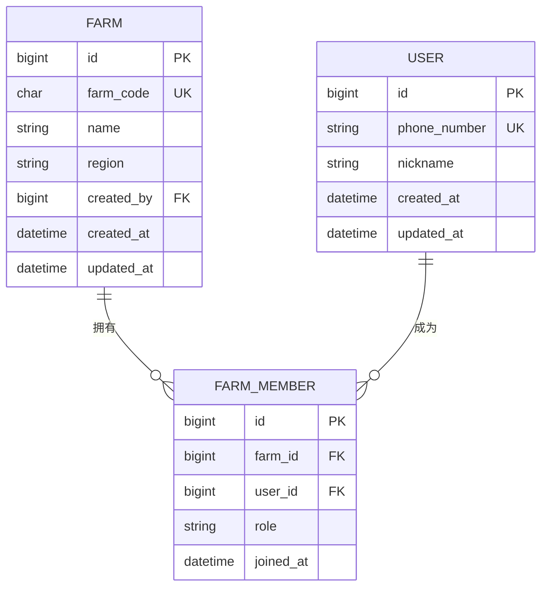
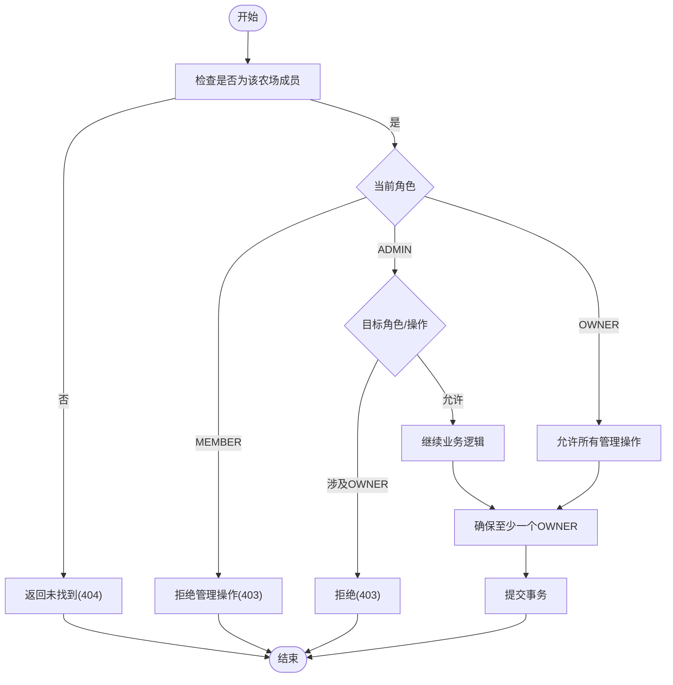
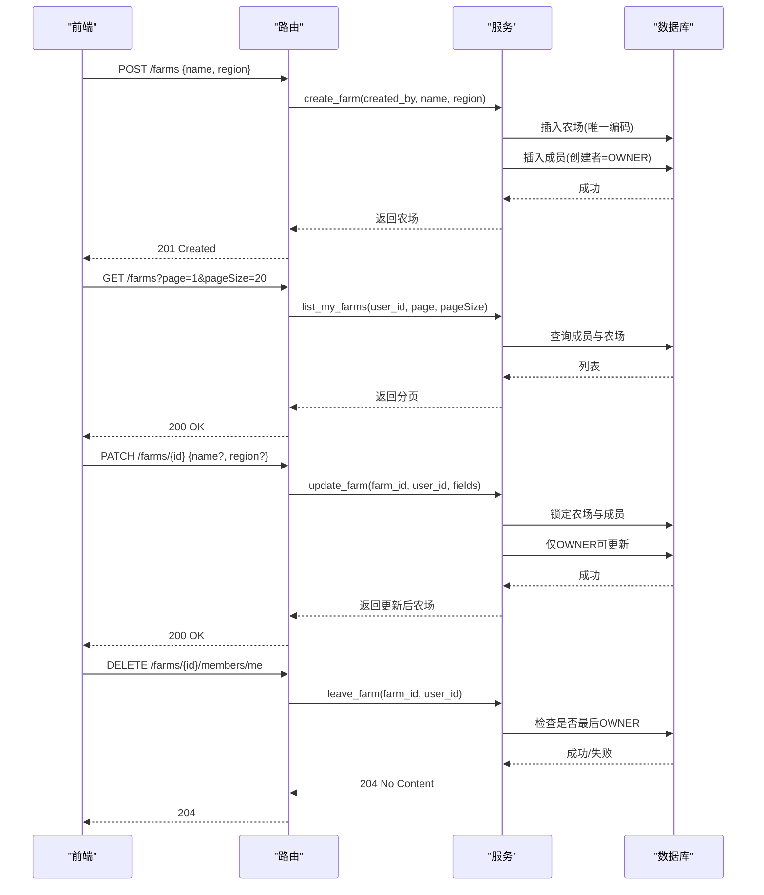
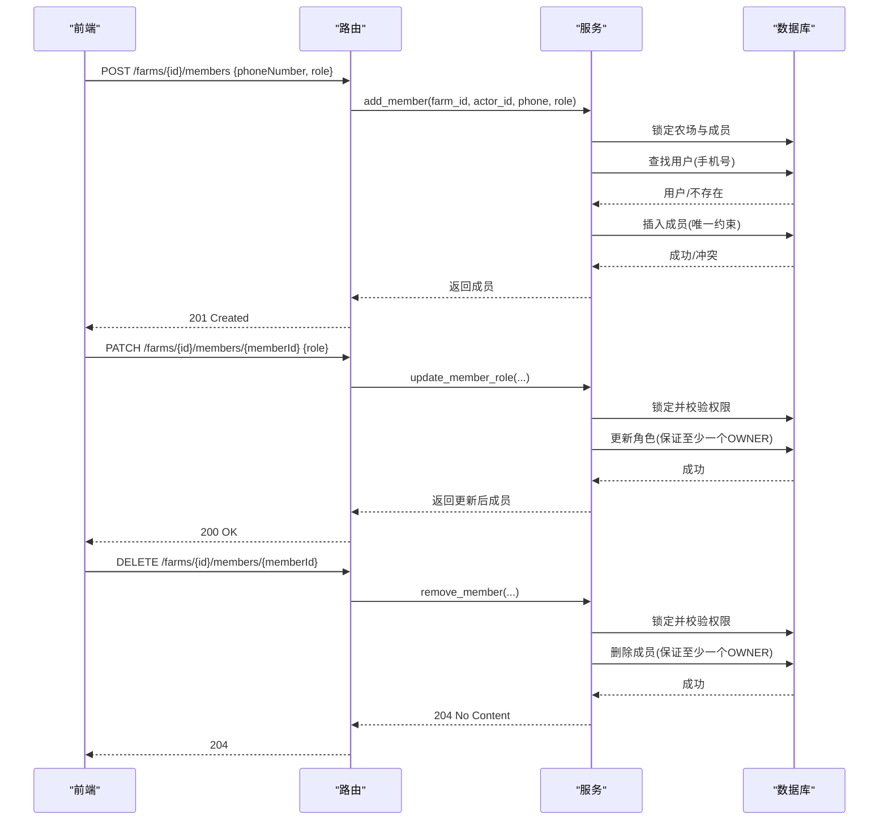
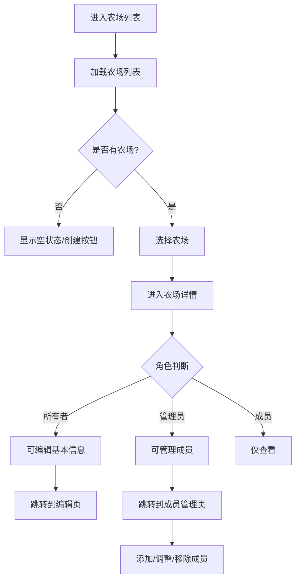
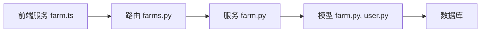

# 农场协作管理

<cite>
**本文引用的文件**
- [apps/api/app/models/farm.py](file://apps/api/app/models/farm.py)
- [apps/api/app/schemas/farm.py](file://apps/api/app/schemas/farm.py)
- [apps/api/app/services/farm.py](file://apps/api/app/services/farm.py)
- [apps/api/app/api/v1/endpoints/farms.py](file://apps/api/app/api/v1/endpoints/farms.py)
- [apps/api/app/models/user.py](file://apps/api/app/models/user.py)
- [apps/miniapp/src/pages/farms/index.vue](file://apps/miniapp/src/pages/farms/index.vue)
- [apps/miniapp/src/pages/farms/detail.vue](file://apps/miniapp/src/pages/farms/detail.vue)
- [apps/miniapp/src/pages/farms/members.vue](file://apps/miniapp/src/pages/farms/members.vue)
- [apps/miniapp/src/pages/farms/create.vue](file://apps/miniapp/src/pages/farms/create.vue)
- [apps/miniapp/src/pages/farms/edit.vue](file://apps/miniapp/src/pages/farms/edit.vue)
- [apps/miniapp/src/services/farm.ts](file://apps/miniapp/src/services/farm.ts)
</cite>

## 目录
1. [简介](#简介)
2. [项目结构](#项目结构)
3. [核心组件](#核心组件)
4. [架构总览](#架构总览)
5. [详细组件分析](#详细组件分析)
6. [依赖关系分析](#依赖关系分析)
7. [性能考虑](#性能考虑)
8. [故障排查指南](#故障排查指南)
9. [结论](#结论)
10. [附录：API与数据模型速查](#附录api与数据模型速查)

## 简介
本模块提供“农场”的协作管理能力，包括农场的创建、查看、编辑、退出；成员邀请与管理（添加、移除、角色调整）；以及基于角色的权限控制。前端提供农场列表、详情、成员管理等页面，后端通过服务层进行业务校验与事务处理，确保数据一致性与安全性。

## 项目结构
- 后端（FastAPI + SQLAlchemy）
  - 模型：农场与成员、用户
  - Schema：请求/响应结构定义
  - 服务：农场与成员的业务逻辑、权限校验、并发安全
  - 路由：RESTful API 暴露
- 前端（uni-app + Vue）
  - 页面：农场列表、详情、创建/编辑、成员管理
  - 服务：HTTP 封装与接口调用

图表来源
- [apps/api/app/api/v1/endpoints/farms.py:58-200](file://apps/api/app/api/v1/endpoints/farms.py#L58-L200)
- [apps/api/app/services/farm.py:33-264](file://apps/api/app/services/farm.py#L33-L264)
- [apps/api/app/models/farm.py:18-59](file://apps/api/app/models/farm.py#L18-L59)
- [apps/api/app/models/user.py:15-28](file://apps/api/app/models/user.py#L15-L28)

章节来源
- [apps/api/app/api/v1/endpoints/farms.py:58-200](file://apps/api/app/api/v1/endpoints/farms.py#L58-L200)
- [apps/api/app/services/farm.py:33-264](file://apps/api/app/services/farm.py#L33-L264)
- [apps/api/app/models/farm.py:18-59](file://apps/api/app/models/farm.py#L18-L59)
- [apps/api/app/models/user.py:15-28](file://apps/api/app/models/user.py#L15-L28)

## 核心组件
- 数据模型
  - 农场：包含唯一编码、名称、地区、创建者、时间戳等
  - 农场成员：关联农场与用户，记录角色与加入时间
  - 用户：手机号、昵称、时间戳
- 请求/响应模式
  - 农场CRUD：创建、分页查询、详情、更新
  - 成员管理：分页查询、添加、修改角色、删除、退出
- 服务层
  - 事务性创建农场并自动授予创建者为所有者
  - 并发安全的成员操作（行级锁）
  - 严格的角色权限校验（所有者/管理员/成员）
- 前端页面
  - 列表：展示所属农场及当前角色
  - 详情：基本信息、成员管理入口、危险操作（退出）
  - 成员：添加成员、调整角色、移除成员
  - 创建/编辑：表单提交与保存

章节来源
- [apps/api/app/models/farm.py:18-59](file://apps/api/app/models/farm.py#L18-L59)
- [apps/api/app/schemas/farm.py:14-73](file://apps/api/app/schemas/farm.py#L14-L73)
- [apps/api/app/services/farm.py:33-264](file://apps/api/app/services/farm.py#L33-L264)
- [apps/miniapp/src/pages/farms/index.vue:63-115](file://apps/miniapp/src/pages/farms/index.vue#L63-L115)
- [apps/miniapp/src/pages/farms/detail.vue:82-192](file://apps/miniapp/src/pages/farms/detail.vue#L82-L192)
- [apps/miniapp/src/pages/farms/members.vue:104-283](file://apps/miniapp/src/pages/farms/members.vue#L104-L283)
- [apps/miniapp/src/pages/farms/create.vue:13-57](file://apps/miniapp/src/pages/farms/create.vue#L13-L57)
- [apps/miniapp/src/pages/farms/edit.vue:38-122](file://apps/miniapp/src/pages/farms/edit.vue#L38-L122)
- [apps/miniapp/src/services/farm.ts:48-121](file://apps/miniapp/src/services/farm.ts#L48-L121)

## 架构总览
农场协作管理的端到端流程如下：
- 前端发起请求（列表、详情、成员管理）
- 路由层解析参数并调用服务层
- 服务层执行权限校验、数据库事务、并发控制
- 返回统一响应格式给前端渲染

图表来源
- [apps/api/app/api/v1/endpoints/farms.py:58-139](file://apps/api/app/api/v1/endpoints/farms.py#L58-L139)
- [apps/api/app/services/farm.py:115-178](file://apps/api/app/services/farm.py#L115-L178)

## 详细组件分析

### 数据模型与关系
- 农场（Farm）
  - 主键ID、唯一农场编码、名称、地区、创建者ID、时间戳
- 农场成员（FarmMember）
  - 主键ID、农场ID、用户ID、角色、加入时间
  - 唯一约束：同一农场内同一用户仅一条成员记录
- 用户（User）
  - 主键ID、手机号、昵称、时间戳

图表来源
- [apps/api/app/models/farm.py:18-59](file://apps/api/app/models/farm.py#L18-L59)
- [apps/api/app/models/user.py:15-28](file://apps/api/app/models/user.py#L15-L28)

章节来源
- [apps/api/app/models/farm.py:18-59](file://apps/api/app/models/farm.py#L18-L59)
- [apps/api/app/models/user.py:15-28](file://apps/api/app/models/user.py#L15-L28)

### 权限与角色控制
- 角色定义
  - 所有者（OWNER）：可编辑农场信息、管理成员、转移所有权（需保证至少一个所有者）
  - 管理员（ADMIN）：可管理成员（不能操作或创建所有者）、不可编辑农场信息
  - 成员（MEMBER）：仅可查看与参与协作，无管理权限
- 关键校验
  - 非成员访问农场或成员相关资源视为不存在（防越权）
  - 禁止自我操作（如自己移除自己应使用退出接口）
  - 管理员不能对所有者进行操作或创建所有者
  - 始终保留至少一个所有者
- 并发安全
  - 使用行级锁锁定农场与成员表，避免竞态条件

图表来源
- [apps/api/app/services/farm.py:73-113](file://apps/api/app/services/farm.py#L73-L113)
- [apps/api/app/services/farm.py:210-231](file://apps/api/app/services/farm.py#L210-L231)
- [apps/api/app/services/farm.py:234-264](file://apps/api/app/services/farm.py#L234-L264)

章节来源
- [apps/api/app/services/farm.py:73-113](file://apps/api/app/services/farm.py#L73-L113)
- [apps/api/app/services/farm.py:210-231](file://apps/api/app/services/farm.py#L210-L231)
- [apps/api/app/services/farm.py:234-264](file://apps/api/app/services/farm.py#L234-L264)

### 农场CRUD流程
- 创建农场
  - 生成唯一农场编码（重试机制）
  - 在事务中插入农场并自动将创建者设为所有者
- 查询农场列表
  - 按用户已加入的农场分页返回，附带当前角色
- 获取农场详情
  - 验证成员身份后返回农场信息与当前角色
- 更新农场信息
  - 仅所有者可编辑名称与地区
- 退出农场
  - 若为最后一个所有者则不允许退出

图表来源
- [apps/api/app/services/farm.py:33-54](file://apps/api/app/services/farm.py#L33-L54)
- [apps/api/app/services/farm.py:115-156](file://apps/api/app/services/farm.py#L115-L156)
- [apps/api/app/services/farm.py:255-264](file://apps/api/app/services/farm.py#L255-L264)
- [apps/api/app/api/v1/endpoints/farms.py:78-118](file://apps/api/app/api/v1/endpoints/farms.py#L78-L118)
- [apps/api/app/api/v1/endpoints/farms.py:181-188](file://apps/api/app/api/v1/endpoints/farms.py#L181-L188)

章节来源
- [apps/api/app/services/farm.py:33-54](file://apps/api/app/services/farm.py#L33-L54)
- [apps/api/app/services/farm.py:115-156](file://apps/api/app/services/farm.py#L115-L156)
- [apps/api/app/services/farm.py:255-264](file://apps/api/app/services/farm.py#L255-L264)
- [apps/api/app/api/v1/endpoints/farms.py:78-118](file://apps/api/app/api/v1/endpoints/farms.py#L78-L118)
- [apps/api/app/api/v1/endpoints/farms.py:181-188](file://apps/api/app/api/v1/endpoints/farms.py#L181-L188)

### 成员邀请与管理
- 添加成员
  - 通过手机号精确查找已注册用户
  - 校验操作者权限（所有者/管理员），管理员不可创建所有者
  - 防止重复添加（唯一约束）
- 修改成员角色
  - 所有者可调整任意成员角色（需保证至少一个所有者）
  - 管理员可调整非所有者成员的角色
- 移除成员
  - 所有者/管理员可移除成员（不能移除自己，使用退出接口）
  - 保证至少一个所有者存在
- 退出农场
  - 成员可自行退出
  - 最后一个所有者不可退出

图表来源
- [apps/api/app/services/farm.py:181-208](file://apps/api/app/services/farm.py#L181-L208)
- [apps/api/app/services/farm.py:210-231](file://apps/api/app/services/farm.py#L210-L231)
- [apps/api/app/services/farm.py:234-253](file://apps/api/app/services/farm.py#L234-L253)
- [apps/api/app/api/v1/endpoints/farms.py:142-199](file://apps/api/app/api/v1/endpoints/farms.py#L142-L199)

章节来源
- [apps/api/app/services/farm.py:181-208](file://apps/api/app/services/farm.py#L181-L208)
- [apps/api/app/services/farm.py:210-231](file://apps/api/app/services/farm.py#L210-L231)
- [apps/api/app/services/farm.py:234-253](file://apps/api/app/services/farm.py#L234-L253)
- [apps/api/app/api/v1/endpoints/farms.py:142-199](file://apps/api/app/api/v1/endpoints/farms.py#L142-L199)

### 前端页面实现
- 农场列表页
  - 加载用户所属农场列表，显示名称、角色、当前标记
  - 支持跳转到创建农场页
- 农场详情页
  - 展示农场编号、名称、角色
  - 根据角色显示编辑与成员管理入口
  - 危险操作：退出农场（最后一位所有者不可退出）
- 成员管理页
  - 展示成员列表（昵称、角色、加入时间）
  - 支持添加成员（手机号校验）、调整角色、移除成员
  - 根据当前角色控制可操作范围
- 创建/编辑农场页
  - 表单提交与保存，成功后刷新上下文并跳转

图表来源
- [apps/miniapp/src/pages/farms/index.vue:63-115](file://apps/miniapp/src/pages/farms/index.vue#L63-L115)
- [apps/miniapp/src/pages/farms/detail.vue:82-192](file://apps/miniapp/src/pages/farms/detail.vue#L82-L192)
- [apps/miniapp/src/pages/farms/members.vue:104-283](file://apps/miniapp/src/pages/farms/members.vue#L104-L283)
- [apps/miniapp/src/pages/farms/create.vue:13-57](file://apps/miniapp/src/pages/farms/create.vue#L13-L57)
- [apps/miniapp/src/pages/farms/edit.vue:38-122](file://apps/miniapp/src/pages/farms/edit.vue#L38-L122)

章节来源
- [apps/miniapp/src/pages/farms/index.vue:63-115](file://apps/miniapp/src/pages/farms/index.vue#L63-L115)
- [apps/miniapp/src/pages/farms/detail.vue:82-192](file://apps/miniapp/src/pages/farms/detail.vue#L82-L192)
- [apps/miniapp/src/pages/farms/members.vue:104-283](file://apps/miniapp/src/pages/farms/members.vue#L104-L283)
- [apps/miniapp/src/pages/farms/create.vue:13-57](file://apps/miniapp/src/pages/farms/create.vue#L13-L57)
- [apps/miniapp/src/pages/farms/edit.vue:38-122](file://apps/miniapp/src/pages/farms/edit.vue#L38-L122)

## 依赖关系分析
- 路由依赖服务层，服务层依赖模型与数据库会话
- 前端服务函数映射到后端API路径
- 权限校验集中在服务层，避免在路由层重复实现

图表来源
- [apps/miniapp/src/services/farm.ts:48-121](file://apps/miniapp/src/services/farm.ts#L48-L121)
- [apps/api/app/api/v1/endpoints/farms.py:58-200](file://apps/api/app/api/v1/endpoints/farms.py#L58-L200)
- [apps/api/app/services/farm.py:33-264](file://apps/api/app/services/farm.py#L33-L264)
- [apps/api/app/models/farm.py:18-59](file://apps/api/app/models/farm.py#L18-L59)
- [apps/api/app/models/user.py:15-28](file://apps/api/app/models/user.py#L15-L28)

章节来源
- [apps/miniapp/src/services/farm.ts:48-121](file://apps/miniapp/src/services/farm.ts#L48-L121)
- [apps/api/app/api/v1/endpoints/farms.py:58-200](file://apps/api/app/api/v1/endpoints/farms.py#L58-L200)
- [apps/api/app/services/farm.py:33-264](file://apps/api/app/services/farm.py#L33-L264)
- [apps/api/app/models/farm.py:18-59](file://apps/api/app/models/farm.py#L18-L59)
- [apps/api/app/models/user.py:15-28](file://apps/api/app/models/user.py#L15-L28)

## 性能考虑
- 分页查询：列表与成员均支持分页，减少单次数据量
- 并发安全：使用行级锁避免竞态条件，保障一致性
- 唯一编码生成：带重试机制，降低冲突概率
- 前端优化：并行请求（如详情与成员列表同时加载）提升体验

[本节为通用指导，不直接分析具体文件]

## 故障排查指南
- 401 未授权
  - 前端检测到401时清除令牌并跳转登录页
- 403 权限不足
  - 非成员尝试访问农场或成员资源
  - 普通成员尝试管理成员
  - 管理员尝试操作或创建所有者
- 404 未找到
  - 非成员访问农场详情或成员相关接口
  - 添加成员时手机号对应的用户不存在
- 409 业务冲突
  - 重复添加成员（唯一约束）
  - 试图移除最后一个所有者或将其降为非所有者
- 常见错误定位
  - 检查前端请求参数是否符合Schema定义
  - 检查当前用户角色与目标成员角色关系
  - 检查数据库唯一约束与外键约束

章节来源
- [apps/api/app/services/farm.py:21-31](file://apps/api/app/services/farm.py#L21-L31)
- [apps/api/app/services/farm.py:56-70](file://apps/api/app/services/farm.py#L56-L70)
- [apps/api/app/services/farm.py:181-208](file://apps/api/app/services/farm.py#L181-L208)
- [apps/api/app/services/farm.py:210-231](file://apps/api/app/services/farm.py#L210-L231)
- [apps/api/app/services/farm.py:234-264](file://apps/api/app/services/farm.py#L234-L264)

## 结论
农场协作管理模块通过清晰的数据模型、严格的服务层权限校验与并发安全机制，实现了健壮的农场与成员管理能力。前端页面提供了直观的操作界面，覆盖从创建、编辑到成员邀请与管理的完整工作流。建议在生产环境中持续监控异常日志，结合测试用例验证权限边界与并发场景。

[本节为总结，不直接分析具体文件]

## 附录：API与数据模型速查
- 农场API
  - 列表：GET /api/v1/farms?page=1&pageSize=20
  - 创建：POST /api/v1/farms {name, region?}
  - 详情：GET /api/v1/farms/{farmId}
  - 更新：PATCH /api/v1/farms/{farmId} {name?, region?}
- 成员API
  - 列表：GET /api/v1/farms/{farmId}/members?page=1&pageSize=20
  - 添加：POST /api/v1/farms/{farmId}/members {phoneNumber, role}
  - 修改角色：PATCH /api/v1/farms/{farmId}/members/{memberId} {role}
  - 移除：DELETE /api/v1/farms/{farmId}/members/{memberId}
  - 退出：DELETE /api/v1/farms/{farmId}/members/me
- 数据模型
  - 农场：id, farmCode, name, region, createdBy, createdAt, updatedAt
  - 成员：id, userId, nickname, role, joinedAt
  - 用户：id, phoneNumber, nickname, createdAt, updatedAt

章节来源
- [apps/api/app/api/v1/endpoints/farms.py:58-200](file://apps/api/app/api/v1/endpoints/farms.py#L58-L200)
- [apps/api/app/schemas/farm.py:14-73](file://apps/api/app/schemas/farm.py#L14-L73)
- [apps/api/app/models/farm.py:18-59](file://apps/api/app/models/farm.py#L18-L59)
- [apps/api/app/models/user.py:15-28](file://apps/api/app/models/user.py#L15-L28)