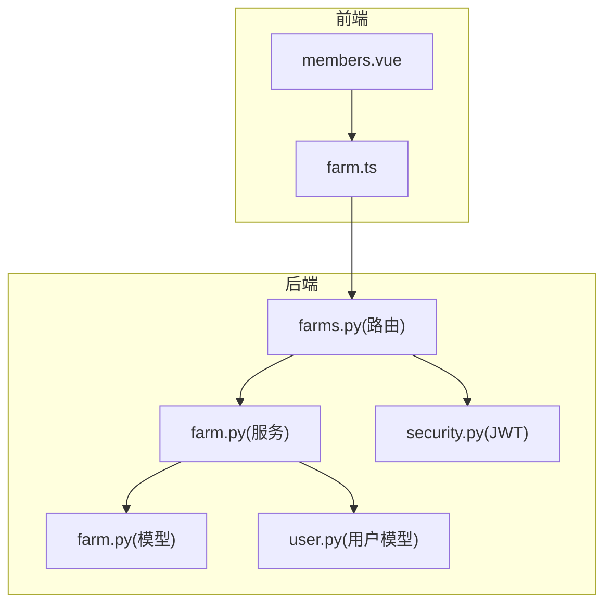
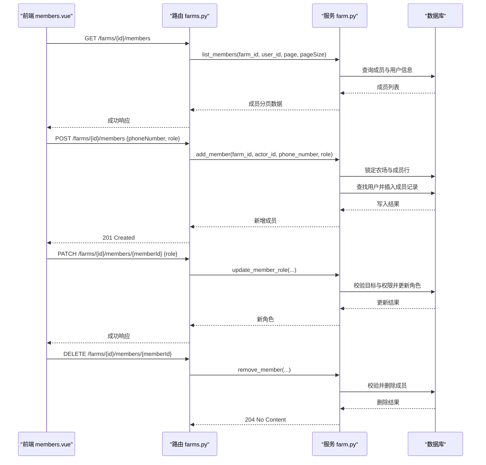
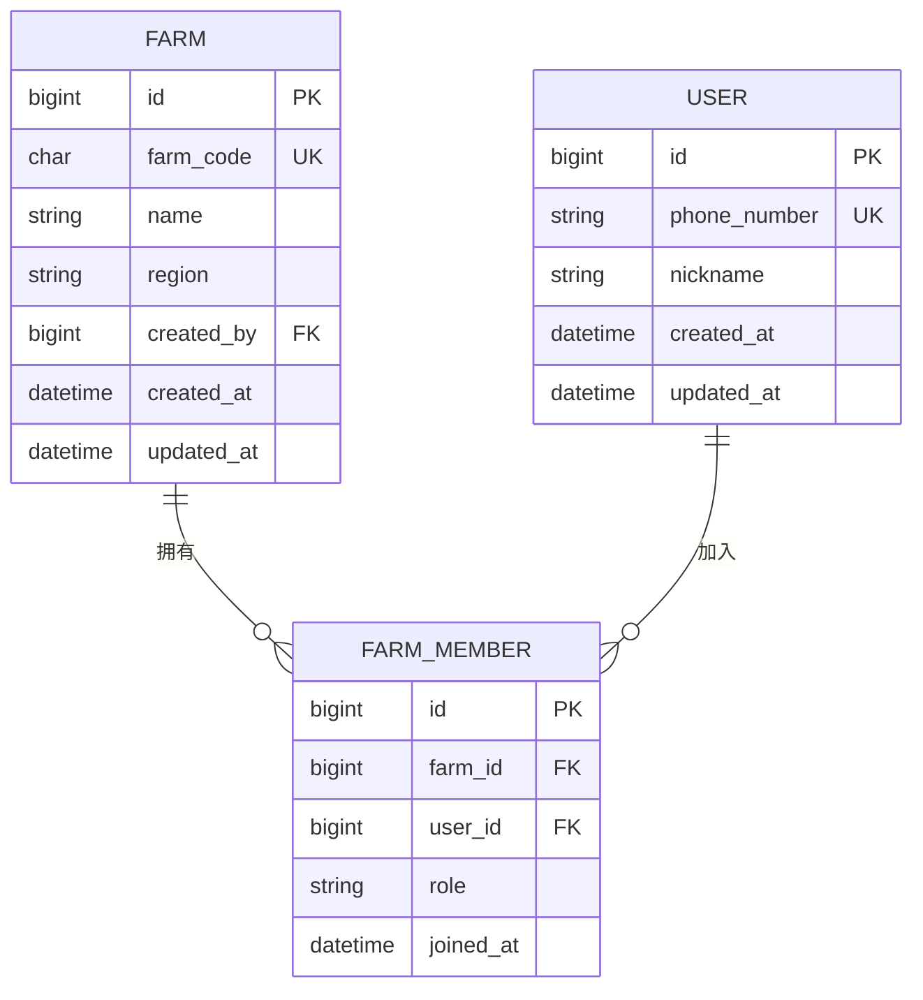
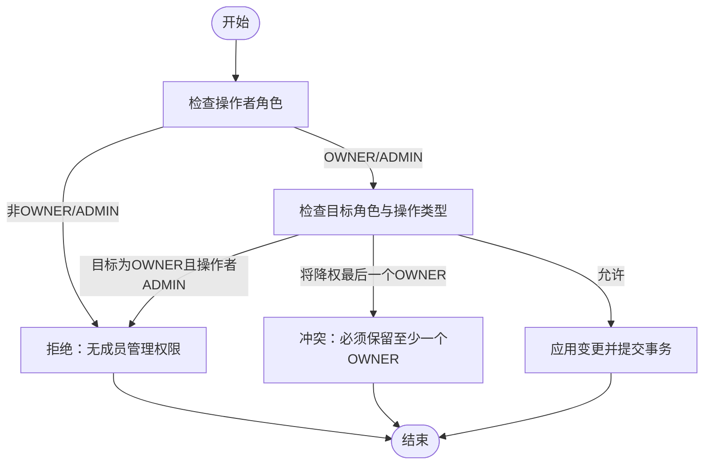
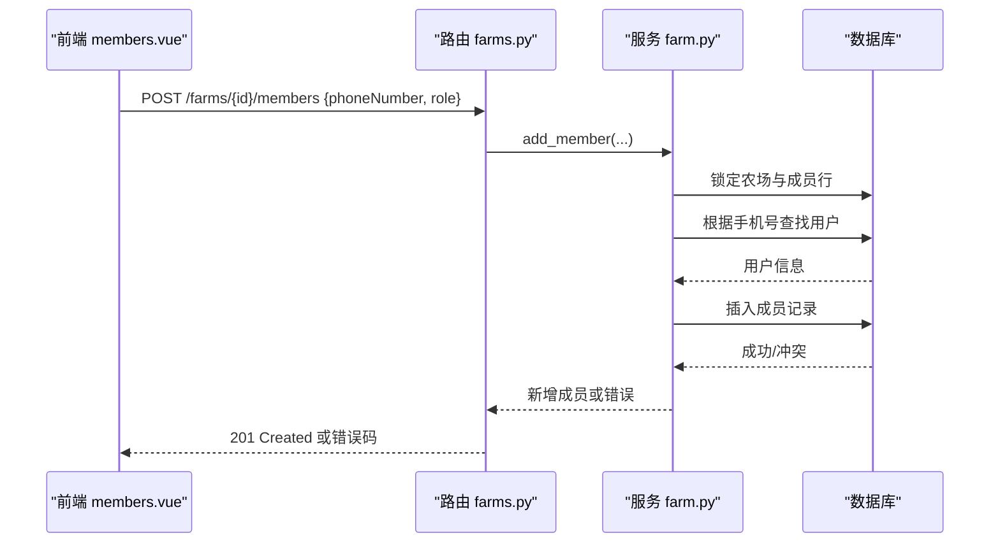
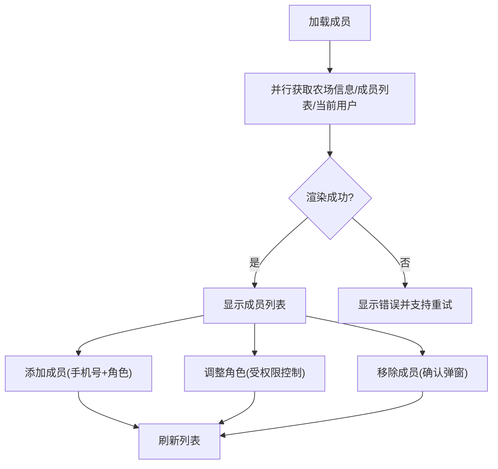
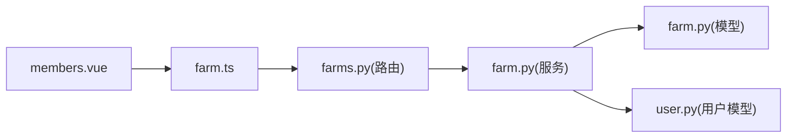

# 成员管理

<cite>
**本文引用的文件**
- [apps/api/app/models/farm.py](file://apps/api/app/models/farm.py)
- [apps/api/app/schemas/farm.py](file://apps/api/app/schemas/farm.py)
- [apps/api/app/services/farm.py](file://apps/api/app/services/farm.py)
- [apps/api/app/api/v1/endpoints/farms.py](file://apps/api/app/api/v1/endpoints/farms.py)
- [apps/api/app/models/user.py](file://apps/api/app/models/user.py)
- [apps/api/app/core/security.py](file://apps/api/app/core/security.py)
- [apps/miniapp/src/pages/farms/members.vue](file://apps/miniapp/src/pages/farms/members.vue)
- [apps/miniapp/src/services/farm.ts](file://apps/miniapp/src/services/farm.ts)
- [apps/api/tests/test_farms.py](file://apps/api/tests/test_farms.py)
</cite>

## 目录
1. [简介](#简介)
2. [项目结构](#项目结构)
3. [核心组件](#核心组件)
4. [架构总览](#架构总览)
5. [详细组件分析](#详细组件分析)
6. [依赖关系分析](#依赖关系分析)
7. [性能考虑](#性能考虑)
8. [故障排查指南](#故障排查指南)
9. [结论](#结论)
10. [附录](#附录)

## 简介
本章节面向农场成员管理的完整生命周期：邀请、加入、移除与角色权限控制，覆盖后端数据模型、权限验证机制、API 流程以及前端成员管理界面的交互与状态管理。目标是帮助开发者快速理解并扩展成员协作能力，确保在复杂场景下（如管理员限制、唯一农场主保护）的一致性与安全性。

## 项目结构
- 后端采用 FastAPI + SQLAlchemy 异步会话，服务层封装业务规则与并发安全；路由层暴露 REST API；Pydantic 负责请求/响应校验与序列化。
- 前端基于 uni-app/Vue 的移动端页面，提供成员列表展示、添加、角色调整、移除与离开农场的交互。

图表来源
- [apps/miniapp/src/pages/farms/members.vue:1-482](file://apps/miniapp/src/pages/farms/members.vue#L1-L482)
- [apps/miniapp/src/services/farm.ts:1-121](file://apps/miniapp/src/services/farm.ts#L1-L121)
- [apps/api/app/api/v1/endpoints/farms.py:1-200](file://apps/api/app/api/v1/endpoints/farms.py#L1-L200)
- [apps/api/app/services/farm.py:1-264](file://apps/api/app/services/farm.py#L1-L264)
- [apps/api/app/models/farm.py:1-59](file://apps/api/app/models/farm.py#L1-L59)
- [apps/api/app/models/user.py:1-28](file://apps/api/app/models/user.py#L1-L28)
- [apps/api/app/core/security.py:1-29](file://apps/api/app/core/security.py#L1-L29)

章节来源
- [apps/api/app/api/v1/endpoints/farms.py:1-200](file://apps/api/app/api/v1/endpoints/farms.py#L1-L200)
- [apps/api/app/services/farm.py:1-264](file://apps/api/app/services/farm.py#L1-L264)
- [apps/api/app/models/farm.py:1-59](file://apps/api/app/models/farm.py#L1-L59)
- [apps/miniapp/src/pages/farms/members.vue:1-482](file://apps/miniapp/src/pages/farms/members.vue#L1-L482)
- [apps/miniapp/src/services/farm.ts:1-121](file://apps/miniapp/src/services/farm.ts#L1-L121)

## 核心组件
- 数据模型
  - 农场与成员：农场编码、名称、区域、创建者；成员表维护“农场-用户-角色”三元关系，含加入时间。
  - 用户：手机号、昵称、时间戳。
- 服务层
  - 成员增删改查、角色变更、离开农场、并发锁与权限校验。
- 路由层
  - 成员列表、添加成员、修改角色、删除成员、离开农场等接口。
- 前端
  - 成员管理页：加载成员列表、按角色筛选可操作项、添加成员、调整角色、移除成员、处理未授权跳转登录。

章节来源
- [apps/api/app/models/farm.py:12-59](file://apps/api/app/models/farm.py#L12-L59)
- [apps/api/app/models/user.py:15-28](file://apps/api/app/models/user.py#L15-L28)
- [apps/api/app/services/farm.py:94-113](file://apps/api/app/services/farm.py#L94-L113)
- [apps/api/app/api/v1/endpoints/farms.py:121-199](file://apps/api/app/api/v1/endpoints/farms.py#L121-L199)
- [apps/miniapp/src/pages/farms/members.vue:135-177](file://apps/miniapp/src/pages/farms/members.vue#L135-L177)

## 架构总览
成员管理的关键调用链：前端通过 HTTP 调用后端路由，路由解析参数并调用服务层完成权限校验与数据持久化，最终返回统一响应体。

图表来源
- [apps/api/app/api/v1/endpoints/farms.py:121-199](file://apps/api/app/api/v1/endpoints/farms.py#L121-L199)
- [apps/api/app/services/farm.py:158-264](file://apps/api/app/services/farm.py#L158-L264)

## 详细组件分析

### 数据模型与关系设计
- 农场主键自增，农场编码唯一且为6位数字。
- 成员表包含唯一约束（farm_id, user_id），避免重复加入。
- 角色枚举：OWNER、ADMIN、MEMBER。
- 用户表以手机号唯一标识，支持昵称。

图表来源
- [apps/api/app/models/farm.py:18-59](file://apps/api/app/models/farm.py#L18-L59)
- [apps/api/app/models/user.py:15-28](file://apps/api/app/models/user.py#L15-L28)

章节来源
- [apps/api/app/models/farm.py:12-59](file://apps/api/app/models/farm.py#L12-L59)
- [apps/api/app/models/user.py:15-28](file://apps/api/app/models/user.py#L15-L28)

### 权限与角色控制
- 角色层级：OWNER > ADMIN > MEMBER。
- 成员管理权限：仅 OWNER 与 ADMIN 可管理成员；普通成员不可管理。
- 管理员限制：ADMIN 不能操作或创建 OWNER。
- 唯一农场主保护：任何操作不得导致农场无 OWNER。
- 自身离开：使用专用接口离开农场，禁止通过管理接口自我移除。

图表来源
- [apps/api/app/services/farm.py:94-113](file://apps/api/app/services/farm.py#L94-L113)
- [apps/api/app/services/farm.py:210-231](file://apps/api/app/services/farm.py#L210-L231)
- [apps/api/app/services/farm.py:234-264](file://apps/api/app/services/farm.py#L234-L264)

章节来源
- [apps/api/app/services/farm.py:94-113](file://apps/api/app/services/farm.py#L94-L113)
- [apps/api/app/services/farm.py:210-231](file://apps/api/app/services/farm.py#L210-L231)
- [apps/api/app/services/farm.py:234-264](file://apps/api/app/services/farm.py#L234-L264)

### 邀请与加入流程
- 邀请方式：通过手机号精确匹配已注册用户，将其加入农场并赋予指定角色。
- 防重入：同一用户重复加入会返回业务冲突。
- 权限校验：仅 OWNER/ADMIN 可邀请；ADMIN 不可邀请 OWNER。
- 前端交互：输入手机号与选择角色后提交，成功后刷新成员列表。

图表来源
- [apps/api/app/api/v1/endpoints/farms.py:142-160](file://apps/api/app/api/v1/endpoints/farms.py#L142-L160)
- [apps/api/app/services/farm.py:181-208](file://apps/api/app/services/farm.py#L181-L208)
- [apps/miniapp/src/pages/farms/members.vue:212-233](file://apps/miniapp/src/pages/farms/members.vue#L212-L233)

章节来源
- [apps/api/app/api/v1/endpoints/farms.py:142-160](file://apps/api/app/api/v1/endpoints/farms.py#L142-L160)
- [apps/api/app/services/farm.py:181-208](file://apps/api/app/services/farm.py#L181-L208)
- [apps/miniapp/src/pages/farms/members.vue:212-233](file://apps/miniapp/src/pages/farms/members.vue#L212-L233)

### 成员状态管理与协作工作流
- 成员状态：通过角色体现当前权限与可见性；加入时间用于排序与审计。
- 协作边界：只有具备成员管理权限的用户才能进行添加、角色调整与移除；普通成员只能查看与自行离开。
- 一致性保障：使用行级锁保证并发下的角色与成员数量一致性，避免竞态条件。

章节来源
- [apps/api/app/services/farm.py:73-92](file://apps/api/app/services/farm.py#L73-L92)
- [apps/api/app/services/farm.py:158-178](file://apps/api/app/services/farm.py#L158-L178)
- [apps/miniapp/src/pages/farms/members.vue:135-177](file://apps/miniapp/src/pages/farms/members.vue#L135-L177)

### 前端成员管理界面与状态管理
- 页面职责：展示成员列表、显示当前用户标记、提供添加与角色调整入口、支持移除与离开。
- 状态变量：loading、adding、loadError、phoneNumber、addRoleIndex、currentUserId、farm、members。
- 权限计算：根据 myRole 决定可操作范围；ADMIN 不可操作 OWNER。
- 错误处理：401 时清除令牌并跳转登录；其他错误提示并重试。

图表来源
- [apps/miniapp/src/pages/farms/members.vue:183-210](file://apps/miniapp/src/pages/farms/members.vue#L183-L210)
- [apps/miniapp/src/pages/farms/members.vue:212-275](file://apps/miniapp/src/pages/farms/members.vue#L212-L275)

章节来源
- [apps/miniapp/src/pages/farms/members.vue:135-283](file://apps/miniapp/src/pages/farms/members.vue#L135-L283)
- [apps/miniapp/src/services/farm.ts:74-120](file://apps/miniapp/src/services/farm.ts#L74-L120)

### API 定义与响应规范
- 成员相关端点
  - GET /farms/{farm_id}/members：分页列出成员，需为农场成员。
  - POST /farms/{farm_id}/members：添加成员，需具备成员管理权限。
  - PATCH /farms/{farm_id}/members/{member_id}：修改成员角色，受权限与唯一农场主保护限制。
  - DELETE /farms/{farm_id}/members/me：当前用户离开农场。
  - DELETE /farms/{farm_id}/members/{member_id}：移除成员，受权限与唯一农场主保护限制。
- 请求/响应
  - 请求体字段：phoneNumber、role（默认 MEMBER）。
  - 响应体：统一 ApiResponse 包装，包含 data、page、pageSize、total。

章节来源
- [apps/api/app/api/v1/endpoints/farms.py:121-199](file://apps/api/app/api/v1/endpoints/farms.py#L121-L199)
- [apps/api/app/schemas/farm.py:44-73](file://apps/api/app/schemas/farm.py#L44-L73)

### 认证与安全
- 访问令牌：JWT 生成与解码，携带用户 ID 与过期时间。
- 鉴权：路由通过依赖注入获取当前用户，所有成员操作均要求已认证。
- 安全建议：令牌存储于客户端安全位置；服务端校验签名与有效期。

章节来源
- [apps/api/app/core/security.py:8-28](file://apps/api/app/core/security.py#L8-L28)
- [apps/api/app/api/v1/endpoints/farms.py:58-118](file://apps/api/app/api/v1/endpoints/farms.py#L58-L118)

## 依赖关系分析
- 路由依赖服务：路由层仅做参数校验与响应组装，核心逻辑在服务层。
- 服务依赖模型：服务层通过 ORM 操作农场、成员与用户模型。
- 前端依赖服务：前端通过 TypeScript 函数封装 HTTP 请求，调用后端成员相关接口。

图表来源
- [apps/miniapp/src/pages/farms/members.vue:104-119](file://apps/miniapp/src/pages/farms/members.vue#L104-L119)
- [apps/miniapp/src/services/farm.ts:74-120](file://apps/miniapp/src/services/farm.ts#L74-L120)
- [apps/api/app/api/v1/endpoints/farms.py:121-199](file://apps/api/app/api/v1/endpoints/farms.py#L121-L199)
- [apps/api/app/services/farm.py:158-264](file://apps/api/app/services/farm.py#L158-L264)

章节来源
- [apps/api/app/api/v1/endpoints/farms.py:121-199](file://apps/api/app/api/v1/endpoints/farms.py#L121-L199)
- [apps/api/app/services/farm.py:158-264](file://apps/api/app/services/farm.py#L158-L264)

## 性能考虑
- 分页查询：成员列表支持分页，减少大数据量传输与渲染压力。
- 并发安全：使用行级锁（with_for_update）避免并发下的角色与成员数量不一致。
- 最小化网络请求：前端并行获取农场信息、成员列表与当前用户，降低首屏等待。
- 索引优化：成员表的 user_id 建立索引，提升按用户查询效率。

[本节为通用性能指导，不直接分析具体代码]

## 故障排查指南
- 常见错误码与含义
  - NOT_FOUND：农场不存在或用户未注册。
  - FORBIDDEN：无成员管理权限或越权操作（如 ADMIN 操作 OWNER）。
  - BUSINESS_CONFLICT：重复添加成员或尝试移除最后一个 OWNER。
- 前端异常处理
  - 401 未授权：清除令牌并跳转登录。
  - 其他错误：提示失败原因并提供重试按钮。
- 定位步骤
  - 检查当前用户角色与目标成员角色是否符合权限规则。
  - 检查是否触发了唯一农场主保护。
  - 核对手机号格式与是否存在对应用户。

章节来源
- [apps/api/app/services/farm.py:21-31](file://apps/api/app/services/farm.py#L21-L31)
- [apps/api/app/services/farm.py:94-113](file://apps/api/app/services/farm.py#L94-L113)
- [apps/api/app/services/farm.py:181-208](file://apps/api/app/services/farm.py#L181-L208)
- [apps/api/app/services/farm.py:210-264](file://apps/api/app/services/farm.py#L210-L264)
- [apps/miniapp/src/pages/farms/members.vue:143-146](file://apps/miniapp/src/pages/farms/members.vue#L143-L146)
- [apps/api/tests/test_farms.py:108-152](file://apps/api/tests/test_farms.py#L108-L152)
- [apps/api/tests/test_farms.py:247-285](file://apps/api/tests/test_farms.py#L247-L285)

## 结论
该成员管理系统通过清晰的角色分层、严格的权限校验与并发安全机制，实现了农场成员的邀请、加入、移除与角色调整的完整生命周期管理。前端提供了直观的操作界面与完善的错误处理，确保用户体验与系统稳定性。建议在后续迭代中继续完善日志审计、批量操作与更细粒度的资源级权限控制。

[本节为总结性内容，不直接分析具体代码]

## 附录
- 关键接口速览
  - 获取成员列表：GET /api/v1/farms/{farm_id}/members
  - 添加成员：POST /api/v1/farms/{farm_id}/members
  - 修改角色：PATCH /api/v1/farms/{farm_id}/members/{member_id}
  - 离开农场：DELETE /api/v1/farms/{farm_id}/members/me
  - 移除成员：DELETE /api/v1/farms/{farm_id}/members/{member_id}
- 前端调用示例路径
  - 成员服务封装：[apps/miniapp/src/services/farm.ts:74-120](file://apps/miniapp/src/services/farm.ts#L74-L120)
  - 成员页面交互：[apps/miniapp/src/pages/farms/members.vue:183-283](file://apps/miniapp/src/pages/farms/members.vue#L183-L283)

章节来源
- [apps/api/app/api/v1/endpoints/farms.py:121-199](file://apps/api/app/api/v1/endpoints/farms.py#L121-L199)
- [apps/miniapp/src/services/farm.ts:74-120](file://apps/miniapp/src/services/farm.ts#L74-L120)
- [apps/miniapp/src/pages/farms/members.vue:183-283](file://apps/miniapp/src/pages/farms/members.vue#L183-L283)