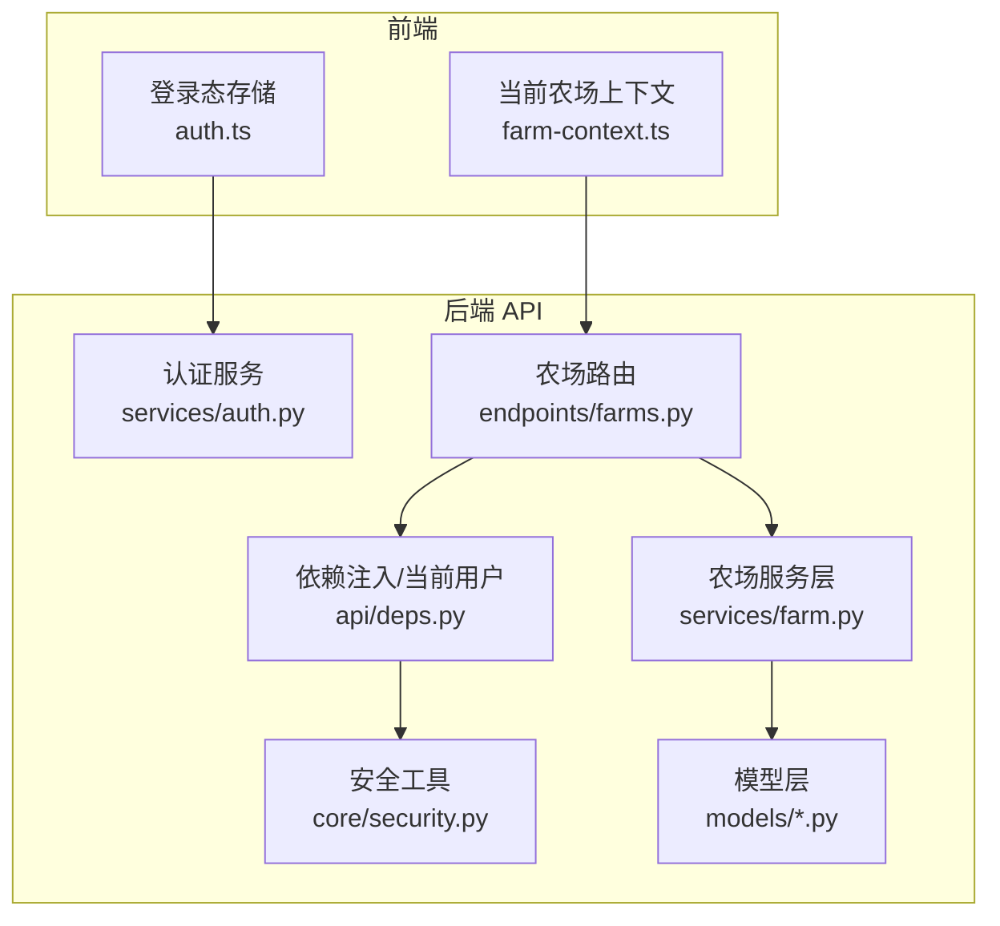
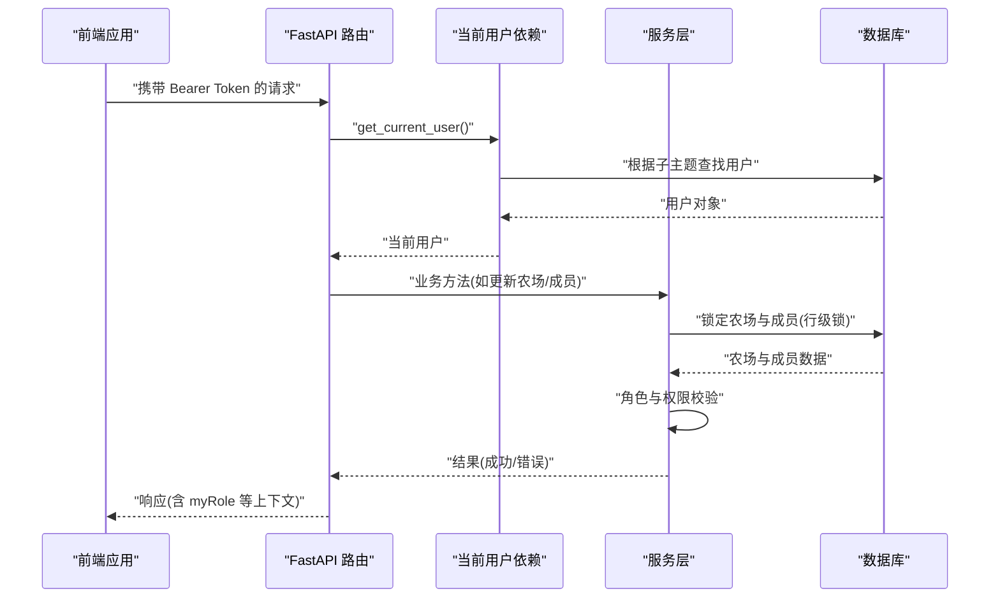
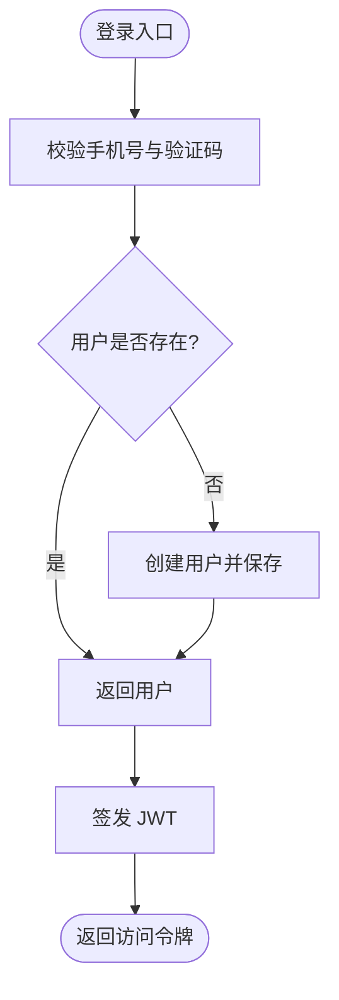
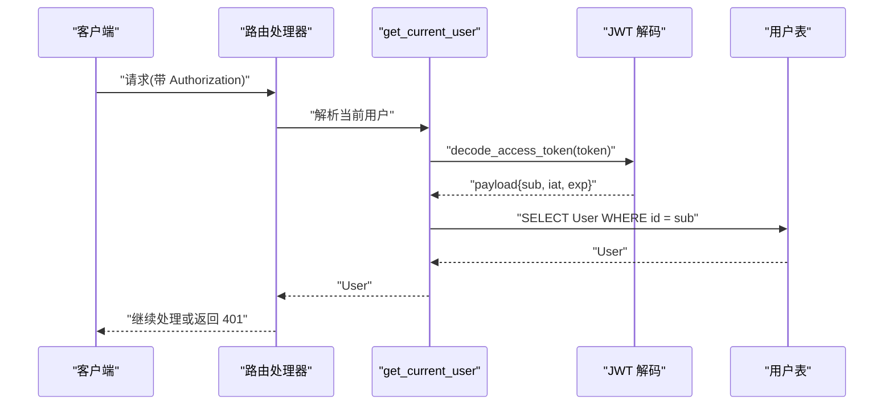
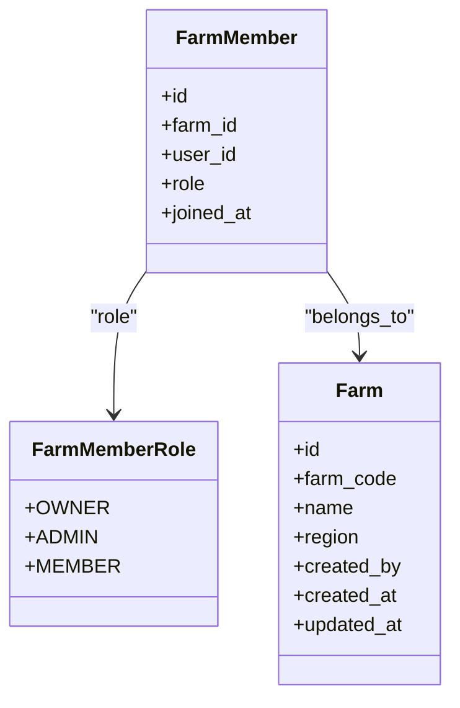
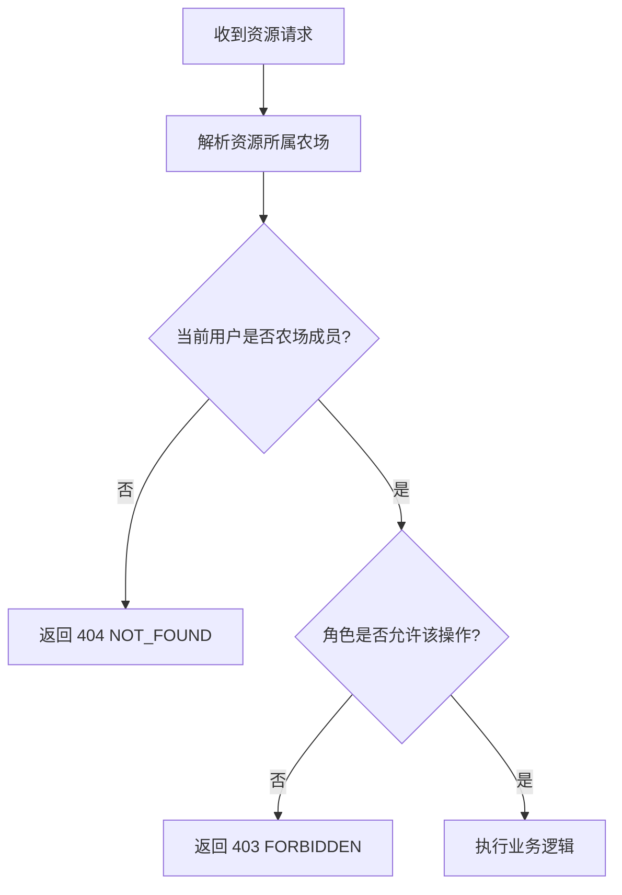
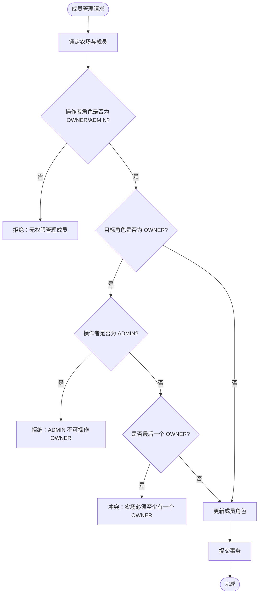
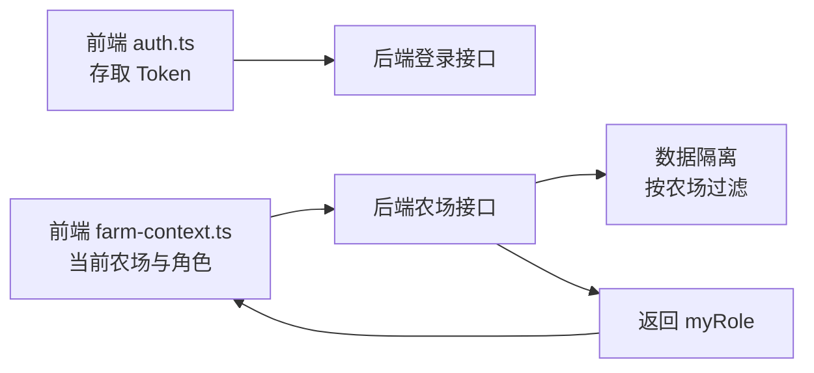
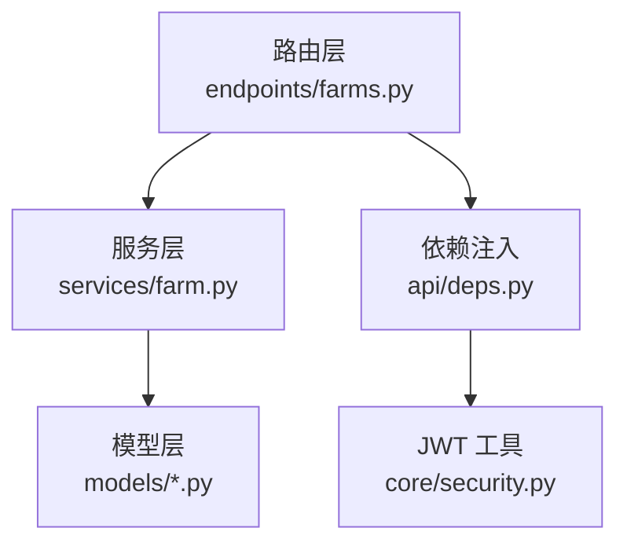

# 权限控制

<cite>
**本文引用的文件**
- [apps/api/app/core/security.py](file://apps/api/app/core/security.py)
- [apps/api/app/api/deps.py](file://apps/api/app/api/deps.py)
- [apps/api/app/services/auth.py](file://apps/api/app/services/auth.py)
- [apps/api/app/models/farm.py](file://apps/api/app/models/farm.py)
- [apps/api/app/models/user.py](file://apps/api/app/models/user.py)
- [apps/api/app/models/plot.py](file://apps/api/app/models/plot.py)
- [apps/api/app/models/production.py](file://apps/api/app/models/production.py)
- [apps/api/app/api/v1/endpoints/farms.py](file://apps/api/app/api/v1/endpoints/farms.py)
- [apps/api/app/services/farm.py](file://apps/api/app/services/farm.py)
- [apps/api/app/schemas/farm.py](file://apps/api/app/schemas/farm.py)
- [apps/api/tests/test_farms.py](file://apps/api/tests/test_farms.py)
- [apps/api/tests/test_auth.py](file://apps/api/tests/test_auth.py)
- [apps/miniapp/src/services/farm-context.ts](file://apps/miniapp/src/services/farm-context.ts)
- [apps/miniapp/src/services/auth.ts](file://apps/miniapp/src/services/auth.ts)
- [docs/mvp/04-api-security.md](file://docs/mvp/04-api-security.md)
</cite>

## 目录
1. [简介](#简介)
2. [项目结构](#项目结构)
3. [核心组件](#核心组件)
4. [架构总览](#架构总览)
5. [详细组件分析](#详细组件分析)
6. [依赖关系分析](#依赖关系分析)
7. [性能与安全考虑](#性能与安全考虑)
8. [故障排查指南](#故障排查指南)
9. [结论](#结论)
10. [附录](#附录)

## 简介
本文件为农场权限控制系统提供完整技术文档，围绕基于角色的访问控制（RBAC）在农场场景中的实现展开。系统以“资源→农场→成员→当前用户→角色”为主线进行权限判定，确保所有业务资源最终通过所属农场与成员关系进行鉴权。文档覆盖：
- 角色定义与权限边界：农场所有者、管理员、普通成员
- 认证与授权中间件：JWT 签发与校验、统一当前用户解析
- 资源访问控制策略：接口保护、数据隔离、越权防护
- 权限继承机制：成员角色对操作能力的约束与限制
- 前后端协同：前端上下文与后端校验的一致性保障

## 项目结构
本项目采用前后端分离架构：
- 后端 API（FastAPI）：负责认证、鉴权、业务逻辑与数据持久化
- 小程序前端（uni-app/Vue）：负责登录态管理、当前农场上下文与界面级权限展示

**图示来源**
- [apps/miniapp/src/services/auth.ts:1-18](file://apps/miniapp/src/services/auth.ts#L1-L18)
- [apps/miniapp/src/services/farm-context.ts:1-94](file://apps/miniapp/src/services/farm-context.ts#L1-L94)
- [apps/api/app/services/auth.py:1-47](file://apps/api/app/services/auth.py#L1-L47)
- [apps/api/app/core/security.py:1-29](file://apps/api/app/core/security.py#L1-L29)
- [apps/api/app/api/deps.py:1-66](file://apps/api/app/api/deps.py#L1-L66)
- [apps/api/app/api/v1/endpoints/farms.py:1-160](file://apps/api/app/api/v1/endpoints/farms.py#L1-L160)
- [apps/api/app/services/farm.py:1-231](file://apps/api/app/services/farm.py#L1-L231)
- [apps/api/app/models/farm.py:1-59](file://apps/api/app/models/farm.py#L1-L59)

**章节来源**
- [apps/api/app/api/v1/endpoints/farms.py:1-160](file://apps/api/app/api/v1/endpoints/farms.py#L1-L160)
- [apps/api/app/services/farm.py:1-231](file://apps/api/app/services/farm.py#L1-L231)
- [apps/api/app/models/farm.py:1-59](file://apps/api/app/models/farm.py#L1-L59)
- [apps/api/app/models/user.py:1-28](file://apps/api/app/models/user.py#L1-L28)
- [apps/api/app/models/plot.py:1-54](file://apps/api/app/models/plot.py#L1-L54)
- [apps/api/app/models/production.py:1-79](file://apps/api/app/models/production.py#L1-L79)
- [apps/miniapp/src/services/auth.ts:1-18](file://apps/miniapp/src/services/auth.ts#L1-L18)
- [apps/miniapp/src/services/farm-context.ts:1-94](file://apps/miniapp/src/services/farm-context.ts#L1-L94)

## 核心组件
- 认证与令牌
  - JWT 签发与解码：包含用户标识与过期时间，不携带完整权限列表
  - 登录流程：手机号+验证码登录，创建或复用用户，返回访问令牌
- 当前用户解析
  - 统一依赖 get_current_user：从请求头解析 Bearer Token，解码后查询用户并返回
- 角色与权限
  - 角色枚举：OWNER、ADMIN、MEMBER
  - 成员管理权限：仅 OWNER/ADMIN 可管理成员；ADMIN 不可操作或创建 OWNER
  - 资源访问：所有资源需归属到农场并通过 FarmMember 校验当前用户权限
- 数据隔离
  - 不信任前端 farmId：必须通过数据库验证当前用户属于目标农场
  - 非成员访问资源返回 404，避免泄露存在性信息

**章节来源**
- [apps/api/app/core/security.py:1-29](file://apps/api/app/core/security.py#L1-L29)
- [apps/api/app/services/auth.py:1-47](file://apps/api/app/services/auth.py#L1-L47)
- [apps/api/app/api/deps.py:1-66](file://apps/api/app/api/deps.py#L1-L66)
- [apps/api/app/models/farm.py:1-59](file://apps/api/app/models/farm.py#L1-L59)
- [docs/mvp/04-api-security.md:24-163](file://docs/mvp/04-api-security.md#L24-L163)

## 架构总览
下图展示了农场 RBAC 的整体调用链：前端发起请求携带 Token，后端通过依赖注入解析当前用户，再根据资源归属与成员角色进行权限判断。

**图示来源**
- [apps/api/app/api/deps.py:19-66](file://apps/api/app/api/deps.py#L19-L66)
- [apps/api/app/services/farm.py:73-113](file://apps/api/app/services/farm.py#L73-L113)
- [apps/api/app/api/v1/endpoints/farms.py:93-118](file://apps/api/app/api/v1/endpoints/farms.py#L93-L118)

## 详细组件分析

### 认证与令牌管理
- 令牌生成：使用配置中的密钥与算法签发 JWT，包含用户 ID 与过期时间
- 令牌校验：统一在依赖中解码并转换为当前用户对象，非法或缺失则返回未授权
- 登录流程：支持测试环境固定验证码；生产环境应接入真实短信服务

**图示来源**
- [apps/api/app/services/auth.py:11-47](file://apps/api/app/services/auth.py#L11-L47)
- [apps/api/app/core/security.py:8-29](file://apps/api/app/core/security.py#L8-L29)

**章节来源**
- [apps/api/app/services/auth.py:1-47](file://apps/api/app/services/auth.py#L1-L47)
- [apps/api/app/core/security.py:1-29](file://apps/api/app/core/security.py#L1-L29)
- [apps/api/tests/test_auth.py:27-108](file://apps/api/tests/test_auth.py#L27-L108)

### 当前用户解析与接口保护
- 统一依赖 get_current_user：从请求头提取 Bearer Token，解码后查询用户
- 未提供 Token 或 Token 无效时返回 401
- 业务路由无需自行解析 Token，保证一致性与安全性

**图示来源**
- [apps/api/app/api/deps.py:19-66](file://apps/api/app/api/deps.py#L19-L66)
- [apps/api/app/core/security.py:22-29](file://apps/api/app/core/security.py#L22-L29)

**章节来源**
- [apps/api/app/api/deps.py:1-66](file://apps/api/app/api/deps.py#L1-L66)
- [apps/api/app/core/security.py:1-29](file://apps/api/app/core/security.py#L1-L29)

### 角色定义与权限矩阵
- 角色枚举：OWNER、ADMIN、MEMBER
- 成员管理权限：
  - 仅 OWNER/ADMIN 可管理成员
  - ADMIN 不可操作或创建 OWNER
  - 禁止自我降级/删除自身成员记录（应使用退出农场接口）
- 资源访问：
  - 非成员访问资源返回 404
  - 成员但无操作权限返回 403

**图示来源**
- [apps/api/app/models/farm.py:12-59](file://apps/api/app/models/farm.py#L12-L59)

**章节来源**
- [apps/api/app/models/farm.py:1-59](file://apps/api/app/models/farm.py#L1-L59)
- [apps/api/app/services/farm.py:94-113](file://apps/api/app/services/farm.py#L94-L113)
- [apps/api/tests/test_farms.py:137-202](file://apps/api/tests/test_farms.py#L137-L202)

### 资源访问控制策略
- 原则：Resource → Farm → FarmMember → Current User → Role
- 不信任前端 farmId：必须通过数据库验证当前用户属于目标农场
- Plot/Production/Operation/Harvest 等资源均需回溯到 Farm 并进行成员校验
- 非成员访问统一返回 404，避免泄露资源存在性

**图示来源**
- [docs/mvp/04-api-security.md:66-163](file://docs/mvp/04-api-security.md#L66-L163)

**章节来源**
- [docs/mvp/04-api-security.md:66-163](file://docs/mvp/04-api-security.md#L66-L163)
- [apps/api/app/api/v1/endpoints/farms.py:93-118](file://apps/api/app/api/v1/endpoints/farms.py#L93-L118)
- [apps/api/tests/test_farms.py:108-152](file://apps/api/tests/test_farms.py#L108-L152)

### 权限继承与成员管理
- 继承规则：
  - MEMBER：仅基础参与，不能管理成员
  - ADMIN：可管理成员（除 OWNER），可执行部分管理操作
  - OWNER：最高权限，可管理成员与农场
- 关键约束：
  - 禁止将最后一个 OWNER 降级或删除
  - ADMIN 不可操作或创建 OWNER
  - 成员退出使用专用接口，而非直接删除成员记录

**图示来源**
- [apps/api/app/services/farm.py:73-113](file://apps/api/app/services/farm.py#L73-L113)
- [apps/api/app/services/farm.py:210-231](file://apps/api/app/services/farm.py#L210-L231)

**章节来源**
- [apps/api/app/services/farm.py:73-113](file://apps/api/app/services/farm.py#L73-L113)
- [apps/api/app/services/farm.py:210-231](file://apps/api/app/services/farm.py#L210-L231)
- [apps/api/tests/test_farms.py:154-260](file://apps/api/tests/test_farms.py#L154-L260)

### 前后端权限检查与数据隔离
- 前端：
  - 登录态存储：access token 本地持久化
  - 当前农场上下文：维护当前选择的农场及其角色，用于界面渲染与按钮显隐
- 后端：
  - 接口保护：所有受保护接口通过 get_current_user 强制鉴权
  - 数据隔离：按农场维度过滤数据，非成员访问返回 404
- 一致性：
  - 前端展示的 myRole 来自后端响应，避免前端伪造权限
  - 后端不信任前端传入的 farmId，始终通过数据库校验

**图示来源**
- [apps/miniapp/src/services/auth.ts:1-18](file://apps/miniapp/src/services/auth.ts#L1-L18)
- [apps/miniapp/src/services/farm-context.ts:1-94](file://apps/miniapp/src/services/farm-context.ts#L1-L94)
- [apps/api/app/api/v1/endpoints/farms.py:58-118](file://apps/api/app/api/v1/endpoints/farms.py#L58-L118)

**章节来源**
- [apps/miniapp/src/services/auth.ts:1-18](file://apps/miniapp/src/services/auth.ts#L1-L18)
- [apps/miniapp/src/services/farm-context.ts:1-94](file://apps/miniapp/src/services/farm-context.ts#L1-L94)
- [apps/api/app/api/v1/endpoints/farms.py:58-118](file://apps/api/app/api/v1/endpoints/farms.py#L58-L118)

## 依赖关系分析
- 模块耦合：
  - 路由层依赖服务层进行业务逻辑与权限校验
  - 服务层依赖模型层进行数据访问与并发控制
  - 依赖注入层统一处理认证与数据库会话
- 外部依赖：
  - JWT 库用于令牌签发与校验
  - SQLAlchemy 异步会话用于数据库操作
- 潜在风险：
  - 若路由层绕过服务层直接操作模型，可能导致权限校验缺失
  - 若服务层未正确锁定资源，可能引发并发下的状态不一致

**图示来源**
- [apps/api/app/api/v1/endpoints/farms.py:1-160](file://apps/api/app/api/v1/endpoints/farms.py#L1-L160)
- [apps/api/app/services/farm.py:1-231](file://apps/api/app/services/farm.py#L1-L231)
- [apps/api/app/models/farm.py:1-59](file://apps/api/app/models/farm.py#L1-L59)
- [apps/api/app/api/deps.py:1-66](file://apps/api/app/api/deps.py#L1-L66)
- [apps/api/app/core/security.py:1-29](file://apps/api/app/core/security.py#L1-L29)

**章节来源**
- [apps/api/app/api/v1/endpoints/farms.py:1-160](file://apps/api/app/api/v1/endpoints/farms.py#L1-L160)
- [apps/api/app/services/farm.py:1-231](file://apps/api/app/services/farm.py#L1-L231)
- [apps/api/app/models/farm.py:1-59](file://apps/api/app/models/farm.py#L1-L59)
- [apps/api/app/api/deps.py:1-66](file://apps/api/app/api/deps.py#L1-L66)
- [apps/api/app/core/security.py:1-29](file://apps/api/app/core/security.py#L1-L29)

## 性能与安全考虑
- 性能
  - 使用异步数据库会话提升并发处理能力
  - 列表接口分页限制 pageSize 上限，防止过大查询
  - 资源锁定使用行级锁，减少并发写冲突
- 安全
  - JWT 不包含完整权限列表，权限由数据库实时判断
  - 不信任前端 farmId，始终通过数据库校验成员关系
  - 非成员访问返回 404，避免泄露资源存在性
  - 严格区分 401（未认证）、403（无权限）、404（不存在）

[本节为通用指导，不直接分析具体文件]

## 故障排查指南
- 常见问题
  - 未携带 Token：返回 401，检查前端是否正确设置 Authorization
  - Token 无效或过期：返回 401，检查 JWT 配置与有效期
  - 非成员访问资源：返回 404，检查用户是否已加入目标农场
  - 无权限操作：返回 403，检查当前用户角色是否具备操作能力
- 定位步骤
  - 查看登录日志与 Token 签发过程
  - 检查当前用户解析是否成功
  - 确认资源归属与成员关系是否正确
  - 审查服务层权限校验逻辑

**章节来源**
- [apps/api/tests/test_auth.py:83-108](file://apps/api/tests/test_auth.py#L83-L108)
- [apps/api/tests/test_farms.py:108-152](file://apps/api/tests/test_farms.py#L108-L152)
- [apps/api/app/api/deps.py:29-66](file://apps/api/app/api/deps.py#L29-L66)

## 结论
本系统通过明确的 RBAC 模型与严格的资源访问控制策略，实现了农场场景下的多角色权限管理。认证与鉴权解耦，权限判断集中在服务层，结合数据库锁定与数据隔离，有效防止越权访问。前后端通过一致的上下文与响应字段协作，确保用户体验与安全性的平衡。建议在生产环境中关闭测试登录模式，并持续完善权限用例与监控告警。

[本节为总结性内容，不直接分析具体文件]

## 附录
- 接口规范参考：统一响应格式、错误码、HTTP 状态码
- 数据模型参考：用户、农场、成员、地块、生产记录等
- 前端上下文参考：当前农场选择与角色展示

**章节来源**
- [docs/mvp/04-api-security.md:295-444](file://docs/mvp/04-api-security.md#L295-L444)
- [apps/api/app/schemas/farm.py:1-166](file://apps/api/app/schemas/farm.py#L1-L166)
- [apps/miniapp/src/services/farm-context.ts:1-94](file://apps/miniapp/src/services/farm-context.ts#L1-L94)