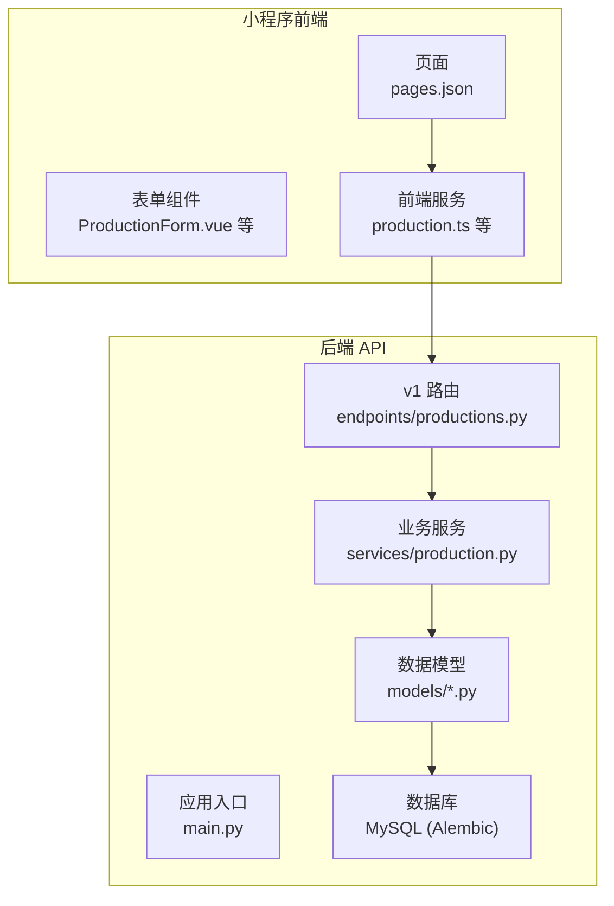
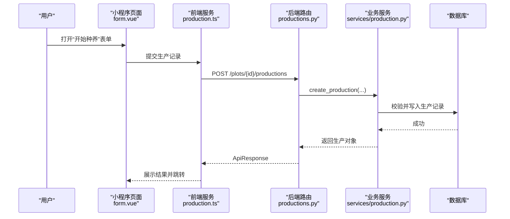
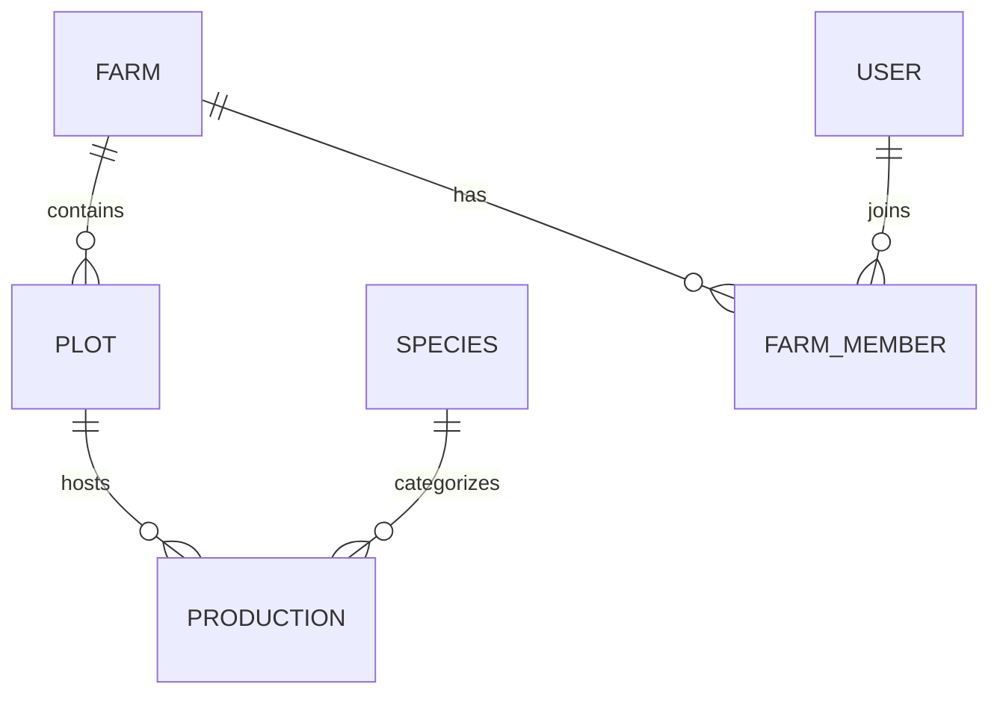
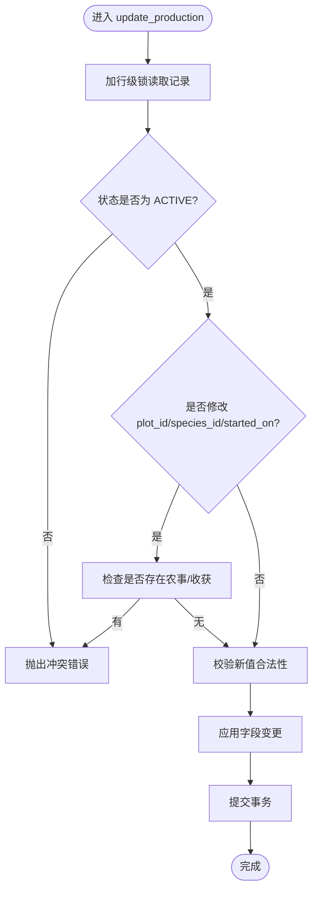
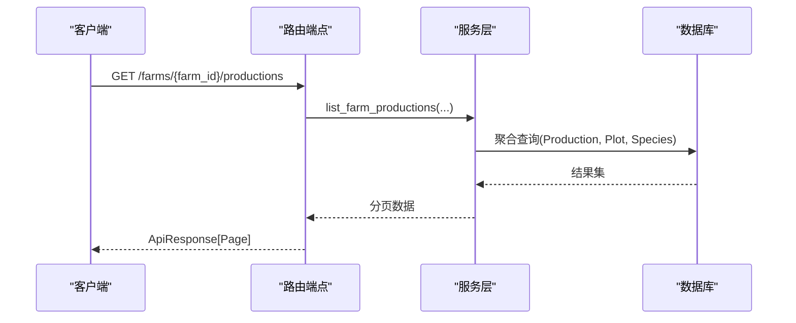
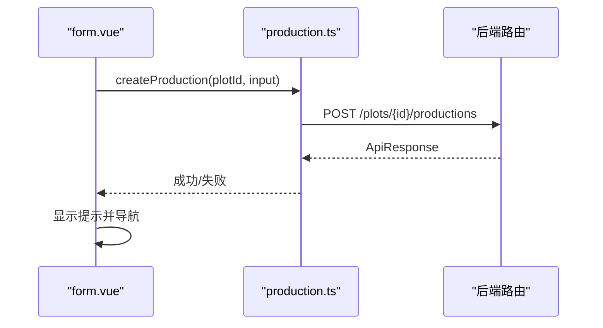
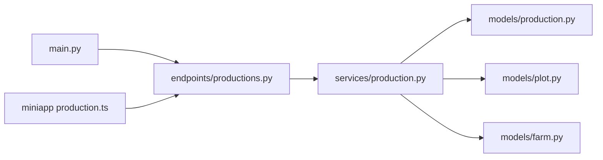

# 农场生产记录

<cite>
**本文引用的文件**
- [apps/api/app/main.py](file://apps/api/app/main.py)
- [apps/api/pyproject.toml](file://apps/api/pyproject.toml)
- [apps/api/app/models/production.py](file://apps/api/app/models/production.py)
- [apps/api/app/models/farm.py](file://apps/api/app/models/farm.py)
- [apps/api/app/models/plot.py](file://apps/api/app/models/plot.py)
- [apps/api/app/services/production.py](file://apps/api/app/services/production.py)
- [apps/api/app/api/v1/endpoints/productions.py](file://apps/api/app/api/v1/endpoints/productions.py)
- [apps/miniapp/src/pages.json](file://apps/miniapp/src/pages.json)
- [apps/miniapp/package.json](file://apps/miniapp/package.json)
- [apps/miniapp/src/services/production.ts](file://apps/miniapp/src/services/production.ts)
- [apps/miniapp/src/pages/productions/form.vue](file://apps/miniapp/src/pages/productions/form.vue)
- [docs/index.md](file://docs/index.md)
- [docs/mvp/02-domain-model.md](file://docs/mvp/02-domain-model.md)
- [docs/mvp/03-business-rules.md](file://docs/mvp/03-business-rules.md)
</cite>

## 目录
1. [简介](#简介)
2. [项目结构](#项目结构)
3. [核心组件](#核心组件)
4. [架构总览](#架构总览)
5. [详细组件分析](#详细组件分析)
6. [依赖关系分析](#依赖关系分析)
7. [性能考虑](#性能考虑)
8. [故障排查指南](#故障排查指南)
9. [结论](#结论)
10. [附录](#附录)

## 简介
本项目“掌上农场”围绕农场、地块与一次种养生命周期，构建轻量且可实际使用的生产管理闭环。后端采用 FastAPI + SQLAlchemy（异步）+ Alembic 迁移；前端为基于 uni-app 的小程序端，提供登录、农场管理、地块管理、开始种养、农事记录、收获记录与生产记录等能力。领域模型以 Production 为核心，统一覆盖农业、林业、牧业与渔业场景，并通过 FarmMember 实现资源级权限隔离。

## 项目结构
- 后端 API：FastAPI 应用，按路由、服务、模型、Schema 分层组织，使用 Alembic 进行数据库迁移。
- 小程序前端：uni-app + Vue 3，页面通过 pages.json 注册，业务逻辑封装在 services 层，组件化表单复用。
- 文档：MVP 领域模型与业务规则文档定义数据约束、权限与流程。

图表来源
- [apps/api/app/main.py:1-28](file://apps/api/app/main.py#L1-L28)
- [apps/api/app/api/v1/endpoints/productions.py:1-246](file://apps/api/app/api/v1/endpoints/productions.py#L1-L246)
- [apps/api/app/services/production.py:1-486](file://apps/api/app/services/production.py#L1-L486)
- [apps/api/app/models/production.py:1-87](file://apps/api/app/models/production.py#L1-L87)
- [apps/miniapp/src/pages.json:1-223](file://apps/miniapp/src/pages.json#L1-L223)

章节来源
- [apps/api/app/main.py:1-28](file://apps/api/app/main.py#L1-L28)
- [apps/miniapp/src/pages.json:1-223](file://apps/miniapp/src/pages.json#L1-L223)
- [docs/index.md:1-24](file://docs/index.md#L1-L24)

## 核心组件
- 领域模型
  - Production：一次完整种养生命周期，包含状态、时间、行业相关字段与索引。
  - Plot：农场内的生产区域，支持面积与边界信息。
  - Farm/FarmMember：农场与成员角色，用于权限控制。
- 业务服务
  - production 服务：创建、查询、编辑、删除、结束生产，含跨表校验与并发锁。
- API 路由
  - productions 路由：暴露按地块/农场维度的生产记录 CRUD 与分页查询。
- 前端
  - 生产记录页面与服务：选择种类、填写表单、调用后端接口、错误处理与导航。

章节来源
- [apps/api/app/models/production.py:1-87](file://apps/api/app/models/production.py#L1-L87)
- [apps/api/app/models/plot.py:1-54](file://apps/api/app/models/plot.py#L1-L54)
- [apps/api/app/models/farm.py:1-59](file://apps/api/app/models/farm.py#L1-L59)
- [apps/api/app/services/production.py:1-486](file://apps/api/app/services/production.py#L1-L486)
- [apps/api/app/api/v1/endpoints/productions.py:1-246](file://apps/api/app/api/v1/endpoints/productions.py#L1-L246)
- [apps/miniapp/src/services/production.ts:1-162](file://apps/miniapp/src/services/production.ts#L1-L162)
- [apps/miniapp/src/pages/productions/form.vue:1-178](file://apps/miniapp/src/pages/productions/form.vue#L1-L178)

## 架构总览
系统采用前后端分离的 RESTful 架构：
- 小程序通过 HTTP 请求调用后端 v1 路由。
- 路由层负责参数校验与响应包装，委托服务层执行业务逻辑。
- 服务层进行权限校验、领域规则验证、事务提交与并发控制。
- 数据层通过 SQLAlchemy ORM 映射到 MySQL，使用 Alembic 管理迁移。

图表来源
- [apps/miniapp/src/pages/productions/form.vue:94-114](file://apps/miniapp/src/pages/productions/form.vue#L94-L114)
- [apps/miniapp/src/services/production.ts:115-121](file://apps/miniapp/src/services/production.ts#L115-L121)
- [apps/api/app/api/v1/endpoints/productions.py:148-176](file://apps/api/app/api/v1/endpoints/productions.py#L148-L176)
- [apps/api/app/services/production.py:204-257](file://apps/api/app/services/production.py#L204-L257)

## 详细组件分析

### 领域模型与关系
- Production：关联 Plot 与 Species，维护状态、时间与行业相关字段，具备复合索引优化查询。
- Plot：属于 Farm，支持类型、面积与边界信息。
- Farm/FarmMember：成员角色决定资源访问权限。

图表来源
- [apps/api/app/models/production.py:43-87](file://apps/api/app/models/production.py#L43-L87)
- [apps/api/app/models/plot.py:31-54](file://apps/api/app/models/plot.py#L31-L54)
- [apps/api/app/models/farm.py:18-59](file://apps/api/app/models/farm.py#L18-L59)
- [docs/mvp/02-domain-model.md:7-75](file://docs/mvp/02-domain-model.md#L7-L75)

章节来源
- [apps/api/app/models/production.py:1-87](file://apps/api/app/models/production.py#L1-L87)
- [apps/api/app/models/plot.py:1-54](file://apps/api/app/models/plot.py#L1-L54)
- [apps/api/app/models/farm.py:1-59](file://apps/api/app/models/farm.py#L1-L59)
- [docs/mvp/02-domain-model.md:1-634](file://docs/mvp/02-domain-model.md#L1-L634)

### 生产记录服务（创建/更新/结束）
- 创建生产：校验地块权限、物种存在性、行业字段必填与可选规则，写入 ACTIVE 状态。
- 更新生产：锁定记录，限制核心字段变更时机（已有农事或收获时不可改），同农场内移动地块允许。
- 结束生产：校验结束日期不晚于今天且不早于最早关联农事/收获日期，设置 ENDED 状态。

图表来源
- [apps/api/app/services/production.py:260-405](file://apps/api/app/services/production.py#L260-L405)

章节来源
- [apps/api/app/services/production.py:204-486](file://apps/api/app/services/production.py#L204-L486)

### API 路由（生产记录）
- 列表：按地块或农场维度分页查询，支持状态与行业过滤。
- 详情：根据生产 ID 获取并返回物种信息。
- 创建：POST 创建生产记录。
- 更新：PATCH 部分更新，仅提交变更字段。
- 结束：POST 结束当前生产。
- 删除：DELETE 删除未结束且无关联记录的生产。

图表来源
- [apps/api/app/api/v1/endpoints/productions.py:103-145](file://apps/api/app/api/v1/endpoints/productions.py#L103-L145)
- [apps/api/app/services/production.py:142-178](file://apps/api/app/services/production.py#L142-L178)

章节来源
- [apps/api/app/api/v1/endpoints/productions.py:1-246](file://apps/api/app/api/v1/endpoints/productions.py#L1-L246)

### 前端生产记录表单
- 页面职责：加载地块信息、选择种类、组装表单并提交。
- 交互流程：选择地块→选择种类→填写行业字段→提交→提示并返回。
- 错误处理：捕获 401 跳转登录，其他错误提示并重试。

图表来源
- [apps/miniapp/src/pages/productions/form.vue:94-114](file://apps/miniapp/src/pages/productions/form.vue#L94-L114)
- [apps/miniapp/src/services/production.ts:115-121](file://apps/miniapp/src/services/production.ts#L115-L121)

章节来源
- [apps/miniapp/src/pages/productions/form.vue:1-178](file://apps/miniapp/src/pages/productions/form.vue#L1-L178)
- [apps/miniapp/src/services/production.ts:1-162](file://apps/miniapp/src/services/production.ts#L1-L162)

## 依赖关系分析
- 技术栈
  - 后端：FastAPI、SQLAlchemy（异步）、Alembic、PyJWT、Uvicorn、aiomysql。
  - 前端：uni-app、Vue 3、TypeScript。
- 模块耦合
  - 路由依赖服务，服务依赖模型与配置，模型依赖基础 Base 与用户时间函数。
  - 前端服务与后端路由一一对应，类型定义保持一致。

图表来源
- [apps/api/app/main.py:1-28](file://apps/api/app/main.py#L1-L28)
- [apps/api/app/api/v1/endpoints/productions.py:1-246](file://apps/api/app/api/v1/endpoints/productions.py#L1-L246)
- [apps/api/app/services/production.py:1-486](file://apps/api/app/services/production.py#L1-L486)
- [apps/api/app/models/production.py:1-87](file://apps/api/app/models/production.py#L1-L87)
- [apps/api/app/models/plot.py:1-54](file://apps/api/app/models/plot.py#L1-L54)
- [apps/api/app/models/farm.py:1-59](file://apps/api/app/models/farm.py#L1-L59)
- [apps/miniapp/src/services/production.ts:1-162](file://apps/miniapp/src/services/production.ts#L1-L162)

章节来源
- [apps/api/pyproject.toml:1-35](file://apps/api/pyproject.toml#L1-L35)
- [apps/miniapp/package.json:1-73](file://apps/miniapp/package.json#L1-L73)

## 性能考虑
- 数据库索引：Production 表对 plot_id、status、species_id 建立复合索引，提升按地块与状态筛选的性能。
- 分页查询：列表接口支持 page/pageSize，避免一次性加载大量数据。
- 并发安全：更新与结束操作使用行级锁（with_for_update），防止并发修改导致的数据不一致。
- 时区处理：统一使用配置时区计算业务日期，减少跨时区问题。

章节来源
- [apps/api/app/models/production.py:43-52](file://apps/api/app/models/production.py#L43-L52)
- [apps/api/app/services/production.py:181-201](file://apps/api/app/services/production.py#L181-L201)
- [apps/api/app/services/production.py:260-285](file://apps/api/app/services/production.py#L260-L285)
- [apps/api/app/services/production.py:443-486](file://apps/api/app/services/production.py#L443-L486)

## 故障排查指南
- 401 未授权：前端检测到 401 会清除令牌并跳转登录页，检查 JWT 是否有效。
- 422 校验错误：常见于必填字段缺失、数值格式不符（如整数单位传入小数）、日期越界（startedOn/endedOn）。
- 409 业务冲突：已结束生产不可编辑或删除；已有关联农事或收获时不可修改核心字段；重复结束生产。
- 404 资源不存在：生产记录、地块或物种未找到，检查 ID 与权限归属。

章节来源
- [apps/api/app/services/production.py:29-38](file://apps/api/app/services/production.py#L29-L38)
- [apps/api/app/services/production.py:286-310](file://apps/api/app/services/production.py#L286-L310)
- [apps/api/app/services/production.py:420-437](file://apps/api/app/services/production.py#L420-L437)
- [apps/miniapp/src/pages/productions/form.vue:67-89](file://apps/miniapp/src/pages/productions/form.vue#L67-L89)

## 结论
本系统以 Production 为核心，结合 Farm、Plot、Species 与 FarmMember，构建了覆盖多行业的农场生产记录闭环。后端通过严格的服务层校验与并发控制保障数据一致性，前端提供直观的流程化表单与错误反馈。整体架构清晰、扩展性强，适合 MVP 阶段快速交付与后续迭代。

## 附录
- 领域模型与业务规则详见文档：
  - 领域模型：[docs/mvp/02-domain-model.md](file://docs/mvp/02-domain-model.md)
  - 业务规则：[docs/mvp/03-business-rules.md](file://docs/mvp/03-business-rules.md)
- 小程序页面路由：[apps/miniapp/src/pages.json](file://apps/miniapp/src/pages.json)
- 后端依赖与工具链：[apps/api/pyproject.toml](file://apps/api/pyproject.toml)