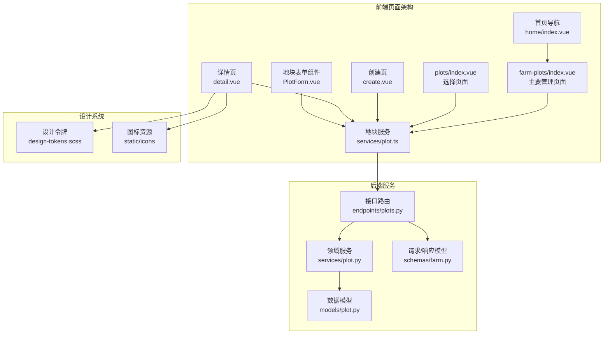
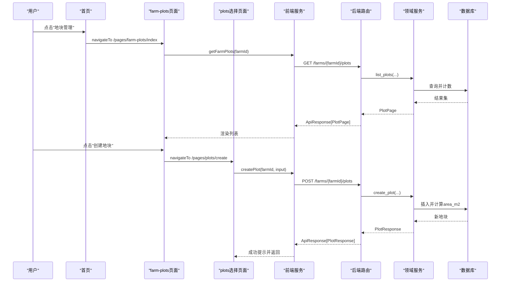
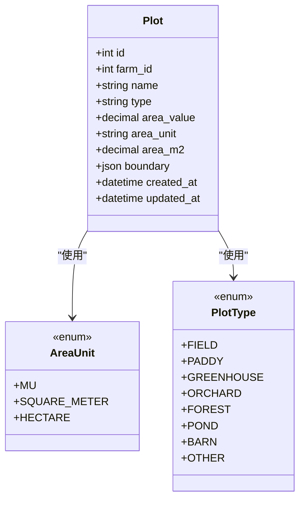
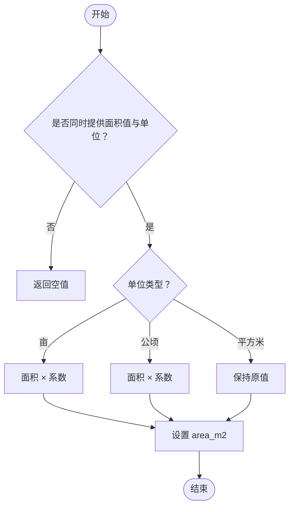
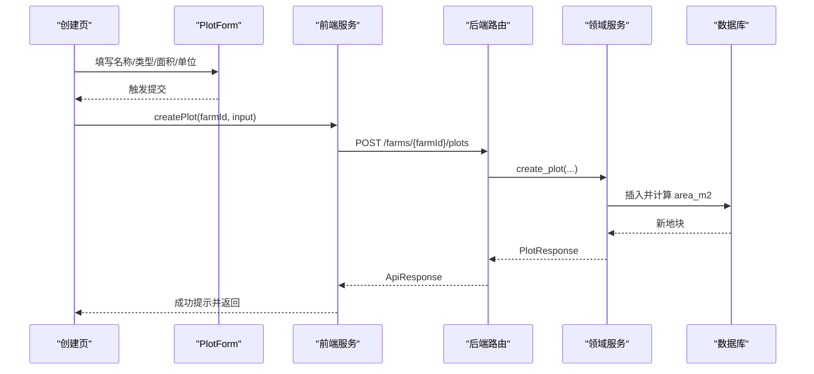
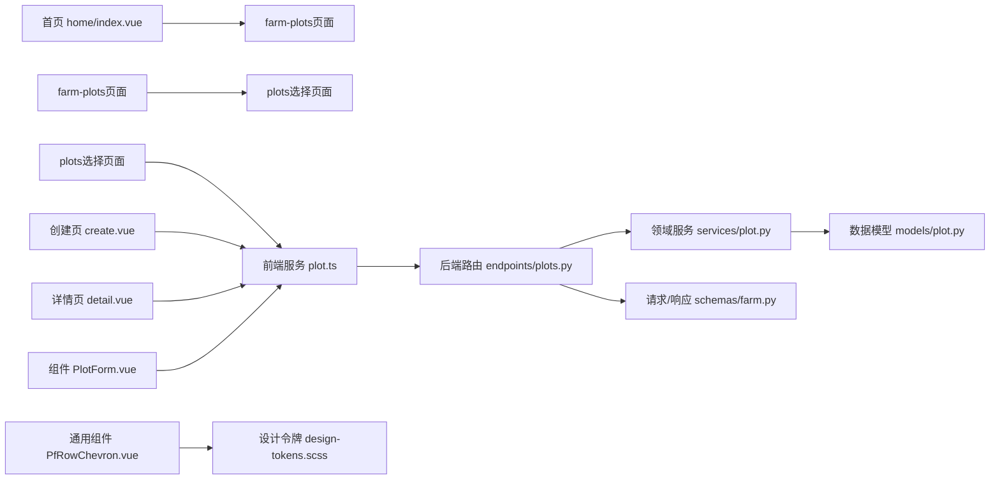

# 地块规划与管理

<cite>
**本文引用的文件**
- [apps/api/app/models/plot.py](file://apps/api/app/models/plot.py)
- [apps/api/app/services/plot.py](file://apps/api/app/services/plot.py)
- [apps/api/app/api/v1/endpoints/plots.py](file://apps/api/app/api/v1/endpoints/plots.py)
- [apps/api/app/schemas/farm.py](file://apps/api/app/schemas/farm.py)
- [apps/miniapp/src/pages/farm-plots/index.vue](file://apps/miniapp/src/pages/farm-plots/index.vue)
- [apps/miniapp/src/pages/plots/index.vue](file://apps/miniapp/src/pages/plots/index.vue)
- [apps/miniapp/src/components/PlotForm.vue](file://apps/miniapp/src/components/PlotForm.vue)
- [apps/miniapp/src/pages/plots/create.vue](file://apps/miniapp/src/pages/plots/create.vue)
- [apps/miniapp/src/pages/plots/detail.vue](file://apps/miniapp/src/pages/plots/detail.vue)
- [apps/miniapp/src/services/plot.ts](file://apps/miniapp/src/services/plot.ts)
- [apps/miniapp/src/styles/design-tokens.scss](file://apps/miniapp/src/styles/design-tokens.scss)
- [apps/miniapp/src/components/PfRowChevron.vue](file://apps/miniapp/src/components/PfRowChevron.vue)
- [apps/miniapp/src/pages/home/index.vue](file://apps/miniapp/src/pages/home/index.vue)
- [apps/miniapp/src/pages.json](file://apps/miniapp/src/pages.json)
</cite>

## 更新摘要
**所做更改**
- 重构了页面架构，farm-plots/index.vue现在作为主要的农场地块浏览和管理页面
- plots/index.vue专注于地块选择功能，移除了之前的双模式系统
- 更新了导航模式，首页通过farm-plots页面进行导航
- 操作和生产表单直接导航到选择页面而不再使用mode=select参数
- 增强了地块列表的筛选功能和状态显示

## 目录
1. [简介](#简介)
2. [项目结构](#项目结构)
3. [核心组件](#核心组件)
4. [架构总览](#架构总览)
5. [详细组件分析](#详细组件分析)
6. [依赖关系分析](#依赖关系分析)
7. [性能考虑](#性能考虑)
8. [故障排查指南](#故障排查指南)
9. [结论](#结论)
10. [附录](#附录)

## 简介
本模块围绕"地块"这一农场生产空间进行全生命周期管理，覆盖创建、编辑、查看列表与详情等基础操作，以及面积计算与单位换算、地块类型管理、边界地理信息存储、状态跟踪（关联种养、农事、收获）等高级能力。前端提供地块列表、创建/编辑表单、详情聚合页；后端提供 RESTful API、领域服务、数据模型与校验规则，确保数据一致性与权限控制。

**更新** 地块规划与管理模块经历了重大架构重构，现在采用清晰的功能分离设计：farm-plots页面负责完整的农场地块管理和浏览功能，plots页面专注于地块选择场景，简化了导航流程和用户体验。

## 项目结构
- 后端（FastAPI + SQLAlchemy）
  - 数据模型：地块模型定义类型、面积字段、边界 JSON、时间戳等
  - 领域服务：分页查询、创建/更新、详情聚合、面积换算、权限校验
  - 接口层：路由、请求/响应模型、序列化转换
- 前端（uni-app + Vue 3）
  - 页面：farm-plots（主要管理页面）、plots（选择页面）、创建、详情
  - 组件：通用地块表单（名称、类型、面积、单位）
  - 服务：HTTP 封装与类型定义
  - 样式：统一的设计令牌系统和白卡设计基线

**图表来源**
- [apps/miniapp/src/pages/farm-plots/index.vue:1-376](file://apps/miniapp/src/pages/farm-plots/index.vue#L1-L376)
- [apps/miniapp/src/pages/plots/index.vue:1-247](file://apps/miniapp/src/pages/plots/index.vue#L1-L247)
- [apps/miniapp/src/pages/home/index.vue:207-209](file://apps/miniapp/src/pages/home/index.vue#L207-L209)
- [apps/miniapp/src/pages/plots/create.vue:1-88](file://apps/miniapp/src/pages/plots/create.vue#L1-L88)
- [apps/miniapp/src/pages/plots/detail.vue:1-799](file://apps/miniapp/src/pages/plots/detail.vue#L1-L799)
- [apps/miniapp/src/components/PlotForm.vue:1-242](file://apps/miniapp/src/components/PlotForm.vue#L1-L242)
- [apps/miniapp/src/services/plot.ts:1-93](file://apps/miniapp/src/services/plot.ts#L1-L93)
- [apps/miniapp/src/styles/design-tokens.scss:1-74](file://apps/miniapp/src/styles/design-tokens.scss#L1-L74)
- [apps/api/app/api/v1/endpoints/plots.py:1-246](file://apps/api/app/api/v1/endpoints/plots.py#L1-L246)
- [apps/api/app/services/plot.py:1-223](file://apps/api/app/services/plot.py#L1-L223)
- [apps/api/app/models/plot.py:1-54](file://apps/api/app/models/plot.py#L1-L54)
- [apps/api/app/schemas/farm.py:75-166](file://apps/api/app/schemas/farm.py#L75-L166)

章节来源
- [apps/api/app/models/plot.py:1-54](file://apps/api/app/models/plot.py#L1-L54)
- [apps/api/app/services/plot.py:1-223](file://apps/api/app/services/plot.py#L1-L223)
- [apps/api/app/api/v1/endpoints/plots.py:1-246](file://apps/api/app/api/v1/endpoints/plots.py#L1-L246)
- [apps/api/app/schemas/farm.py:75-166](file://apps/api/app/schemas/farm.py#L75-L166)
- [apps/miniapp/src/pages/farm-plots/index.vue:1-376](file://apps/miniapp/src/pages/farm-plots/index.vue#L1-L376)
- [apps/miniapp/src/pages/plots/index.vue:1-247](file://apps/miniapp/src/pages/plots/index.vue#L1-L247)
- [apps/miniapp/src/components/PlotForm.vue:1-242](file://apps/miniapp/src/components/PlotForm.vue#L1-L242)
- [apps/miniapp/src/pages/plots/create.vue:1-88](file://apps/miniapp/src/pages/plots/create.vue#L1-L88)
- [apps/miniapp/src/pages/plots/detail.vue:1-799](file://apps/miniapp/src/pages/plots/detail.vue#L1-L799)
- [apps/miniapp/src/services/plot.ts:1-93](file://apps/miniapp/src/services/plot.ts#L1-L93)
- [apps/miniapp/src/styles/design-tokens.scss:1-74](file://apps/miniapp/src/styles/design-tokens.scss#L1-L74)
- [apps/miniapp/src/components/PfRowChevron.vue:1-17](file://apps/miniapp/src/components/PfRowChevron.vue#L1-L17)

## 核心组件
- 数据模型
  - 地块类型枚举：大田、水田、大棚、果园、林地、鱼塘、栏舍、其他
  - 面积单位枚举：亩、平方米、公顷
  - 地块实体：包含归属农场、名称、类型、原始面积值与单位、标准平方米面积、可选边界 JSON、时间戳
- 领域服务
  - 列表分页：按农场过滤、排序、计数
  - 创建：权限校验、自动计算标准平方米面积
  - 更新：增量字段更新、面积联动重算
  - 详情聚合：当前/历史种养、农事记录、收获记录及总数
  - 面积换算：支持亩、公顷到平方米的换算
- 接口层
  - GET /farms/{farm_id}/plots：分页获取地块
  - POST /farms/{farm_id}/plots：创建地块
  - GET /plots/{plot_id}：获取单个地块
  - GET /plots/{plot_id}/detail：获取地块详情（含关联数据）
  - PATCH /plots/{plot_id}：更新地块
- 前端界面
  - farm-plots页面：展示地块名称、类型、面积、空闲状态、筛选功能、创建入口
  - plots页面：专注的地块选择功能，支持已选地块高亮
  - 创建/编辑表单：名称、类型、面积与单位、提交校验
  - 详情页：概览指标、快捷入口、当前/历史种养、农事与收获入口

**更新** 页面架构经过重构，farm-plots页面现在承担主要的农场地块管理职责，提供了完整的筛选、状态显示和创建功能；plots页面专注于简单的地块选择场景，移除了复杂的双模式逻辑。

章节来源
- [apps/api/app/models/plot.py:14-54](file://apps/api/app/models/plot.py#L14-L54)
- [apps/api/app/services/plot.py:18-55](file://apps/api/app/services/plot.py#L18-L55)
- [apps/api/app/services/plot.py:57-223](file://apps/api/app/services/plot.py#L57-L223)
- [apps/api/app/api/v1/endpoints/plots.py:139-246](file://apps/api/app/api/v1/endpoints/plots.py#L139-L246)
- [apps/miniapp/src/pages/farm-plots/index.vue:1-376](file://apps/miniapp/src/pages/farm-plots/index.vue#L1-L376)
- [apps/miniapp/src/pages/plots/index.vue:1-247](file://apps/miniapp/src/pages/plots/index.vue#L1-L247)
- [apps/miniapp/src/components/PlotForm.vue:1-242](file://apps/miniapp/src/components/PlotForm.vue#L1-L242)
- [apps/miniapp/src/pages/plots/detail.vue:1-799](file://apps/miniapp/src/pages/plots/detail.vue#L1-L799)

## 架构总览

**图表来源**
- [apps/miniapp/src/pages/home/index.vue:207-209](file://apps/miniapp/src/pages/home/index.vue#L207-L209)
- [apps/miniapp/src/pages/farm-plots/index.vue:153-155](file://apps/miniapp/src/pages/farm-plots/index.vue#L153-L155)
- [apps/miniapp/src/pages/plots/create.vue:34-74](file://apps/miniapp/src/pages/plots/create.vue#L34-L74)
- [apps/miniapp/src/services/plot.ts:64-76](file://apps/miniapp/src/services/plot.ts#L64-L76)
- [apps/api/app/api/v1/endpoints/plots.py:139-185](file://apps/api/app/api/v1/endpoints/plots.py#L139-L185)
- [apps/api/app/services/plot.py:57-104](file://apps/api/app/services/plot.py#L57-L104)

## 详细组件分析

### 数据模型与业务规则
- 地块类型：固定枚举，前端以中文展示，后端保存英文代码
- 面积单位：支持亩、平方米、公顷；创建/更新时若同时提供面积值与单位，则自动计算标准平方米面积
- 边界信息：可选 JSON，要求 coordinateSystem 为 GCJ02，不用于自动覆盖面积
- 权限：仅农场成员中的所有者或管理员可管理地块（创建、更新）

**图表来源**
- [apps/api/app/models/plot.py:14-54](file://apps/api/app/models/plot.py#L14-L54)

章节来源
- [apps/api/app/models/plot.py:14-54](file://apps/api/app/models/plot.py#L14-L54)
- [apps/api/app/schemas/farm.py:75-166](file://apps/api/app/schemas/farm.py#L75-L166)
- [apps/api/app/services/plot.py:42-55](file://apps/api/app/services/plot.py#L42-L55)

### 面积计算与单位转换
- 输入：area_value 与 area_unit 必须成对出现
- 换算规则：
  - 亩 → 平方米：乘以固定系数
  - 公顷 → 平方米：乘以固定系数
  - 平方米：保持不变
- 输出：area_m2 始终为标准平方米值，便于统计与比较

**图表来源**
- [apps/api/app/services/plot.py:18-55](file://apps/api/app/services/plot.py#L18-L55)

章节来源
- [apps/api/app/services/plot.py:18-55](file://apps/api/app/services/plot.py#L18-L55)

### 列表与分页
- 列表接口按农场维度分页，默认按创建时间与 ID 倒序
- **更新** farm-plots页面实现了增强的筛选功能，支持按全部种类、空闲地块、特定品种进行筛选
- 前端根据 page/pageSize 拉取数据，并在空态时引导创建

章节来源
- [apps/api/app/services/plot.py:57-77](file://apps/api/app/services/plot.py#L57-L77)
- [apps/api/app/api/v1/endpoints/plots.py:139-161](file://apps/api/app/api/v1/endpoints/plots.py#L139-L161)
- [apps/miniapp/src/pages/farm-plots/index.vue:123-128](file://apps/miniapp/src/pages/farm-plots/index.vue#L123-L128)

### 创建流程
- 前端表单校验：名称必填；面积值与单位需同时填写；农场信息有效
- 后端校验：Pydantic 模型校验面积正数、坐标系统、字段组合
- 权限校验：仅所有者或管理员可创建
- 自动计算：创建时同步计算 area_m2

**图表来源**
- [apps/miniapp/src/pages/plots/create.vue:34-74](file://apps/miniapp/src/pages/plots/create.vue#L34-L74)
- [apps/miniapp/src/components/PlotForm.vue:158-166](file://apps/miniapp/src/components/PlotForm.vue#L158-L166)
- [apps/miniapp/src/services/plot.ts:70-76](file://apps/miniapp/src/services/plot.ts#L70-L76)
- [apps/api/app/api/v1/endpoints/plots.py:164-185](file://apps/api/app/api/v1/endpoints/plots.py#L164-L185)
- [apps/api/app/services/plot.py:79-104](file://apps/api/app/services/plot.py#L79-L104)

章节来源
- [apps/miniapp/src/pages/plots/create.vue:34-74](file://apps/miniapp/src/pages/plots/create.vue#L34-L74)
- [apps/api/app/schemas/farm.py:75-100](file://apps/api/app/schemas/farm.py#L75-L100)
- [apps/api/app/services/plot.py:79-104](file://apps/api/app/services/plot.py#L79-L104)

### 更新流程
- 支持增量更新：name、type、area_value+area_unit、boundary
- 当同时更新面积值与单位时，重新计算 area_m2
- 更新前锁定行并校验权限

章节来源
- [apps/api/app/services/plot.py:186-223](file://apps/api/app/services/plot.py#L186-L223)
- [apps/api/app/api/v1/endpoints/plots.py:227-246](file://apps/api/app/api/v1/endpoints/plots.py#L227-L246)
- [apps/api/app/schemas/farm.py:102-131](file://apps/api/app/schemas/farm.py#L102-L131)

### 详情聚合与状态跟踪
- 聚合内容：
  - 当前种养：按状态排序，优先显示进行中
  - 历史种养：已结束的生产批次
  - 农事记录：最近若干条及总数
  - 收获记录：最近若干条及总数
- 权限：通过农场成员角色校验访问

**更新** 详情页现已采用白卡设计基线，包含改进的信息层次结构和增强的生产列表功能。

章节来源
- [apps/api/app/services/plot.py:124-183](file://apps/api/app/services/plot.py#L124-L183)
- [apps/api/app/api/v1/endpoints/plots.py:198-224](file://apps/api/app/api/v1/endpoints/plots.py#L198-L224)
- [apps/miniapp/src/pages/plots/detail.vue:1-799](file://apps/miniapp/src/pages/plots/detail.vue#L1-L799)

### 前端界面实现要点

**更新** 页面架构经过重大重构，采用了清晰的功能分离设计：

#### farm-plots页面（主要管理页面）
- **增强的筛选功能**：支持按全部种类、空闲地块、特定品种进行筛选
- **地块状态显示**：显示空闲状态标签和当前种植的品种标签
- **完整的管理功能**：包含创建按钮、筛选器、统计信息显示
- **现代化界面设计**：使用统一的卡片设计和交互反馈

#### plots页面（选择页面）
- **专注的选择功能**：移除了复杂的双模式逻辑，专注于地块选择
- **已选地块高亮**：支持通过selectedPlotId参数预选中地块
- **事件通信机制**：通过openerEventChannel向调用页面传递选中结果
- **简化的用户流程**：减少操作步骤，提升选择效率

#### 导航模式更新
- **首页导航**：从首页直接导航到farm-plots页面进行地块管理
- **表单导航**：操作和生产表单直接导航到plots选择页面，不再使用mode=select参数
- **清晰的页面职责**：每个页面都有明确的功能定位，避免功能重叠

**更新** 详情页已完全重构，采用统一的白卡设计基线：

- **白卡设计系统**
  - 统一的卡片阴影：`$pf-shadow-card: 0 8rpx 28rpx rgba(23, 35, 27, 0.045)`
  - 标准化圆角：`border-radius: 20rpx`
  - 白色背景：`background: $pf-color-surface`
  - 统一的间距系统：使用 `$pf-space-*` 变量

- **信息层次结构改进**
  - 顶部信息卡：包含地块图标、名称、类型、创建日期和编辑按钮
  - 指标区域：地块面积主指标（大数字 + 单位），右侧状态标签
  - 快捷操作区：三个主要操作的横向排列
  - 生产列表：当前种养和历史种养的清晰分离

- **增强的生产列表功能**
  - 当前种养：显示品种名称、变种信息、开始日期和初始数量
  - 历史种养：显示已结束的生产批次，带有"已结束"状态标签
  - 生产记录入口：农事记录和收获记录的快速导航

- **统一的图标系统**
  - 使用 `/static/icons/home/` 目录下的统一图标资源
  - 支持不同尺寸的图标适配
  - 颜色主题化：主品牌色 `#286B46`

- **状态管理优化**
  - 加载状态：圆形加载指示器
  - 错误状态：带重试按钮的错误提示
  - 空状态：友好的空态引导

章节来源
- [apps/miniapp/src/pages/farm-plots/index.vue:1-376](file://apps/miniapp/src/pages/farm-plots/index.vue#L1-L376)
- [apps/miniapp/src/pages/plots/index.vue:1-247](file://apps/miniapp/src/pages/plots/index.vue#L1-L247)
- [apps/miniapp/src/pages/home/index.vue:207-209](file://apps/miniapp/src/pages/home/index.vue#L207-L209)
- [apps/miniapp/src/components/PlotForm.vue:1-242](file://apps/miniapp/src/components/PlotForm.vue#L1-L242)
- [apps/miniapp/src/pages/plots/detail.vue:1-799](file://apps/miniapp/src/pages/plots/detail.vue#L1-L799)
- [apps/miniapp/src/styles/design-tokens.scss:1-74](file://apps/miniapp/src/styles/design-tokens.scss#L1-L74)
- [apps/miniapp/src/components/PfRowChevron.vue:1-17](file://apps/miniapp/src/components/PfRowChevron.vue#L1-L17)

## 依赖关系分析

**图表来源**
- [apps/miniapp/src/pages/home/index.vue:207-209](file://apps/miniapp/src/pages/home/index.vue#L207-L209)
- [apps/miniapp/src/pages/farm-plots/index.vue:153-155](file://apps/miniapp/src/pages/farm-plots/index.vue#L153-L155)
- [apps/miniapp/src/pages/plots/index.vue:112-115](file://apps/miniapp/src/pages/plots/index.vue#L112-L115)
- [apps/miniapp/src/pages/plots/create.vue:34-74](file://apps/miniapp/src/pages/plots/create.vue#L34-L74)
- [apps/miniapp/src/pages/plots/detail.vue:1-799](file://apps/miniapp/src/pages/plots/detail.vue#L1-L799)
- [apps/miniapp/src/components/PlotForm.vue:1-242](file://apps/miniapp/src/components/PlotForm.vue#L1-L242)
- [apps/miniapp/src/components/PfRowChevron.vue:1-17](file://apps/miniapp/src/components/PfRowChevron.vue#L1-L17)
- [apps/miniapp/src/services/plot.ts:1-93](file://apps/miniapp/src/services/plot.ts#L1-L93)
- [apps/miniapp/src/styles/design-tokens.scss:1-74](file://apps/miniapp/src/styles/design-tokens.scss#L1-L74)
- [apps/api/app/api/v1/endpoints/plots.py:1-246](file://apps/api/app/api/v1/endpoints/plots.py#L1-L246)
- [apps/api/app/services/plot.py:1-223](file://apps/api/app/services/plot.py#L1-L223)
- [apps/api/app/models/plot.py:1-54](file://apps/api/app/models/plot.py#L1-L54)
- [apps/api/app/schemas/farm.py:75-166](file://apps/api/app/schemas/farm.py#L75-L166)

章节来源
- [apps/api/app/api/v1/endpoints/plots.py:1-246](file://apps/api/app/api/v1/endpoints/plots.py#L1-L246)
- [apps/api/app/services/plot.py:1-223](file://apps/api/app/services/plot.py#L1-L223)
- [apps/api/app/models/plot.py:1-54](file://apps/api/app/models/plot.py#L1-L54)
- [apps/api/app/schemas/farm.py:75-166](file://apps/api/app/schemas/farm.py#L75-L166)
- [apps/miniapp/src/services/plot.ts:1-93](file://apps/miniapp/src/services/plot.ts#L1-L93)

## 性能考虑
- 列表分页：后端使用 offset/limit 分页，避免一次性加载过多数据
- 详情聚合限制：农事与收获记录限制最大条数，减少单次响应体积
- 面积计算：在服务器端统一计算，避免前端重复换算导致不一致
- 前端交互：列表与详情页采用按需加载与懒渲染，提升首屏体验
- **更新** farm-plots页面实现了智能筛选，减少了不必要的数据传输和渲染
- **更新** 页面职责分离后，每个页面只加载所需数据，提升了整体性能
- **更新** 白卡设计系统通过CSS变量和统一的样式类，减少了重复样式代码，提升了渲染性能

## 故障排查指南
- 认证失败（401）
  - 现象：列表或详情加载失败，跳转到登录页
  - 处理：清除本地令牌并重定向至登录页
- 参数校验错误
  - 现象：创建/更新时报错，提示面积值与单位需同时提供、坐标系统必须为 GCJ02
  - 处理：检查前端表单校验逻辑，确保成对字段完整
- 权限不足（403）
  - 现象：无法创建或更新地块
  - 处理：确认当前用户在农场中的角色为所有者或管理员
- 数据不存在（404）
  - 现象：获取地块详情失败
  - 处理：检查地块 ID 是否正确，或用户是否有访问权限
- **更新** 页面导航问题
  - 现象：从首页无法正确导航到地块管理页面
  - 处理：检查首页的openPlotList函数和路由配置
- **更新** 地块选择功能异常
  - 现象：在选择地块时无法正确返回选中结果
  - 处理：检查openerEventChannel的使用和事件监听器的注册
- **更新** 图标资源缺失
  - 现象：详情页图标显示异常
  - 处理：检查 `/static/icons/home/` 目录下的图标文件是否存在

章节来源
- [apps/miniapp/src/pages/farm-plots/index.vue:157-160](file://apps/miniapp/src/pages/farm-plots/index.vue#L157-L160)
- [apps/miniapp/src/pages/plots/index.vue:97-100](file://apps/miniapp/src/pages/plots/index.vue#L97-L100)
- [apps/miniapp/src/pages/plots/create.vue:29-32](file://apps/miniapp/src/pages/plots/create.vue#L29-L32)
- [apps/miniapp/src/pages/plots/detail.vue:324-353](file://apps/miniapp/src/pages/plots/detail.vue#L324-L353)
- [apps/api/app/services/plot.py:34-45](file://apps/api/app/services/plot.py#L34-L45)
- [apps/api/app/schemas/farm.py:94-131](file://apps/api/app/schemas/farm.py#L94-L131)

## 结论
本模块以"地块"为核心，构建了从创建、编辑到详情聚合的完整闭环。通过严格的模型与校验规则、统一的面积换算、清晰的权限控制与前后端一致的交互设计，确保了地块管理的准确性与可用性。

**更新** 页面架构的重构显著提升了系统的可维护性和用户体验。通过将farm-plots页面定位为主要的农场地块管理入口，将plots页面专注于地块选择场景，实现了清晰的功能分离和简化的用户流程。新的导航模式消除了复杂的mode=select参数逻辑，使页面间的跳转更加直观和高效。建议在后续迭代中继续优化筛选性能、扩展批量操作功能，并增强地块可视化能力。

## 附录
- 关键 API 路径
  - 列表：GET /farms/{farm_id}/plots
  - 创建：POST /farms/{farm_id}/plots
  - 详情：GET /plots/{plot_id}/detail
  - 单条：GET /plots/{plot_id}
  - 更新：PATCH /plots/{plot_id}
- 前端页面
  - 主要管理：pages/farm-plots/index.vue
  - 选择页面：pages/plots/index.vue
  - 创建：pages/plots/create.vue
  - 详情：pages/plots/detail.vue
  - 表单组件：components/PlotForm.vue
  - 通用组件：components/PfRowChevron.vue
  - 服务：services/plot.ts
- **更新** 导航配置
  - 首页导航：pages/home/index.vue
  - 页面路由：pages.json
- **更新** 设计系统
  - 设计令牌：styles/design-tokens.scss
  - 图标资源：static/icons/home/

章节来源
- [apps/api/app/api/v1/endpoints/plots.py:139-246](file://apps/api/app/api/v1/endpoints/plots.py#L139-L246)
- [apps/miniapp/src/pages/farm-plots/index.vue:1-376](file://apps/miniapp/src/pages/farm-plots/index.vue#L1-L376)
- [apps/miniapp/src/pages/plots/index.vue:1-247](file://apps/miniapp/src/pages/plots/index.vue#L1-L247)
- [apps/miniapp/src/pages/plots/create.vue:1-88](file://apps/miniapp/src/pages/plots/create.vue#L1-L88)
- [apps/miniapp/src/pages/plots/detail.vue:1-799](file://apps/miniapp/src/pages/plots/detail.vue#L1-L799)
- [apps/miniapp/src/components/PlotForm.vue:1-242](file://apps/miniapp/src/components/PlotForm.vue#L1-L242)
- [apps/miniapp/src/components/PfRowChevron.vue:1-17](file://apps/miniapp/src/components/PfRowChevron.vue#L1-L17)
- [apps/miniapp/src/services/plot.ts:1-93](file://apps/miniapp/src/services/plot.ts#L1-L93)
- [apps/miniapp/src/styles/design-tokens.scss:1-74](file://apps/miniapp/src/styles/design-tokens.scss#L1-L74)
- [apps/miniapp/src/pages/home/index.vue:207-209](file://apps/miniapp/src/pages/home/index.vue#L207-L209)
- [apps/miniapp/src/pages.json:63-73](file://apps/miniapp/src/pages.json#L63-L73)