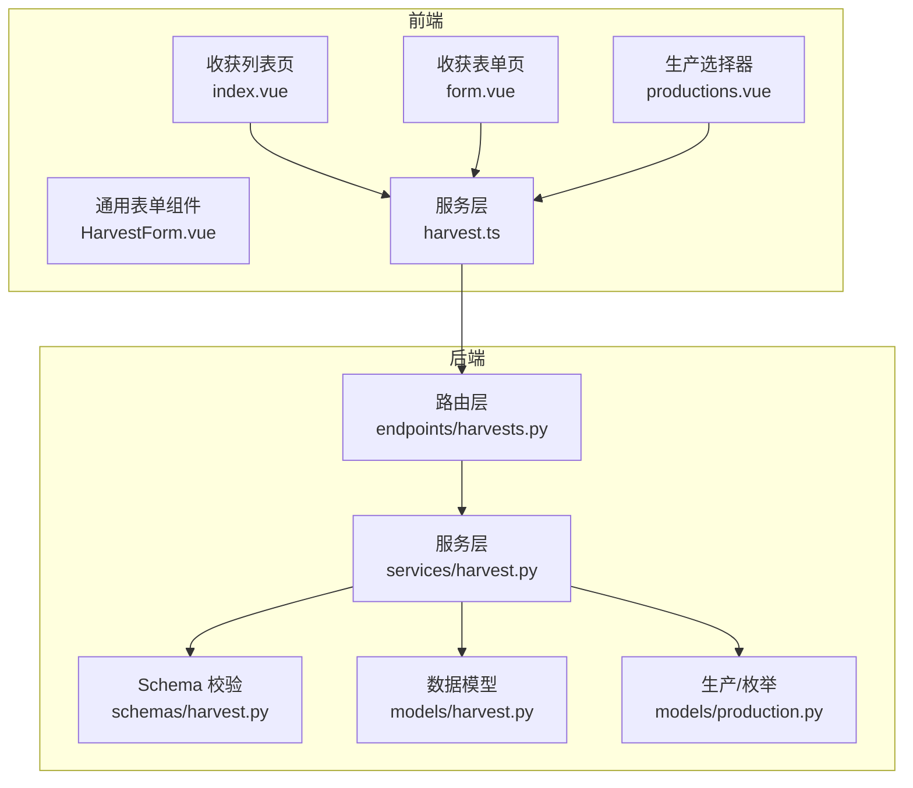
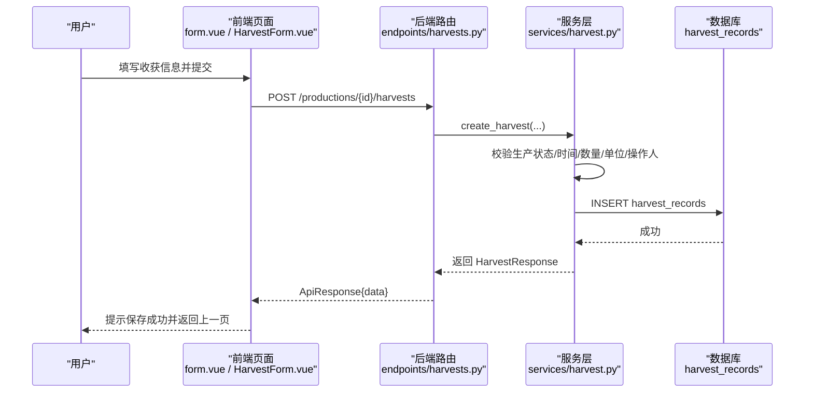
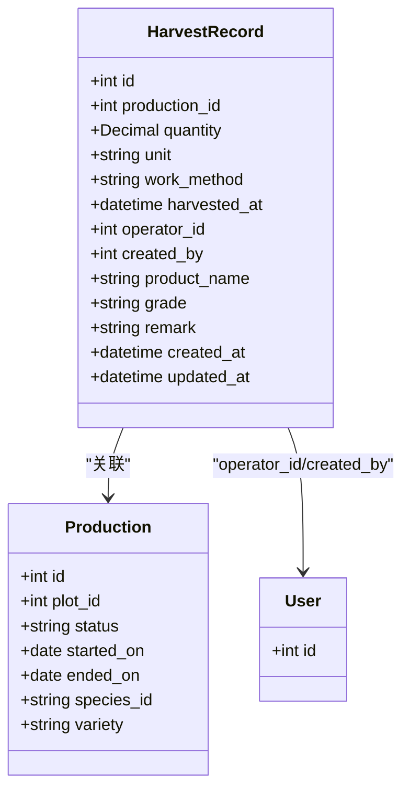
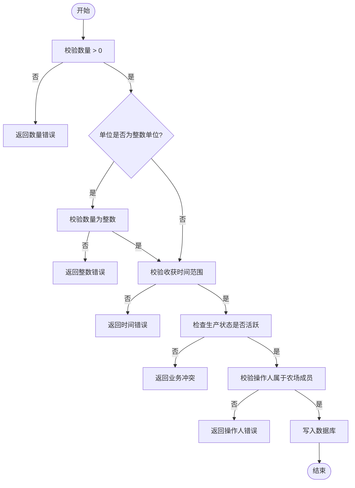
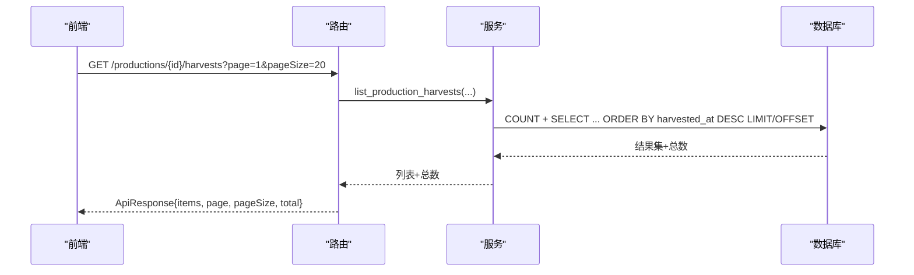
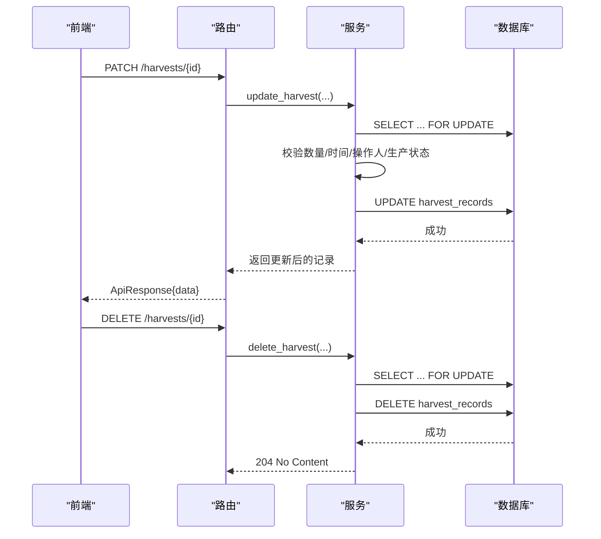
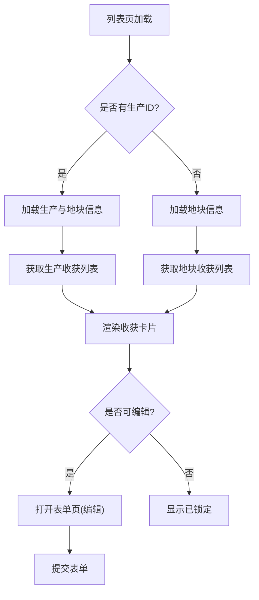
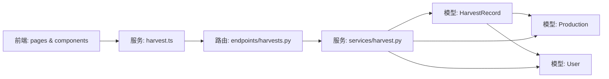

# 收获统计与分析

<cite>
**本文引用的文件**
- [harvest.py](file://apps/api/app/models/harvest.py)
- [harvest.py](file://apps/api/app/schemas/harvest.py)
- [harvest.py](file://apps/api/app/services/harvest.py)
- [harvests.py](file://apps/api/app/api/v1/endpoints/harvests.py)
- [production.py](file://apps/api/app/models/production.py)
- [b8e4d2a1c673_create_harvest_records.py](file://apps/api/alembic/versions/b8e4d2a1c673_create_harvest_records.py)
- [index.vue](file://apps/miniapp/src/pages/harvests/index.vue)
- [form.vue](file://apps/miniapp/src/pages/harvests/form.vue)
- [HarvestForm.vue](file://apps/miniapp/src/components/HarvestForm.vue)
- [productions.vue](file://apps/miniapp/src/pages/harvests/productions.vue)
- [harvest.ts](file://apps/miniapp/src/services/harvest.ts)
</cite>

## 目录
1. [简介](#简介)
2. [项目结构](#项目结构)
3. [核心组件](#核心组件)
4. [架构总览](#架构总览)
5. [详细组件分析](#详细组件分析)
6. [依赖关系分析](#依赖关系分析)
7. [性能与可扩展性](#性能与可扩展性)
8. [故障排查指南](#故障排查指南)
9. [结论](#结论)
10. [附录：API 与数据模型](#附录api-与数据模型)

## 简介
本模块聚焦“收获统计与分析”，覆盖收获数据的录入、查询、编辑、删除，以及基于收获的产量统计与质量评估能力。后端提供 RESTful API 与严格的业务校验；前端提供移动端页面用于列表展示、数据录入表单、生产选择器与基础交互。当前仓库已实现完整的收获记录生命周期管理，并具备按生产/地块维度分页查询的能力，为后续统计分析（如累计产量、单位面积产量、批次质量分布）奠定了数据基础。

## 项目结构
收获功能在前后端分层清晰：
- 后端（FastAPI + SQLAlchemy）
  - 模型层：定义收获记录表结构与字段约束
  - Schema 层：请求/响应体校验与序列化
  - 服务层：业务规则校验、权限与关联上下文获取、CRUD 操作
  - 接口层：路由与参数绑定、统一响应封装
- 前端（uni-app Vue 3）
  - 页面：收获列表、收获表单、生产选择器
  - 组件：可复用的收获表单组件
  - 服务：HTTP 客户端封装与类型定义

图表来源
- [index.vue:1-263](file://apps/miniapp/src/pages/harvests/index.vue#L1-L263)
- [form.vue:1-223](file://apps/miniapp/src/pages/harvests/form.vue#L1-L223)
- [HarvestForm.vue:1-311](file://apps/miniapp/src/components/HarvestForm.vue#L1-L311)
- [productions.vue:1-138](file://apps/miniapp/src/pages/harvests/productions.vue#L1-L138)
- [harvest.ts:1-92](file://apps/miniapp/src/services/harvest.ts#L1-L92)
- [harvests.py:1-163](file://apps/api/app/api/v1/endpoints/harvests.py#L1-L163)
- [harvest.py:1-281](file://apps/api/app/services/harvest.py#L1-L281)
- [harvest.py:1-111](file://apps/api/app/schemas/harvest.py#L1-L111)
- [harvest.py:1-48](file://apps/api/app/models/harvest.py#L1-L48)
- [production.py:1-79](file://apps/api/app/models/production.py#L1-L79)

章节来源
- [index.vue:1-263](file://apps/miniapp/src/pages/harvests/index.vue#L1-L263)
- [form.vue:1-223](file://apps/miniapp/src/pages/harvests/form.vue#L1-L223)
- [HarvestForm.vue:1-311](file://apps/miniapp/src/components/HarvestForm.vue#L1-L311)
- [productions.vue:1-138](file://apps/miniapp/src/pages/harvests/productions.vue#L1-L138)
- [harvest.ts:1-92](file://apps/miniapp/src/services/harvest.ts#L1-L92)
- [harvests.py:1-163](file://apps/api/app/api/v1/endpoints/harvests.py#L1-L163)
- [harvest.py:1-281](file://apps/api/app/services/harvest.py#L1-L281)
- [harvest.py:1-111](file://apps/api/app/schemas/harvest.py#L1-L111)
- [harvest.py:1-48](file://apps/api/app/models/harvest.py#L1-L48)
- [production.py:1-79](file://apps/api/app/models/production.py#L1-L79)

## 核心组件
- 收获记录模型：定义收获记录的数据库表结构与字段约束，包括数量、单位、作业方式、时间、操作人、创建人、产品名、等级、备注等。
- 请求/响应 Schema：对输入进行严格校验（如数量必须大于 0、整数单位必须为整数、时间需带时区），并对输出进行统一序列化。
- 服务层：负责业务规则校验（如收获时间范围、生产状态、操作人归属）、数据持久化、分页查询、并发安全（行级锁）。
- 接口层：暴露 RESTful 路由，统一响应格式，处理分页参数。
- 前端页面与服务：提供收获列表展示、收获表单录入、生产选择器、错误处理与用户提示。

章节来源
- [harvest.py:1-48](file://apps/api/app/models/harvest.py#L1-L48)
- [harvest.py:1-111](file://apps/api/app/schemas/harvest.py#L1-L111)
- [harvest.py:1-281](file://apps/api/app/services/harvest.py#L1-L281)
- [harvests.py:1-163](file://apps/api/app/api/v1/endpoints/harvests.py#L1-L163)
- [index.vue:1-263](file://apps/miniapp/src/pages/harvests/index.vue#L1-L263)
- [form.vue:1-223](file://apps/miniapp/src/pages/harvests/form.vue#L1-L223)
- [HarvestForm.vue:1-311](file://apps/miniapp/src/components/HarvestForm.vue#L1-L311)
- [productions.vue:1-138](file://apps/miniapp/src/pages/harvests/productions.vue#L1-L138)
- [harvest.ts:1-92](file://apps/miniapp/src/services/harvest.ts#L1-L92)

## 架构总览
以下序列图展示了“新增收获记录”的端到端调用流程，涵盖前端表单提交、后端路由、服务层校验与持久化。

图表来源
- [form.vue:172-191](file://apps/miniapp/src/pages/harvests/form.vue#L172-L191)
- [HarvestForm.vue:248-288](file://apps/miniapp/src/components/HarvestForm.vue#L248-L288)
- [harvest.ts:67-76](file://apps/miniapp/src/services/harvest.ts#L67-L76)
- [harvests.py:86-109](file://apps/api/app/api/v1/endpoints/harvests.py#L86-L109)
- [harvest.py:134-178](file://apps/api/app/services/harvest.py#L134-L178)
- [b8e4d2a1c673_create_harvest_records.py:21-57](file://apps/api/alembic/versions/b8e4d2a1c673_create_harvest_records.py#L21-L57)

## 详细组件分析

### 收获记录模型与数据流
- 数据模型
  - 主键：自增 ID
  - 关联：production_id（关联生产）、operator_id、created_by（关联用户）
  - 业务字段：quantity、unit、work_method、harvested_at、product_name、grade、remark
  - 审计字段：created_at、updated_at
- 数据流
  - 前端通过表单收集数据，调用服务层方法发起 HTTP 请求
  - 后端路由接收请求，交由服务层执行校验与持久化
  - 服务层根据生产所属物种/行业确定单位，校验数量合法性与时间范围，验证操作人归属农场成员
  - 写入数据库后返回标准化响应

图表来源
- [harvest.py:13-48](file://apps/api/app/models/harvest.py#L13-L48)
- [production.py:43-79](file://apps/api/app/models/production.py#L43-L79)

章节来源
- [harvest.py:1-48](file://apps/api/app/models/harvest.py#L1-L48)
- [b8e4d2a1c673_create_harvest_records.py:21-77](file://apps/api/alembic/versions/b8e4d2a1c673_create_harvest_records.py#L21-L77)

### 业务规则与校验
- 数量与单位
  - 数量必须大于 0
  - 当单位为头/羽/只/株/尾时，数量必须为整数
- 时间校验
  - 收获时间不能晚于当前时间
  - 收获时间不能早于生产开始日期
- 生产状态
  - 已结束的生产不允许修改收获记录
- 操作人校验
  - 操作人必须是该生产所属农场的成员
- 单位推导
  - 农业/渔业行业默认使用公斤
  - 其他行业使用物种个体单位

图表来源
- [harvest.py:45-69](file://apps/api/app/services/harvest.py#L45-L69)
- [harvest.py:71-84](file://apps/api/app/services/harvest.py#L71-L84)
- [harvest.py:134-178](file://apps/api/app/services/harvest.py#L134-L178)

章节来源
- [harvest.py:45-69](file://apps/api/app/services/harvest.py#L45-L69)
- [harvest.py:71-84](file://apps/api/app/services/harvest.py#L71-L84)
- [harvest.py:134-178](file://apps/api/app/services/harvest.py#L134-L178)

### 列表与分页查询
- 按生产查询收获记录：支持分页，按收获时间倒序排列
- 按地块查询收获记录：通过 JOIN 生产表过滤，支持分页
- 权限控制：查询前会校验用户对该生产/地块的访问权限（通过成员关系）

图表来源
- [harvests.py:66-83](file://apps/api/app/api/v1/endpoints/harvests.py#L66-L83)
- [harvest.py:86-104](file://apps/api/app/services/harvest.py#L86-L104)

章节来源
- [harvests.py:66-83](file://apps/api/app/api/v1/endpoints/harvests.py#L66-L83)
- [harvest.py:86-104](file://apps/api/app/services/harvest.py#L86-L104)
- [harvest.py:107-131](file://apps/api/app/services/harvest.py#L107-L131)

### 编辑与删除
- 编辑：仅允许对活跃生产的收获记录进行修改；更新时逐项校验必填字段与业务规则
- 删除：仅允许对活跃生产的收获记录进行删除；删除前锁定相关记录以确保一致性

图表来源
- [harvests.py:132-162](file://apps/api/app/api/v1/endpoints/harvests.py#L132-L162)
- [harvest.py:181-281](file://apps/api/app/services/harvest.py#L181-L281)

章节来源
- [harvests.py:132-162](file://apps/api/app/api/v1/endpoints/harvests.py#L132-L162)
- [harvest.py:181-281](file://apps/api/app/services/harvest.py#L181-L281)

### 前端界面实现
- 收获列表页
  - 支持按生产或地块维度加载收获记录
  - 显示产品名称、数量与单位、收获时间、操作人与记录人
  - 非活跃生产记录显示“已锁定”，不可编辑或删除
  - 支持删除确认与失败重试
- 收获表单页
  - 支持选择具体生产（若未指定则进入生产选择器）
  - 表单组件自动根据生产行业/物种设置单位与帮助文案
  - 提交前进行本地校验（数量格式、整数限制、时间范围、操作人选择）
- 生产选择器
  - 列出当前范围内进行中的生产，便于选择本次收获归属
- 服务层封装
  - 提供统一的 HTTP 请求方法与类型定义，简化页面调用

图表来源
- [index.vue:143-186](file://apps/miniapp/src/pages/harvests/index.vue#L143-L186)
- [form.vue:102-152](file://apps/miniapp/src/pages/harvests/form.vue#L102-L152)
- [HarvestForm.vue:136-218](file://apps/miniapp/src/components/HarvestForm.vue#L136-L218)
- [productions.vue:61-91](file://apps/miniapp/src/pages/harvests/productions.vue#L61-L91)

章节来源
- [index.vue:1-263](file://apps/miniapp/src/pages/harvests/index.vue#L1-L263)
- [form.vue:1-223](file://apps/miniapp/src/pages/harvests/form.vue#L1-L223)
- [HarvestForm.vue:1-311](file://apps/miniapp/src/components/HarvestForm.vue#L1-L311)
- [productions.vue:1-138](file://apps/miniapp/src/pages/harvests/productions.vue#L1-L138)
- [harvest.ts:1-92](file://apps/miniapp/src/services/harvest.ts#L1-L92)

## 依赖关系分析
- 模型依赖
  - 收获记录依赖生产与用户实体
- 服务依赖
  - 服务层依赖生产服务与地块服务以获取上下文与权限校验
- 前端依赖
  - 页面依赖服务层封装，服务层依赖 HTTP 客户端与类型定义
- 外部依赖
  - 数据库迁移脚本确保表结构一致性与索引优化

图表来源
- [harvest.py:1-48](file://apps/api/app/models/harvest.py#L1-L48)
- [production.py:43-79](file://apps/api/app/models/production.py#L43-L79)
- [harvest.py:1-281](file://apps/api/app/services/harvest.py#L1-L281)
- [harvests.py:1-163](file://apps/api/app/api/v1/endpoints/harvests.py#L1-L163)
- [harvest.ts:1-92](file://apps/miniapp/src/services/harvest.ts#L1-L92)

章节来源
- [harvest.py:1-281](file://apps/api/app/services/harvest.py#L1-L281)
- [harvests.py:1-163](file://apps/api/app/api/v1/endpoints/harvests.py#L1-L163)
- [harvest.ts:1-92](file://apps/miniapp/src/services/harvest.ts#L1-L92)

## 性能与可扩展性
- 查询性能
  - 列表查询使用分页与排序，避免全量加载
  - 针对 production_id 与 operator_id 建立索引，提升查询效率
- 并发安全
  - 编辑/删除时使用行级锁（SELECT ... FOR UPDATE），防止竞态条件
- 可扩展点
  - 可在服务层增加聚合统计接口（如按生产累计产量、按地块汇总、按等级分布）
  - 可增加批量导入/导出能力，支持离线采集与同步
  - 可增加质量评估指标（如等级占比、平均重量、批次波动）

[本节为通用建议，不直接分析具体文件]

## 故障排查指南
- 常见错误与定位
  - 数量非法：检查数量是否大于 0，整数单位是否填写为整数
  - 时间非法：检查收获时间是否晚于当前时间或早于生产开始日期
  - 生产状态：已结束的生产无法修改/删除收获记录
  - 操作人非法：操作人必须属于该生产所属农场成员
- 前端错误处理
  - 401 未授权：跳转登录页
  - 网络或服务异常：显示错误提示并提供重试按钮
- 后端错误码
  - 404 未找到：收获记录不存在或无权限访问
  - 409 业务冲突：生产已结束或数据不一致
  - 422 校验错误：请求参数不符合业务规则

章节来源
- [harvest.py:29-39](file://apps/api/app/services/harvest.py#L29-L39)
- [harvest.py:58-69](file://apps/api/app/services/harvest.py#L58-L69)
- [harvest.py:71-84](file://apps/api/app/services/harvest.py#L71-L84)
- [index.vue:177-186](file://apps/miniapp/src/pages/harvests/index.vue#L177-L186)
- [form.vue:143-152](file://apps/miniapp/src/pages/harvests/form.vue#L143-L152)

## 结论
本模块实现了收获记录的完整生命周期管理与严格的业务校验，提供了按生产/地块维度的分页查询能力，并为后续的产量统计与质量评估奠定了坚实的数据基础。前端界面友好、交互流畅，支持列表展示、表单录入与生产选择。建议在现有基础上扩展统计分析接口与可视化报表，进一步提升农业产量的数据采集与分析能力。

[本节为总结性内容，不直接分析具体文件]

## 附录：API 与数据模型
- 主要接口
  - 获取生产收获列表：GET /productions/{production_id}/harvests
  - 新增收获记录：POST /productions/{production_id}/harvests
  - 获取地块收获列表：GET /plots/{plot_id}/harvests
  - 编辑收获记录：PATCH /harvests/{harvest_id}
  - 删除收获记录：DELETE /harvests/{harvest_id}
- 请求/响应要点
  - 数量：必须大于 0，整数单位需为整数
  - 时间：需带时区，且不得晚于当前时间、不早于生产开始日期
  - 单位：农业/渔业默认公斤，其他按物种个体单位
  - 分页：page、pageSize，返回 items、total
- 数据模型关键字段
  - 收获记录：id、production_id、quantity、unit、work_method、harvested_at、operator_id、created_by、product_name、grade、remark、created_at、updated_at

章节来源
- [harvests.py:66-162](file://apps/api/app/api/v1/endpoints/harvests.py#L66-L162)
- [harvest.py:15-111](file://apps/api/app/schemas/harvest.py#L15-L111)
- [harvest.py:13-48](file://apps/api/app/models/harvest.py#L13-L48)
- [production.py:29-41](file://apps/api/app/models/production.py#L29-L41)