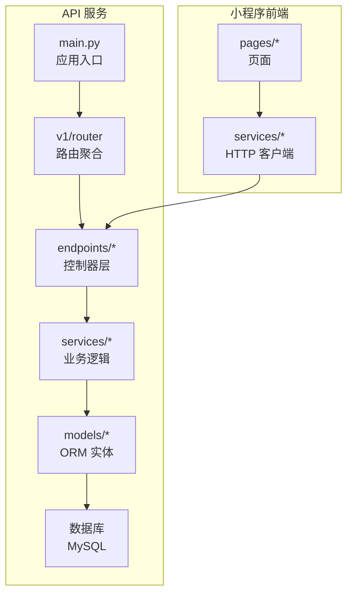
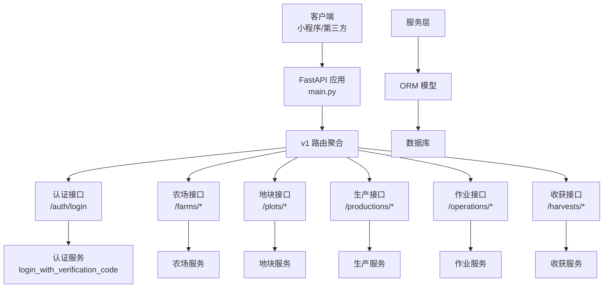
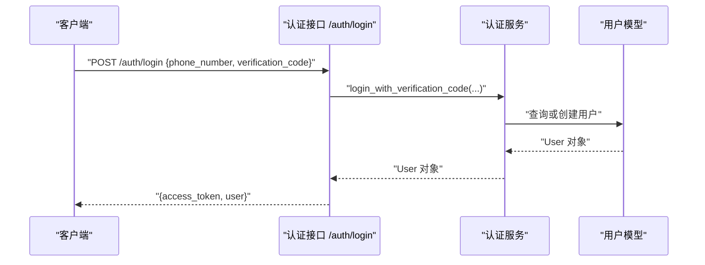
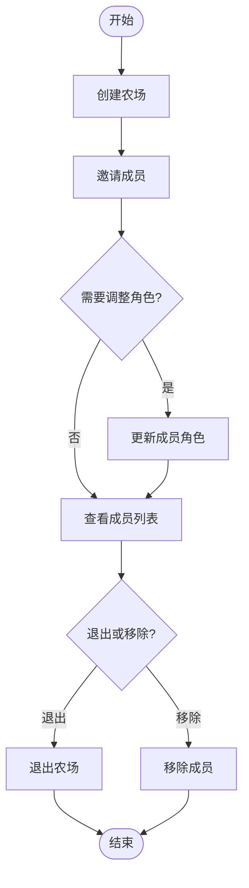
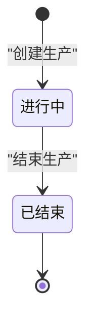
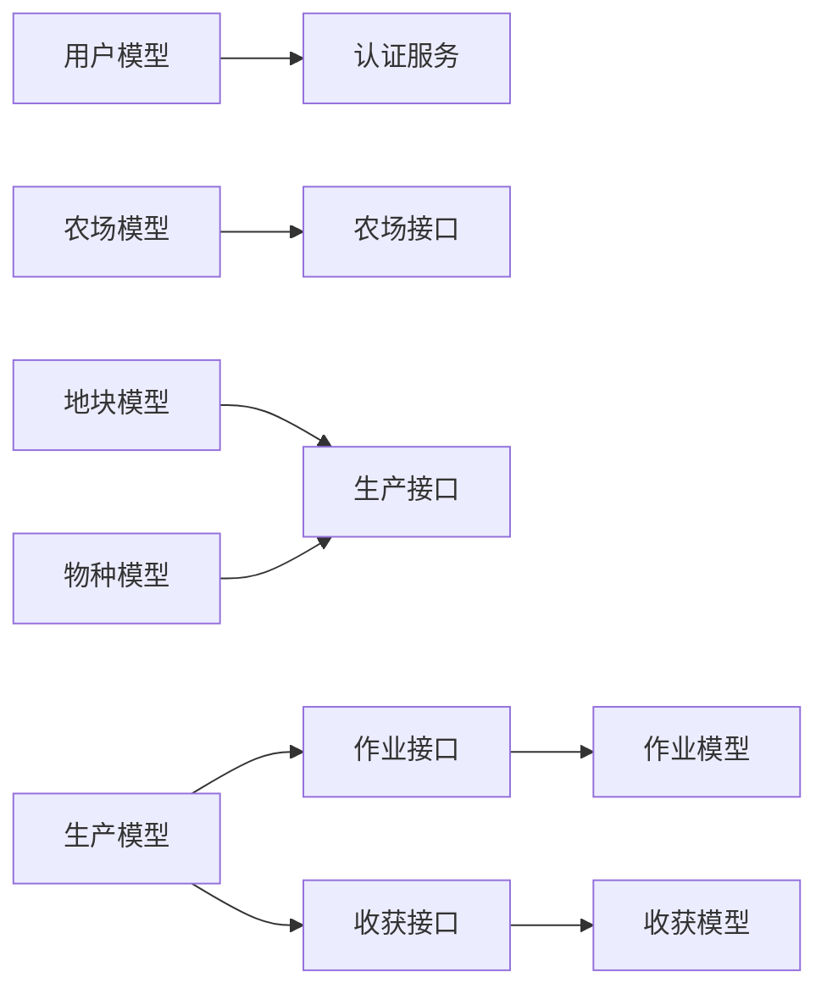

# 核心功能

<cite>
**本文引用的文件**
- [apps/api/app/main.py](file://apps/api/app/main.py)
- [apps/api/app/core/config.py](file://apps/api/app/core/config.py)
- [apps/api/app/models/user.py](file://apps/api/app/models/user.py)
- [apps/api/app/models/farm.py](file://apps/api/app/models/farm.py)
- [apps/api/app/models/plot.py](file://apps/api/app/models/plot.py)
- [apps/api/app/models/production.py](file://apps/api/app/models/production.py)
- [apps/api/app/models/operation.py](file://apps/api/app/models/operation.py)
- [apps/api/app/models/harvest.py](file://apps/api/app/models/harvest.py)
- [apps/api/app/models/species.py](file://apps/api/app/models/species.py)
- [apps/api/app/services/auth.py](file://apps/api/app/services/auth.py)
- [apps/api/app/api/v1/endpoints/auth.py](file://apps/api/app/api/v1/endpoints/auth.py)
- [apps/api/app/api/v1/endpoints/farms.py](file://apps/api/app/api/v1/endpoints/farms.py)
- [apps/api/app/api/v1/endpoints/productions.py](file://apps/api/app/api/v1/endpoints/productions.py)
- [apps/api/app/api/v1/endpoints/harvests.py](file://apps/api/app/api/v1/endpoints/harvests.py)
- [apps/api/app/api/v1/endpoints/operations.py](file://apps/api/app/api/v1/endpoints/operations.py)
</cite>

## 目录
1. [简介](#简介)
2. [项目结构](#项目结构)
3. [核心组件](#核心组件)
4. [架构总览](#架构总览)
5. [详细组件分析](#详细组件分析)
6. [依赖关系分析](#依赖关系分析)
7. [性能考量](#性能考量)
8. [故障排查指南](#故障排查指南)
9. [结论](#结论)
10. [附录](#附录)

## 简介
本文件面向 Pocket Farm 项目的业务与工程读者，系统化梳理并说明系统的核心功能模块：用户认证与授权、农场协作管理、地块规划与管理、生产生命周期跟踪、农事活动记录、收获统计分析与物种管理等。文档从业务场景出发，结合后端 API 与服务实现，解释各模块的职责边界、数据流转、权限模型与使用流程，并提供可视化图示帮助理解系统架构与关键流程。同时给出功能优先级与实现状态的说明，便于产品与研发团队对齐目标与进度。

## 项目结构
Pocket Farm 采用前后端分离的单体仓库组织方式：
- 后端 API（FastAPI）：位于 apps/api，按领域划分 models、services、schemas、api/v1/endpoints，统一通过 main.py 启动应用并挂载路由与健康检查。
- 前端小程序（uni-app/Vue）：位于 apps/miniapp，提供农场、地块、生产、作业、收获等页面与表单，调用后端 REST API。
- 数据库迁移：使用 Alembic 管理 schema 演进。

图表来源
- [apps/api/app/main.py:19-27](file://apps/api/app/main.py#L19-L27)
- [apps/api/app/api/v1/endpoints/auth.py:10-28](file://apps/api/app/api/v1/endpoints/auth.py#L10-L28)
- [apps/api/app/api/v1/endpoints/farms.py:32-200](file://apps/api/app/api/v1/endpoints/farms.py#L32-L200)
- [apps/api/app/api/v1/endpoints/productions.py:32-198](file://apps/api/app/api/v1/endpoints/productions.py#L32-L198)
- [apps/api/app/api/v1/endpoints/harvests.py:26-163](file://apps/api/app/api/v1/endpoints/harvests.py#L26-L163)
- [apps/api/app/api/v1/endpoints/operations.py:28-168](file://apps/api/app/api/v1/endpoints/operations.py#L28-L168)

章节来源
- [apps/api/app/main.py:1-27](file://apps/api/app/main.py#L1-L27)
- [apps/api/app/core/config.py:5-22](file://apps/api/app/core/config.py#L5-L22)

## 核心组件
- 用户与认证
  - 用户模型：手机号唯一标识，支持昵称与时间戳。
  - 验证码登录：在测试模式下允许以验证码登录；成功返回访问令牌与用户信息。
- 农场协作
  - 农场实体：包含农场编码、名称、区域、创建者等。
  - 成员角色：拥有者 OWNER、管理员 ADMIN、普通成员 MEMBER，支持邀请、移除、退出与角色变更。
- 地块规划与管理
  - 地块类型：田地、水田、温室、果园、林地、池塘、棚屋、其他。
  - 面积单位：亩、平方米、公顷；支持边界 JSON 存储。
- 生产生命周期
  - 生产记录：关联地块与物种，记录品种、种植标准与方法、作业方式、预期收获日期、单产、初始数量、株距、入龄天数等。
  - 状态：进行中 ACTIVE、已结束 ENDED。
- 农事活动记录
  - 作业类型：可配置的活动类型（如播种、施肥、除草等），支持排序与启用/禁用。
  - 作业记录：关联地块与可选的生产，记录作业方式、操作时间、操作人、备注等。
- 收获统计与分析
  - 收获记录：关联生产，记录数量与单位、作业方式、收获时间、操作人、产品名称、等级、备注等。
  - 支持按生产或地块维度查询与分页。
- 物种管理
  - 物种定义：名称、行业（农业、林业、畜牧、渔业）、个体单位（头、羽、只、株、尾）。

章节来源
- [apps/api/app/models/user.py:15-27](file://apps/api/app/models/user.py#L15-L27)
- [apps/api/app/services/auth.py:11-46](file://apps/api/app/services/auth.py#L11-L46)
- [apps/api/app/api/v1/endpoints/auth.py:13-28](file://apps/api/app/api/v1/endpoints/auth.py#L13-L28)
- [apps/api/app/models/farm.py:12-59](file://apps/api/app/models/farm.py#L12-L59)
- [apps/api/app/api/v1/endpoints/farms.py:58-200](file://apps/api/app/api/v1/endpoints/farms.py#L58-L200)
- [apps/api/app/models/plot.py:14-54](file://apps/api/app/models/plot.py#L14-L54)
- [apps/api/app/models/production.py:13-79](file://apps/api/app/models/production.py#L13-L79)
- [apps/api/app/api/v1/endpoints/productions.py:71-198](file://apps/api/app/api/v1/endpoints/productions.py#L71-L198)
- [apps/api/app/models/operation.py:13-80](file://apps/api/app/models/operation.py#L13-L80)
- [apps/api/app/api/v1/endpoints/operations.py:63-168](file://apps/api/app/api/v1/endpoints/operations.py#L63-L168)
- [apps/api/app/models/harvest.py:13-48](file://apps/api/app/models/harvest.py#L13-L48)
- [apps/api/app/api/v1/endpoints/harvests.py:66-163](file://apps/api/app/api/v1/endpoints/harvests.py#L66-L163)
- [apps/api/app/models/species.py:12-35](file://apps/api/app/models/species.py#L12-L35)

## 架构总览
系统采用分层架构：API 路由层负责请求解析与响应封装；服务层承载业务规则与事务；模型层映射数据库表；配置与安全模块提供鉴权与全局设置。

图表来源
- [apps/api/app/main.py:19-27](file://apps/api/app/main.py#L19-L27)
- [apps/api/app/api/v1/endpoints/auth.py:13-28](file://apps/api/app/api/v1/endpoints/auth.py#L13-L28)
- [apps/api/app/api/v1/endpoints/farms.py:58-200](file://apps/api/app/api/v1/endpoints/farms.py#L58-L200)
- [apps/api/app/api/v1/endpoints/productions.py:71-198](file://apps/api/app/api/v1/endpoints/productions.py#L71-L198)
- [apps/api/app/api/v1/endpoints/operations.py:63-168](file://apps/api/app/api/v1/endpoints/operations.py#L63-L168)
- [apps/api/app/api/v1/endpoints/harvests.py:66-163](file://apps/api/app/api/v1/endpoints/harvests.py#L66-L163)

## 详细组件分析

### 用户认证与授权
- 业务场景
  - 新用户通过手机号与验证码登录，系统在测试模式下允许以固定验证码快速验证；成功后颁发访问令牌，用于后续受保护接口的鉴权。
- 使用流程
  - 客户端调用登录接口提交手机号与验证码；服务端校验并获取或创建用户；返回令牌与用户信息。
- 权限模型
  - 当前实现基于 JWT 访问令牌进行接口鉴权；农场级权限由成员角色控制（OWNER/ADMIN/MEMBER）。
- 关键数据流
  - 登录请求 -> 认证服务 -> 用户模型 -> 返回令牌与用户信息。

图表来源
- [apps/api/app/api/v1/endpoints/auth.py:13-28](file://apps/api/app/api/v1/endpoints/auth.py#L13-L28)
- [apps/api/app/services/auth.py:11-46](file://apps/api/app/services/auth.py#L11-L46)
- [apps/api/app/models/user.py:15-27](file://apps/api/app/models/user.py#L15-L27)

章节来源
- [apps/api/app/api/v1/endpoints/auth.py:13-28](file://apps/api/app/api/v1/endpoints/auth.py#L13-L28)
- [apps/api/app/services/auth.py:11-46](file://apps/api/app/services/auth.py#L11-L46)
- [apps/api/app/models/user.py:15-27](file://apps/api/app/models/user.py#L15-L27)
- [apps/api/app/core/config.py:10-19](file://apps/api/app/core/config.py#L10-L19)

### 农场协作管理
- 业务场景
  - 用户创建农场并邀请成员加入，支持查看成员列表、修改成员角色、移除成员或退出农场。
- 使用流程
  - 创建农场后，通过成员接口添加成员；管理员可调整角色；成员可退出。
- 权限模型
  - 角色：OWNER（所有者）、ADMIN（管理员）、MEMBER（成员）；不同角色对农场资源具有不同操作权限。
- 关键数据流
  - 农场 CRUD -> 成员管理 -> 角色校验 -> 持久化。

图表来源
- [apps/api/app/api/v1/endpoints/farms.py:58-200](file://apps/api/app/api/v1/endpoints/farms.py#L58-L200)
- [apps/api/app/models/farm.py:12-59](file://apps/api/app/models/farm.py#L12-L59)

章节来源
- [apps/api/app/api/v1/endpoints/farms.py:58-200](file://apps/api/app/api/v1/endpoints/farms.py#L58-L200)
- [apps/api/app/models/farm.py:12-59](file://apps/api/app/models/farm.py#L12-L59)

### 地块规划与管理
- 业务场景
  - 为农场划分地块，支持多种类型与面积单位，并可记录地理边界信息。
- 使用流程
  - 选择地块类型与单位，填写面积与边界，保存后可用于后续生产与作业。
- 关键数据流
  - 地块创建/更新 -> 关联农场 -> 存储边界 JSON。

章节来源
- [apps/api/app/models/plot.py:14-54](file://apps/api/app/models/plot.py#L14-L54)

### 生产生命周期跟踪
- 业务场景
  - 在指定地块上建立生产记录，记录品种、种植标准与方法、作业方式、预期收获日期、单产、初始数量、株距、入龄天数等，并支持结束生产。
- 使用流程
  - 创建生产 -> 维护生产信息 -> 结束时标记状态为已结束。
- 关键数据流
  - 生产 CRUD -> 关联地块与物种 -> 状态机（ACTIVE/ENDED）。

图表来源
- [apps/api/app/models/production.py:13-79](file://apps/api/app/models/production.py#L13-L79)
- [apps/api/app/api/v1/endpoints/productions.py:174-187](file://apps/api/app/api/v1/endpoints/productions.py#L174-L187)

章节来源
- [apps/api/app/models/production.py:13-79](file://apps/api/app/models/production.py#L13-L79)
- [apps/api/app/api/v1/endpoints/productions.py:71-198](file://apps/api/app/api/v1/endpoints/productions.py#L71-L198)

### 农事活动记录
- 业务场景
  - 记录在地块或生产上的具体农事活动（如播种、施肥、喷药等），支持作业方式、操作时间与操作人。
- 使用流程
  - 选择作业类型与地块（可选关联生产），填写作业详情并保存。
- 关键数据流
  - 作业类型管理 -> 作业记录 -> 关联地块与生产。

章节来源
- [apps/api/app/models/operation.py:13-80](file://apps/api/app/models/operation.py#L13-L80)
- [apps/api/app/api/v1/endpoints/operations.py:63-168](file://apps/api/app/api/v1/endpoints/operations.py#L63-L168)

### 收获统计与分析
- 业务场景
  - 记录每次收获的产量、单位、作业方式、收获时间与操作人，支持按生产或地块维度查询与分页。
- 使用流程
  - 在生产或地块下新增收获记录，便于后续统计与产出分析。
- 关键数据流
  - 收获记录 -> 关联生产 -> 统计汇总。

章节来源
- [apps/api/app/models/harvest.py:13-48](file://apps/api/app/models/harvest.py#L13-L48)
- [apps/api/app/api/v1/endpoints/harvests.py:66-163](file://apps/api/app/api/v1/endpoints/harvests.py#L66-L163)

### 物种管理
- 业务场景
  - 维护作物或养殖物种的基础信息，包括行业分类与个体单位，供生产记录引用。
- 使用流程
  - 新增或维护物种信息，作为生产记录的参考字典。
- 关键数据流
  - 物种 CRUD -> 被生产记录引用。

章节来源
- [apps/api/app/models/species.py:12-35](file://apps/api/app/models/species.py#L12-L35)

## 依赖关系分析
- 模块耦合
  - 认证模块依赖用户模型与配置；农场、地块、生产、作业、收获模块均依赖用户与会话上下文进行权限校验。
  - 生产模块依赖地块与物种；作业与收获模块可关联生产，形成“地块-生产-作业/收获”的数据链。
- 外部依赖
  - 数据库：MySQL（通过 SQLAlchemy 异步会话）。
  - 安全：JWT 访问令牌生成与校验。
- 潜在循环依赖
  - 当前模型间通过外键关联，未见代码层面的循环导入；服务层按领域拆分，职责清晰。

图表来源
- [apps/api/app/models/user.py:15-27](file://apps/api/app/models/user.py#L15-L27)
- [apps/api/app/models/farm.py:12-59](file://apps/api/app/models/farm.py#L12-L59)
- [apps/api/app/models/plot.py:14-54](file://apps/api/app/models/plot.py#L14-L54)
- [apps/api/app/models/production.py:13-79](file://apps/api/app/models/production.py#L13-L79)
- [apps/api/app/models/operation.py:13-80](file://apps/api/app/models/operation.py#L13-L80)
- [apps/api/app/models/harvest.py:13-48](file://apps/api/app/models/harvest.py#L13-L48)
- [apps/api/app/models/species.py:12-35](file://apps/api/app/models/species.py#L12-L35)

章节来源
- [apps/api/app/models/user.py:15-27](file://apps/api/app/models/user.py#L15-L27)
- [apps/api/app/models/farm.py:12-59](file://apps/api/app/models/farm.py#L12-L59)
- [apps/api/app/models/plot.py:14-54](file://apps/api/app/models/plot.py#L14-L54)
- [apps/api/app/models/production.py:13-79](file://apps/api/app/models/production.py#L13-L79)
- [apps/api/app/models/operation.py:13-80](file://apps/api/app/models/operation.py#L13-L80)
- [apps/api/app/models/harvest.py:13-48](file://apps/api/app/models/harvest.py#L13-L48)
- [apps/api/app/models/species.py:12-35](file://apps/api/app/models/species.py#L12-L35)

## 性能考量
- 分页与过滤
  - 多数列表接口支持 page/pageSize 参数，建议前端合理设置页大小以避免大结果集传输。
- 索引设计
  - 模型中对外键字段（如 farm_id、plot_id、production_id、user_id）建立索引，提升关联查询性能。
- 时区处理
  - 时间字段统一转换为 UTC 再返回，避免前端时区差异导致展示问题。
- 连接池管理
  - 应用生命周期内管理数据库引擎释放，避免连接泄漏。

[本节为通用指导，不直接分析具体文件]

## 故障排查指南
- 认证失败
  - 验证码错误或未开启测试登录模式将返回未授权错误；请检查配置与输入。
- 并发冲突
  - 用户创建可能因手机号唯一约束产生冲突，服务层会回滚并返回业务冲突错误。
- 权限不足
  - 访问农场相关接口需具备相应角色；若角色校验失败，应检查成员关系与角色。
- 数据一致性
  - 生产结束、作业与收获记录需确保关联实体存在且具备访问权限；出现异常时应检查外键与权限。

章节来源
- [apps/api/app/services/auth.py:11-46](file://apps/api/app/services/auth.py#L11-L46)
- [apps/api/app/api/v1/endpoints/farms.py:58-200](file://apps/api/app/api/v1/endpoints/farms.py#L58-L200)
- [apps/api/app/api/v1/endpoints/productions.py:71-198](file://apps/api/app/api/v1/endpoints/productions.py#L71-L198)
- [apps/api/app/api/v1/endpoints/operations.py:63-168](file://apps/api/app/api/v1/endpoints/operations.py#L63-L168)
- [apps/api/app/api/v1/endpoints/harvests.py:66-163](file://apps/api/app/api/v1/endpoints/harvests.py#L66-L163)

## 结论
Pocket Farm 围绕“农场-地块-生产-作业-收获”的主线构建了完整的农业生产管理闭环。通过清晰的领域模型与分层架构，系统实现了用户认证、农场协作、地块规划、生产生命周期跟踪、农事活动记录与收获统计分析等核心能力。当前已实现基础功能与权限控制，后续可在数据统计、报表导出、预警提醒等方面持续增强。

[本节为总结性内容，不直接分析具体文件]

## 附录
- 功能特性优先级与实现状态（基于现有代码推断）
  - 高优先级（已实现）
    - 用户认证与授权：验证码登录、JWT 令牌
    - 农场协作管理：创建、成员管理、角色控制
    - 地块规划与管理：类型、面积、边界
    - 生产生命周期：创建、编辑、结束
    - 农事活动记录：作业类型、作业记录
    - 收获统计与分析：按生产/地块查询与分页
    - 物种管理：基础信息与单位
  - 中优先级（可扩展）
    - 生产计划与排程
    - 成本与收益核算
    - 质量追溯与批次管理
  - 低优先级（未来规划）
    - 设备与农资库存管理
    - 气象与环境监测集成
    - 移动端离线同步与消息推送

[本节为概念性内容，不直接分析具体文件]