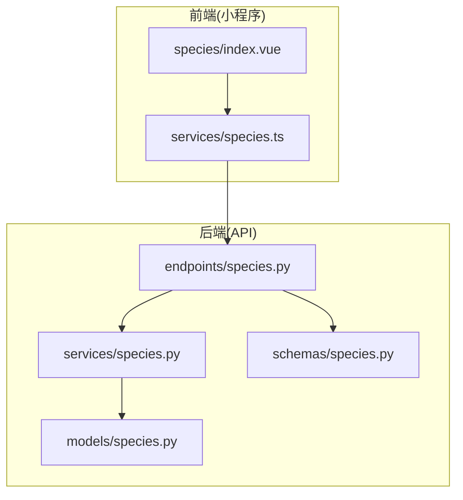
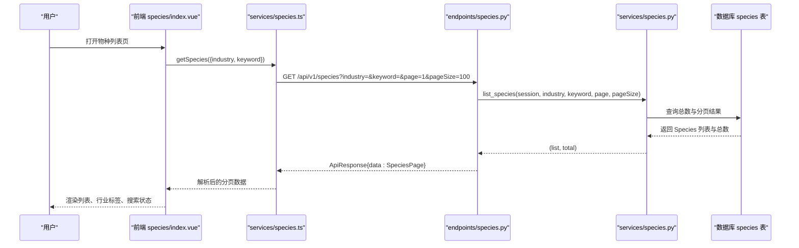
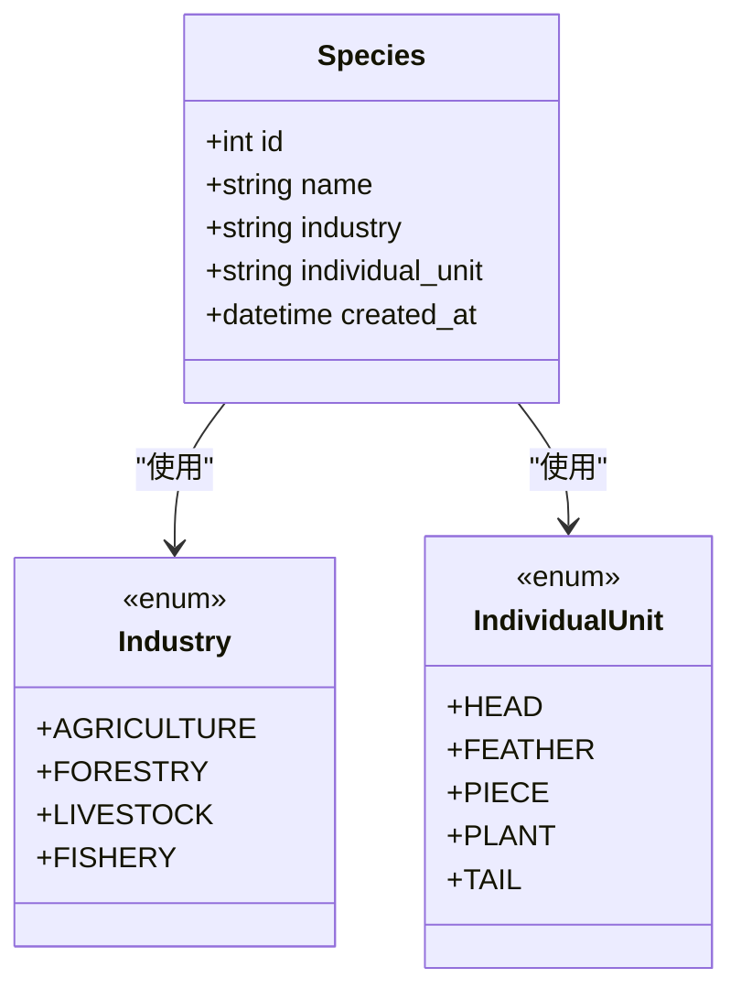
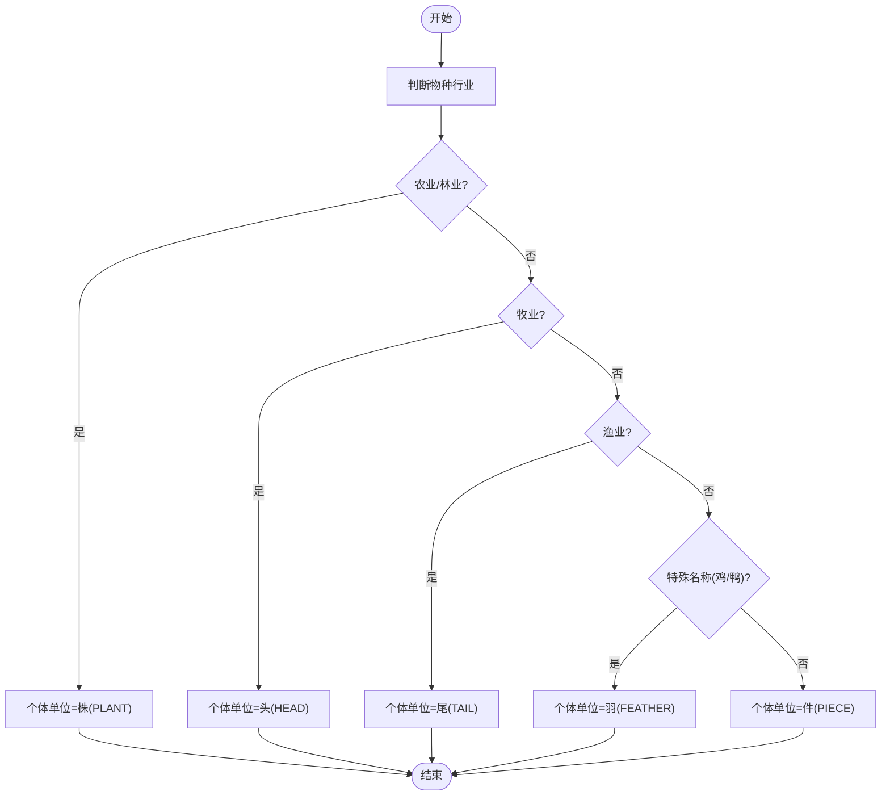
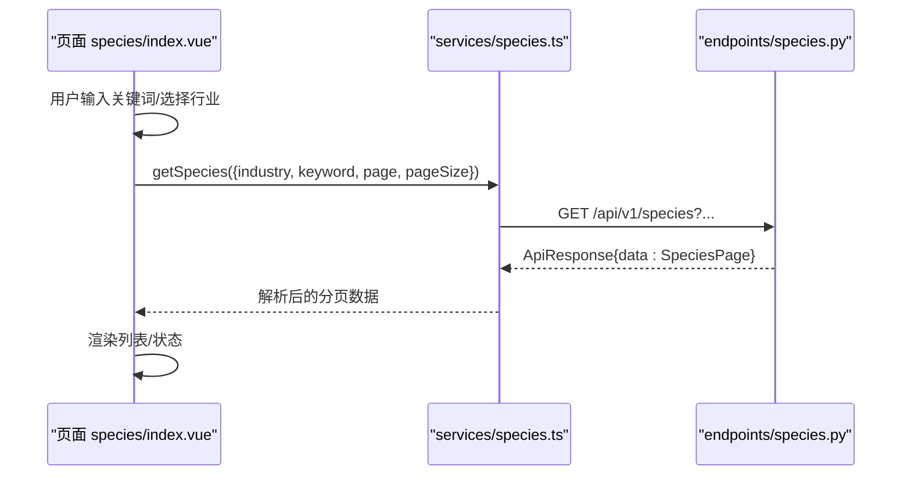
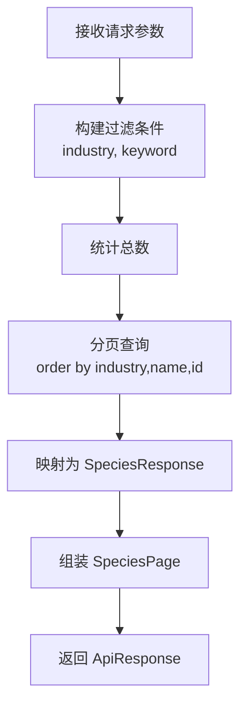

# 物种管理

<cite>
**本文引用的文件**
- [apps/api/app/models/species.py](file://apps/api/app/models/specpecies.py)
- [apps/api/app/schemas/species.py](file://apps/api/app/schemas/species.py)
- [apps/api/app/services/species.py](file://apps/api/app/services/species.py)
- [apps/api/app/api/v1/endpoints/species.py](file://apps/api/app/api/v1/endpoints/species.py)
- [apps/miniapp/src/pages/species/index.vue](file://apps/miniapp/src/pages/species/index.vue)
- [apps/miniapp/src/services/species.ts](file://apps/miniapp/src/services/species.ts)
- [apps/api/alembic/versions/1bf2b6d1b674_create_species_and_productions.py](file://apps/api/alembic/versions/1bf2b6d1b674_create_species_and_productions.py)
- [apps/api/alembic/versions/093fa42fe3ad_refine_production_industry_fields.py](file://apps/api/alembic/versions/093fa42fe3ad_refine_production_industry_fields.py)
- [apps/api/app/models/production.py](file://apps/api/app/models/production.py)
</cite>

## 目录
1. [简介](#简介)
2. [项目结构](#项目结构)
3. [核心组件](#核心组件)
4. [架构总览](#架构总览)
5. [详细组件分析](#详细组件分析)
6. [依赖关系分析](#依赖关系分析)
7. [性能考虑](#性能考虑)
8. [故障排查指南](#故障排查指南)
9. [结论](#结论)
10. [附录](#附录)

## 简介
本模块为“物种管理”提供标准化能力，涵盖农作物种类定义、行业标准配置与个体单位设置。通过统一的模型设计、服务层查询与API接口，以及前端列表展示与选择交互，实现农业领域内物种信息的标准化管理，并为生产记录（如种植、养殖）提供基础数据支撑。

## 项目结构
围绕物种管理的代码分布在后端 API 与前端小程序两端：
- 后端：模型定义、Schema 校验、服务层分页查询、FastAPI 路由暴露接口
- 前端：页面列表展示、行业筛选、关键词搜索、调用服务获取数据并渲染

图表来源
- [apps/miniapp/src/pages/species/index.vue:1-258](file://apps/miniapp/src/pages/species/index.vue#L1-L258)
- [apps/miniapp/src/services/species.ts:1-34](file://apps/miniapp/src/services/species.ts#L1-L34)
- [apps/api/app/api/v1/endpoints/species.py:1-50](file://apps/api/app/api/v1/endpoints/species.py#L1-L50)
- [apps/api/app/services/species.py:1-30](file://apps/api/app/services/species.py#L1-L30)
- [apps/api/app/schemas/species.py:1-21](file://apps/api/app/schemas/species.py#L1-L21)
- [apps/api/app/models/species.py:1-35](file://apps/api/app/models/species.py#L1-L35)

章节来源
- [apps/api/app/models/species.py:1-35](file://apps/api/app/models/species.py#L1-L35)
- [apps/api/app/schemas/species.py:1-21](file://apps/api/app/schemas/species.py#L1-L21)
- [apps/api/app/services/species.py:1-30](file://apps/api/app/services/species.py#L1-L30)
- [apps/api/app/api/v1/endpoints/species.py:1-50](file://apps/api/app/api/v1/endpoints/species.py#L1-L50)
- [apps/miniapp/src/pages/species/index.vue:1-258](file://apps/miniapp/src/pages/species/index.vue#L1-L258)
- [apps/miniapp/src/services/species.ts:1-34](file://apps/miniapp/src/services/species.ts#L1-L34)

## 核心组件
- 物种模型与枚举
  - 行业分类：农业、林业、牧业、渔业
  - 个体单位：头、羽、件、株、尾
  - 字段：名称、行业、个体单位、创建时间
- 数据契约（Schema）
  - 返回对象包含 id、name、industry、individualUnit、createdAt
  - 分页对象包含 items、page、pageSize、total
- 服务层
  - 支持按行业过滤、关键词模糊搜索、分页排序
- API 端点
  - GET /api/v1/species：受认证保护，返回列表与总数
- 前端界面
  - 搜索框、行业标签切换、列表展示、错误状态处理、选择后回传

章节来源
- [apps/api/app/models/species.py:12-35](file://apps/api/app/models/species.py#L12-L35)
- [apps/api/app/schemas/species.py:8-21](file://apps/api/app/schemas/species.py#L8-L21)
- [apps/api/app/services/species.py:7-29](file://apps/api/app/services/species.py#L7-L29)
- [apps/api/app/api/v1/endpoints/species.py:16-49](file://apps/api/app/api/v1/endpoints/species.py#L16-L49)
- [apps/miniapp/src/pages/species/index.vue:64-159](file://apps/miniapp/src/pages/species/index.vue#L64-L159)
- [apps/miniapp/src/services/species.ts:3-33](file://apps/miniapp/src/services/species.ts#L3-L33)

## 架构总览
从请求到响应的完整链路如下：

图表来源
- [apps/miniapp/src/pages/species/index.vue:112-132](file://apps/miniapp/src/pages/species/index.vue#L112-L132)
- [apps/miniapp/src/services/species.ts:28-33](file://apps/miniapp/src/services/species.ts#L28-L33)
- [apps/api/app/api/v1/endpoints/species.py:26-49](file://apps/api/app/api/v1/endpoints/species.py#L26-L49)
- [apps/api/app/services/species.py:7-29](file://apps/api/app/services/species.py#L7-L29)

## 详细组件分析

### 物种模型与行业标准
- 行业枚举
  - AGRICULTURE（农业）、FORESTRY（林业）、LIVESTOCK（牧业）、FISHERY（渔业）
- 个体单位枚举
  - HEAD（头）、FEATHER（羽）、PIECE（件）、PLANT（株）、TAIL（尾）
- 模型字段
  - id、name、industry、individual_unit、created_at
- 初始化数据与单位映射规则
  - 迁移脚本在创建 species 表时插入默认物种
  - 后续迁移根据行业与名称自动填充 individual_unit：
    - 农业/林业 -> PLANT
    - 鸡/鸭 -> FEATHER
    - 牧业 -> HEAD
    - 渔业 -> TAIL
    - 其他 -> PIECE

图表来源
- [apps/api/app/models/species.py:12-35](file://apps/api/app/models/species.py#L12-L35)
- [apps/api/alembic/versions/1bf2b6d1b674_create_species_and_productions.py:22-66](file://apps/api/alembic/versions/1bf2b6d1b674_create_species_and_productions.py#L22-L66)
- [apps/api/alembic/versions/093fa42fe3ad_refine_production_industry_fields.py:41-59](file://apps/api/alembic/versions/093fa42fe3ad_refine_production_industry_fields.py#L41-L59)

章节来源
- [apps/api/app/models/species.py:12-35](file://apps/api/app/models/species.py#L12-L35)
- [apps/api/alembic/versions/1bf2b6d1b674_create_species_and_productions.py:22-66](file://apps/api/alembic/versions/1bf2b6d1b674_create_species_and_productions.py#L22-L66)
- [apps/api/alembic/versions/093fa42fe3ad_refine_production_industry_fields.py:41-59](file://apps/api/alembic/versions/093fa42fe3ad_refine_production_industry_fields.py#L41-L59)

### 行业标准管理与单位换算机制
- 行业标准即“行业+个体单位”的组合，用于规范不同类别物种的计量方式
- 单位换算策略
  - 当前系统以“个体单位”作为统一度量基准，不直接进行跨单位换算
  - 在生产记录中，期望产量采用“每亩”数值，初始数量使用与物种个体单位一致的数值，避免复杂换算
  - 若未来需要跨单位换算，建议在服务层或业务层基于行业与单位建立换算表与转换函数
- 相关字段
  - 生产记录中的 expected_yield_per_mu（每亩预期产量）、initial_quantity（初始数量）、plant_spacing_cm（株距厘米）等，均与物种单位保持一致性约束

图表来源
- [apps/api/alembic/versions/093fa42fe3ad_refine_production_industry_fields.py:41-59](file://apps/api/alembic/versions/093fa42fe3ad_refine_production_industry_fields.py#L41-L59)
- [apps/api/app/models/production.py:34-41](file://apps/api/app/models/production.py#L34-L41)

章节来源
- [apps/api/alembic/versions/093fa42fe3ad_refine_production_industry_fields.py:41-59](file://apps/api/alembic/versions/093fa42fe3ad_refine_production_industry_fields.py#L41-L59)
- [apps/api/app/models/production.py:34-41](file://apps/api/app/models/production.py#L34-L41)

### 前端界面实现（列表与详情）
- 列表页功能
  - 搜索框：支持关键词搜索
  - 行业标签：全部、农业、林业、牧业、渔业
  - 列表项：显示名称与行业标签
  - 状态：加载中、错误重试、空结果提示
  - 选择行为：根据用途（生产流程或通用选择）回传选中物种
- 服务层封装
  - 类型定义：Industry、IndividualUnit、Species、SpeciesPage、SpeciesQuery
  - 请求参数：industry、keyword、page、pageSize
  - 响应处理：将后端返回的分页数据映射到前端类型

图表来源
- [apps/miniapp/src/pages/species/index.vue:64-159](file://apps/miniapp/src/pages/species/index.vue#L64-L159)
- [apps/miniapp/src/services/species.ts:3-33](file://apps/miniapp/src/services/species.ts#L3-L33)
- [apps/api/app/api/v1/endpoints/species.py:26-49](file://apps/api/app/api/v1/endpoints/species.py#L26-L49)

章节来源
- [apps/miniapp/src/pages/species/index.vue:1-258](file://apps/miniapp/src/pages/species/index.vue#L1-L258)
- [apps/miniapp/src/services/species.ts:1-34](file://apps/miniapp/src/services/species.ts#L1-L34)

### 后端接口与服务逻辑
- 路由
  - GET /api/v1/species：受认证保护，支持 industry、keyword、page、pageSize 参数
- 服务
  - list_species：构建过滤条件（行业、关键词），计算总数，执行分页与排序（按行业、名称、id 升序）
- Schema
  - SpeciesResponse：序列化别名将 snake_case 转为 camelCase（如 individualUnit、createdAt）
  - SpeciesPage：items、page、pageSize、total

图表来源
- [apps/api/app/api/v1/endpoints/species.py:26-49](file://apps/api/app/api/v1/endpoints/species.py#L26-L49)
- [apps/api/app/services/species.py:7-29](file://apps/api/app/services/species.py#L7-L29)
- [apps/api/app/schemas/species.py:8-21](file://apps/api/app/schemas/species.py#L8-L21)

章节来源
- [apps/api/app/api/v1/endpoints/species.py:16-49](file://apps/api/app/api/v1/endpoints/species.py#L16-L49)
- [apps/api/app/services/species.py:7-29](file://apps/api/app/services/species.py#L7-L29)
- [apps/api/app/schemas/species.py:8-21](file://apps/api/app/schemas/species.py#L8-L21)

## 依赖关系分析
- 前端依赖
  - pages/species/index.vue 依赖 services/species.ts 发起网络请求
  - services/species.ts 定义类型并封装请求方法
- 后端依赖
  - endpoints/species.py 依赖 services/species.py 与 schemas/species.py
  - services/species.py 依赖 models/species.py 与数据库会话
  - 数据库表 species 由迁移脚本创建并填充初始数据与单位映射

图表来源
- [apps/miniapp/src/pages/species/index.vue:64-159](file://apps/miniapp/src/pages/species/index.vue#L64-L159)
- [apps/miniapp/src/services/species.ts:28-33](file://apps/miniapp/src/services/species.ts#L28-L33)
- [apps/api/app/api/v1/endpoints/species.py:26-49](file://apps/api/app/api/v1/endpoints/species.py#L26-L49)
- [apps/api/app/services/species.py:7-29](file://apps/api/app/services/species.py#L7-L29)
- [apps/api/app/models/species.py:27-35](file://apps/api/app/models/species.py#L27-L35)
- [apps/api/alembic/versions/1bf2b6d1b674_create_species_and_productions.py:22-66](file://apps/api/alembic/versions/1bf2b6d1b674_create_species_and_productions.py#L22-L66)

章节来源
- [apps/miniapp/src/pages/species/index.vue:64-159](file://apps/miniapp/src/pages/species/index.vue#L64-L159)
- [apps/miniapp/src/services/species.ts:28-33](file://apps/miniapp/src/services/species.ts#L28-L33)
- [apps/api/app/api/v1/endpoints/species.py:26-49](file://apps/api/app/api/v1/endpoints/species.py#L26-L49)
- [apps/api/app/services/species.py:7-29](file://apps/api/app/services/species.py#L7-L29)
- [apps/api/app/models/species.py:27-35](file://apps/api/app/models/species.py#L27-L35)
- [apps/api/alembic/versions/1bf2b6d1b674_create_species_and_productions.py:22-66](file://apps/api/alembic/versions/1bf2b6d1b674_create_species_and_productions.py#L22-L66)

## 性能考虑
- 查询优化
  - 对 industry 字段建立索引，提升按行业过滤效率
  - 使用 count 与 limit/offset 实现分页，减少单次返回数据量
- 前端体验
  - 默认 pageSize 较大以减少翻页次数，适合移动端快速浏览
  - 关键词搜索使用模糊匹配，注意大数据量下的性能影响
- 扩展建议
  - 如需更细粒度分页或高级筛选，可引入缓存或搜索引擎
  - 对热门行业可考虑预加载或本地缓存

[本节为通用性能建议，不直接分析具体文件]

## 故障排查指南
- 前端错误处理
  - 401 未授权：清除令牌并重定向登录页
  - 网络或服务异常：显示错误信息并提供重试按钮
- 后端验证
  - 参数校验：keyword 长度限制、page/pageSize 范围限制
  - 认证依赖：通过依赖注入获取当前用户与会话
- 常见问题定位
  - 列表为空：检查行业筛选与关键词组合是否过严
  - 单位不一致：确认物种的 individual_unit 是否正确映射

章节来源
- [apps/miniapp/src/pages/species/index.vue:103-127](file://apps/miniapp/src/pages/species/index.vue#L103-L127)
- [apps/api/app/api/v1/endpoints/species.py:26-49](file://apps/api/app/api/v1/endpoints/species.py#L26-L49)

## 结论
本模块通过标准化的物种模型与行业单位配置，结合前后端的清晰分层与良好交互，实现了农业物种信息的标准化管理。未来可在单位换算、批量导入、多语言支持等方面持续完善，以更好地服务于农业生产全流程。

[本节为总结性内容，不直接分析具体文件]

## 附录
- 关键数据模型与字段说明
  - 物种：id、name、industry、individual_unit、created_at
  - 生产记录：expected_yield_per_mu、initial_quantity、plant_spacing_cm 等与单位一致性相关字段
- 接口参考
  - GET /api/v1/species：支持 industry、keyword、page、pageSize 参数，返回分页数据

章节来源
- [apps/api/app/models/species.py:27-35](file://apps/api/app/models/species.py#L27-L35)
- [apps/api/app/models/production.py:43-79](file://apps/api/app/models/production.py#L43-L79)
- [apps/api/app/api/v1/endpoints/species.py:26-49](file://apps/api/app/api/v1/endpoints/species.py#L26-L49)