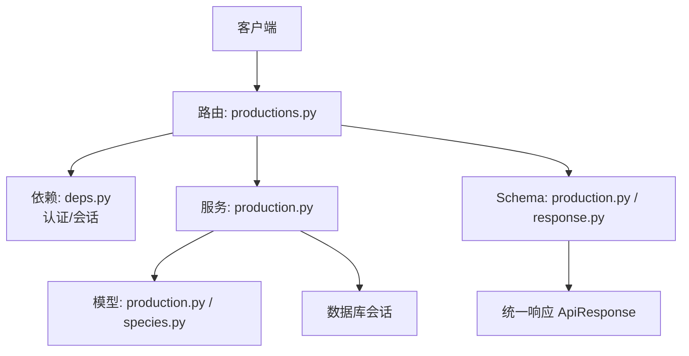
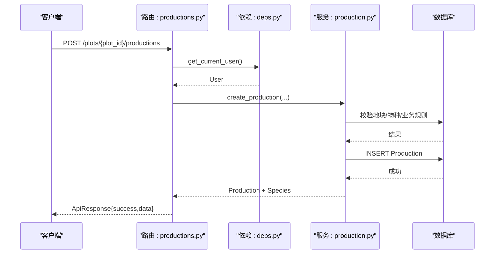
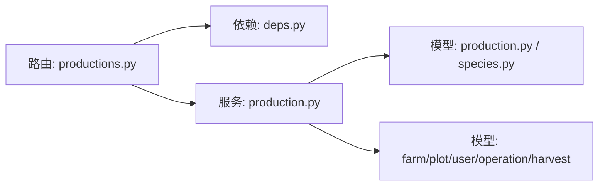
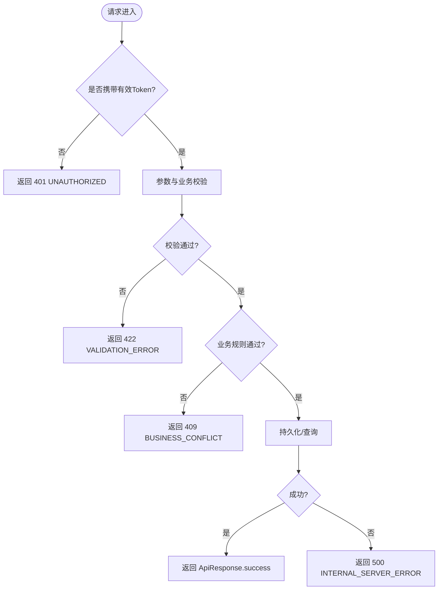

# 生产API接口参考

<cite>
**本文引用的文件**
- [apps/api/app/api/v1/endpoints/productions.py](file://apps/api/app/api/v1/endpoints/productions.py)
- [apps/api/app/schemas/production.py](file://apps/api/app/schemas/production.py)
- [apps/api/app/services/production.py](file://apps/api/app/services/production.py)
- [apps/api/app/models/production.py](file://apps/api/app/models/production.py)
- [apps/api/app/models/species.py](file://apps/api/app/models/species.py)
- [apps/api/app/api/deps.py](file://apps/api/app/api/deps.py)
- [apps/api/app/schemas/response.py](file://apps/api/app/schemas/response.py)
- [apps/api/app/core/error_codes.py](file://apps/api/app/core/error_codes.py)
- [apps/api/app/core/exceptions.py](file://apps/api/app/core/exceptions.py)
</cite>

## 目录
1. [简介](#简介)
2. [项目结构](#项目结构)
3. [核心组件](#核心组件)
4. [架构总览](#架构总览)
5. [详细接口说明](#详细接口说明)
6. [依赖关系分析](#依赖关系分析)
7. [性能与分页](#性能与分页)
8. [错误码与异常处理](#错误码与异常处理)
9. [版本管理与兼容性](#版本管理与兼容性)
10. [故障排查指南](#故障排查指南)
11. [结论](#结论)

## 简介
本参考文档面向生产环境，系统化说明“生产”模块的RESTful API端点，覆盖创建、查询、更新、结束与删除等能力。文档包含：
- HTTP方法与URL模式
- 请求参数与响应格式（含字段命名约定）
- 认证与权限要求
- 参数校验规则与业务约束
- 分页、过滤与排序用法
- 统一错误码与异常处理机制
- 版本管理与向后兼容策略

## 项目结构
生产相关API位于FastAPI应用的路由层，通过依赖注入获取当前用户与数据库会话；服务层实现业务校验与数据操作；模型与Schema定义数据结构与枚举；统一响应体封装成功与错误信息。

图表来源
- [apps/api/app/api/v1/endpoints/productions.py:71-198](file://apps/api/app/api/v1/endpoints/productions.py#L71-L198)
- [apps/api/app/api/deps.py:19-66](file://apps/api/app/api/deps.py#L19-L66)
- [apps/api/app/services/production.py:112-446](file://apps/api/app/services/production.py#L112-L446)
- [apps/api/app/schemas/production.py:15-198](file://apps/api/app/schemas/production.py#L15-L198)
- [apps/api/app/schemas/response.py:16-40](file://apps/api/app/schemas/response.py#L16-L40)

章节来源
- [apps/api/app/api/v1/endpoints/productions.py:71-198](file://apps/api/app/api/v1/endpoints/productions.py#L71-L198)
- [apps/api/app/api/deps.py:19-66](file://apps/api/app/api/deps.py#L19-L66)
- [apps/api/app/services/production.py:112-446](file://apps/api/app/services/production.py#L112-L446)
- [apps/api/app/schemas/production.py:15-198](file://apps/api/app/schemas/production.py#L15-L198)
- [apps/api/app/schemas/response.py:16-40](file://apps/api/app/schemas/response.py#L16-L40)

## 核心组件
- 路由层：定义HTTP端点，负责参数解析、调用服务、组装响应。
- 依赖层：提供鉴权（JWT Bearer）与异步数据库会话。
- 服务层：实现业务规则校验（行业字段约束、日期校验、状态流转）、数据访问与事务提交。
- 模型层：定义实体与枚举（生产状态、种植标准、作业方式、行业、单位）。
- Schema层：定义请求/响应结构与字段别名（驼峰/下划线兼容）。
- 统一响应：ApiResponse 封装 success/data/error。

章节来源
- [apps/api/app/api/v1/endpoints/productions.py:71-198](file://apps/api/app/api/v1/endpoints/productions.py#L71-L198)
- [apps/api/app/api/deps.py:19-66](file://apps/api/app/api/deps.py#L19-L66)
- [apps/api/app/services/production.py:63-103](file://apps/api/app/services/production.py#L63-L103)
- [apps/api/app/models/production.py:13-79](file://apps/api/app/models/production.py#L13-L79)
- [apps/api/app/models/species.py:12-35](file://apps/api/app/models/species.py#L12-L35)
- [apps/api/app/schemas/production.py:15-198](file://apps/api/app/schemas/production.py#L15-L198)
- [apps/api/app/schemas/response.py:16-40](file://apps/api/app/schemas/response.py#L16-L40)

## 架构总览
下图展示一次“创建生产”的请求在系统中的流转过程，包括认证、参数校验、业务规则验证、持久化与响应封装。

图表来源
- [apps/api/app/api/v1/endpoints/productions.py:100-129](file://apps/api/app/api/v1/endpoints/productions.py#L100-L129)
- [apps/api/app/api/deps.py:29-66](file://apps/api/app/api/deps.py#L29-L66)
- [apps/api/app/services/production.py:164-217](file://apps/api/app/services/production.py#L164-L217)

## 详细接口说明

### 通用约定
- 基础路径：/api/v1（按路由前缀组织）
- 认证：所有端点需要有效的Bearer Token（Access Token），未携带或无效将返回401。
- 权限：基于地块所属农场的成员关系进行资源级权限控制。
- 请求体字段命名：支持驼峰与下划线两种形式（如 speciesId/species_id），序列化输出使用驼峰。
- 统一响应体：ApiResponse{success, data, error}。

章节来源
- [apps/api/app/api/deps.py:29-66](file://apps/api/app/api/deps.py#L29-L66)
- [apps/api/app/schemas/production.py:15-198](file://apps/api/app/schemas/production.py#L15-L198)
- [apps/api/app/schemas/response.py:16-40](file://apps/api/app/schemas/response.py#L16-L40)

---

### 1) 创建生产
- 方法：POST
- URL：/api/v1/plots/{plot_id}/productions
- 认证：需要
- 权限：调用者必须是 plot_id 对应地块所在农场的成员
- 请求体：CreateProductionRequest
  - 必填字段：species_id、started_on
  - 可选字段：variety、planting_standard、planting_method、work_method、expected_harvest_on、expected_yield_per_mu、initial_quantity、plant_spacing_cm、entry_age_days、remark
  - 数值校验：正数限制（如 species_id > 0、expected_yield_per_mu > 0、initial_quantity > 0、plant_spacing_cm > 0、entry_age_days >= 0）
  - 长度限制：variety ≤ 100、remark ≤ 1000
  - 日期约束：started_on 不得晚于当天
  - 行业字段约束：根据物种所属行业（农业/林业/畜牧/渔业）强制或禁止某些字段（详见“业务规则”小节）
- 成功响应：201 Created，data 为 ProductionResponse
- 失败响应：
  - 401：未认证或Token无效
  - 404：地块不存在或无权限；物种不存在
  - 422：参数校验失败（如 startedOn 晚于今天、数值非法、行业字段不匹配）
  - 409：业务冲突（如该地块已存在活跃生产且不允许重复创建的业务规则，若存在）

示例
- 请求示例（JSON）
  {
    "speciesId": 1,
    "startedOn": "2025-01-01",
    "plantingStandard": "NORMAL",
    "plantingMethod": "TRANSPLANT",
    "workMethod": "MANUAL",
    "expectedHarvestOn": "2025-06-01",
    "expectedYieldPerMu": 500.00,
    "initialQuantity": 1000,
    "plantSpacingCm": 30.00,
    "entryAgeDays": 0,
    "remark": "首批试验田"
  }
- 成功响应示例（JSON）
  {
    "success": true,
    "data": {
      "id": 1001,
      "plotId": 10,
      "speciesId": 1,
      "speciesName": "水稻",
      "industry": "AGRICULTURE",
      "individualUnit": "PLANT",
      "variety": "南粳9108",
      "status": "ACTIVE",
      "startedOn": "2025-01-01",
      "endedOn": null,
      "plantingStandard": "NORMAL",
      "plantingMethod": "TRANSPLANT",
      "workMethod": "MANUAL",
      "expectedHarvestOn": "2025-06-01",
      "expectedYieldPerMu": 500.00,
      "initialQuantity": 1000,
      "plantSpacingCm": 30.00,
      "entryAgeDays": 0,
      "remark": "首批试验田",
      "createdAt": "2025-01-01T08:00:00",
      "updatedAt": "2025-01-01T08:00:00"
    },
    "error": null
  }

章节来源
- [apps/api/app/api/v1/endpoints/productions.py:100-129](file://apps/api/app/api/v1/endpoints/productions.py#L100-L129)
- [apps/api/app/schemas/production.py:15-71](file://apps/api/app/schemas/production.py#L15-L71)
- [apps/api/app/services/production.py:164-217](file://apps/api/app/services/production.py#L164-L217)
- [apps/api/app/models/production.py:43-79](file://apps/api/app/models/production.py#L43-L79)
- [apps/api/app/models/species.py:12-35](file://apps/api/app/models/species.py#L12-L35)

---

### 2) 获取生产详情
- 方法：GET
- URL：/api/v1/productions/{production_id}
- 认证：需要
- 权限：调用者必须对生产所属地块有农场成员权限
- 成功响应：200 OK，data 为 ProductionResponse
- 失败响应：
  - 401：未认证或Token无效
  - 404：生产不存在或无权限

示例
- 成功响应示例（JSON）
  {
    "success": true,
    "data": {
      "id": 1001,
      "plotId": 10,
      "speciesId": 1,
      "speciesName": "水稻",
      "industry": "AGRICULTURE",
      "individualUnit": "PLANT",
      "status": "ACTIVE",
      "startedOn": "2025-01-01",
      "endedOn": null,
      "plantingStandard": "NORMAL",
      "plantingMethod": "TRANSPLANT",
      "workMethod": "MANUAL",
      "expectedHarvestOn": "2025-06-01",
      "expectedYieldPerMu": 500.00,
      "initialQuantity": 1000,
      "plantSpacingCm": 30.00,
      "entryAgeDays": 0,
      "remark": "首批试验田",
      "createdAt": "2025-01-01T08:00:00",
      "updatedAt": "2025-01-01T08:00:00"
    },
    "error": null
  }

章节来源
- [apps/api/app/api/v1/endpoints/productions.py:131-143](file://apps/api/app/api/v1/endpoints/productions.py#L131-L143)
- [apps/api/app/services/production.py:141-161](file://apps/api/app/services/production.py#L141-L161)

---

### 3) 更新生产（部分更新）
- 方法：PATCH
- URL：/api/v1/productions/{production_id}
- 认证：需要
- 权限：同获取详情
- 请求体：UpdateProductionRequest（仅传入需更新的字段）
  - 若更新核心字段（plot_id、species_id、started_on），则：
    - 生产必须处于 ACTIVE 状态
    - 不能存在任何农事操作记录或采收记录
    - 若更换地块，新地块必须与原地块属于同一农场
  - 其他字段按业务规则校验（行业字段约束、日期约束、数值约束）
- 成功响应：200 OK，data 为 ProductionResponse
- 失败响应：
  - 401：未认证或Token无效
  - 404：生产不存在或无权限
  - 409：业务冲突（已结束的生产不可编辑；存在操作/采收记录时不可变更核心字段；跨农场移动地块）
  - 422：参数校验失败

示例
- 请求示例（JSON）
  {
    "plantingStandard": "GREEN",
    "expectedHarvestOn": "2025-07-01",
    "remark": "调整预期采收期"
  }
- 成功响应示例（JSON）
  {
    "success": true,
    "data": {
      "id": 1001,
      "plotId": 10,
      "speciesId": 1,
      "speciesName": "水稻",
      "industry": "AGRICULTURE",
      "individualUnit": "PLANT",
      "status": "ACTIVE",
      "startedOn": "2025-01-01",
      "endedOn": null,
      "plantingStandard": "GREEN",
      "plantingMethod": "TRANSPLANT",
      "workMethod": "MANUAL",
      "expectedHarvestOn": "2025-07-01",
      "expectedYieldPerMu": 500.00,
      "initialQuantity": 1000,
      "plantSpacingCm": 30.00,
      "entryAgeDays": 0,
      "remark": "调整预期采收期",
      "createdAt": "2025-01-01T08:00:00",
      "updatedAt": "2025-01-02T10:00:00"
    },
    "error": null
  }

章节来源
- [apps/api/app/api/v1/endpoints/productions.py:145-172](file://apps/api/app/api/v1/endpoints/productions.py#L145-L172)
- [apps/api/app/schemas/production.py:73-143](file://apps/api/app/schemas/production.py#L73-L143)
- [apps/api/app/services/production.py:220-365](file://apps/api/app/services/production.py#L220-L365)

---

### 4) 结束生产
- 方法：POST
- URL：/api/v1/productions/{production_id}/end
- 认证：需要
- 权限：同获取详情
- 请求体：EndProductionRequest
  - ended_on：可选，若不传则使用当天；不得晚于当天；不得早于 started_on；不得早于最近一次农事操作或采收记录的日期
- 成功响应：200 OK，data 为 ProductionResponse（status=ENDED）
- 失败响应：
  - 401：未认证或Token无效
  - 404：生产不存在或无权限
  - 409：业务冲突（生产已结束）
  - 422：参数校验失败（日期不合法）

示例
- 请求示例（JSON）
  {
    "endedOn": "2025-06-15"
  }
- 成功响应示例（JSON）
  {
    "success": true,
    "data": {
      "id": 1001,
      "plotId": 10,
      "speciesId": 1,
      "speciesName": "水稻",
      "industry": "AGRICULTURE",
      "individualUnit": "PLANT",
      "status": "ENDED",
      "startedOn": "2025-01-01",
      "endedOn": "2025-06-15",
      "plantingStandard": "GREEN",
      "plantingMethod": "TRANSPLANT",
      "workMethod": "MANUAL",
      "expectedHarvestOn": "2025-07-01",
      "expectedYieldPerMu": 500.00,
      "initialQuantity": 1000,
      "plantSpacingCm": 30.00,
      "entryAgeDays": 0,
      "remark": "调整预期采收期",
      "createdAt": "2025-01-01T08:00:00",
      "updatedAt": "2025-06-15T16:00:00"
    },
    "error": null
  }

章节来源
- [apps/api/app/api/v1/endpoints/productions.py:174-188](file://apps/api/app/api/v1/endpoints/productions.py#L174-L188)
- [apps/api/app/schemas/production.py:146-152](file://apps/api/app/schemas/production.py#L146-L152)
- [apps/api/app/services/production.py:403-446](file://apps/api/app/services/production.py#L403-L446)

---

### 5) 删除生产
- 方法：DELETE
- URL：/api/v1/productions/{production_id}
- 认证：需要
- 权限：同获取详情
- 成功响应：204 No Content（无响应体）
- 失败响应：
  - 401：未认证或Token无效
  - 404：生产不存在或无权限
  - 409：业务冲突（已结束的生产不可删除；存在农事操作或采收记录不可删除）

章节来源
- [apps/api/app/api/v1/endpoints/productions.py:190-198](file://apps/api/app/api/v1/endpoints/productions.py#L190-L198)
- [apps/api/app/services/production.py:368-401](file://apps/api/app/services/production.py#L368-L401)

---

### 6) 按地块列出生产（分页/过滤/排序）
- 方法：GET
- URL：/api/v1/plots/{plot_id}/productions
- 认证：需要
- 权限：调用者必须对 plot_id 对应地块有农场成员权限
- 查询参数：
  - status：可选，按生产状态过滤（ACTIVE/ENDED）
  - page：页码，≥1，默认1
  - pageSize：每页条数，1~100，默认20
- 排序：默认按“活跃优先”，其次按 started_on 降序，再按 id 降序
- 成功响应：200 OK，data 为 ProductionPage（items/page/pageSize/total）
- 失败响应：
  - 401：未认证或Token无效
  - 404：地块不存在或无权限

示例
- 请求示例
  GET /api/v1/plots/10/productions?status=ACTIVE&page=1&pageSize=20
- 成功响应示例（JSON）
  {
    "success": true,
    "data": {
      "items": [
        {
          "id": 1001,
          "plotId": 10,
          "speciesId": 1,
          "speciesName": "水稻",
          "industry": "AGRICULTURE",
          "individualUnit": "PLANT",
          "status": "ACTIVE",
          "startedOn": "2025-01-01",
          "endedOn": null,
          "plantingStandard": "GREEN",
          "plantingMethod": "TRANSPLANT",
          "workMethod": "MANUAL",
          "expectedHarvestOn": "2025-07-01",
          "expectedYieldPerMu": 500.00,
          "initialQuantity": 1000,
          "plantSpacingCm": 30.00,
          "entryAgeDays": 0,
          "remark": "调整预期采收期",
          "createdAt": "2025-01-01T08:00:00",
          "updatedAt": "2025-01-02T10:00:00"
        }
      ],
      "page": 1,
      "pageSize": 20,
      "total": 1
    },
    "error": null
  }

章节来源
- [apps/api/app/api/v1/endpoints/productions.py:71-98](file://apps/api/app/api/v1/endpoints/productions.py#L71-L98)
- [apps/api/app/services/production.py:112-139](file://apps/api/app/services/production.py#L112-L139)
- [apps/api/app/schemas/production.py:193-198](file://apps/api/app/schemas/production.py#L193-L198)

---

### 业务规则与字段约束（摘要）
- 开始日期：started_on 不得晚于当天
- 结束日期：ended_on 不得晚于当天，不得早于 started_on，且不得早于最近一次农事操作或采收记录日期
- 行业字段约束：
  - 农业/林业：必须提供 planting_standard、planting_method、work_method；林业还需 initial_quantity 且禁止 expected_yield_per_mu；禁止 entry_age_days
  - 畜牧业：必须提供 initial_quantity、entry_age_days；禁止 work_method
  - 渔业：必须提供 initial_quantity、work_method；禁止 entry_age_days；禁止 planting_standard、expected_harvest_on、expected_yield_per_mu、plant_spacing_cm
- 数值约束：species_id、expected_yield_per_mu、initial_quantity、plant_spacing_cm 必须为正数；entry_age_days ≥ 0
- 长度约束：variety ≤ 100；remark ≤ 1000
- 状态约束：已结束的生产不可编辑或删除；存在农事操作或采收记录时，不可修改核心字段（plot_id、species_id、started_on）

章节来源
- [apps/api/app/services/production.py:44-103](file://apps/api/app/services/production.py#L44-L103)
- [apps/api/app/services/production.py:220-365](file://apps/api/app/services/production.py#L220-L365)
- [apps/api/app/services/production.py:403-446](file://apps/api/app/services/production.py#L403-L446)

## 依赖关系分析
- 路由依赖：
  - get_current_user：从请求头读取Bearer Token，解码后获取用户并校验有效性
  - get_db_session：每个请求一个独立异步会话，异常时回滚
- 服务依赖：
  - 地块权限校验：get_plot_with_member（确保调用者对地块有农场成员权限）
  - 物种校验：_get_species（检查物种是否存在）
  - 业务校验：_validate_industry_fields、_validate_started_on、_business_date
- 模型依赖：
  - Production、Species、FarmMember、Plot、FarmOperation、HarvestRecord 等用于权限与业务校验

图表来源
- [apps/api/app/api/v1/endpoints/productions.py:71-198](file://apps/api/app/api/v1/endpoints/productions.py#L71-L198)
- [apps/api/app/api/deps.py:19-66](file://apps/api/app/api/deps.py#L19-L66)
- [apps/api/app/services/production.py:105-161](file://apps/api/app/services/production.py#L105-L161)

章节来源
- [apps/api/app/api/deps.py:19-66](file://apps/api/app/api/deps.py#L19-L66)
- [apps/api/app/services/production.py:105-161](file://apps/api/app/services/production.py#L105-L161)

## 性能与分页
- 列表接口支持分页：page、pageSize，默认20，最大100
- 默认排序：活跃优先，随后按 started_on 降序、id 降序
- 计数优化：使用 count 查询总数，避免全量加载
- 建议：
  - 合理设置 pageSize，避免过大导致响应体积过大
  - 结合 status 过滤减少不必要的数据传输
  - 前端按需分页加载，避免一次性拉取大量数据

章节来源
- [apps/api/app/api/v1/endpoints/productions.py:71-98](file://apps/api/app/api/v1/endpoints/productions.py#L71-L98)
- [apps/api/app/services/production.py:112-139](file://apps/api/app/services/production.py#L112-L139)

## 错误码与异常处理
- 统一响应体：ApiResponse{success, data, error}
- 错误体结构：ErrorDetail{code, message, details}
- 常见错误码：
  - UNAUTHORIZED：未认证或Token无效（401）
  - NOT_FOUND：资源不存在（404）
  - VALIDATION_ERROR：请求参数校验失败（422）
  - BUSINESS_CONFLICT：业务冲突（409）
  - HTTP_ERROR：HTTP层异常（4xx/5xx）
  - INTERNAL_SERVER_ERROR：服务器内部错误（500）
- 异常处理器：
  - AppException：业务异常，映射到 ApiResponse.error_response
  - RequestValidationError：参数校验异常，映射到 VALIDATION_ERROR
  - StarletteHTTPException：HTTP异常，映射到 HTTP_ERROR
  - 未捕获异常：映射到 INTERNAL_SERVER_ERROR

图表来源
- [apps/api/app/core/exceptions.py:35-88](file://apps/api/app/core/exceptions.py#L35-L88)
- [apps/api/app/schemas/response.py:16-40](file://apps/api/app/schemas/response.py#L16-L40)
- [apps/api/app/core/error_codes.py:4-13](file://apps/api/app/core/error_codes.py#L4-L13)

章节来源
- [apps/api/app/core/exceptions.py:35-88](file://apps/api/app/core/exceptions.py#L35-L88)
- [apps/api/app/schemas/response.py:16-40](file://apps/api/app/schemas/response.py#L16-L40)
- [apps/api/app/core/error_codes.py:4-13](file://apps/api/app/core/error_codes.py#L4-L13)

## 版本管理与兼容性
- 版本前缀：/api/v1，便于后续演进与多版本并存
- 字段兼容：请求与响应均支持驼峰与下划线双命名（通过 AliasChoices/serialization_alias），降低客户端升级成本
- 向后兼容策略：
  - 新增可选字段不影响旧客户端
  - 保留历史字段名以兼容旧客户端
  - 严格校验新增必填字段，避免破坏既有流程
- 建议：
  - 重大变更时发布 v2，保持 v1 稳定运行
  - 通过响应头或文档标注废弃字段与迁移指引

章节来源
- [apps/api/app/schemas/production.py:15-198](file://apps/api/app/schemas/production.py#L15-L198)

## 故障排查指南
- 401 未认证：
  - 检查请求头是否携带 Authorization: Bearer <token>
  - 确认 token 未过期且 payload 中 sub 为用户ID
- 404 资源不存在：
  - 确认 plot_id/production_id 正确
  - 确认调用者对该地块/生产具有农场成员权限
- 422 参数校验失败：
  - 检查 required 字段是否齐全
  - 检查数值范围与长度限制
  - 检查日期合法性（started_on/ended_on）
  - 检查行业字段约束（不同行业允许/禁止的字段）
- 409 业务冲突：
  - 已结束的生产不可编辑/删除
  - 存在农事操作或采收记录时，不可修改核心字段
  - 跨农场移动地块不被允许
- 500 服务器错误：
  - 查看服务端日志定位具体异常堆栈

章节来源
- [apps/api/app/api/deps.py:29-66](file://apps/api/app/api/deps.py#L29-L66)
- [apps/api/app/services/production.py:164-446](file://apps/api/app/services/production.py#L164-L446)
- [apps/api/app/core/exceptions.py:35-88](file://apps/api/app/core/exceptions.py#L35-L88)

## 结论
本参考文档完整覆盖了生产模块的核心API端点，明确了认证与权限、参数校验与业务规则、分页与排序、统一响应与错误码、以及版本兼容策略。建议在集成过程中严格遵循字段命名约定与校验规则，并结合分页与过滤提升查询效率。遇到异常时，依据错误码快速定位问题并进行修复。