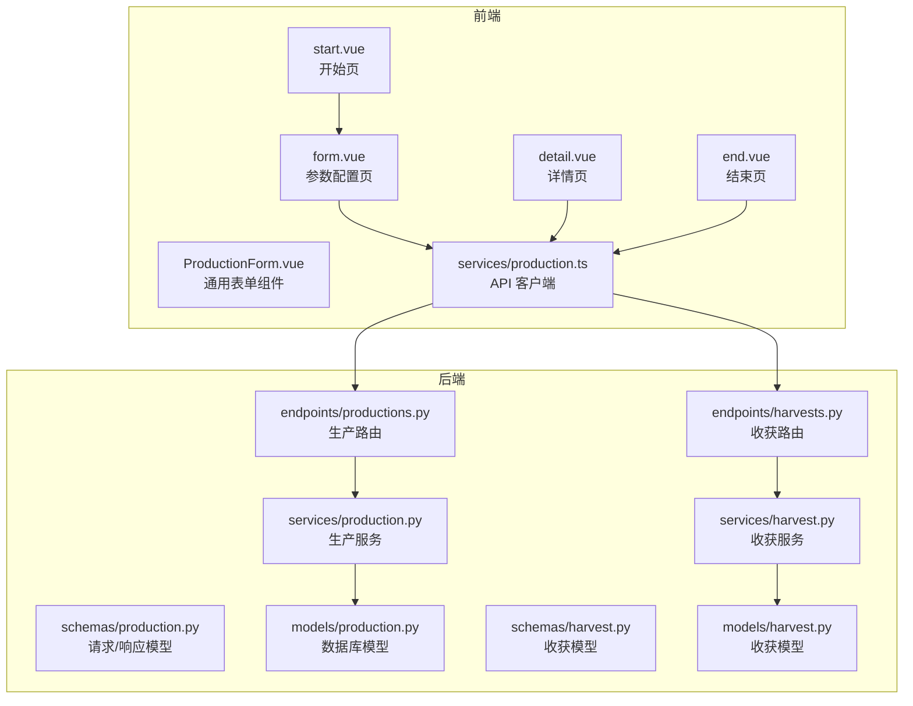
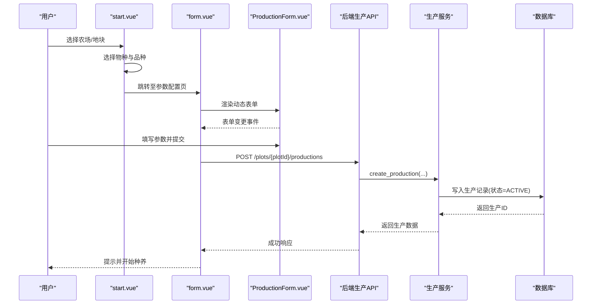
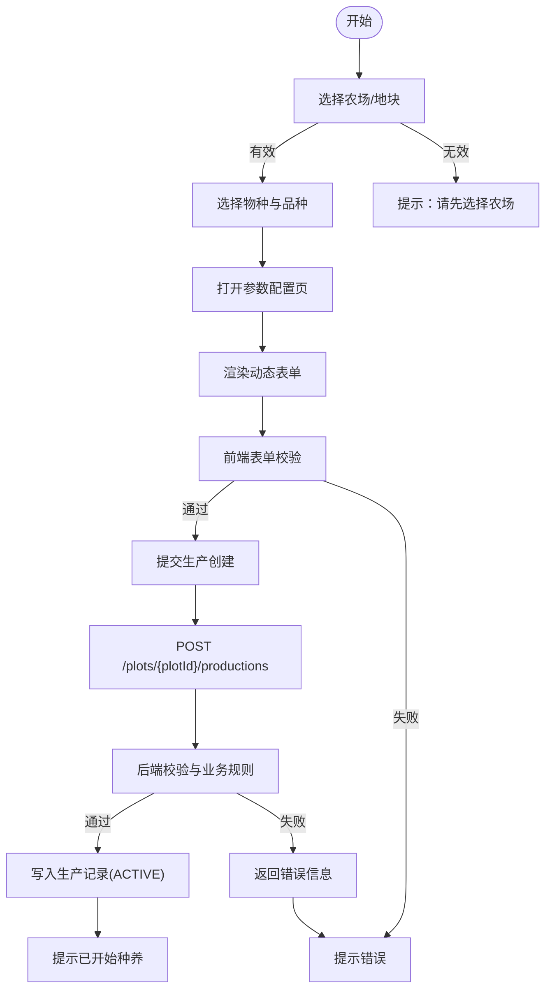
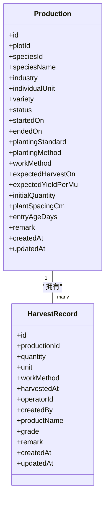
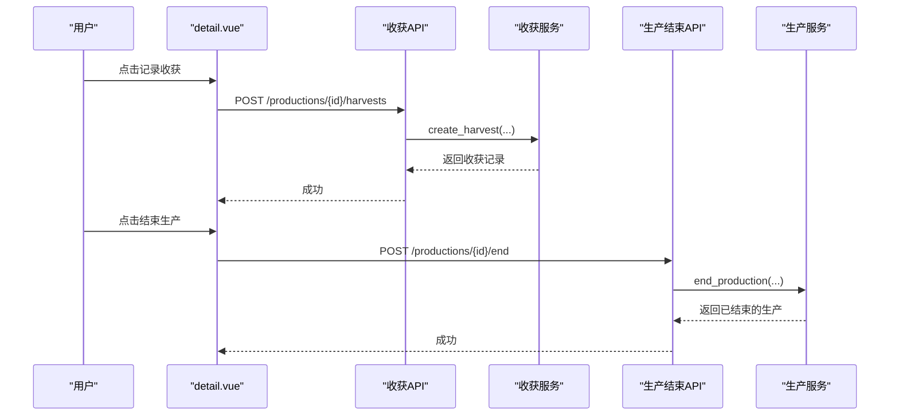
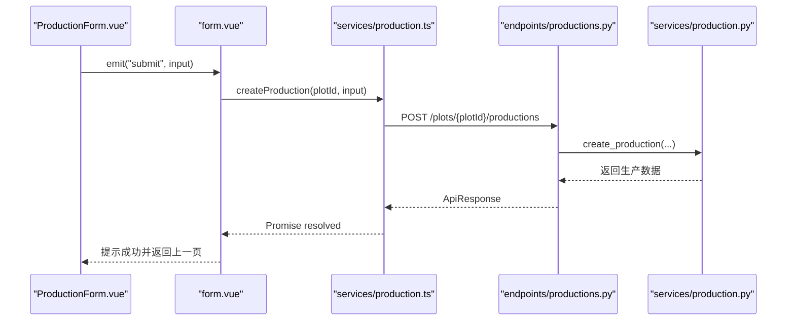
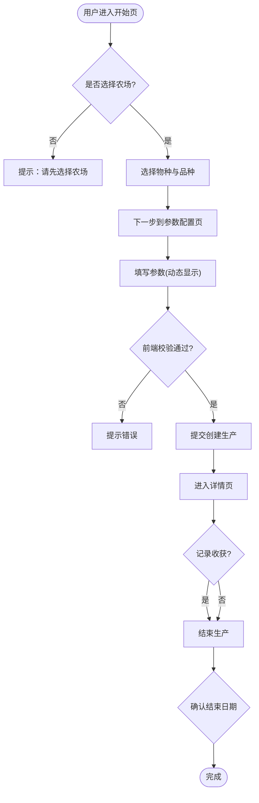
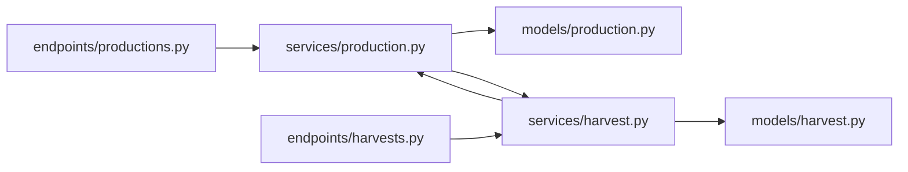

# 生产工作流程

<cite>
**本文引用的文件**
- [apps/api/app/models/production.py](file://apps/api/app/models/production.py)
- [apps/api/app/schemas/production.py](file://apps/api/app/schemas/production.py)
- [apps/api/app/services/production.py](file://apps/api/app/services/production.py)
- [apps/api/app/api/v1/endpoints/productions.py](file://apps/api/app/api/v1/endpoints/productions.py)
- [apps/api/app/models/harvest.py](file://apps/api/app/models/harvest.py)
- [apps/api/app/schemas/harvest.py](file://apps/api/app/schemas/harvest.py)
- [apps/api/app/services/harvest.py](file://apps/api/app/services/harvest.py)
- [apps/api/app/api/v1/endpoints/harvests.py](file://apps/api/app/api/v1/endpoints/harvests.py)
- [apps/miniapp/src/pages/productions/start.vue](file://apps/miniapp/src/pages/productions/start.vue)
- [apps/miniapp/src/pages/productions/form.vue](file://apps/miniapp/src/pages/productions/form.vue)
- [apps/miniapp/src/pages/productions/detail.vue](file://apps/miniapp/src/pages/productions/detail.vue)
- [apps/miniapp/src/pages/productions/end.vue](file://apps/miniapp/src/pages/productions/end.vue)
- [apps/miniapp/src/components/ProductionForm.vue](file://apps/miniapp/src/components/ProductionForm.vue)
- [apps/miniapp/src/services/production.ts](file://apps/miniapp/src/services/production.ts)
</cite>

## 目录
1. [简介](#简介)
2. [项目结构](#项目结构)
3. [核心组件](#核心组件)
4. [架构总览](#架构总览)
5. [详细组件分析](#详细组件分析)
6. [依赖关系分析](#依赖关系分析)
7. [性能考虑](#性能考虑)
8. [故障排查指南](#故障排查指南)
9. [结论](#结论)
10. [附录](#附录)

## 简介
本文件面向生产与运维人员，系统化说明“生产”从开始到结束的完整业务流程：地块选择、物种选择、种植参数配置、表单交互与数据提交；生产详情页面的信息展示逻辑（基本信息、作业记录、收获统计）；生产结束时的收获数据录入、产量计算与状态更新链路；前后端交互模式（数据绑定、表单验证、错误处理）；用户操作流程图与界面交互规范；以及生命周期各阶段的业务规则验证和用户提示信息。

## 项目结构
本项目采用前后端分离架构：
- 前端（小程序）：基于 Vue 的页面与组件，负责用户交互、表单校验、调用后端 API。
- 后端（FastAPI）：提供 RESTful API，包含路由层、服务层、数据模型与 Pydantic 校验，负责权限校验、业务规则验证与持久化。

图表来源
- [apps/miniapp/src/pages/productions/start.vue:1-226](file://apps/miniapp/src/pages/productions/start.vue#L1-L226)
- [apps/miniapp/src/pages/productions/form.vue:1-181](file://apps/miniapp/src/pages/productions/form.vue#L1-L181)
- [apps/miniapp/src/pages/productions/detail.vue:1-520](file://apps/miniapp/src/pages/productions/detail.vue#L1-L520)
- [apps/miniapp/src/pages/productions/end.vue:1-222](file://apps/miniapp/src/pages/productions/end.vue#L1-L222)
- [apps/miniapp/src/components/ProductionForm.vue:1-613](file://apps/miniapp/src/components/ProductionForm.vue#L1-L613)
- [apps/miniapp/src/services/production.ts:1-121](file://apps/miniapp/src/services/production.ts#L1-L121)
- [apps/api/app/api/v1/endpoints/productions.py:1-198](file://apps/api/app/api/v1/endpoints/productions.py#L1-L198)
- [apps/api/app/services/production.py:1-446](file://apps/api/app/services/production.py#L1-L446)
- [apps/api/app/schemas/production.py:1-198](file://apps/api/app/schemas/production.py#L1-L198)
- [apps/api/app/models/production.py:1-79](file://apps/api/app/models/production.py#L1-L79)
- [apps/api/app/api/v1/endpoints/harvests.py:1-163](file://apps/api/app/api/v1/endpoints/harvests.py#L1-L163)
- [apps/api/app/services/harvest.py:1-281](file://apps/api/app/services/harvest.py#L1-L281)
- [apps/api/app/schemas/harvest.py:1-111](file://apps/api/app/schemas/harvest.py#L1-L111)
- [apps/api/app/models/harvest.py:1-48](file://apps/api/app/models/harvest.py#L1-L48)

章节来源
- [apps/miniapp/src/pages/productions/start.vue:1-226](file://apps/miniapp/src/pages/productions/start.vue#L1-L226)
- [apps/miniapp/src/pages/productions/form.vue:1-181](file://apps/miniapp/src/pages/productions/form.vue#L1-L181)
- [apps/miniapp/src/pages/productions/detail.vue:1-520](file://apps/miniapp/src/pages/productions/detail.vue#L1-L520)
- [apps/miniapp/src/pages/productions/end.vue:1-222](file://apps/miniapp/src/pages/productions/end.vue#L1-L222)
- [apps/miniapp/src/components/ProductionForm.vue:1-613](file://apps/miniapp/src/components/ProductionForm.vue#L1-L613)
- [apps/miniapp/src/services/production.ts:1-121](file://apps/miniapp/src/services/production.ts#L1-L121)
- [apps/api/app/api/v1/endpoints/productions.py:1-198](file://apps/api/app/api/v1/endpoints/productions.py#L1-L198)
- [apps/api/app/services/production.py:1-446](file://apps/api/app/services/production.py#L1-L446)
- [apps/api/app/schemas/production.py:1-198](file://apps/api/app/schemas/production.py#L1-L198)
- [apps/api/app/models/production.py:1-79](file://apps/api/app/models/production.py#L1-L79)
- [apps/api/app/api/v1/endpoints/harvests.py:1-163](file://apps/api/app/api/v1/endpoints/harvests.py#L1-L163)
- [apps/api/app/services/harvest.py:1-281](file://apps/api/app/services/harvest.py#L1-L281)
- [apps/api/app/schemas/harvest.py:1-111](file://apps/api/app/schemas/harvest.py#L1-L111)
- [apps/api/app/models/harvest.py:1-48](file://apps/api/app/models/harvest.py#L1-L48)

## 核心组件
- 生产数据模型与枚举：定义生产状态、种植标准、种植方式、作业方式、数量单位等。
- 生产请求/响应模型：统一前后端字段命名与校验规则。
- 生产服务：实现创建、编辑、删除、结束生产的业务规则与权限校验。
- 收获数据模型与服务：记录每次收获的数量、单位、作业方式、时间、操作员等，并支持按生产或地块聚合查询。
- 前端页面与组件：开始页、参数配置页、详情页、结束页，以及可复用的表单组件。
- 前端 API 客户端：封装对后端的 HTTP 请求。

章节来源
- [apps/api/app/models/production.py:13-79](file://apps/api/app/models/production.py#L13-L79)
- [apps/api/app/schemas/production.py:15-198](file://apps/api/app/schemas/production.py#L15-L198)
- [apps/api/app/services/production.py:164-446](file://apps/api/app/services/production.py#L164-L446)
- [apps/api/app/models/harvest.py:13-48](file://apps/api/app/models/harvest.py#L13-L48)
- [apps/api/app/schemas/harvest.py:15-111](file://apps/api/app/schemas/harvest.py#L15-L111)
- [apps/api/app/services/harvest.py:134-281](file://apps/api/app/services/harvest.py#L134-L281)
- [apps/miniapp/src/components/ProductionForm.vue:187-470](file://apps/miniapp/src/components/ProductionForm.vue#L187-L470)
- [apps/miniapp/src/services/production.ts:63-121](file://apps/miniapp/src/services/production.ts#L63-L121)

## 架构总览
生产流程涉及“开始—进行中—结束”三阶段，贯穿前后端协作与多实体关联（生产、地块、物种、收获）。

图表来源
- [apps/miniapp/src/pages/productions/start.vue:82-114](file://apps/miniapp/src/pages/productions/start.vue#L82-L114)
- [apps/miniapp/src/pages/productions/form.vue:96-116](file://apps/miniapp/src/pages/productions/form.vue#L96-L116)
- [apps/miniapp/src/components/ProductionForm.vue:418-469](file://apps/miniapp/src/components/ProductionForm.vue#L418-L469)
- [apps/miniapp/src/services/production.ts:74-80](file://apps/miniapp/src/services/production.ts#L74-L80)
- [apps/api/app/api/v1/endpoints/productions.py:100-129](file://apps/api/app/api/v1/endpoints/productions.py#L100-L129)
- [apps/api/app/services/production.py:164-218](file://apps/api/app/services/production.py#L164-L218)

## 详细组件分析

### 生产开始流程（地块选择、物种选择、参数配置与提交）
- 地块选择：在开始页中读取当前农场或传入 farmId/plotId，若未选择则提示先选农场。
- 物种选择：打开物种选择器，选择后根据物种行业类型决定后续必填项。
- 参数配置：进入 form.vue，加载地块信息，渲染 ProductionForm 组件，根据物种行业动态显示/隐藏字段（如种植标准、种植方式、作业方式、预计采收时间、亩产、株间距、入栏日龄等）。
- 表单验证：前端进行基础校验（正整数、非负数、必填项），后端通过 Pydantic 与业务规则再次校验（如日期范围、行业相关字段约束）。
- 数据提交：调用 createProduction 接口，成功后提示并开始种养。

图表来源
- [apps/miniapp/src/pages/productions/start.vue:64-122](file://apps/miniapp/src/pages/productions/start.vue#L64-L122)
- [apps/miniapp/src/pages/productions/form.vue:74-116](file://apps/miniapp/src/pages/productions/form.vue#L74-L116)
- [apps/miniapp/src/components/ProductionForm.vue:269-469](file://apps/miniapp/src/components/ProductionForm.vue#L269-L469)
- [apps/api/app/services/production.py:44-103](file://apps/api/app/services/production.py#L44-L103)
- [apps/api/app/api/v1/endpoints/productions.py:100-129](file://apps/api/app/api/v1/endpoints/productions.py#L100-L129)

章节来源
- [apps/miniapp/src/pages/productions/start.vue:64-122](file://apps/miniapp/src/pages/productions/start.vue#L64-L122)
- [apps/miniapp/src/pages/productions/form.vue:74-116](file://apps/miniapp/src/pages/productions/form.vue#L74-L116)
- [apps/miniapp/src/components/ProductionForm.vue:269-469](file://apps/miniapp/src/components/ProductionForm.vue#L269-L469)
- [apps/api/app/services/production.py:44-103](file://apps/api/app/services/production.py#L44-L103)
- [apps/api/app/api/v1/endpoints/productions.py:100-129](file://apps/api/app/api/v1/endpoints/productions.py#L100-L129)

### 生产详情页面（基本信息、作业记录、收获统计）
- 基本信息：展示物种名称、行业、状态、开始时间、品种、种植标准、种植方式、作业方式等。
- 更多信息：根据行业与种植方式动态显示预计采收时间、亩产、初始数量、株间距、入栏日龄、备注等。
- 收获记录：提供查看与新增收获记录的入口，支持同一次生产多次收获。
- 结束与删除：进行中时可结束生产或删除记录（危险操作需二次确认）。

图表来源
- [apps/api/app/models/production.py:43-79](file://apps/api/app/models/production.py#L43-L79)
- [apps/api/app/models/harvest.py:13-48](file://apps/api/app/models/harvest.py#L13-L48)

章节来源
- [apps/miniapp/src/pages/productions/detail.vue:20-110](file://apps/miniapp/src/pages/productions/detail.vue#L20-L110)
- [apps/miniapp/src/pages/productions/detail.vue:116-305](file://apps/miniapp/src/pages/productions/detail.vue#L116-L305)
- [apps/api/app/models/production.py:43-79](file://apps/api/app/models/production.py#L43-L79)
- [apps/api/app/models/harvest.py:13-48](file://apps/api/app/models/harvest.py#L13-L48)

### 生产结束流程（收获数据录入、产量计算、状态更新）
- 收获数据录入：在生产详情中点击记录收获，跳转到收获表单，填写数量、作业方式、收获时间、操作员、产品名、等级、备注等。
- 收获校验：后端校验数量为正、单位与行业匹配（重量类为公斤，其他按物种单位）、收获时间不得晚于当前时间且不早于生产开始时间。
- 产量计算：系统不直接计算总产量，而是通过累计该生产的所有收获记录进行统计展示（前端可按列表汇总）。
- 状态更新：当确认结束时，设置 ended_on 与 status=ENDED，并校验结束时间不得早于最近作业或收获时间。

图表来源
- [apps/miniapp/src/pages/productions/detail.vue:255-271](file://apps/miniapp/src/pages/productions/detail.vue#L255-L271)
- [apps/api/app/api/v1/endpoints/harvests.py:86-109](file://apps/api/app/api/v1/endpoints/harvests.py#L86-L109)
- [apps/api/app/services/harvest.py:134-178](file://apps/api/app/services/harvest.py#L134-L178)
- [apps/api/app/api/v1/endpoints/productions.py:174-187](file://apps/api/app/api/v1/endpoints/productions.py#L174-L187)
- [apps/api/app/services/production.py:403-446](file://apps/api/app/services/production.py#L403-L446)

章节来源
- [apps/miniapp/src/pages/productions/detail.vue:255-271](file://apps/miniapp/src/pages/productions/detail.vue#L255-L271)
- [apps/api/app/api/v1/endpoints/harvests.py:86-109](file://apps/api/app/api/v1/endpoints/harvests.py#L86-L109)
- [apps/api/app/services/harvest.py:134-178](file://apps/api/app/services/harvest.py#L134-L178)
- [apps/api/app/api/v1/endpoints/productions.py:174-187](file://apps/api/app/api/v1/endpoints/productions.py#L174-L187)
- [apps/api/app/services/production.py:403-446](file://apps/api/app/services/production.py#L403-L446)

### 前端页面与后端API交互模式
- 数据绑定：ProductionForm 组件通过 props 与 reactive 表单对象绑定，监听变化并通过 emit 通知父组件。
- 表单验证：前端进行基础格式与必填校验；后端使用 Pydantic 与自定义校验函数确保数据合法性与业务一致性。
- 错误处理：前端捕获 ApiRequestError，区分 401 未授权跳转登录，其他错误以 Toast 提示；后端抛出 AppException，携带错误码与消息。

图表来源
- [apps/miniapp/src/components/ProductionForm.vue:418-469](file://apps/miniapp/src/components/ProductionForm.vue#L418-L469)
- [apps/miniapp/src/pages/productions/form.vue:96-116](file://apps/miniapp/src/pages/productions/form.vue#L96-L116)
- [apps/miniapp/src/services/production.ts:74-80](file://apps/miniapp/src/services/production.ts#L74-L80)
- [apps/api/app/api/v1/endpoints/productions.py:100-129](file://apps/api/app/api/v1/endpoints/productions.py#L100-L129)
- [apps/api/app/services/production.py:164-218](file://apps/api/app/services/production.py#L164-L218)

章节来源
- [apps/miniapp/src/components/ProductionForm.vue:418-469](file://apps/miniapp/src/components/ProductionForm.vue#L418-L469)
- [apps/miniapp/src/pages/productions/form.vue:96-116](file://apps/miniapp/src/pages/productions/form.vue#L96-L116)
- [apps/miniapp/src/services/production.ts:74-80](file://apps/miniapp/src/services/production.ts#L74-L80)
- [apps/api/app/api/v1/endpoints/productions.py:100-129](file://apps/api/app/api/v1/endpoints/productions.py#L100-L129)
- [apps/api/app/services/production.py:164-218](file://apps/api/app/services/production.py#L164-L218)

### 用户操作流程图与界面交互规范
- 开始页：必须选择农场与物种，否则提示错误；选择后进入参数配置页。
- 参数配置页：根据物种行业动态显示必填/选填字段；提交前进行前端校验；提交成功后返回上一级。
- 详情页：展示基本信息与更多信息；进行中可记录收获与结束生产；支持删除（危险操作需确认）。
- 结束页：选择结束日期（不早于开始时间且不晚于今天），确认后结束生产。

图表来源
- [apps/miniapp/src/pages/productions/start.vue:82-114](file://apps/miniapp/src/pages/productions/start.vue#L82-L114)
- [apps/miniapp/src/pages/productions/form.vue:96-116](file://apps/miniapp/src/pages/productions/form.vue#L96-L116)
- [apps/miniapp/src/pages/productions/detail.vue:255-271](file://apps/miniapp/src/pages/productions/detail.vue#L255-L271)
- [apps/miniapp/src/pages/productions/end.vue:117-141](file://apps/miniapp/src/pages/productions/end.vue#L117-L141)

章节来源
- [apps/miniapp/src/pages/productions/start.vue:82-114](file://apps/miniapp/src/pages/productions/start.vue#L82-L114)
- [apps/miniapp/src/pages/productions/form.vue:96-116](file://apps/miniapp/src/pages/productions/form.vue#L96-L116)
- [apps/miniapp/src/pages/productions/detail.vue:255-271](file://apps/miniapp/src/pages/productions/detail.vue#L255-L271)
- [apps/miniapp/src/pages/productions/end.vue:117-141](file://apps/miniapp/src/pages/productions/end.vue#L117-L141)

### 生产生命周期各阶段的业务规则验证与用户提示
- 开始阶段：
  - 开始日期不得晚于今天。
  - 根据行业要求必填字段（种植标准、种植方式、作业方式、初始数量、入栏日龄等）。
  - 数值字段需为正数或符合单位要求（如整数单位）。
- 进行中阶段：
  - 仅可进行收获记录与编辑（受限制）。
  - 收获数量必须大于 0，单位与行业匹配，收获时间不得早于生产开始时间且不晚于当前时间。
- 结束阶段：
  - 结束日期不得晚于今天且不得早于生产开始时间。
  - 结束日期不得早于最近的作业或收获时间。
  - 已结束的生产不可再编辑或删除。

章节来源
- [apps/api/app/services/production.py:44-103](file://apps/api/app/services/production.py#L44-L103)
- [apps/api/app/services/production.py:220-365](file://apps/api/app/services/production.py#L220-L365)
- [apps/api/app/services/production.py:403-446](file://apps/api/app/services/production.py#L403-L446)
- [apps/api/app/services/harvest.py:45-69](file://apps/api/app/services/harvest.py#L45-L69)
- [apps/api/app/services/harvest.py:134-178](file://apps/api/app/services/harvest.py#L134-L178)

## 依赖关系分析
- 生产模块依赖：
  - 路由层依赖服务层，服务层依赖数据模型与 Pydantic 模型。
  - 生产与收获通过 production_id 关联，形成一对多关系。
- 权限与上下文：
  - 所有操作均通过 get_current_user 获取当前用户，并进行所属农场成员校验。
- 外部依赖：
  - 数据库会话通过依赖注入提供，使用异步 SQLAlchemy 执行查询与事务。

图表来源
- [apps/api/app/api/v1/endpoints/productions.py:1-198](file://apps/api/app/api/v1/endpoints/productions.py#L1-L198)
- [apps/api/app/services/production.py:1-446](file://apps/api/app/services/production.py#L1-L446)
- [apps/api/app/models/production.py:1-79](file://apps/api/app/models/production.py#L1-L79)
- [apps/api/app/api/v1/endpoints/harvests.py:1-163](file://apps/api/app/api/v1/endpoints/harvests.py#L1-L163)
- [apps/api/app/services/harvest.py:1-281](file://apps/api/app/services/harvest.py#L1-L281)
- [apps/api/app/models/harvest.py:1-48](file://apps/api/app/models/harvest.py#L1-L48)

章节来源
- [apps/api/app/api/v1/endpoints/productions.py:1-198](file://apps/api/app/api/v1/endpoints/productions.py#L1-L198)
- [apps/api/app/services/production.py:1-446](file://apps/api/app/services/production.py#L1-L446)
- [apps/api/app/models/production.py:1-79](file://apps/api/app/models/production.py#L1-L79)
- [apps/api/app/api/v1/endpoints/harvests.py:1-163](file://apps/api/app/api/v1/endpoints/harvests.py#L1-L163)
- [apps/api/app/services/harvest.py:1-281](file://apps/api/app/services/harvest.py#L1-L281)
- [apps/api/app/models/harvest.py:1-48](file://apps/api/app/models/harvest.py#L1-L48)

## 性能考虑
- 分页查询：生产与收获列表均采用分页，减少单次数据量。
- 索引优化：生产与收获表对常用查询字段建立索引（如 plot_id、production_id、harvested_at）。
- 并发安全：关键写操作使用行级锁（with_for_update）避免竞态条件。
- 前端缓存：详情页在 onShow 时刷新，避免重复请求；表单组件按需渲染以减少开销。

[本节为通用指导，无需特定文件引用]

## 故障排查指南
- 401 未授权：前端检测到 401 时清除认证并跳转登录页。
- 业务冲突：尝试编辑或删除已结束的生产、修改核心字段存在作业或收获记录时，会返回冲突错误。
- 校验错误：日期、数值、必填字段不符合规则时，返回 422 并附带具体错误信息。
- 网络异常：前端统一捕获并提示“请稍后再试”，建议重试。

章节来源
- [apps/miniapp/src/pages/productions/form.vue:69-116](file://apps/miniapp/src/pages/productions/form.vue#L69-L116)
- [apps/miniapp/src/pages/productions/detail.vue:201-297](file://apps/miniapp/src/pages/productions/detail.vue#L201-L297)
- [apps/api/app/services/production.py:220-365](file://apps/api/app/services/production.py#L220-L365)
- [apps/api/app/services/harvest.py:204-281](file://apps/api/app/services/harvest.py#L204-L281)

## 结论
本工作流通过清晰的前后端分层与严格的业务规则校验，实现了生产从开始到结束的闭环管理。前端注重用户体验与即时反馈，后端确保数据一致性与安全性。建议在后续迭代中继续完善收获统计聚合展示与更丰富的指标计算，以提升运营决策能力。

[本节为总结性内容，无需特定文件引用]

## 附录
- 关键 API 路径：
  - 创建生产：POST /plots/{plotId}/productions
  - 获取生产：GET /productions/{productionId}
  - 编辑生产：PATCH /productions/{productionId}
  - 结束生产：POST /productions/{productionId}/end
  - 记录收获：POST /productions/{productionId}/harvests
  - 查询收获：GET /productions/{productionId}/harvests

章节来源
- [apps/api/app/api/v1/endpoints/productions.py:71-198](file://apps/api/app/api/v1/endpoints/productions.py#L71-L198)
- [apps/api/app/api/v1/endpoints/harvests.py:66-163](file://apps/api/app/api/v1/endpoints/harvests.py#L66-L163)
- [apps/miniapp/src/services/production.ts:63-121](file://apps/miniapp/src/services/production.ts#L63-L121)