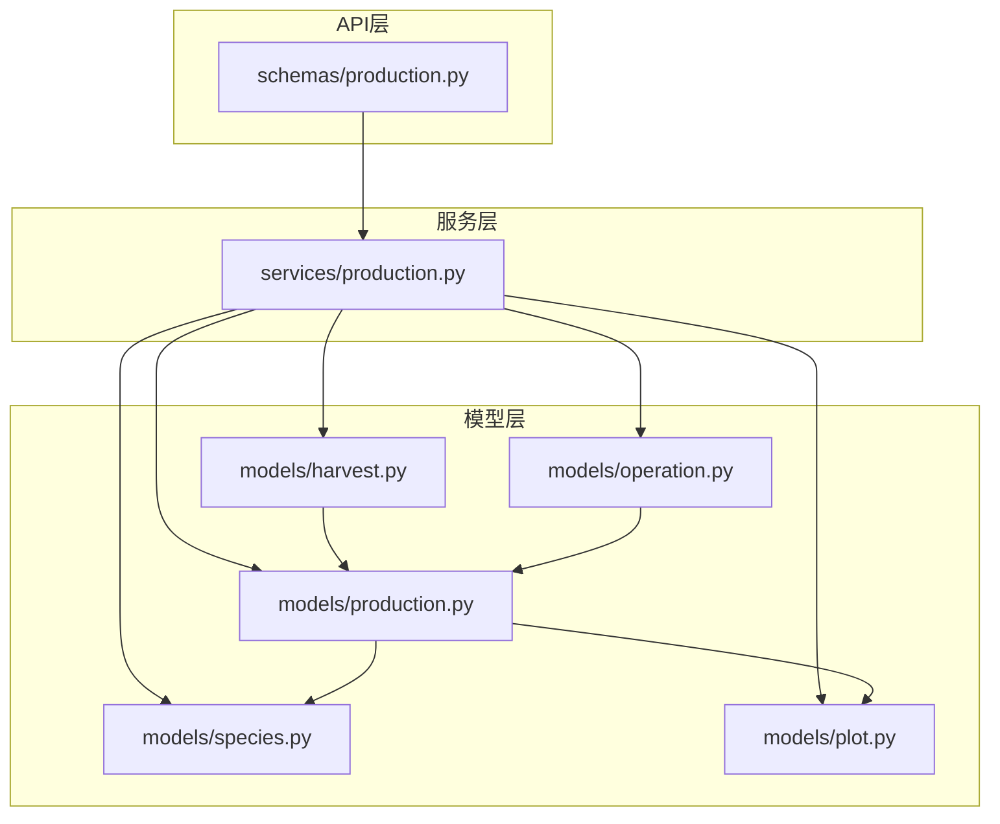
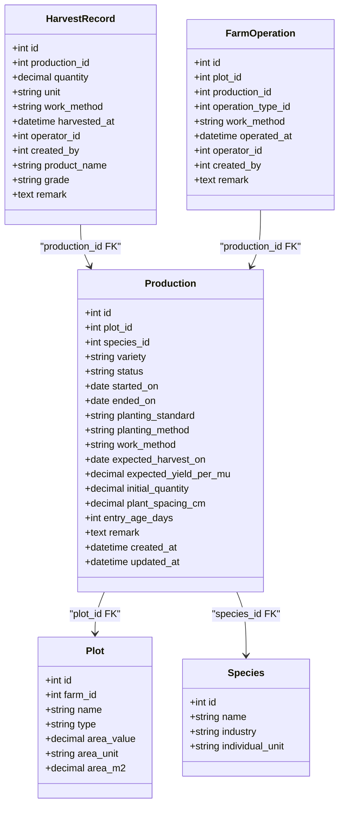
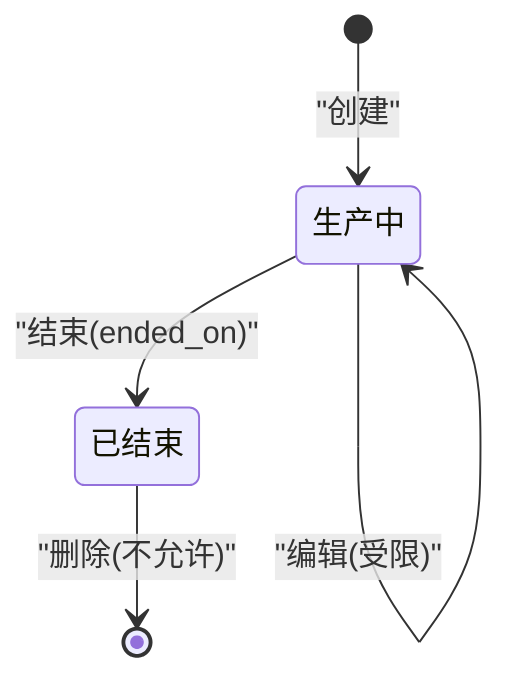
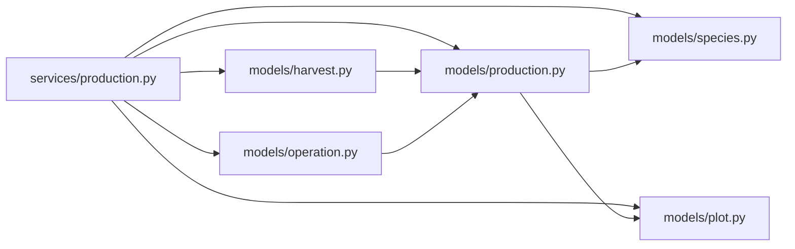
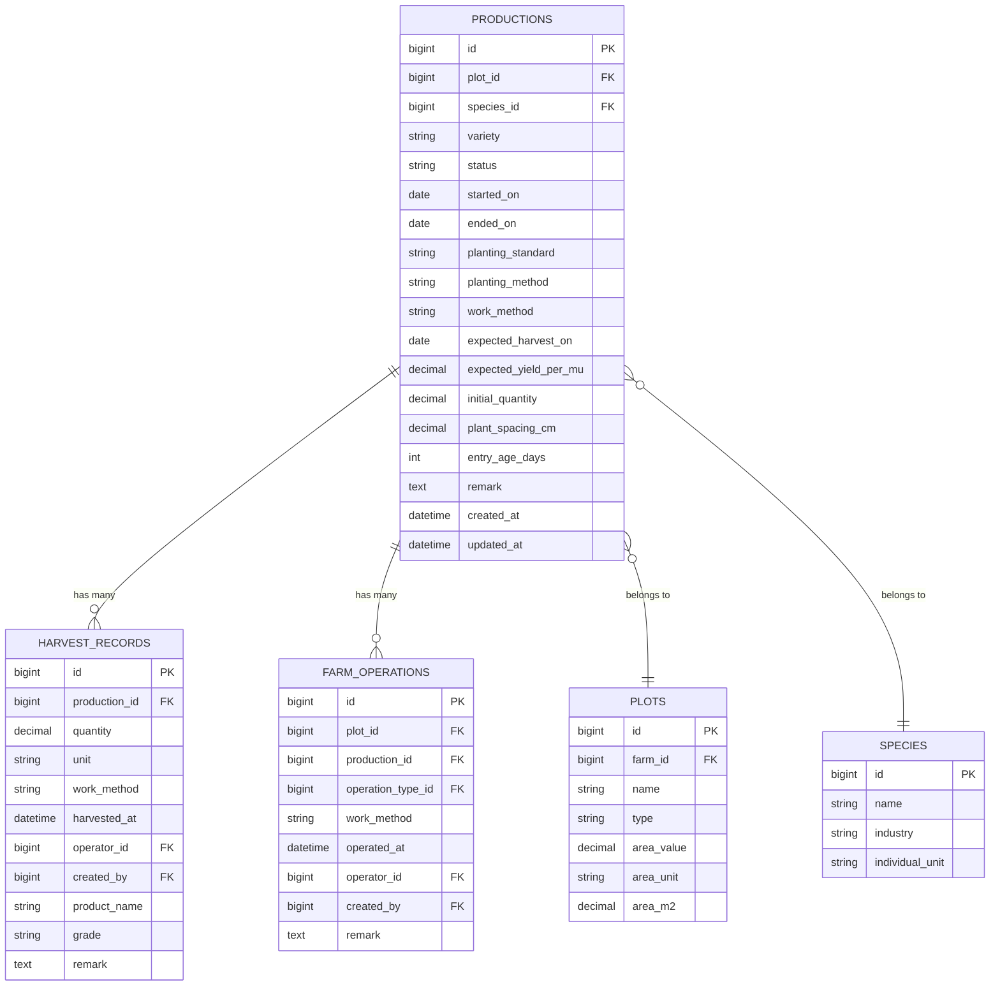
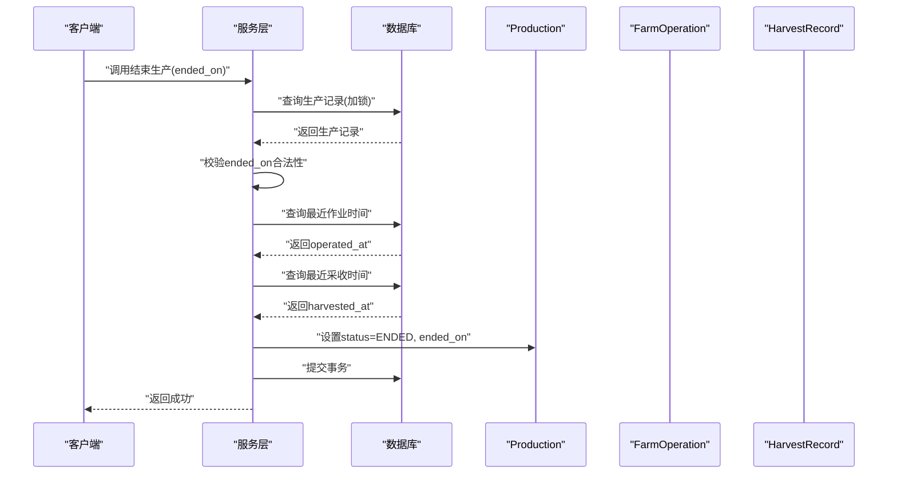

# 生产数据模型设计

<cite>
**本文引用的文件**
- [apps/api/app/models/production.py](file://apps/api/app/models/production.py)
- [apps/api/app/schemas/production.py](file://apps/api/app/schemas/production.py)
- [apps/api/app/services/production.py](file://apps/api/app/services/production.py)
- [apps/api/app/models/species.py](file://apps/api/app/models/species.py)
- [apps/api/app/models/plot.py](file://apps/api/app/models/plot.py)
- [apps/api/app/models/harvest.py](file://apps/api/app/models/harvest.py)
- [apps/api/app/models/operation.py](file://apps/api/app/models/operation.py)
</cite>

## 目录
1. [简介](#简介)
2. [项目结构](#项目结构)
3. [核心组件](#核心组件)
4. [架构总览](#架构总览)
5. [详细组件分析](#详细组件分析)
6. [依赖关系分析](#依赖关系分析)
7. [性能考虑](#性能考虑)
8. [故障排查指南](#故障排查指南)
9. [结论](#结论)
10. [附录](#附录)

## 简介
本文件面向生产环境的数据模型设计，聚焦 Production（生产）实体的字段定义、枚举与业务规则、时间字段管理逻辑、产量相关字段的计算约束，以及与地块、物种、作业和采收记录的关联关系。文档同时提供 ER 图、类图与时序图，帮助读者快速理解系统设计与实现细节。

## 项目结构
围绕 Production 的核心代码分布在以下位置：
- 数据模型：models/production.py、models/species.py、models/plot.py、models/harvest.py、models/operation.py
- 接口校验与序列化：schemas/production.py
- 业务服务：services/production.py

图表来源
- [apps/api/app/schemas/production.py:1-198](file://apps/api/app/schemas/production.py#L1-L198)
- [apps/api/app/services/production.py:1-446](file://apps/api/app/services/production.py#L1-L446)
- [apps/api/app/models/production.py:1-79](file://apps/api/app/models/production.py#L1-L79)
- [apps/api/app/models/species.py:1-35](file://apps/api/app/models/species.py#L1-L35)
- [apps/api/app/models/plot.py:1-54](file://apps/api/app/models/plot.py#L1-L54)
- [apps/api/app/models/harvest.py:1-48](file://apps/api/app/models/harvest.py#L1-L48)
- [apps/api/app/models/operation.py:1-80](file://apps/api/app/models/operation.py#L1-L80)

章节来源
- [apps/api/app/models/production.py:1-79](file://apps/api/app/models/production.py#L1-L79)
- [apps/api/app/schemas/production.py:1-198](file://apps/api/app/schemas/production.py#L1-L198)
- [apps/api/app/services/production.py:1-446](file://apps/api/app/services/production.py#L1-L446)

## 核心组件
- Production 实体：记录一次种植/养殖生产的完整生命周期信息，包含地块、物种、品种、状态、时间与数量等关键维度。
- 枚举类型：ProductionStatus、PlantingStandard、PlantingMethod、WorkMethod、QuantityUnit，用于规范业务语义与输入校验。
- 关联实体：Plot（地块）、Species（物种）、HarvestRecord（采收记录）、FarmOperation（农事作业）。
- 服务层：负责创建、更新、结束、删除生产记录，并执行跨表一致性校验与业务规则验证。

章节来源
- [apps/api/app/models/production.py:13-79](file://apps/api/app/models/production.py#L13-L79)
- [apps/api/app/models/species.py:12-35](file://apps/api/app/models/species.py#L12-L35)
- [apps/api/app/models/plot.py:31-54](file://apps/api/app/models/plot.py#L31-L54)
- [apps/api/app/models/harvest.py:13-48](file://apps/api/app/models/harvest.py#L13-L48)
- [apps/api/app/models/operation.py:37-80](file://apps/api/app/models/operation.py#L37-L80)
- [apps/api/app/services/production.py:164-446](file://apps/api/app/services/production.py#L164-L446)

## 架构总览
Production 处于业务核心，向上通过 API Schema 暴露请求/响应契约，向下通过 ORM 映射到数据库表，并通过服务层协调 Plot、Species、HarvestRecord、FarmOperation 的读写与一致性约束。

图表来源
- [apps/api/app/models/production.py:43-79](file://apps/api/app/models/production.py#L43-L79)
- [apps/api/app/models/plot.py:31-54](file://apps/api/app/models/plot.py#L31-L54)
- [apps/api/app/models/species.py:27-35](file://apps/api/app/models/species.py#L27-L35)
- [apps/api/app/models/harvest.py:13-48](file://apps/api/app/models/harvest.py#L13-L48)
- [apps/api/app/models/operation.py:37-80](file://apps/api/app/models/operation.py#L37-L80)

## 详细组件分析

### 1) Production 模型字段与约束
- 基础标识与关联
  - id：主键，自增。
  - plot_id：外键指向 plots.id，不可为空，建立索引。
  - species_id：外键指向 species.id，不可为空，建立索引。
  - variety：品种，可选字符串。
- 状态与时间
  - status：生产状态，默认 ACTIVE；支持 ENDED。
  - started_on：开始日期，必填。
  - ended_on：结束日期，可选；结束时间不得早于开始时间且不得晚于当天。
  - expected_harvest_on：预计收获日期，可选。
- 种植与工作配置
  - planting_standard：种植标准，可选，取值 NORMAL、GREEN、ORGANIC。
  - planting_method：种植方法，可选，取值 TRANSPLANT、DIRECT_SEEDING。
  - work_method：工作方法，可选，取值 MANUAL、MECHANICAL。
- 产量与规格
  - expected_yield_per_mu：预期亩产，可选，数值型。
  - initial_quantity：初始数量，可选，数值型；根据物种单位进行整数性校验。
  - plant_spacing_cm：株距（厘米），可选，数值型。
  - entry_age_days：入栏/定植日龄，可选，非负整数。
- 审计字段
  - remark：备注，可选文本。
  - created_at/updated_at：自动维护的时间戳。

章节来源
- [apps/api/app/models/production.py:13-79](file://apps/api/app/models/production.py#L13-L79)

### 2) 枚举与业务含义
- ProductionStatus
  - ACTIVE：生产中，可编辑、可结束。
  - ENDED：已结束，禁止再次编辑或删除。
- PlantingStandard（种植标准）
  - NORMAL：常规种植。
  - GREEN：绿色种植。
  - ORGANIC：有机种植。
- PlantingMethod（种植方法）
  - TRANSPLANT：移栽。
  - DIRECT_SEEDING：直播。
- WorkMethod（工作方法）
  - MANUAL：人工。
  - MECHANICAL：机械。
- QuantityUnit（数量单位）
  - KG、HEAD、FEATHER、PIECE、PLANT、TAIL。
  - 注意：QuantityUnit 在模型中作为枚举存在，但实际入库字段 unit 由 HarvestRecord 使用；Production 本身不直接存储单位，单位约束通过 Species.individual_unit 与服务层校验共同保证。

章节来源
- [apps/api/app/models/production.py:13-41](file://apps/api/app/models/production.py#L13-L41)
- [apps/api/app/models/species.py:12-35](file://apps/api/app/models/species.py#L12-L35)
- [apps/api/app/models/harvest.py:13-48](file://apps/api/app/models/harvest.py#L13-L48)

### 3) 时间字段管理逻辑
- started_on
  - 不允许为未来日期；创建与更新时均会校验。
- ended_on
  - 结束日期不得晚于当天；不得早于 started_on；不得早于最近一次作业或采收时间（按业务时区换算后的日期）。
- expected_harvest_on
  - 仅在适用行业（如种植业）允许填写；其他行业会被拒绝。

章节来源
- [apps/api/app/services/production.py:44-51](file://apps/api/app/services/production.py#L44-L51)
- [apps/api/app/services/production.py:403-443](file://apps/api/app/services/production.py#L403-L443)

### 4) 产量相关字段与计算规则
- initial_quantity（初始数量）
  - 必须为正数；当物种单位为个体类（如 HEAD、PLANT 等）时，要求为整数。
  - 不同行业对是否必填有不同约束：林业与畜牧业通常要求填写；种植业可能依据具体场景决定。
- expected_yield_per_mu（预期亩产）
  - 必须为正数；仅适用于种植业/林业等“种植”相关行业；畜牧渔业不适用。
- plant_spacing_cm（株距）
  - 必须为正数；仅适用于种植业；其他行业禁用。
- entry_age_days（日龄）
  - 非负整数；仅适用于畜牧业；种植业禁用。

上述规则在服务层 _validate_industry_fields 中集中实现，依据 Species.industry 动态判定必填与禁用字段。

章节来源
- [apps/api/app/services/production.py:63-103](file://apps/api/app/services/production.py#L63-L103)
- [apps/api/app/schemas/production.py:15-143](file://apps/api/app/schemas/production.py#L15-L143)

### 5) 状态机与业务流程
- 创建生产：状态置为 ACTIVE，写入开始日期与业务配置。
- 编辑生产：仅 ACTIVE 状态可编辑；若已产生作业或采收记录，则禁止修改核心字段（plot_id、species_id、started_on）。
- 结束生产：将状态改为 ENDED，写入结束日期；需满足结束日期约束并与作业/采收时间一致。
- 删除生产：仅 ACTIVE 且无作业与采收记录时可删除。

图表来源
- [apps/api/app/services/production.py:164-217](file://apps/api/app/services/production.py#L164-L217)
- [apps/api/app/services/production.py:220-365](file://apps/api/app/services/production.py#L220-L365)
- [apps/api/app/services/production.py:368-400](file://apps/api/app/services/production.py#L368-L400)
- [apps/api/app/services/production.py:403-443](file://apps/api/app/services/production.py#L403-L443)

### 6) 与作业和采收的一致性约束
- 作业（FarmOperation）
  - 一旦存在作业记录，禁止修改生产的核心字段（plot_id、species_id、started_on）。
  - 结束日期不得早于最近一次作业的业务日期。
- 采收（HarvestRecord）
  - 一旦存在采收记录，禁止修改生产的核心字段。
  - 结束日期不得早于最近一次采收的业务日期。

章节来源
- [apps/api/app/services/production.py:249-270](file://apps/api/app/services/production.py#L249-L270)
- [apps/api/app/services/production.py:383-397](file://apps/api/app/services/production.py#L383-L397)
- [apps/api/app/services/production.py:425-439](file://apps/api/app/services/production.py#L425-L439)

### 7) 接口契约与序列化
- CreateProductionRequest / UpdateProductionRequest：统一支持驼峰与下划线字段名，提供范围校验（正数、非负等）。
- EndProductionRequest：仅接受结束日期。
- ProductionResponse：对外返回生产详情，包含物种名称、行业、个体单位等信息，便于前端展示。

章节来源
- [apps/api/app/schemas/production.py:15-198](file://apps/api/app/schemas/production.py#L15-L198)

## 依赖关系分析
- 模型耦合
  - Production 强依赖 Plot 与 Species；HarvestRecord 与 FarmOperation 反向依赖 Production。
- 服务层耦合
  - services/production.py 聚合了所有与生产相关的业务规则，包括跨表查询与一致性校验。
- 外部依赖
  - 时区处理：基于应用配置的时区进行业务日期转换。
  - 数据库：MySQL 大整型、Decimal 精度控制。

图表来源
- [apps/api/app/services/production.py:1-446](file://apps/api/app/services/production.py#L1-L446)
- [apps/api/app/models/production.py:1-79](file://apps/api/app/models/production.py#L1-L79)
- [apps/api/app/models/species.py:1-35](file://apps/api/app/models/species.py#L1-L35)
- [apps/api/app/models/plot.py:1-54](file://apps/api/app/models/plot.py#L1-L54)
- [apps/api/app/models/harvest.py:1-48](file://apps/api/app/models/harvest.py#L1-L48)
- [apps/api/app/models/operation.py:1-80](file://apps/api/app/models/operation.py#L1-L80)

章节来源
- [apps/api/app/services/production.py:1-446](file://apps/api/app/services/production.py#L1-L446)

## 性能考虑
- 索引优化
  - productions.plot_id、productions.species_id 已建索引，利于按地块/物种查询。
  - harvest_records.production_id、farm_operations.production_id 已建索引，利于关联统计与一致性检查。
- 查询策略
  - 列表查询采用分页与排序（优先显示 ACTIVE，再按开始时间倒序）。
  - 更新/结束时使用行级锁（with_for_update）避免并发冲突。
- 数值精度
  - 产量与面积使用 Decimal，避免浮点误差。
- 时区处理
  - 统一通过应用时区转换业务日期，减少跨时区不一致问题。

[本节为通用性能建议，不直接引用具体代码片段]

## 故障排查指南
- 常见错误与定位
  - “startedOn 不能晚于今天”：检查传入的开始日期是否超过当前业务日期。
  - “endedOn 不能晚于今天/早于开始日期/早于作业或采收日期”：核对结束日期与关联记录时间。
  - “initialQuantity 必须为整数”：确认物种单位是否为个体类，并确保传入值为整数。
  - “该字段不适用于某行业”：根据物种行业判断字段是否允许填写。
  - “已结束的生产不可编辑/删除”：确认生产状态是否为 ACTIVE。
  - “已有作业/采收记录，不可修改核心字段”：如需调整，应评估数据影响并遵循变更限制。
- 定位步骤
  - 查看服务层抛出的异常信息与错误码。
  - 核对请求参数是否符合 Schema 校验规则。
  - 检查关联表是否存在作业/采收记录，以及其时间戳。

章节来源
- [apps/api/app/services/production.py:28-61](file://apps/api/app/services/production.py#L28-L61)
- [apps/api/app/services/production.py:44-51](file://apps/api/app/services/production.py#L44-L51)
- [apps/api/app/services/production.py:63-103](file://apps/api/app/services/production.py#L63-L103)
- [apps/api/app/services/production.py:246-270](file://apps/api/app/services/production.py#L246-L270)
- [apps/api/app/services/production.py:368-400](file://apps/api/app/services/production.py#L368-L400)
- [apps/api/app/services/production.py:403-443](file://apps/api/app/services/production.py#L403-L443)

## 结论
Production 模型以清晰的字段划分与严格的枚举约束，结合服务层的行业化校验与时间一致性规则，形成了稳健的生产生命周期管理能力。通过与其他实体的关联与约束，确保了从地块、物种到作业、采收的全链路数据一致性。建议在扩展新行业或新增字段时，延续现有“Schema 校验 + 服务层规则”的分层模式，以保持系统的可维护性与一致性。

[本节为总结性内容，不直接引用具体代码片段]

## 附录

### ER 关系图

图表来源
- [apps/api/app/models/production.py:43-79](file://apps/api/app/models/production.py#L43-L79)
- [apps/api/app/models/plot.py:31-54](file://apps/api/app/models/plot.py#L31-L54)
- [apps/api/app/models/species.py:27-35](file://apps/api/app/models/species.py#L27-L35)
- [apps/api/app/models/harvest.py:13-48](file://apps/api/app/models/harvest.py#L13-L48)
- [apps/api/app/models/operation.py:37-80](file://apps/api/app/models/operation.py#L37-L80)

### 关键流程时序图（结束生产）

图表来源
- [apps/api/app/services/production.py:403-443](file://apps/api/app/services/production.py#L403-L443)