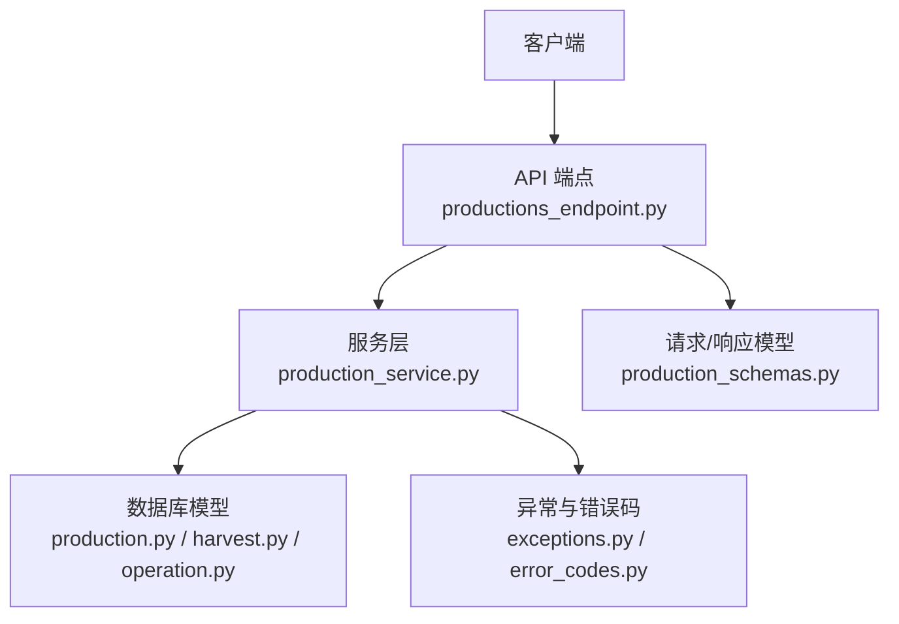
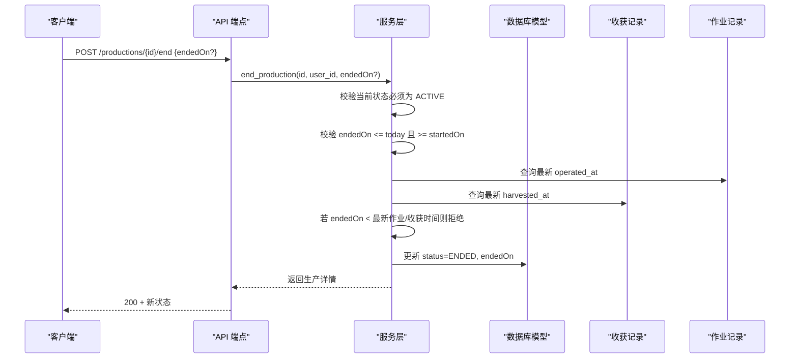
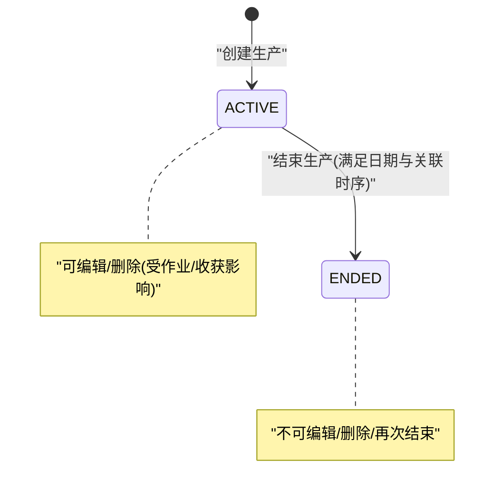
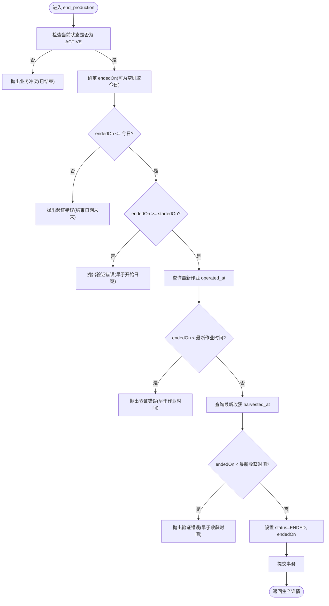
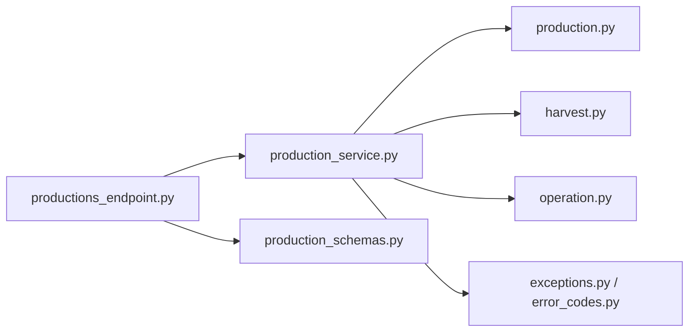
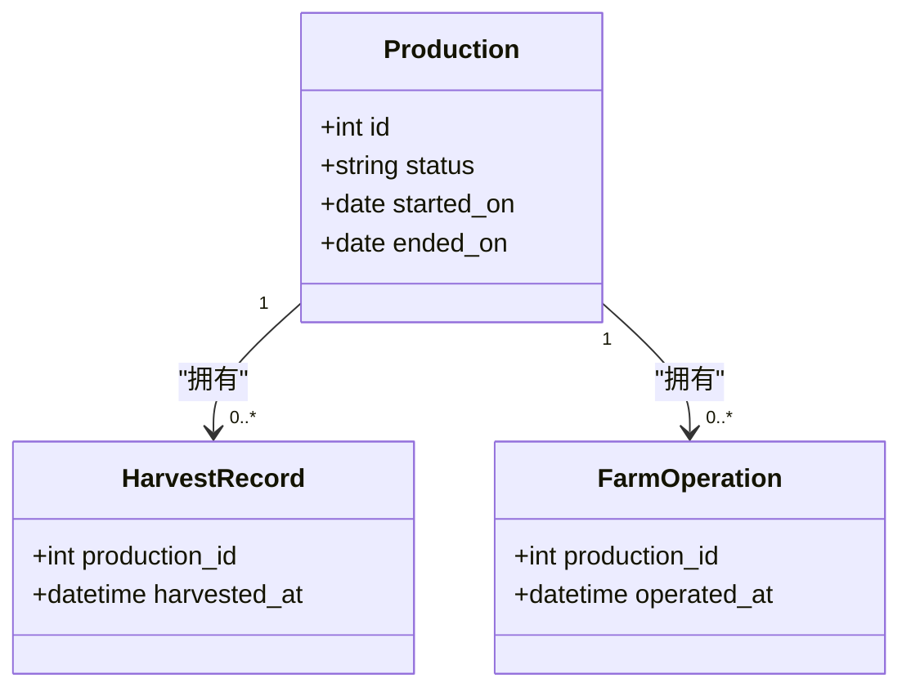
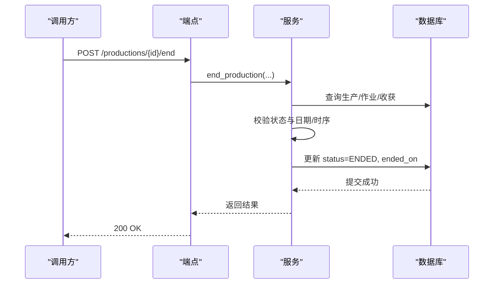

# 生产状态机实现

<cite>
**本文引用的文件**
- [production.py](file://apps/api/app/models/production.py)
- [production_service.py](file://apps/api/app/services/production.py)
- [productions_endpoint.py](file://apps/api/app/api/v1/endpoints/productions.py)
- [production_schemas.py](file://apps/api/app/schemas/production.py)
- [harvest_model.py](file://apps/api/app/models/harvest.py)
- [operation_model.py](file://apps/api/app/models/operation.py)
- [error_codes.py](file://apps/api/app/core/error_codes.py)
- [exceptions.py](file://apps/api/app/core/exceptions.py)
- [test_productions.py](file://apps/api/tests/test_productions.py)
</cite>

## 目录
1. [简介](#简介)
2. [项目结构](#项目结构)
3. [核心组件](#核心组件)
4. [架构总览](#架构总览)
5. [详细组件分析](#详细组件分析)
6. [依赖关系分析](#依赖关系分析)
7. [性能考虑](#性能考虑)
8. [故障排查指南](#故障排查指南)
9. [结论](#结论)
10. [附录](#附录)

## 简介
本文件面向生产状态机的实现，聚焦从 ACTIVE 到 ENDED 的状态流转机制、业务约束与数据完整性校验。文档覆盖：
- 状态转换规则与前置条件（如结束日期不得早于开始日期、只能单向流转等）
- 状态变更时的数据完整性检查（产量计算、收获记录关联等）
- 状态更新 API 的实现逻辑（参数验证、权限控制、事务处理）
- 状态流转图与各状态下操作权限矩阵
- 异常处理与错误码定义，以及回滚机制说明

## 项目结构
后端采用分层架构：API 层负责路由与入参解析；Service 层承载业务规则与数据一致性校验；Model 层定义数据库模型与枚举；Schema 层负责请求/响应结构与字段级校验；Core 提供统一异常与错误码。

图表来源
- [productions_endpoint.py:71-198](file://apps/api/app/api/v1/endpoints/productions.py#L71-L198)
- [production_service.py:164-446](file://apps/api/app/services/production.py#L164-L446)
- [production.py:43-79](file://apps/api/app/models/production.py#L43-L79)
- [harvest_model.py:13-48](file://apps/api/app/models/harvest.py#L13-L48)
- [operation_model.py:37-80](file://apps/api/app/models/operation.py#L37-L80)
- [production_schemas.py:15-198](file://apps/api/app/schemas/production.py#L15-L198)
- [exceptions.py:13-88](file://apps/api/app/core/exceptions.py#L13-L88)
- [error_codes.py:4-13](file://apps/api/app/core/error_codes.py#L4-L13)

章节来源
- [productions_endpoint.py:71-198](file://apps/api/app/api/v1/endpoints/productions.py#L71-L198)
- [production_service.py:164-446](file://apps/api/app/services/production.py#L164-L446)
- [production.py:43-79](file://apps/api/app/models/production.py#L43-L79)
- [production_schemas.py:15-198](file://apps/api/app/schemas/production.py#L15-L198)
- [exceptions.py:13-88](file://apps/api/app/core/exceptions.py#L13-L88)
- [error_codes.py:4-13](file://apps/api/app/core/error_codes.py#L4-L13)

## 核心组件
- 模型与枚举
  - 生产实体 Production，包含状态 status、开始时间 started_on、结束时间 ended_on 等关键字段
  - 状态枚举 ProductionStatus：ACTIVE、ENDED
- 服务层
  - 创建生产 create_production：校验行业相关必填字段、开始日期限制，并写入初始状态为 ACTIVE
  - 编辑生产 update_production：在存在作业或收获记录时禁止修改核心字段（plot_id、species_id、started_on），并校验行业字段
  - 删除生产 delete_production：仅允许删除未结束的且无作业/收获记录的记录
  - 结束生产 end_production：实现 ACTIVE→ENDED 的单向流转，严格校验结束日期与关联数据的时序一致性
- API 端点
  - GET/POST/PATCH/DELETE 及 POST /end 暴露生产生命周期操作
- Schema
  - Create/Update/End 请求体与响应体，含字段别名与序列化别名，确保前后端一致

章节来源
- [production.py:13-79](file://apps/api/app/models/production.py#L13-L79)
- [production_service.py:164-446](file://apps/api/app/services/production.py#L164-L446)
- [productions_endpoint.py:71-198](file://apps/api/app/api/v1/endpoints/productions.py#L71-L198)
- [production_schemas.py:15-198](file://apps/api/app/schemas/production.py#L15-L198)

## 架构总览
生产状态机围绕“生产”这一领域对象展开，通过服务层集中实现状态转换与业务规则，API 层仅做参数透传与结果封装。所有写操作均基于异步会话提交，失败时由框架自动回滚。

图表来源
- [production_service.py:403-446](file://apps/api/app/services/production.py#L403-L446)
- [productions_endpoint.py:174-187](file://apps/api/app/api/v1/endpoints/productions.py#L174-L187)
- [operation_model.py:37-80](file://apps/api/app/models/operation.py#L37-L80)
- [harvest_model.py:13-48](file://apps/api/app/models/harvest.py#L13-L48)

## 详细组件分析

### 状态机与流转规则
- 状态集合：ACTIVE、ENDED
- 流转方向：仅允许 ACTIVE → ENDED，不允许反向或跨态跳转
- 触发入口：POST /api/v1/productions/{production_id}/end
- 前置条件
  - 当前状态必须为 ACTIVE
  - 结束日期 endedOn 不得晚于今天
  - 结束日期 endedOn 不得早于 startedOn
  - 结束日期 endedOn 不得早于任何关联作业的最晚 operated_at
  - 结束日期 endedOn 不得早于任何关联收获记录的最晚 harvested_at
- 业务约束
  - 已结束的生产不可再编辑或删除
  - 已有关键字段的修改在存在作业/收获记录时被禁止（针对 edit）
  - 删除仅在无作业/收获记录且状态为 ACTIVE 时允许

图表来源
- [production_service.py:220-446](file://apps/api/app/services/production.py#L220-L446)
- [productions_endpoint.py:145-187](file://apps/api/app/api/v1/endpoints/productions.py#L145-L187)

章节来源
- [production_service.py:220-446](file://apps/api/app/services/production.py#L220-L446)
- [productions_endpoint.py:145-187](file://apps/api/app/api/v1/endpoints/productions.py#L145-L187)

### 结束生产流程（端到端）

图表来源
- [production_service.py:403-446](file://apps/api/app/services/production.py#L403-L446)

章节来源
- [production_service.py:403-446](file://apps/api/app/services/production.py#L403-L446)

### 编辑生产的约束与数据完整性
- 核心字段保护：当存在作业或收获记录时，禁止修改 plot_id、species_id、started_on
- 同农场内地块迁移：允许在同农场内移动地块，跨农场迁移被禁止
- 行业字段校验：根据物种所属行业动态要求/限制字段（如种植业需 planting_standard/method/work_method，林业需 initial_quantity 且禁用 expected_yield_per_mu 等）
- 数值与类型：initialQuantity 必须为整数（按单位约束），其他数值字段需为正数

章节来源
- [production_service.py:220-366](file://apps/api/app/services/production.py#L220-L366)
- [production_schemas.py:15-143](file://apps/api/app/schemas/production.py#L15-L143)

### 删除生产的约束
- 仅允许删除状态为 ACTIVE 的记录
- 若存在作业或收获记录，禁止删除
- 删除后无法恢复（无软删除）

章节来源
- [production_service.py:368-401](file://apps/api/app/services/production.py#L368-L401)

### 权限控制
- 资源级访问：通过 join FarmMember 并按 user_id 过滤，确保只有该生产所属农场的成员可访问
- 越权访问将返回 404（对外隐藏资源存在性）

章节来源
- [production_service.py:141-161](file://apps/api/app/services/production.py#L141-L161)
- [productions_endpoint.py:71-142](file://apps/api/app/api/v1/endpoints/productions.py#L71-L142)

### 事务与回滚
- 所有写操作使用异步会话提交，任一环节抛出异常将导致事务回滚
- 自定义 AppException 会被全局异常处理器捕获并转换为统一错误响应

章节来源
- [production_service.py:164-446](file://apps/api/app/services/production.py#L164-L446)
- [exceptions.py:35-88](file://apps/api/app/core/exceptions.py#L35-L88)

### 各状态下操作权限矩阵
- ACTIVE
  - 编辑：允许（受作业/收获记录对核心字段的限制）
  - 删除：允许（若无作业/收获记录）
  - 结束：允许（满足日期与关联时序约束）
- ENDED
  - 编辑：禁止
  - 删除：禁止
  - 结束：禁止（已处于终态）

章节来源
- [production_service.py:220-446](file://apps/api/app/services/production.py#L220-L446)
- [productions_endpoint.py:145-187](file://apps/api/app/api/v1/endpoints/productions.py#L145-L187)

## 依赖关系分析
- 模型依赖
  - HarvestRecord 与 FarmOperation 通过 production_id 与生产关联，用于结束前的时序校验
- 服务依赖
  - 服务层依赖模型进行数据读取与校验，并通过会话提交事务
- API 依赖
  - 端点依赖服务层方法，并将结果映射为响应模型

图表来源
- [productions_endpoint.py:71-198](file://apps/api/app/api/v1/endpoints/productions.py#L71-L198)
- [production_service.py:164-446](file://apps/api/app/services/production.py#L164-L446)
- [production.py:43-79](file://apps/api/app/models/production.py#L43-L79)
- [harvest_model.py:13-48](file://apps/api/app/models/harvest.py#L13-L48)
- [operation_model.py:37-80](file://apps/api/app/models/operation.py#L37-L80)
- [production_schemas.py:15-198](file://apps/api/app/schemas/production.py#L15-L198)
- [exceptions.py:13-88](file://apps/api/app/core/exceptions.py#L13-L88)
- [error_codes.py:4-13](file://apps/api/app/core/error_codes.py#L4-L13)

章节来源
- [production_service.py:164-446](file://apps/api/app/services/production.py#L164-L446)
- [productions_endpoint.py:71-198](file://apps/api/app/api/v1/endpoints/productions.py#L71-L198)

## 性能考虑
- 列表查询使用分页与排序优化，优先展示 ACTIVE 记录
- 结束前查询最新作业/收获时间使用聚合函数，避免全表扫描
- 并发安全：关键读路径使用 with_for_update 锁定行，防止竞态条件

章节来源
- [production_service.py:112-138](file://apps/api/app/services/production.py#L112-L138)
- [production_service.py:141-161](file://apps/api/app/services/production.py#L141-L161)
- [production_service.py:425-439](file://apps/api/app/services/production.py#L425-L439)

## 故障排查指南
- 常见错误码
  - VALIDATION_ERROR：参数校验失败（如日期非法、数值格式不符、行业必填缺失）
  - BUSINESS_CONFLICT：业务冲突（如已结束不可编辑/删除、重复结束、跨农场迁移等）
  - NOT_FOUND：资源不存在或无权访问
  - INTERNAL_SERVER_ERROR：未预期异常
- 典型问题定位
  - 结束失败：检查 endedOn 是否大于 today、是否早于 startedOn、是否早于最近作业/收获时间
  - 编辑失败：检查是否存在作业/收获记录，以及是否尝试修改核心字段
  - 删除失败：检查状态是否为 ACTIVE，以及是否存在作业/收获记录
- 调试建议
  - 查看返回的错误码与消息
  - 确认用户是否为目标生产所属农场成员
  - 核对请求字段是否符合行业要求与类型约束

章节来源
- [error_codes.py:4-13](file://apps/api/app/core/error_codes.py#L4-L13)
- [exceptions.py:35-88](file://apps/api/app/core/exceptions.py#L35-L88)
- [production_service.py:220-446](file://apps/api/app/services/production.py#L220-L446)
- [test_productions.py:315-412](file://apps/api/tests/test_productions.py#L315-L412)

## 结论
生产状态机以 ACTIVE→ENDED 的单向流转为核心，配合严格的日期与时序校验、资源级权限控制与事务保障，确保生产生命周期的一致性与可审计性。服务层集中实现业务规则，API 层保持简洁，便于扩展与维护。

## 附录

### 状态流转图（代码级）

图表来源
- [production.py:43-79](file://apps/api/app/models/production.py#L43-L79)
- [harvest_model.py:13-48](file://apps/api/app/models/harvest.py#L13-L48)
- [operation_model.py:37-80](file://apps/api/app/models/operation.py#L37-L80)

### 结束生产序列图（代码级）

图表来源
- [productions_endpoint.py:174-187](file://apps/api/app/api/v1/endpoints/productions.py#L174-L187)
- [production_service.py:403-446](file://apps/api/app/services/production.py#L403-L446)