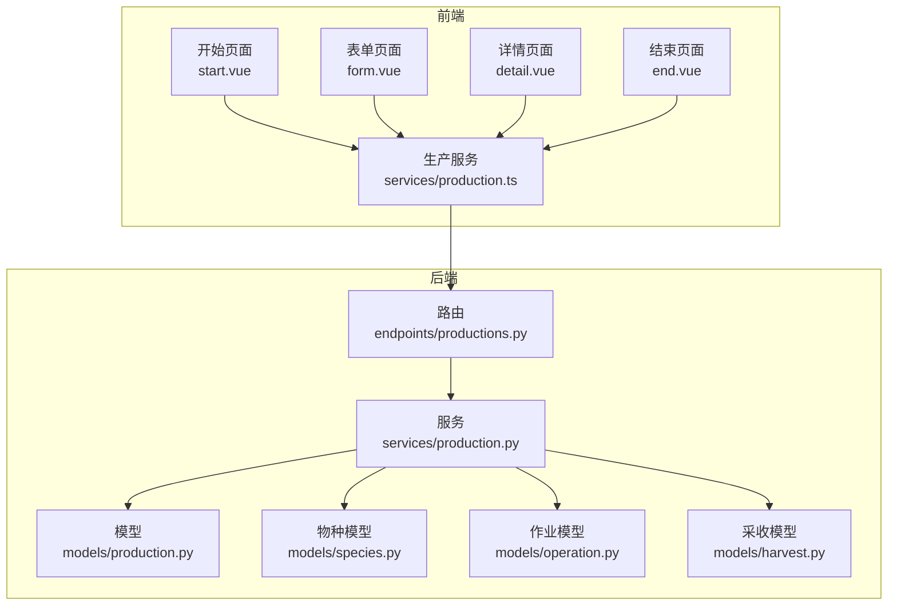
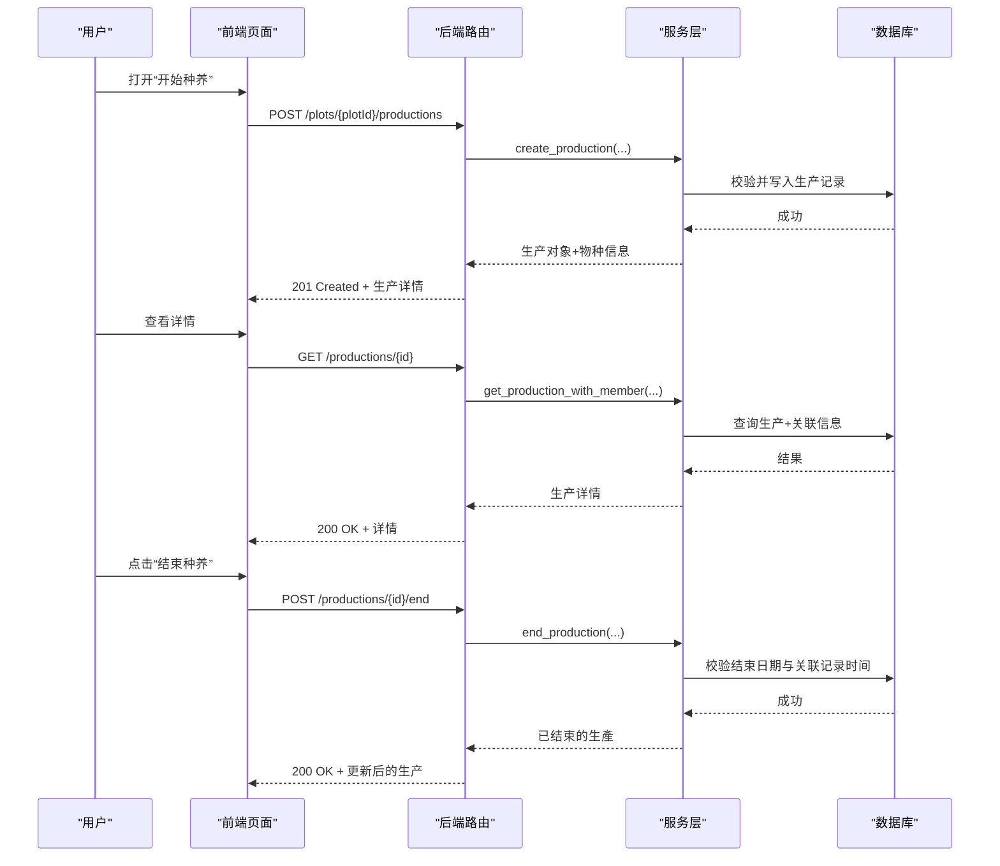
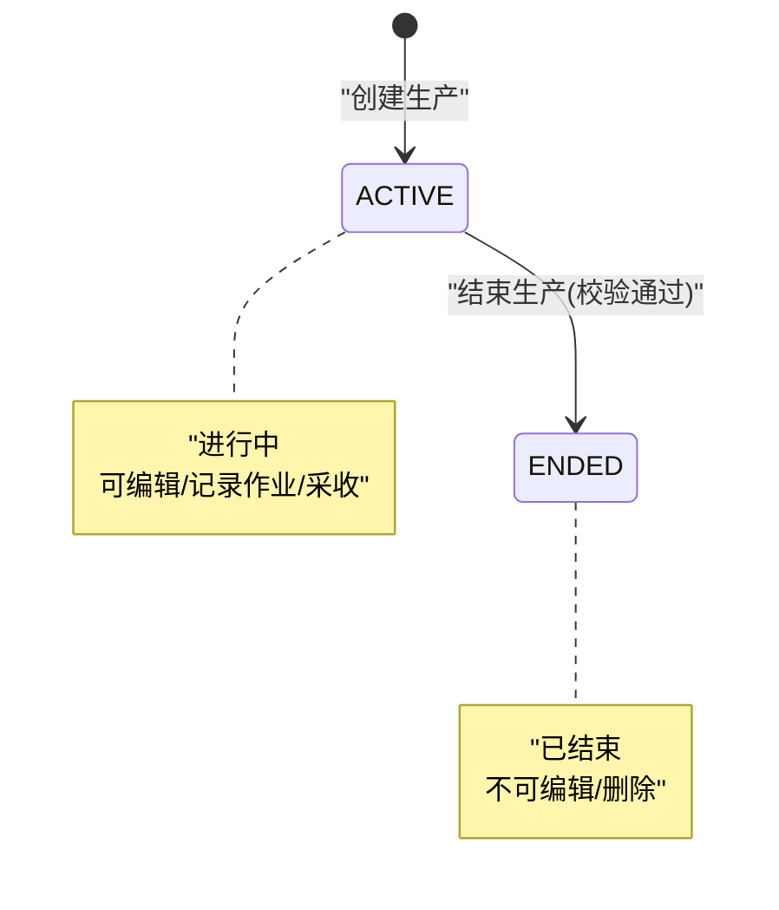
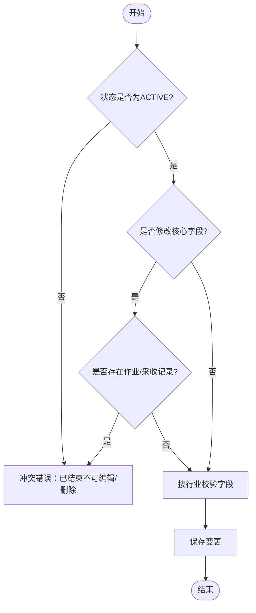
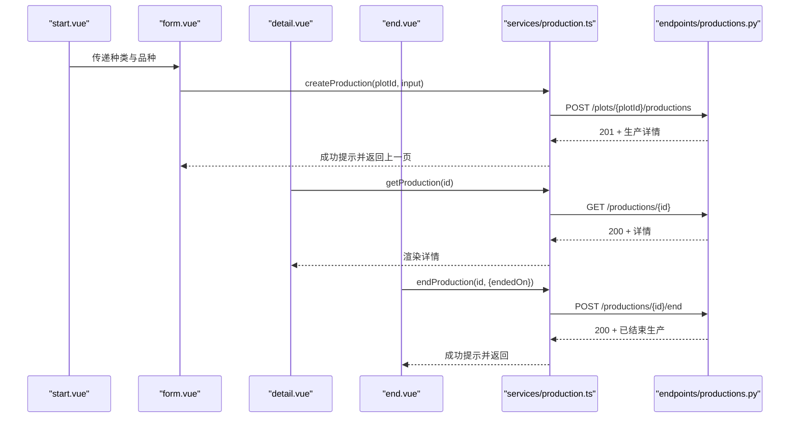
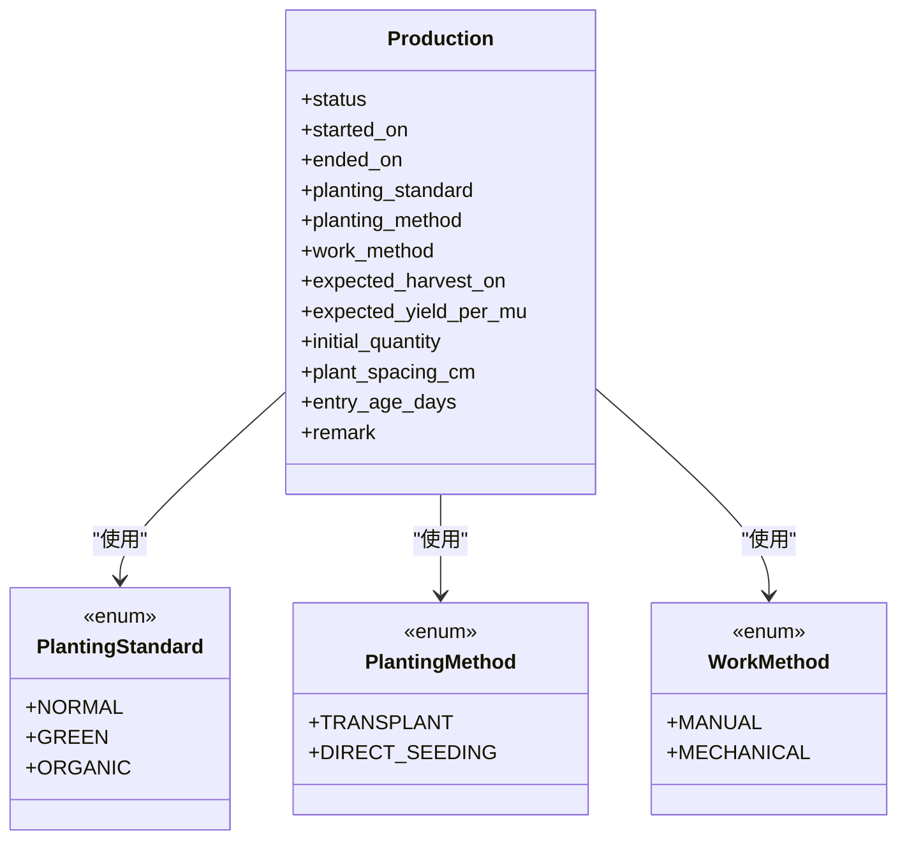
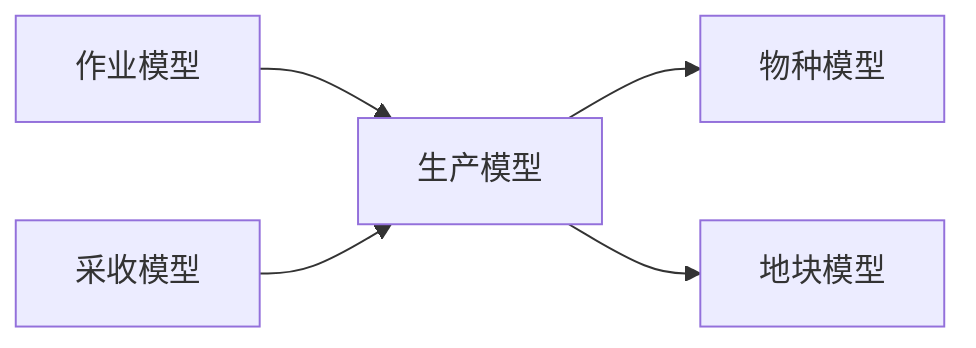

# 生产生命周期跟踪

<cite>
**本文引用的文件**
- [apps/api/app/models/production.py](file://apps/api/app/models/production.py)
- [apps/api/app/schemas/production.py](file://apps/api/app/schemas/production.py)
- [apps/api/app/services/production.py](file://apps/api/app/services/production.py)
- [apps/api/app/api/v1/endpoints/productions.py](file://apps/api/app/api/v1/endpoints/productions.py)
- [apps/api/app/models/species.py](file://apps/api/app/models/species.py)
- [apps/api/app/models/operation.py](file://apps/api/app/models/operation.py)
- [apps/api/app/models/harvest.py](file://apps/api/app/models/harvest.py)
- [apps/api/app/core/error_codes.py](file://apps/api/app/core/error_codes.py)
- [apps/miniapp/src/pages/productions/start.vue](file://apps/miniapp/src/pages/productions/start.vue)
- [apps/miniapp/src/pages/productions/form.vue](file://apps/miniapp/src/pages/productions/form.vue)
- [apps/miniapp/src/pages/productions/detail.vue](file://apps/miniapp/src/pages/productions/detail.vue)
- [apps/miniapp/src/pages/productions/end.vue](file://apps/miniapp/src/pages/productions/end.vue)
- [apps/miniapp/src/services/production.ts](file://apps/miniapp/src/services/production.ts)
</cite>

## 目录
1. [简介](#简介)
2. [项目结构](#项目结构)
3. [核心组件](#核心组件)
4. [架构总览](#架构总览)
5. [详细组件分析](#详细组件分析)
6. [依赖关系分析](#依赖关系分析)
7. [性能考虑](#性能考虑)
8. [故障排查指南](#故障排查指南)
9. [结论](#结论)
10. [附录：标准化管理方案](#附录：标准化管理方案)

## 简介
本模块围绕“生产”（种养）全生命周期进行建模与实现，覆盖从开始、进行中到结束的完整状态流转，并支持种植方法、种植标准、工作方法的配置管理。后端通过领域模型、服务层校验与接口暴露，前端提供多页面交互以完成创建、详情展示、编辑、结束等流程。该设计同时兼顾农业、林业、牧业、渔业等多行业差异化的字段约束与业务规则，确保农业生产流程的标准化与可追溯性。

## 项目结构
- 后端（FastAPI + SQLAlchemy）
  - 数据模型：生产、物种、作业、采收记录等
  - 请求/响应模式：Pydantic Schema 定义输入输出
  - 服务层：业务校验、权限与一致性控制
  - 路由层：RESTful API 暴露
- 前端（UniApp + Vue）
  - 页面：开始、表单、详情、结束
  - 服务：HTTP 封装与类型定义
  - 交互：选择种类、地块、日期选择、确认弹窗等

**图表来源**
- [apps/miniapp/src/pages/productions/start.vue:1-226](file://apps/miniapp/src/pages/productions/start.vue#L1-L226)
- [apps/miniapp/src/pages/productions/form.vue:1-181](file://apps/miniapp/src/pages/productions/form.vue#L1-L181)
- [apps/miniapp/src/pages/productions/detail.vue:1-520](file://apps/miniapp/src/pages/productions/detail.vue#L1-L520)
- [apps/miniapp/src/pages/productions/end.vue:1-222](file://apps/miniapp/src/pages/productions/end.vue#L1-L222)
- [apps/miniapp/src/services/production.ts:1-121](file://apps/miniapp/src/services/production.ts#L1-L121)
- [apps/api/app/api/v1/endpoints/productions.py:1-198](file://apps/api/app/api/v1/endpoints/productions.py#L1-L198)
- [apps/api/app/services/production.py:1-446](file://apps/api/app/services/production.py#L1-L446)
- [apps/api/app/models/production.py:1-79](file://apps/api/app/models/production.py#L1-L79)
- [apps/api/app/models/species.py:1-35](file://apps/api/app/models/species.py#L1-L35)
- [apps/api/app/models/operation.py:1-80](file://apps/api/app/models/operation.py#L1-L80)
- [apps/api/app/models/harvest.py:1-48](file://apps/api/app/models/harvest.py#L1-L48)

**章节来源**
- [apps/api/app/models/production.py:1-79](file://apps/api/app/models/production.py#L1-L79)
- [apps/api/app/schemas/production.py:1-198](file://apps/api/app/schemas/production.py#L1-L198)
- [apps/api/app/services/production.py:1-446](file://apps/api/app/services/production.py#L1-L446)
- [apps/api/app/api/v1/endpoints/productions.py:1-198](file://apps/api/app/api/v1/endpoints/productions.py#L1-L198)
- [apps/miniapp/src/pages/productions/start.vue:1-226](file://apps/miniapp/src/pages/productions/start.vue#L1-L226)
- [apps/miniapp/src/pages/productions/form.vue:1-181](file://apps/miniapp/src/pages/productions/form.vue#L1-L181)
- [apps/miniapp/src/pages/productions/detail.vue:1-520](file://apps/miniapp/src/pages/productions/detail.vue#L1-L520)
- [apps/miniapp/src/pages/productions/end.vue:1-222](file://apps/miniapp/src/pages/productions/end.vue#L1-L222)
- [apps/miniapp/src/services/production.ts:1-121](file://apps/miniapp/src/services/production.ts#L1-L121)

## 核心组件
- 生产模型与枚举
  - 生产状态：ACTIVE（进行中）、ENDED（已结束）
  - 种植标准：NORMAL（普通）、GREEN（绿色）、ORGANIC（有机）
  - 种植方法：TRANSPLANT（移栽）、DIRECT_SEEDING（直播）
  - 工作方法：MANUAL（人工）、MECHANICAL（机械）
  - 数量单位：KG、HEAD、FEATHER、PIECE、PLANT、TAIL
- 物种与行业
  - 行业：AGRICULTURE（农业）、FORESTRY（林业）、LIVESTOCK（牧业）、FISHERY（渔业）
  - 个体单位：HEAD、FEATHER、PIECE、PLANT、TAIL
- 关联实体
  - 作业 FarmOperation：记录生产过程中的操作，含作业时间、操作方法等
  - 采收记录 HarvestRecord：记录产出数量、等级、作业方式、采收时间等
- 服务层校验
  - 按行业差异化校验必填/禁止字段
  - 日期合法性校验（开始/结束日期）
  - 与作业、采收的时间一致性校验
- 路由与接口
  - 列表、创建、详情、更新、删除、结束
  - 统一响应封装与分页

**章节来源**
- [apps/api/app/models/production.py:13-41](file://apps/api/app/models/production.py#L13-L41)
- [apps/api/app/models/species.py:12-35](file://apps/api/app/models/species.py#L12-L35)
- [apps/api/app/models/operation.py:37-80](file://apps/api/app/models/operation.py#L37-L80)
- [apps/api/app/models/harvest.py:13-48](file://apps/api/app/models/harvest.py#L13-L48)
- [apps/api/app/services/production.py:63-103](file://apps/api/app/services/production.py#L63-L103)
- [apps/api/app/api/v1/endpoints/productions.py:71-198](file://apps/api/app/api/v1/endpoints/productions.py#L71-L198)

## 架构总览
生产生命周期由前端页面驱动，调用后端 REST 接口，服务层执行权限校验、业务规则验证、数据库事务提交，最终返回统一响应。

**图表来源**
- [apps/miniapp/src/pages/productions/start.vue:98-114](file://apps/miniapp/src/pages/productions/start.vue#L98-L114)
- [apps/miniapp/src/pages/productions/form.vue:96-116](file://apps/miniapp/src/pages/productions/form.vue#L96-L116)
- [apps/miniapp/src/pages/productions/detail.vue:230-249](file://apps/miniapp/src/pages/productions/detail.vue#L230-L249)
- [apps/miniapp/src/pages/productions/end.vue:117-141](file://apps/miniapp/src/pages/productions/end.vue#L117-L141)
- [apps/miniapp/src/services/production.ts:74-110](file://apps/miniapp/src/services/production.ts#L74-L110)
- [apps/api/app/api/v1/endpoints/productions.py:100-187](file://apps/api/app/api/v1/endpoints/productions.py#L100-L187)
- [apps/api/app/services/production.py:164-217](file://apps/api/app/services/production.py#L164-L217)
- [apps/api/app/services/production.py:403-445](file://apps/api/app/services/production.py#L403-L445)

## 详细组件分析

### 生产模型设计与状态机
- 状态机
  - ACTIVE → ENDED：仅允许从“进行中”到“已结束”，不可逆
  - 结束前需满足：结束日期不晚于今天且不早于最早作业/采收时间
- 关键属性
  - started_on、ended_on、status
  - planting_standard、planting_method、work_method
  - expected_harvest_on、expected_yield_per_mu、initial_quantity、plant_spacing_cm、entry_age_days、remark

**图表来源**
- [apps/api/app/models/production.py:13-16](file://apps/api/app/models/production.py#L13-L16)
- [apps/api/app/services/production.py:403-445](file://apps/api/app/services/production.py#L403-L445)

**章节来源**
- [apps/api/app/models/production.py:43-79](file://apps/api/app/models/production.py#L43-L79)
- [apps/api/app/services/production.py:403-445](file://apps/api/app/services/production.py#L403-L445)

### 业务流程控制与服务层校验
- 创建生产
  - 校验开始日期不晚于今天
  - 根据物种行业校验必填/禁止字段（如农业/林业必须填写种植标准、种植方法、工作方法；牧业要求入栏日龄等）
  - 写入数据库并返回生产与物种信息
- 更新生产
  - 锁定记录后检查是否已结束
  - 若修改核心字段（地块、物种、开始日期），且已有作业或采收记录则拒绝
  - 跨农场移动地块不允许
  - 重新校验行业相关字段
- 结束生产
  - 校验结束日期范围与最早作业/采收时间的一致性
  - 将状态置为 ENDED 并记录结束日期
- 删除生产
  - 仅允许未结束且无作业/采收记录的记录被删除

**图表来源**
- [apps/api/app/services/production.py:220-365](file://apps/api/app/services/production.py#L220-L365)
- [apps/api/app/services/production.py:368-400](file://apps/api/app/services/production.py#L368-L400)
- [apps/api/app/services/production.py:63-103](file://apps/api/app/services/production.py#L63-L103)

**章节来源**
- [apps/api/app/services/production.py:164-217](file://apps/api/app/services/production.py#L164-L217)
- [apps/api/app/services/production.py:220-365](file://apps/api/app/services/production.py#L220-L365)
- [apps/api/app/services/production.py:368-400](file://apps/api/app/services/production.py#L368-L400)
- [apps/api/app/services/production.py:403-445](file://apps/api/app/services/production.py#L403-L445)

### 前端页面实现
- 开始流程
  - start.vue：选择种类与品种，进入 form.vue
  - form.vue：选择地块、填写生产信息并提交创建
- 详情展示
  - detail.vue：展示基本信息、更多信息、采收记录入口、结束与删除操作
- 结束流程
  - end.vue：选择结束日期，确认后调用结束接口

**图表来源**
- [apps/miniapp/src/pages/productions/start.vue:98-114](file://apps/miniapp/src/pages/productions/start.vue#L98-L114)
- [apps/miniapp/src/pages/productions/form.vue:96-116](file://apps/miniapp/src/pages/productions/form.vue#L96-L116)
- [apps/miniapp/src/pages/productions/detail.vue:230-249](file://apps/miniapp/src/pages/productions/detail.vue#L230-L249)
- [apps/miniapp/src/pages/productions/end.vue:117-141](file://apps/miniapp/src/pages/productions/end.vue#L117-L141)
- [apps/miniapp/src/services/production.ts:74-110](file://apps/miniapp/src/services/production.ts#L74-L110)
- [apps/api/app/api/v1/endpoints/productions.py:100-187](file://apps/api/app/api/v1/endpoints/productions.py#L100-L187)

**章节来源**
- [apps/miniapp/src/pages/productions/start.vue:1-226](file://apps/miniapp/src/pages/productions/start.vue#L1-L226)
- [apps/miniapp/src/pages/productions/form.vue:1-181](file://apps/miniapp/src/pages/productions/form.vue#L1-L181)
- [apps/miniapp/src/pages/productions/detail.vue:1-520](file://apps/miniapp/src/pages/productions/detail.vue#L1-L520)
- [apps/miniapp/src/pages/productions/end.vue:1-222](file://apps/miniapp/src/pages/productions/end.vue#L1-L222)
- [apps/miniapp/src/services/production.ts:1-121](file://apps/miniapp/src/services/production.ts#L1-L121)

### 配置管理：种植方法、种植标准、工作方法
- 种植标准（PlantingStandard）
  - NORMAL、GREEN、ORGANIC
  - 农业/林业必填，其他行业禁止
- 种植方法（PlantingMethod）
  - TRANSPLANT、DIRECT_SEEDING
  - 农业/林业必填
- 工作方法（WorkMethod）
  - MANUAL、MECHANICAL
  - 农业/林业必填；牧业禁止；其他行业必填

**图表来源**
- [apps/api/app/models/production.py:13-32](file://apps/api/app/models/production.py#L13-L32)
- [apps/api/app/services/production.py:63-103](file://apps/api/app/services/production.py#L63-L103)

**章节来源**
- [apps/api/app/models/production.py:13-32](file://apps/api/app/models/production.py#L13-L32)
- [apps/api/app/services/production.py:63-103](file://apps/api/app/services/production.py#L63-L103)

## 依赖关系分析
- 模型依赖
  - Production 关联 Plot、Species
  - FarmOperation 与 HarvestRecord 通过 production_id 关联生产
- 服务依赖
  - 服务层在更新/删除/结束时对作业与采收记录进行计数与时间校验
- 前端依赖
  - 页面通过 services/production.ts 调用后端接口
  - 详情页根据行业与状态动态显示标签与操作

**图表来源**
- [apps/api/app/models/production.py:43-79](file://apps/api/app/models/production.py#L43-L79)
- [apps/api/app/models/operation.py:37-80](file://apps/api/app/models/operation.py#L37-L80)
- [apps/api/app/models/harvest.py:13-48](file://apps/api/app/models/harvest.py#L13-L48)

**章节来源**
- [apps/api/app/models/production.py:43-79](file://apps/api/app/models/production.py#L43-L79)
- [apps/api/app/models/operation.py:37-80](file://apps/api/app/models/operation.py#L37-L80)
- [apps/api/app/models/harvest.py:13-48](file://apps/api/app/models/harvest.py#L13-L48)

## 性能考虑
- 列表查询
  - 使用分页与排序（优先显示进行中，再按开始日期倒序）
  - 条件过滤（按状态）减少不必要数据
- 更新与结束
  - 使用行级锁（with_for_update）避免并发写冲突
  - 提前校验核心字段与关联记录，减少无效事务
- 前端优化
  - 按需加载详情与地块信息
  - 使用本地状态与防重复提交（loading 标志）

[本节为通用指导，无需特定文件引用]

## 故障排查指南
- 常见错误码
  - VALIDATION_ERROR：字段校验失败（如开始/结束日期非法、行业必填缺失）
  - BUSINESS_CONFLICT：业务冲突（如已结束不可编辑、存在作业/采收记录不可改核心字段）
  - NOT_FOUND：资源不存在（如生产、物种找不到）
- 排查步骤
  - 检查前端传入参数是否符合 Schema 定义
  - 检查后端日志中的错误码与消息
  - 核对作业/采收时间与结束日期的关系
  - 确认用户权限与所属农场/地块

**章节来源**
- [apps/api/app/core/error_codes.py:4-13](file://apps/api/app/core/error_codes.py#L4-L13)
- [apps/api/app/services/production.py:28-38](file://apps/api/app/services/production.py#L28-L38)
- [apps/api/app/services/production.py:105-110](file://apps/api/app/services/production.py#L105-L110)
- [apps/api/app/services/production.py:240-270](file://apps/api/app/services/production.py#L240-L270)
- [apps/api/app/services/production.py:425-440](file://apps/api/app/services/production.py#L425-L440)

## 结论
本模块通过清晰的状态机、严格的行业化校验与前后端协同，实现了生产生命周期的标准化管理。从开始、进行中到结束的全链路控制，结合作业与采收记录的时间一致性保障，确保了数据的准确性与可追溯性。前端页面提供了直观的操作体验，便于农场人员高效完成日常生产任务。

[本节为总结性内容，无需特定文件引用]

## 附录：标准化管理方案
- 行业标准与规范
  - 农业/林业：强制种植标准、种植方法、工作方法；可选预计采收时间与亩产；林业要求初始数量
  - 牧业：强制初始数量与入栏日龄；禁止工作方法
  - 渔业：强制初始数量与方法；禁止种植相关字段
- 流程管控
  - 开始：选择种类与品种，填写必要信息，绑定地块
  - 进行中：记录作业与采收，支持多次采收/出栏/捕捞
  - 结束：选择结束日期，系统校验与作业/采收时间一致性
- 数据治理
  - 统一枚举与单位，保证跨模块一致
  - 严格权限控制（地块/农场成员校验）
  - 审计字段（创建/更新时间）与备注字段用于追溯

[本节为概念性内容，无需特定文件引用]