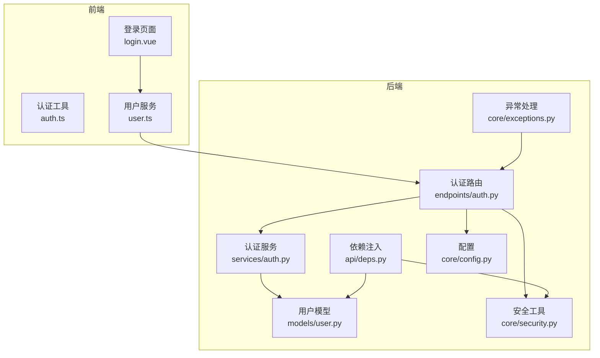
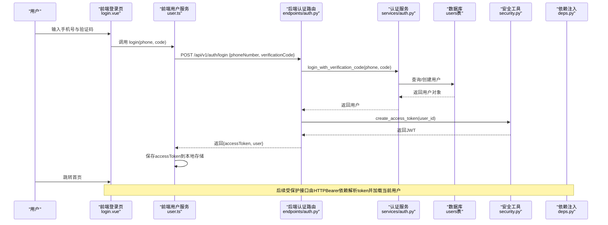
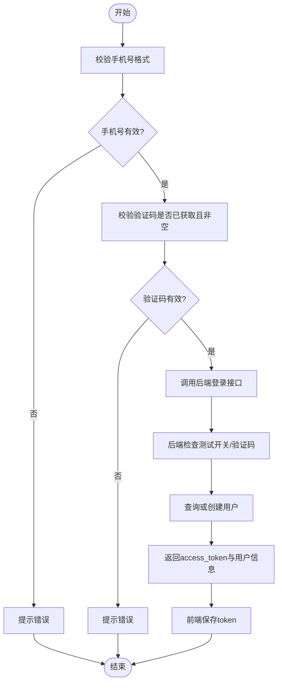
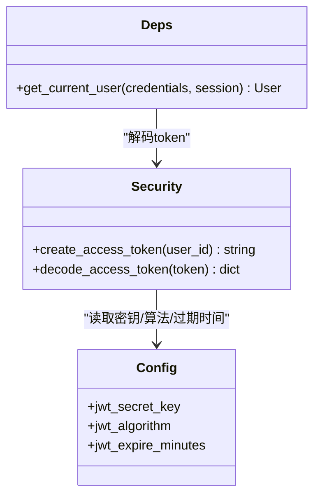
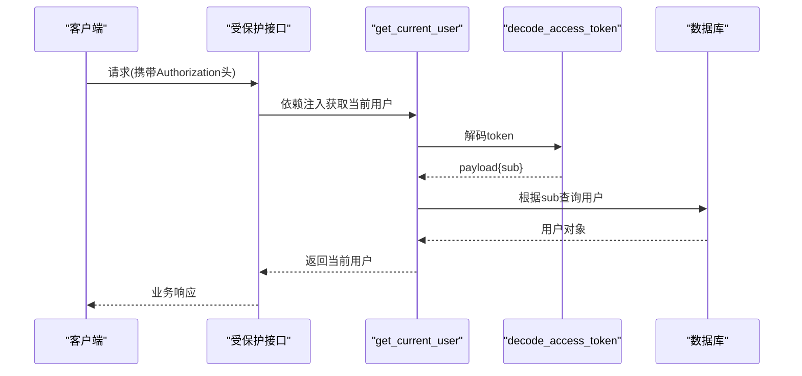
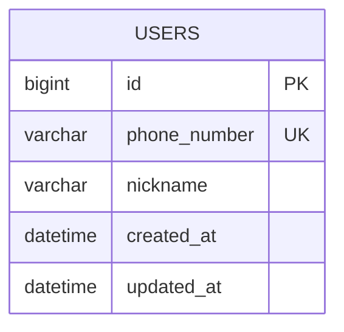
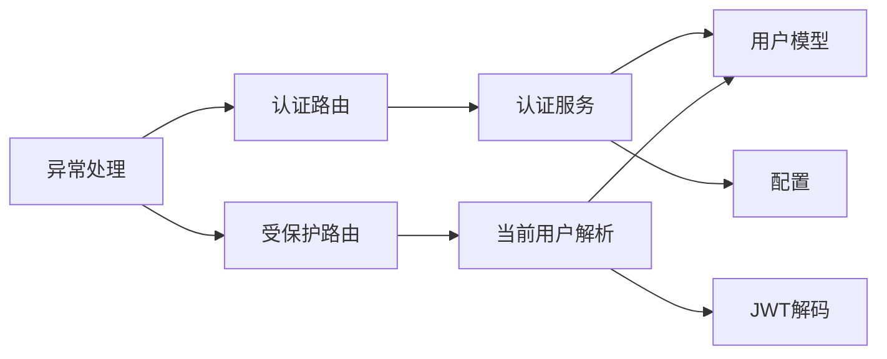

# 用户认证与授权

<cite>
**本文引用的文件**
- [apps/api/app/api/v1/endpoints/auth.py](file://apps/api/app/api/v1/endpoints/auth.py)
- [apps/api/app/services/auth.py](file://apps/api/app/services/auth.py)
- [apps/api/app/models/user.py](file://apps/api/app/models/user.py)
- [apps/api/app/core/security.py](file://apps/api/app/core/security.py)
- [apps/api/app/core/config.py](file://apps/api/app/core/config.py)
- [apps/api/app/schemas/user.py](file://apps/api/app/schemas/user.py)
- [apps/api/app/api/deps.py](file://apps/api/app/api/deps.py)
- [apps/api/app/core/error_codes.py](file://apps/api/app/core/error_codes.py)
- [apps/api/app/core/exceptions.py](file://apps/api/app/core/exceptions.py)
- [apps/miniapp/src/pages/auth/login.vue](file://apps/miniapp/src/pages/auth/login.vue)
- [apps/miniapp/src/services/auth.ts](file://apps/miniapp/src/services/auth.ts)
- [apps/miniapp/src/services/user.ts](file://apps/miniapp/src/services/user.ts)
</cite>

## 目录
1. [简介](#简介)
2. [项目结构](#项目结构)
3. [核心组件](#核心组件)
4. [架构总览](#架构总览)
5. [详细组件分析](#详细组件分析)
6. [依赖关系分析](#依赖关系分析)
7. [性能考虑](#性能考虑)
8. [故障排查指南](#故障排查指南)
9. [结论](#结论)
10. [附录](#附录)

## 简介
本模块实现基于手机号验证码的无密码登录、JWT 令牌签发与校验、以及受保护接口的身份鉴权。前端采用小程序页面完成手机号输入、验证码获取与登录流程，后端通过 FastAPI 暴露 REST API，使用 SQLAlchemy 异步会话访问数据库，Pydantic 进行请求/响应数据校验，并使用 PyJWT 管理 JWT 生命周期。当前实现以“测试模式”为主：在开启测试开关时，使用固定验证码完成登录；生产环境建议接入短信服务并完善验证码校验与风控策略。

## 项目结构
认证相关代码按前后端分层组织：
- 后端（FastAPI）
  - 路由层：定义 /api/v1/auth 等接口
  - 服务层：封装业务逻辑（如验证码登录、用户创建/查找）
  - 模型层：ORM 映射（User）
  - 安全层：JWT 生成与解码、全局依赖注入（当前用户解析）
  - 配置层：环境变量加载（密钥、过期时间、测试开关）
  - 异常与错误码：统一错误响应格式
- 前端（小程序）
  - 登录页：表单、倒计时、错误提示
  - 服务层：调用后端登录接口、本地存储 Token、获取当前用户

图表来源
- [apps/miniapp/src/pages/auth/login.vue:1-359](file://apps/miniapp/src/pages/auth/login.vue#L1-L359)
- [apps/miniapp/src/services/auth.ts:1-18](file://apps/miniapp/src/services/auth.ts#L1-L18)
- [apps/miniapp/src/services/user.ts:1-42](file://apps/miniapp/src/services/user.ts#L1-L42)
- [apps/api/app/api/v1/endpoints/auth.py:1-29](file://apps/api/app/api/v1/endpoints/auth.py#L1-L29)
- [apps/api/app/services/auth.py:1-47](file://apps/api/app/services/auth.py#L1-L47)
- [apps/api/app/models/user.py:1-28](file://apps/api/app/models/user.py#L1-L28)
- [apps/api/app/core/security.py:1-29](file://apps/api/app/core/security.py#L1-L29)
- [apps/api/app/api/deps.py:1-66](file://apps/api/app/api/deps.py#L1-L66)
- [apps/api/app/core/config.py:1-23](file://apps/api/app/core/config.py#L1-L23)
- [apps/api/app/core/exceptions.py:1-88](file://apps/api/app/core/exceptions.py#L1-L88)

章节来源
- [apps/miniapp/src/pages/auth/login.vue:1-359](file://apps/miniapp/src/pages/auth/login.vue#L1-L359)
- [apps/api/app/api/v1/endpoints/auth.py:1-29](file://apps/api/app/api/v1/endpoints/auth.py#L1-L29)

## 核心组件
- 手机号验证码登录：前端收集手机号与验证码，调用后端登录接口；后端根据配置决定是否启用测试验证码比对，随后查找或创建用户并返回 JWT。
- JWT 令牌管理：后端使用 HS256 算法签发包含用户标识与过期时间的 access_token；前端将 token 持久化到本地存储，后续请求携带该 token。
- 用户权限验证：通过 HTTPBearer 依赖注入解析 token，解码后从数据库加载用户对象，作为当前用户上下文供受保护接口使用。
- 用户模型设计：User 表包含唯一手机号、昵称、时间戳字段，支持自动创建与更新时间。
- 会话管理：当前为无状态 JWT 方案；如需会话级控制（如强制下线），可引入黑名单或刷新令牌机制。

章节来源
- [apps/api/app/services/auth.py:11-46](file://apps/api/app/services/auth.py#L11-L46)
- [apps/api/app/core/security.py:8-28](file://apps/api/app/core/security.py#L8-L28)
- [apps/api/app/api/deps.py:29-65](file://apps/api/app/api/deps.py#L29-L65)
- [apps/api/app/models/user.py:15-28](file://apps/api/app/models/user.py#L15-L28)
- [apps/miniapp/src/services/auth.ts:1-18](file://apps/miniapp/src/services/auth.ts#L1-L18)

## 架构总览
下图展示了从前端登录到后端鉴权的完整调用链，包括验证码校验、用户创建/查询、JWT 签发与后续请求的身份解析。

图表来源
- [apps/miniapp/src/pages/auth/login.vue:158-186](file://apps/miniapp/src/pages/auth/login.vue#L158-L186)
- [apps/miniapp/src/services/user.ts:18-29](file://apps/miniapp/src/services/user.ts#L18-L29)
- [apps/api/app/api/v1/endpoints/auth.py:13-28](file://apps/api/app/api/v1/endpoints/auth.py#L13-L28)
- [apps/api/app/services/auth.py:11-46](file://apps/api/app/services/auth.py#L11-L46)
- [apps/api/app/core/security.py:8-19](file://apps/api/app/core/security.py#L8-L19)
- [apps/api/app/api/deps.py:29-65](file://apps/api/app/api/deps.py#L29-L65)

## 详细组件分析

### 手机号验证码登录流程
- 前端校验：手机号格式、是否已获取验证码、验证码非空。
- 后端校验：根据配置决定是否启用测试验证码；若未启用或验证码不匹配则拒绝。
- 用户处理：按手机号查找用户，不存在则创建新用户并提交事务；并发冲突时回滚并二次查询。
- 返回结果：成功返回 access_token 与用户信息。

图表来源
- [apps/miniapp/src/pages/auth/login.vue:122-186](file://apps/miniapp/src/pages/auth/login.vue#L122-L186)
- [apps/api/app/services/auth.py:11-46](file://apps/api/app/services/auth.py#L11-L46)

章节来源
- [apps/miniapp/src/pages/auth/login.vue:122-186](file://apps/miniapp/src/pages/auth/login.vue#L122-L186)
- [apps/api/app/services/auth.py:11-46](file://apps/api/app/services/auth.py#L11-L46)

### JWT 令牌管理
- 签发：使用 HS256 算法，载荷包含用户标识、签发时间与过期时间，密钥与算法来自配置。
- 解码：依赖注入中统一解码并校验子字段类型，再根据 ID 加载用户对象。
- 存储：前端将 token 保存在本地存储，便于后续请求携带。

图表来源
- [apps/api/app/core/security.py:8-28](file://apps/api/app/core/security.py#L8-L28)
- [apps/api/app/core/config.py:14-19](file://apps/api/app/core/config.py#L14-L19)
- [apps/api/app/api/deps.py:29-65](file://apps/api/app/api/deps.py#L29-L65)

章节来源
- [apps/api/app/core/security.py:8-28](file://apps/api/app/core/security.py#L8-L28)
- [apps/api/app/core/config.py:14-19](file://apps/api/app/core/config.py#L14-L19)
- [apps/api/app/api/deps.py:29-65](file://apps/api/app/api/deps.py#L29-L65)
- [apps/miniapp/src/services/auth.ts:1-18](file://apps/miniapp/src/services/auth.ts#L1-L18)

### 用户权限验证（当前用户解析）
- 使用 HTTPBearer 自动提取 Authorization: Bearer <token>。
- 解码 token 并校验 sub 字段为用户 ID。
- 通过异步会话查询用户，不存在或无效则抛出未授权异常。
- 将解析出的用户对象注入到需要鉴权的接口中。

图表来源
- [apps/api/app/api/deps.py:29-65](file://apps/api/app/api/deps.py#L29-L65)
- [apps/api/app/core/security.py:22-28](file://apps/api/app/core/security.py#L22-L28)

章节来源
- [apps/api/app/api/deps.py:29-65](file://apps/api/app/api/deps.py#L29-L65)

### 用户模型设计
- 主键：自增 BIGINT。
- 手机号：唯一索引，用于登录识别。
- 昵称：可选。
- 时间戳：创建与更新时间，默认 UTC 时间（无时区）。

图表来源
- [apps/api/app/models/user.py:15-28](file://apps/api/app/models/user.py#L15-L28)

章节来源
- [apps/api/app/models/user.py:15-28](file://apps/api/app/models/user.py#L15-L28)

### 角色权限控制
- 当前实现未内置角色与权限模型；鉴权仅验证用户身份。
- 扩展建议：
  - 引入角色/权限表与多对多关系。
  - 在依赖注入中增加权限检查中间件，基于角色或资源粒度控制访问。
  - 在路由层声明所需权限，由统一鉴权器校验。

[本节为概念性说明，不涉及具体文件]

### 会话管理
- 当前为无状态 JWT 方案，适合水平扩展。
- 如需会话级能力（如强制登出、设备数限制），可引入：
  - Token 黑名单/白名单缓存（Redis）。
  - 刷新令牌机制（refresh token）分离短期 access_token。
  - 服务端会话记录（设备指纹、IP、UA 等）。

[本节为概念性说明，不涉及具体文件]

## 依赖关系分析
- 路由依赖服务：认证路由调用认证服务完成登录逻辑。
- 服务依赖模型与配置：认证服务通过 ORM 操作用户模型，依据配置决定测试登录行为。
- 依赖注入与安全：受保护接口通过依赖注入解析当前用户，依赖安全模块解码 JWT。
- 异常与错误码：统一异常处理器将应用异常转换为标准 JSON 响应。

图表来源
- [apps/api/app/api/v1/endpoints/auth.py:13-28](file://apps/api/app/api/v1/endpoints/auth.py#L13-L28)
- [apps/api/app/services/auth.py:11-46](file://apps/api/app/services/auth.py#L11-L46)
- [apps/api/app/models/user.py:15-28](file://apps/api/app/models/user.py#L15-L28)
- [apps/api/app/core/config.py:14-19](file://apps/api/app/core/config.py#L14-L19)
- [apps/api/app/api/deps.py:29-65](file://apps/api/app/api/deps.py#L29-L65)
- [apps/api/app/core/exceptions.py:35-87](file://apps/api/app/core/exceptions.py#L35-L87)

章节来源
- [apps/api/app/api/v1/endpoints/auth.py:13-28](file://apps/api/app/api/v1/endpoints/auth.py#L13-L28)
- [apps/api/app/services/auth.py:11-46](file://apps/api/app/services/auth.py#L11-L46)
- [apps/api/app/api/deps.py:29-65](file://apps/api/app/api/deps.py#L29-L65)
- [apps/api/app/core/exceptions.py:35-87](file://apps/api/app/core/exceptions.py#L35-L87)

## 性能考虑
- 数据库查询：登录路径仅一次 SELECT，必要时 INSERT；注意在高并发下唯一约束冲突的回滚与重试。
- JWT 开销：签名与验签计算量低，但需确保密钥安全与算法稳定。
- 前端交互：验证码倒计时避免重复发送；登录失败快速反馈减少无效请求。
- 可扩展性：无状态 JWT 天然支持横向扩展；如需会话控制，应引入高性能缓存。

[本节提供通用指导，不涉及具体文件]

## 故障排查指南
- 未授权（401）
  - 可能原因：缺少 Authorization 头、token 无效或过期、用户不存在。
  - 定位：检查依赖注入中的 token 解码与用户查询逻辑。
- 业务冲突（409）
  - 可能原因：并发创建用户导致唯一约束冲突。
  - 定位：查看服务层事务回滚与二次查询逻辑。
- 请求校验失败（422）
  - 可能原因：手机号格式不符、必填字段缺失。
  - 定位：检查 Pydantic 模型校验规则与前端输入。
- 内部服务器错误（500）
  - 可能原因：未捕获异常或外部依赖故障。
  - 定位：查看全局异常处理器与日志。

章节来源
- [apps/api/app/api/deps.py:29-65](file://apps/api/app/api/deps.py#L29-L65)
- [apps/api/app/services/auth.py:31-43](file://apps/api/app/services/auth.py#L31-L43)
- [apps/api/app/core/error_codes.py:4-12](file://apps/api/app/core/error_codes.py#L4-L12)
- [apps/api/app/core/exceptions.py:35-87](file://apps/api/app/core/exceptions.py#L35-L87)

## 结论
本模块实现了简洁可靠的手机号验证码登录与 JWT 鉴权链路，满足当前最小可用需求。建议在后续迭代中：
- 接入真实短信验证码服务，关闭测试模式。
- 引入速率限制与风控策略，防止暴力破解。
- 扩展角色与权限模型，实现细粒度访问控制。
- 增加刷新令牌与强制下线能力，提升安全性与可运维性。

[本节为总结性内容，不涉及具体文件]

## 附录

### API 接口说明（认证）
- 登录
  - 方法：POST
  - 路径：/api/v1/auth/login
  - 请求体：包含手机号与验证码
  - 响应：包含 access_token 与用户信息
  - 错误：未授权、业务冲突、校验失败、内部错误

章节来源
- [apps/api/app/api/v1/endpoints/auth.py:13-28](file://apps/api/app/api/v1/endpoints/auth.py#L13-L28)
- [apps/api/app/schemas/user.py:4-29](file://apps/api/app/schemas/user.py#L4-L29)
- [apps/api/app/core/error_codes.py:4-12](file://apps/api/app/core/error_codes.py#L4-L12)
- [apps/api/app/core/exceptions.py:35-87](file://apps/api/app/core/exceptions.py#L35-L87)

### 前端登录页面实现要点
- 表单校验：手机号格式、验证码获取与输入。
- 交互体验：倒计时、加载态、错误提示。
- 状态管理：登录后跳转到首页，并将 token 持久化。

章节来源
- [apps/miniapp/src/pages/auth/login.vue:122-186](file://apps/miniapp/src/pages/auth/login.vue#L122-L186)
- [apps/miniapp/src/services/user.ts:18-29](file://apps/miniapp/src/services/user.ts#L18-L29)
- [apps/miniapp/src/services/auth.ts:1-18](file://apps/miniapp/src/services/auth.ts#L1-L18)

### 安全最佳实践
- 密钥管理：JWT 密钥通过环境变量或密钥管理服务注入，禁止硬编码。
- 传输安全：全站 HTTPS，防止中间人攻击。
- 验证码安全：限制发送频率、绑定 IP/设备、防重放。
- 令牌安全：设置合理过期时间，必要时引入刷新令牌与黑名单。
- 输入校验：前后端双重校验，最小权限原则。

[本节提供通用指导，不涉及具体文件]