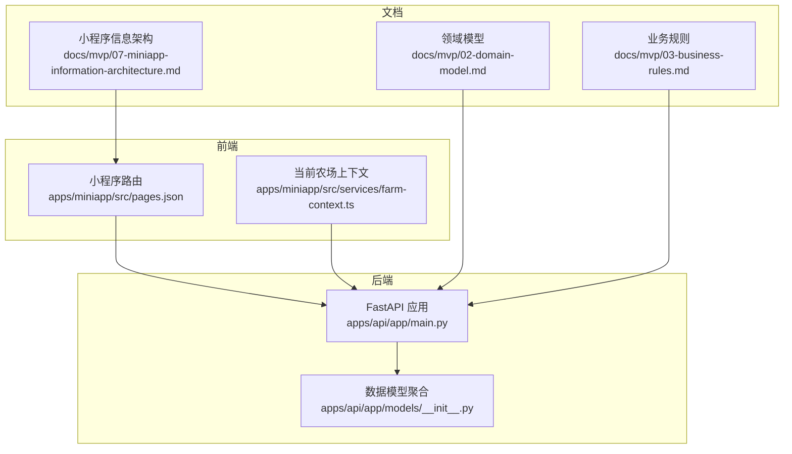
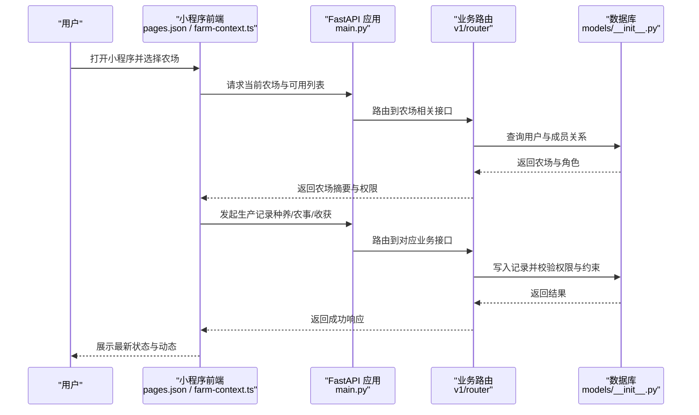
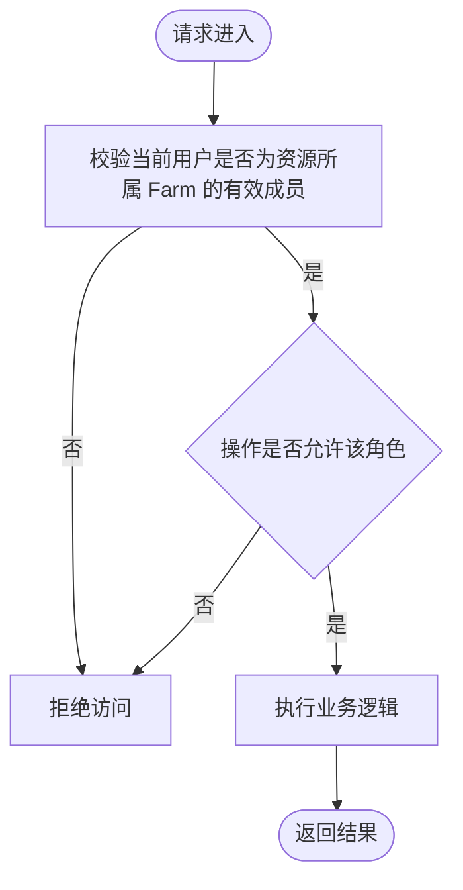
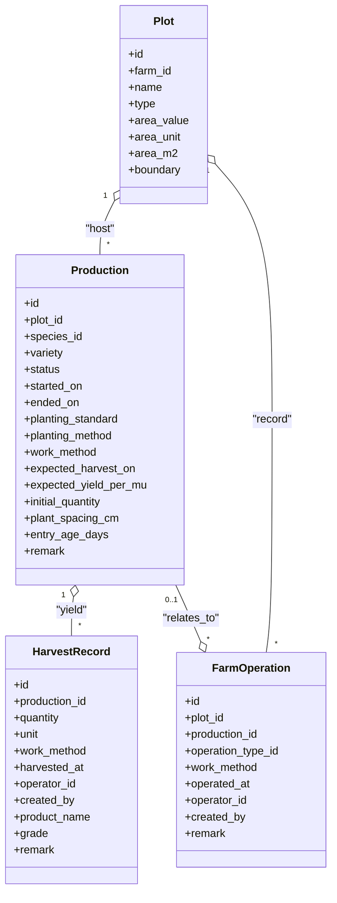
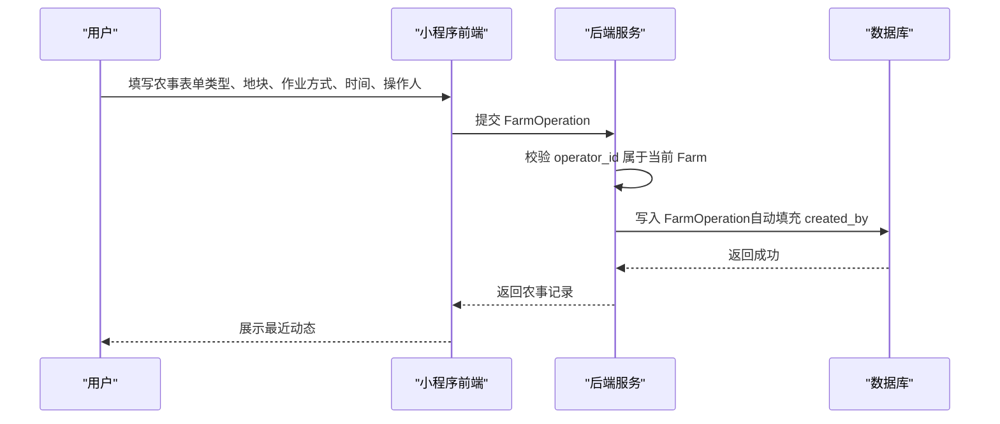
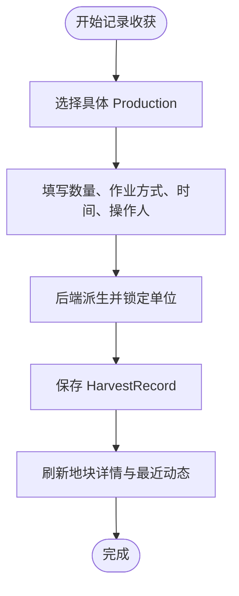
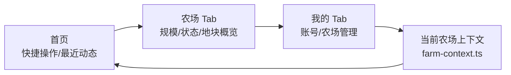
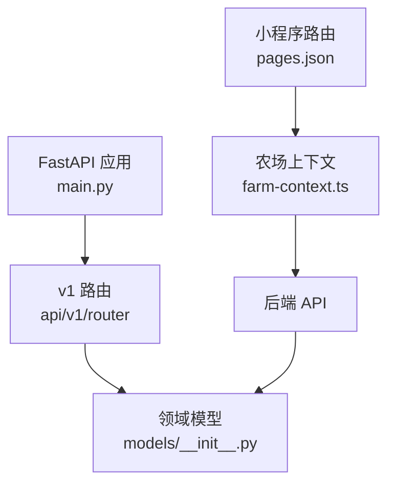

# 项目介绍

<cite>
**本文引用的文件**
- [apps/api/app/main.py](file://apps/api/app/main.py)
- [apps/api/app/models/__init__.py](file://apps/api/app/models/__init__.py)
- [apps/miniapp/src/pages.json](file://apps/miniapp/src/pages.json)
- [apps/miniapp/src/services/farm-context.ts](file://apps/miniapp/src/services/farm-context.ts)
- [docs/index.md](file://docs/index.md)
- [docs/mvp/02-domain-model.md](file://docs/mvp/02-domain-model.md)
- [docs/mvp/03-business-rules.md](file://docs/mvp/03-business-rules.md)
- [docs/mvp/07-miniapp-information-architecture.md](file://docs/mvp/07-miniapp-information-architecture.md)
</cite>

## 目录
1. [简介](#简介)
2. [项目结构](#项目结构)
3. [核心组件](#核心组件)
4. [架构总览](#架构总览)
5. [详细组件分析](#详细组件分析)
6. [依赖关系分析](#依赖关系分析)
7. [性能与可用性考量](#性能与可用性考量)
8. [故障排查指南](#故障排查指南)
9. [结论](#结论)
10. [附录](#附录)

## 简介
Pocket Farm（掌上农场）是一个现代化的农场协作管理平台，围绕“农场、地块、一次种养生命周期”构建轻量且可实际使用的生产管理闭环。系统通过多角色权限控制、生产生命周期跟踪、农事活动记录与收获统计分析，帮助农场主和农业工作者高效管理农业生产活动，降低沟通成本，提升作业透明度与可追溯性。

项目的核心价值：
- 以统一模型覆盖农业、林业、牧业、渔业，减少重复建模与维护成本。
- 基于农场成员角色的细粒度权限控制，确保资源隔离与安全访问。
- 移动端优先设计，贴合一线作业场景，支持快速记录农事与收获。
- 清晰的领域边界与渐进式交付策略，便于团队按阶段验证与扩展。

[本节为概念性概述，不直接分析具体代码文件]

## 项目结构
仓库采用前后端分离的 monorepo 组织方式：
- apps/api：基于 FastAPI 的后端服务，提供 RESTful API，使用 SQLAlchemy 模型与 Alembic 迁移管理数据库。
- apps/miniapp：基于 uni-app + Vue 的小程序前端，包含页面路由、业务服务与 UI 组件。
- docs：产品与设计文档，定义领域模型、业务规则与小程序信息架构。

**图表来源**
- [apps/api/app/main.py:19-27](file://apps/api/app/main.py#L19-L27)
- [apps/api/app/models/__init__.py:1-40](file://apps/api/app/models/__init__.py#L1-L40)
- [apps/miniapp/src/pages.json:1-217](file://apps/miniapp/src/pages.json#L1-L217)
- [apps/miniapp/src/services/farm-context.ts:1-94](file://apps/miniapp/src/services/farm-context.ts#L1-L94)
- [docs/mvp/02-domain-model.md:1-634](file://docs/mvp/02-domain-model.md#L1-L634)
- [docs/mvp/03-business-rules.md:1-609](file://docs/mvp/03-business-rules.md#L1-L609)
- [docs/mvp/07-miniapp-information-architecture.md:1-546](file://docs/mvp/07-miniapp-information-architecture.md#L1-L546)

**章节来源**
- [apps/api/app/main.py:19-27](file://apps/api/app/main.py#L19-L27)
- [apps/miniapp/src/pages.json:1-217](file://apps/miniapp/src/pages.json#L1-L217)
- [docs/index.md:1-24](file://docs/index.md#L1-L24)

## 核心组件
- 用户与农场成员：User 表示系统用户；FarmMember 表示用户在某个农场中的成员身份与角色（OWNER、ADMIN、MEMBER），所有资源访问均通过 FarmMember 校验权限。
- 农场与地块：Farm 是生产组织单元；Plot 是具体生产区域，承载面积、类型与可选边界信息。
- 种类与行业：Species 定义公共种养种类并关联 Industry（农业、林业、牧业、渔业），决定前端术语与表单字段。
- 生产生命周期：Production 表示某地块的一次完整种养生命周期，状态包括 ACTIVE 与 ENDED，支持多次收获记录。
- 农事活动：FarmOperation 记录地块或具体 Production 的作业行为，支持操作人与记录人分离。
- 收获统计：HarvestRecord 记录每次收获的数量、单位与时间，支持同一 Production 多次收获。

这些组件共同构成从“开始种养—农事—收获—结束种养”的闭环流程，并通过权限与约束保证数据一致性与安全性。

**章节来源**
- [docs/mvp/02-domain-model.md:81-634](file://docs/mvp/02-domain-model.md#L81-L634)
- [docs/mvp/03-business-rules.md:1-609](file://docs/mvp/03-business-rules.md#L1-L609)

## 架构总览
系统采用分层架构：
- 表现层：小程序前端负责用户交互、导航与本地上下文管理。
- 接口层：FastAPI 暴露 v1 版本 API，统一注册健康检查与业务路由。
- 领域层：服务层封装业务规则（如成员权限、生产生命周期约束）。
- 数据层：SQLAlchemy 模型与 Alembic 迁移维护数据库结构与约束。

**图表来源**
- [apps/api/app/main.py:19-27](file://apps/api/app/main.py#L19-L27)
- [apps/api/app/models/__init__.py:1-40](file://apps/api/app/models/__init__.py#L1-L40)
- [apps/miniapp/src/pages.json:1-217](file://apps/miniapp/src/pages.json#L1-L217)
- [apps/miniapp/src/services/farm-context.ts:1-94](file://apps/miniapp/src/services/farm-context.ts#L1-L94)

## 详细组件分析

### 多角色权限控制
- 角色定义：OWNER、ADMIN、MEMBER，角色属于 FarmMember，不在 User 上。
- 权限范围：不同角色对农场、成员、地块、生产、农事与收获具备不同能力；例如 ADMIN 不能操作 OWNER，OWNER 需至少保留一位。
- 安全隔离：所有资源访问通过 FarmMember 校验，避免 ID 越权。

**图表来源**
- [docs/mvp/03-business-rules.md:16-77](file://docs/mvp/03-business-rules.md#L16-L77)
- [docs/mvp/02-domain-model.md:131-165](file://docs/mvp/02-domain-model.md#L131-L165)

**章节来源**
- [docs/mvp/03-business-rules.md:16-77](file://docs/mvp/03-business-rules.md#L16-L77)
- [docs/mvp/02-domain-model.md:131-165](file://docs/mvp/02-domain-model.md#L131-L165)

### 生产生命周期跟踪
- 实体关系：Production 属于 Plot，关联 Species，状态为 ACTIVE 或 ENDED。
- 关键约束：一个 Production 只属于一个 Plot；一个 Plot 可同时存在多条 ACTIVE Production；结束操作仅更新 endedOn 与 status。
- 时间校验：startedOn、endedOn 与关联记录的 operatedAt/harvestedAt 不得晚于当前时间，且满足先后顺序约束。

**图表来源**
- [docs/mvp/02-domain-model.md:318-566](file://docs/mvp/02-domain-model.md#L318-L566)

**章节来源**
- [docs/mvp/02-domain-model.md:318-566](file://docs/mvp/02-domain-model.md#L318-L566)
- [docs/mvp/03-business-rules.md:96-113](file://docs/mvp/03-business-rules.md#L96-L113)
- [docs/mvp/03-business-rules.md:424-446](file://docs/mvp/03-business-rules.md#L424-L446)

### 农事活动记录
- 归属关系：FarmOperation 首先属于 Plot，production_id 可为空，用于记录整个地块的作业。
- 自动关联：当地块存在 ACTIVE Production 时，可选择具体批次进行追溯；否则默认记录整个地块。
- 人员分离：operator_id 表示实际执行者，created_by 由后端根据 JWT 写入，不可被前端修改。

**图表来源**
- [docs/mvp/03-business-rules.md:232-318](file://docs/mvp/03-business-rules.md#L232-L318)
- [docs/mvp/02-domain-model.md:460-498](file://docs/mvp/02-domain-model.md#L460-L498)

**章节来源**
- [docs/mvp/03-business-rules.md:232-318](file://docs/mvp/03-business-rules.md#L232-L318)
- [docs/mvp/02-domain-model.md:460-498](file://docs/mvp/02-domain-model.md#L460-L498)

### 收获统计与分析
- 归属关系：HarvestRecord 必须属于具体 Production，不允许 production_id 为空。
- 单位派生：单位由行业与 Species 固定单位派生，客户端不可传入；创建后仅允许修改数量。
- 多次收获：同一 Production 可有多条 HarvestRecord，分别记录时间与数量。

**图表来源**
- [docs/mvp/03-business-rules.md:320-396](file://docs/mvp/03-business-rules.md#L320-L396)
- [docs/mvp/02-domain-model.md:532-566](file://docs/mvp/02-domain-model.md#L532-L566)

**章节来源**
- [docs/mvp/03-business-rules.md:320-396](file://docs/mvp/03-business-rules.md#L320-L396)
- [docs/mvp/02-domain-model.md:532-566](file://docs/mvp/02-domain-model.md#L532-L566)

### 移动端优先设计与信息架构
- 一级入口：首页（工作台）、农场（当前农场总览）、我的（账号与农场管理）。
- 页面职责：首页聚焦快捷操作与最近动态；农场 Tab 展示规模、利用与当前生产状态；我的 Tab 处理低频管理与设置。
- 当前农场上下文：全局持久化当前农场选择，并在登录后恢复与校验有效性。

**图表来源**
- [apps/miniapp/src/pages.json:1-217](file://apps/miniapp/src/pages.json#L1-L217)
- [apps/miniapp/src/services/farm-context.ts:1-94](file://apps/miniapp/src/services/farm-context.ts#L1-L94)
- [docs/mvp/07-miniapp-information-architecture.md:17-65](file://docs/mvp/07-miniapp-information-architecture.md#L17-L65)

**章节来源**
- [apps/miniapp/src/pages.json:1-217](file://apps/miniapp/src/pages.json#L1-L217)
- [apps/miniapp/src/services/farm-context.ts:1-94](file://apps/miniapp/src/services/farm-context.ts#L1-L94)
- [docs/mvp/07-miniapp-information-architecture.md:17-65](file://docs/mvp/07-miniapp-information-architecture.md#L17-L65)

## 依赖关系分析
- 后端启动：FastAPI 应用创建时注册异常处理器、健康检查与 v1 路由前缀。
- 模型聚合：models/__init__.py 集中导出所有领域模型，供服务层与路由引用。
- 前端路由：pages.json 定义小程序页面树与 TabBar，驱动导航与视图渲染。
- 上下文管理：farm-context.ts 维护当前农场选择与同步，影响后续业务页面的数据加载。

**图表来源**
- [apps/api/app/main.py:19-27](file://apps/api/app/main.py#L19-L27)
- [apps/api/app/models/__init__.py:1-40](file://apps/api/app/models/__init__.py#L1-L40)
- [apps/miniapp/src/pages.json:1-217](file://apps/miniapp/src/pages.json#L1-L217)
- [apps/miniapp/src/services/farm-context.ts:1-94](file://apps/miniapp/src/services/farm-context.ts#L1-L94)

**章节来源**
- [apps/api/app/main.py:19-27](file://apps/api/app/main.py#L19-L27)
- [apps/api/app/models/__init__.py:1-40](file://apps/api/app/models/__init__.py#L1-L40)
- [apps/miniapp/src/pages.json:1-217](file://apps/miniapp/src/pages.json#L1-L217)
- [apps/miniapp/src/services/farm-context.ts:1-94](file://apps/miniapp/src/services/farm-context.ts#L1-L94)

## 性能与可用性考量
- 数据聚合：地块详情聚合 Production、FarmOperation、HarvestRecord，避免跨表重复存储 plot_id，减少冗余与一致性风险。
- 权限校验：所有写操作在事务中校验成员与角色，防止越权与不一致。
- 时间约束：严格校验 startedOn/endedOn 与关联记录的时间顺序，避免历史回溯导致的数据矛盾。
- 移动端体验：首页与农场 Tab 聚焦高频操作与关键指标，减少认知负担；当前农场上下文持久化提升连续作业效率。

[本节为通用指导，不直接分析具体代码文件]

## 故障排查指南
- 登录与认证：确认手机号验证码登录流程正常，JWT 正确生成与传递。
- 权限问题：检查当前用户是否为资源所属 Farm 的有效成员，以及角色是否允许该操作。
- 数据一致性：核对 Production 状态与关联记录（农事、收获）是否满足约束；已结束 Production 的记录应锁定。
- 时间错误：校验 operatedAt/harvestedAt 不早于 startedOn 且不晚于当前时间；endedOn 不得晚于今天且满足先后顺序。
- 前端上下文：确认当前农场选择有效，若失效则回退到第一个有效农场或引导创建。

**章节来源**
- [docs/mvp/03-business-rules.md:580-609](file://docs/mvp/03-business-rules.md#L580-L609)
- [apps/miniapp/src/services/farm-context.ts:54-72](file://apps/miniapp/src/services/farm-context.ts#L54-L72)

## 结论
Pocket Farm 通过清晰的领域模型、严格的业务规则与移动端优先的设计，为农场协作管理提供了可靠、可扩展的基础。它以“农场—地块—生产生命周期”为主线，结合多角色权限与农事/收获记录，形成完整的闭环管理能力。项目采用渐进式交付策略，便于团队持续迭代与扩展，满足不同规模农场的实际需求。

[本节为总结性内容，不直接分析具体代码文件]

## 附录
- 领域模型参考：[docs/mvp/02-domain-model.md](file://docs/mvp/02-domain-model.md)
- 业务规则参考：[docs/mvp/03-business-rules.md](file://docs/mvp/03-business-rules.md)
- 小程序信息架构参考：[docs/mvp/07-miniapp-information-architecture.md](file://docs/mvp/07-miniapp-information-architecture.md)
- 后端入口参考：[apps/api/app/main.py](file://apps/api/app/main.py)
- 前端路由参考：[apps/miniapp/src/pages.json](file://apps/miniapp/src/pages.json)
- 农场上下文参考：[apps/miniapp/src/services/farm-context.ts](file://apps/miniapp/src/services/farm-context.ts)