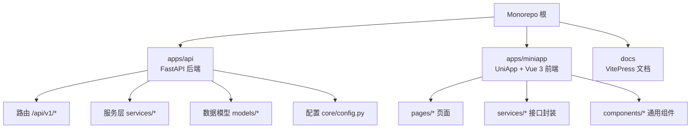
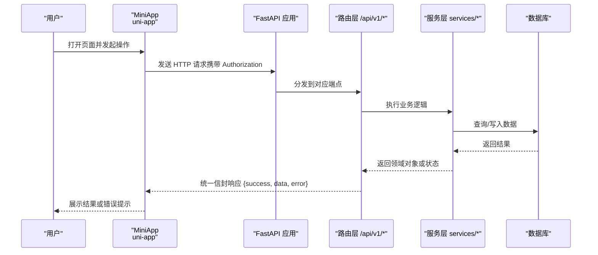
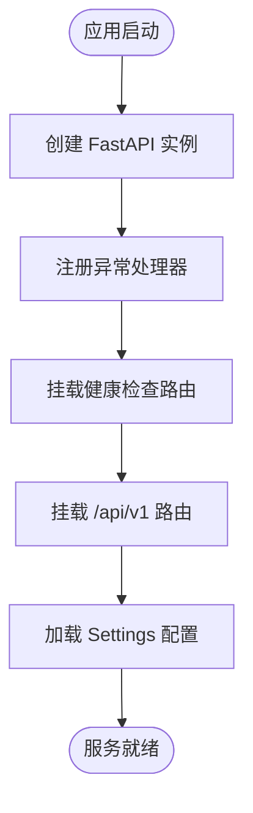
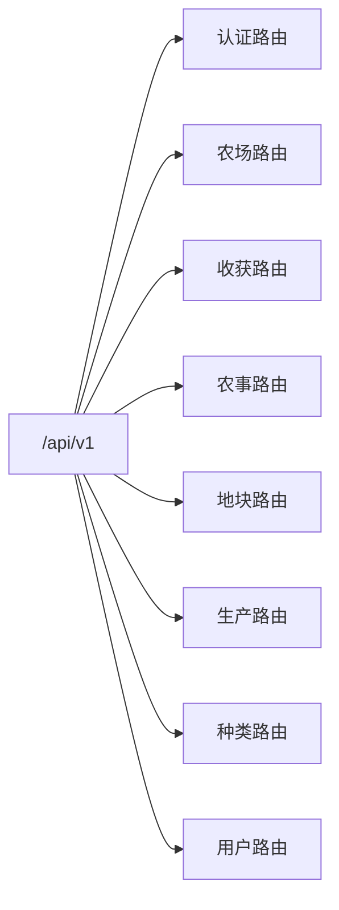
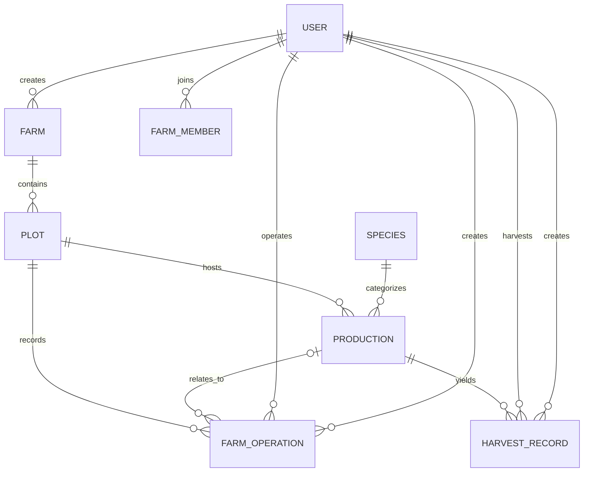
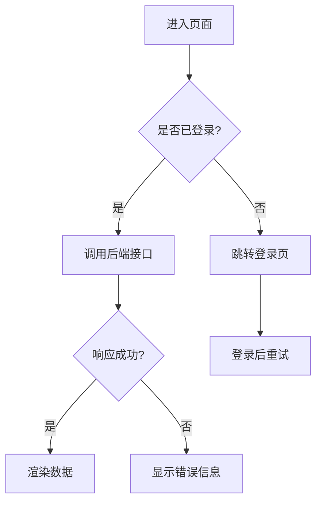
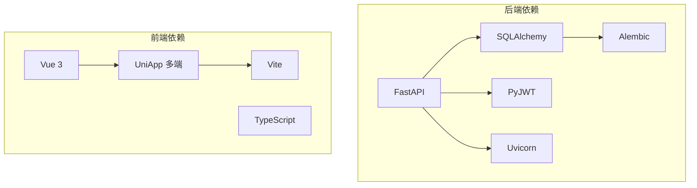

# 项目概览

<cite>
**本文引用的文件**
- [package.json](file://package.json)
- [pnpm-workspace.yaml](file://pnpm-workspace.yaml)
- [apps/api/pyproject.toml](file://apps/api/pyproject.toml)
- [apps/miniapp/package.json](file://apps/miniapp/package.json)
- [apps/api/app/main.py](file://apps/api/app/main.py)
- [apps/api/app/core/config.py](file://apps/api/app/core/config.py)
- [apps/api/app/models/__init__.py](file://apps/api/app/models/__init__.py)
- [apps/api/app/api/v1/router.py](file://apps/api/app/api/v1/router.py)
- [apps/miniapp/src/pages.json](file://apps/miniapp/src/pages.json)
- [apps/miniapp/src/services/http.ts](file://apps/miniapp/src/services/http.ts)
- [docs/index.md](file://docs/index.md)
- [docs/mvp/02-domain-model.md](file://docs/mvp/02-domain-model.md)
- [docs/mvp/03-business-rules.md](file://docs/mvp/03-business-rules.md)
</cite>

## 目录
1. [简介](#简介)
2. [项目结构](#项目结构)
3. [核心组件](#核心组件)
4. [架构总览](#架构总览)
5. [详细组件分析](#详细组件分析)
6. [依赖关系分析](#依赖关系分析)
7. [性能与可维护性](#性能与可维护性)
8. [故障排查指南](#故障排查指南)
9. [结论](#结论)
10. [附录：快速开始](#附录快速开始)

## 简介
Pocket Farm（掌上农场）是一个面向多角色协作的全栈农场管理平台，围绕“农场、地块、一次种养生命周期”构建轻量但可实际使用的生产管理闭环。系统支持多角色权限控制、生产生命周期跟踪、农事活动记录与收获统计，覆盖农业、林业、牧业与渔业等场景。后端采用 FastAPI + SQLAlchemy + Alembic，前端使用 Vue 3 + UniApp 实现跨端小程序/H5，并通过 Monorepo（pnpm workspace）统一管理前后端工程与文档。

业务价值体现在：
- 以统一领域模型贯穿多行业，降低认知与维护成本
- 通过 FarmMember 进行资源级权限隔离，确保数据访问安全
- 以 Phase 渐进式交付，每个阶段完成测试、迁移检查与 API 总结后确认，保障质量与可控演进

**章节来源**
- [docs/index.md:1-24](file://docs/index.md#L1-L24)
- [docs/mvp/02-domain-model.md:1-78](file://docs/mvp/02-domain-model.md#L1-L78)
- [docs/mvp/03-business-rules.md:1-76](file://docs/mvp/03-business-rules.md#L1-L76)

## 项目结构
仓库采用 Monorepo 组织方式，根目录包含：
- apps/api：FastAPI 后端服务，提供 RESTful API，包含路由、服务层、数据模型、配置与异常处理
- apps/miniapp：基于 UniApp + Vue 3 的移动端应用，包含页面、组件、服务层与样式
- docs：VitePress 文档站点，包含 MVP 设计说明、领域模型与业务规则
- 根 package.json：统一脚本与开发工具链（含 mermaid、vitepress 等）

**图表来源**
- [apps/api/app/api/v1/router.py:1-21](file://apps/api/app/api/v1/router.py#L1-L21)
- [apps/api/app/models/__init__.py:1-40](file://apps/api/app/models/__init__.py#L1-L40)
- [apps/miniapp/src/pages.json:1-217](file://apps/miniapp/src/pages.json#L1-L217)

**章节来源**
- [package.json:1-32](file://package.json#L1-L32)
- [pnpm-workspace.yaml:1-7](file://pnpm-workspace.yaml#L1-L7)
- [apps/api/pyproject.toml:1-35](file://apps/api/pyproject.toml#L1-L35)
- [apps/miniapp/package.json:1-73](file://apps/miniapp/package.json#L1-L73)

## 核心组件
- 后端应用入口与生命周期管理：FastAPI 应用创建、健康检查路由挂载、异常处理器注册、数据库引擎生命周期管理
- 配置中心：集中管理应用名、调试开关、API 前缀、数据库连接、JWT 密钥与过期时间、时区与测试登录开关
- 领域模型：用户、农场、成员、地块、种类、生产、农事、收获等实体及其关联关系
- API 路由：按模块划分认证、农场、地块、生产、农事、收获、种类、用户等子路由
- 前端应用：基于 UniApp 的多端页面体系，统一的 HTTP 请求封装与错误处理，TabBar 导航与全局样式

**章节来源**
- [apps/api/app/main.py:1-28](file://apps/api/app/main.py#L1-L28)
- [apps/api/app/core/config.py:1-23](file://apps/api/app/core/config.py#L1-L23)
- [apps/api/app/models/__init__.py:1-40](file://apps/api/app/models/__init__.py#L1-L40)
- [apps/api/app/api/v1/router.py:1-21](file://apps/api/app/api/v1/router.py#L1-L21)
- [apps/miniapp/src/pages.json:1-217](file://apps/miniapp/src/pages.json#L1-L217)
- [apps/miniapp/src/services/http.ts:1-106](file://apps/miniapp/src/services/http.ts#L1-L106)

## 架构总览
系统由前端小程序/H5、后端 API 与数据库组成。前端通过 uni.request 调用后端 /api/v1 下的各模块接口；后端基于 FastAPI 提供 RESTful 接口，使用 SQLAlchemy 操作数据库，Alembic 管理迁移。权限校验在 API 层结合 JWT 与 FarmMember 进行资源级鉴权。

**图表来源**
- [apps/miniapp/src/services/http.ts:1-106](file://apps/miniapp/src/services/http.ts#L1-L106)
- [apps/api/app/api/v1/router.py:1-21](file://apps/api/app/api/v1/router.py#L1-L21)
- [apps/api/app/main.py:1-28](file://apps/api/app/main.py#L1-L28)

## 详细组件分析

### 后端应用与配置
- 应用启动：创建 FastAPI 实例，注册健康检查与 v1 路由，注入异常处理器，管理数据库引擎生命周期
- 配置项：应用名、调试模式、API 前缀、数据库 URL、JWT 密钥与算法、过期时间、时区、测试登录开关
- 模型聚合：统一导出所有 SQLAlchemy 模型，便于服务层与路由层引用

**图表来源**
- [apps/api/app/main.py:1-28](file://apps/api/app/main.py#L1-L28)
- [apps/api/app/core/config.py:1-23](file://apps/api/app/core/config.py#L1-L23)

**章节来源**
- [apps/api/app/main.py:1-28](file://apps/api/app/main.py#L1-L28)
- [apps/api/app/core/config.py:1-23](file://apps/api/app/core/config.py#L1-L23)
- [apps/api/app/models/__init__.py:1-40](file://apps/api/app/models/__init__.py#L1-L40)

### API 路由与模块划分
- 路由组织：认证、农场、收获、农事、地块、生产、种类、用户等模块分别独立路由，统一挂载至 /api/v1
- 职责边界：路由负责参数校验与调度，服务层承载业务规则与事务，模型层定义数据结构与约束

**图表来源**
- [apps/api/app/api/v1/router.py:1-21](file://apps/api/app/api/v1/router.py#L1-L21)

**章节来源**
- [apps/api/app/api/v1/router.py:1-21](file://apps/api/app/api/v1/router.py#L1-L21)

### 领域模型与业务规则
- 核心实体：User、Farm、FarmMember、Plot、Species、Production、FarmOperation、HarvestRecord
- 关键约束：
  - 一个 Production 属于一个 Plot，一个 Plot 可有多条历史 Production，且允许同时存在多条 ACTIVE Production
  - FarmMember 角色遵循 OWNER/ADMIN/MEMBER 规则，至少保留一位 OWNER
  - HarvestRecord 必须归属 Production，单位由行业与种类派生并作为历史快照
  - operator_id 与 created_by 分离：前者为实际操作人，后者为系统记录人（由 JWT 自动写入）
- 业务规则：创建农场生成唯一 farmCode 并在同一事务中完成；成员管理限制角色操作范围；开始种养流程分两步选择种类与填写表单

**图表来源**
- [docs/mvp/02-domain-model.md:7-75](file://docs/mvp/02-domain-model.md#L7-L75)

**章节来源**
- [docs/mvp/02-domain-model.md:81-634](file://docs/mvp/02-domain-model.md#L81-L634)
- [docs/mvp/03-business-rules.md:1-200](file://docs/mvp/03-business-rules.md#L1-L200)

### 前端应用与交互
- 页面结构：首页、农场、我的三大 TabBar；认证、农场管理、地块管理、生产生命周期、农事记录、收获记录、种类与设置等页面
- 网络层：统一 request 封装，自动附加 Authorization 头，统一信封响应解析，401 自动清理 token，错误统一抛出 ApiRequestError
- 导航与样式：全局导航栏样式、TabBar 图标与选中态、页面标题与背景色统一配置

**图表来源**
- [apps/miniapp/src/pages.json:1-217](file://apps/miniapp/src/pages.json#L1-L217)
- [apps/miniapp/src/services/http.ts:1-106](file://apps/miniapp/src/services/http.ts#L1-L106)

**章节来源**
- [apps/miniapp/src/pages.json:1-217](file://apps/miniapp/src/pages.json#L1-L217)
- [apps/miniapp/src/services/http.ts:1-106](file://apps/miniapp/src/services/http.ts#L1-L106)

## 依赖关系分析
- 后端依赖：FastAPI、SQLAlchemy、Alembic、Pydantic Settings、PyJWT、Uvicorn、aiomysql、greenlet、cryptography
- 前端依赖：Vue 3、UniApp 多端适配包、TypeScript、Vite、sass、vue-i18n
- 工作区：pnpm workspace 管理 apps/miniapp 与未来 packages/*，统一脚本与依赖安装

**图表来源**
- [apps/api/pyproject.toml:1-35](file://apps/api/pyproject.toml#L1-L35)
- [apps/miniapp/package.json:1-73](file://apps/miniapp/package.json#L1-L73)
- [pnpm-workspace.yaml:1-7](file://pnpm-workspace.yaml#L1-L7)

**章节来源**
- [apps/api/pyproject.toml:1-35](file://apps/api/pyproject.toml#L1-L35)
- [apps/miniapp/package.json:1-73](file://apps/miniapp/package.json#L1-L73)
- [pnpm-workspace.yaml:1-7](file://pnpm-workspace.yaml#L1-L7)

## 性能与可维护性
- 异步与并发：后端使用 FastAPI + Uvicorn，配合 aiomysql/greenlet 提升并发能力；数据库连接池与引擎生命周期管理避免资源泄漏
- 配置与环境：集中化 Settings，支持环境变量与 .env 文件，便于不同环境部署与调试
- 代码组织：路由与服务分层清晰，模型集中导出，便于扩展与维护；前端统一请求封装与错误类型，提升可观测性与可维护性
- 渐进式交付：按 Phase 推进，每个阶段完成测试、迁移检查与 API 总结，降低风险并提高迭代效率

[本节为通用指导，不直接分析具体文件]

## 故障排查指南
- 认证失败：检查 Authorization 头是否正确传递；401 会触发前端清理 token 并重定向登录
- 请求失败：前端统一抛出 ApiRequestError，包含 code、statusCode 与 details，便于定位问题
- 配置错误：确认数据库 URL、JWT 密钥、API 前缀与时区等配置正确；调试模式开启后可查看详细日志
- 权限问题：确认当前用户为资源所属 Farm 的有效 FarmMember；角色操作需满足 OWNER/ADMIN/MEMBER 约束

**章节来源**
- [apps/miniapp/src/services/http.ts:1-106](file://apps/miniapp/src/services/http.ts#L1-L106)
- [apps/api/app/core/config.py:1-23](file://apps/api/app/core/config.py#L1-L23)
- [docs/mvp/03-business-rules.md:16-76](file://docs/mvp/03-business-rules.md#L16-L76)

## 结论
Pocket Farm 通过清晰的领域模型与严格的业务规则，构建了覆盖多行业的农场协作管理平台。后端以 FastAPI 为核心，提供高性能与可扩展的 API；前端以 UniApp + Vue 3 实现跨端体验；Monorepo 与文档驱动的开发方式保障了项目的可维护性与可演进性。对于初学者，建议从领域模型与业务规则入手，逐步理解各模块职责；对于有经验的开发者，可重点关注服务层的事务与权限校验、前端请求封装与错误处理策略。

[本节为总结性内容，不直接分析具体文件]

## 附录：快速开始
- 启动后端开发服务器：使用根脚本 api:dev 启动 FastAPI 服务，默认监听 0.0.0.0:8000，API 前缀为 /api/v1
- 启动前端开发：使用 miniapp:dev 启动 UniApp 微信小程序开发模式，或根据目标平台选择相应命令
- 文档站点：使用 docs:dev 启动 VitePress 文档站点，查看 MVP 设计与开发计划

**章节来源**
- [package.json:5-12](file://package.json#L5-L12)
- [apps/miniapp/package.json:4-37](file://apps/miniapp/package.json#L4-L37)
- [docs/index.md:4-14](file://docs/index.md#L4-L14)