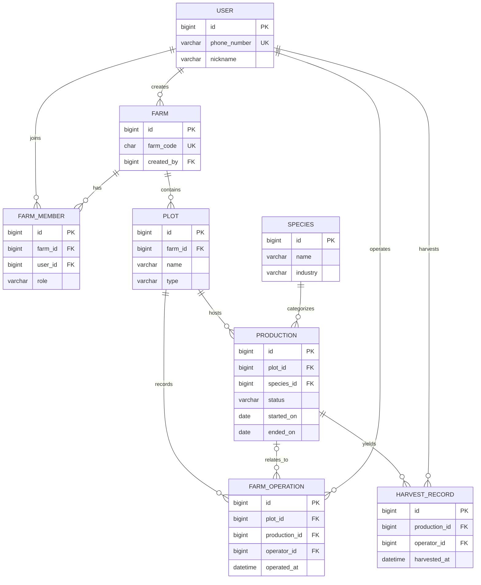

# 核心领域模型

> 本文定义 MVP 的持久化领域模型、关联关系和数据库约束。数据库字段使用 `snake_case`，API 字段命名在 API 文档中统一约定。

## 1. 总体关系

`FarmOperation.production_id` 可为 `NULL`；其余图中关系不表示数据库必须配置级联删除。`HarvestRecord` 通过 `Production` 归属地块，不重复保存 `plot_id`。

---

## 2. User

表示系统用户。

核心字段：

id
phone_number
nickname
created_at
updated_at

认证方式已确定为手机号验证码登录。`phone_number` 是唯一的登录标识和成员查找标识，不作为农场内的日常展示信息；`nickname` 是应用内展示名称，可为空。

MVP 不存在“用户名（username）”概念。用户首次登录后可以设置或修改昵称；昵称为空时，前端以脱敏手机号生成兜底展示名，例如“用户 0001”。

MVP 不引入 `username`、`email`、密码哈希或微信 `openid` 等其他认证字段。

---

## 3. Farm

表示农场。

字段建议：

id
farm_code
name
region
created_by
created_at
updated_at

关系：

Farm
1:N
Plot

Farm
1:N
FarmMember

created_by 主要用于审计。

真正权限仍然以 FarmMember 为准。

---

## 4. FarmMember

表示：

某个 User 在某个 Farm 中的成员身份。

字段：

id
farm_id
user_id
role
joined_at

约束：

UNIQUE(farm_id, user_id)

角色：

OWNER
ADMIN
MEMBER

角色属于 FarmMember。

不要把农场角色放到 User 上。

成员角色遵循“多 OWNER、至少保留一位 OWNER”规则：

- ADMIN 只能操作 ADMIN 与 MEMBER，不能操作 OWNER，也不能提升 OWNER。
- OWNER 可以提升、降级或移除其他 OWNER；操作完成后必须仍至少存在一位 OWNER。
- ADMIN 与 MEMBER 可自行退出农场；OWNER 仅在该农场还有其他 OWNER 时可退出。

---

## 5. Plot

表示农场中的具体生产区域。

字段：

id
farm_id
name
type
area_value
area_unit
area_m2
boundary
created_at
updated_at

Plot 是前端最重要的信息聚合中心。

`area_value` 与 `area_unit` 是用户确认的面积真值，`area_m2` 由二者换算得出。`boundary` 为可选 JSON：使用 `coordinateSystem: "GCJ02"` 标识坐标系，不将其声明为标准 WGS84 GeoJSON，也不以其自动覆盖面积。

---

## 6. PlotType

系统固定枚举：

FIELD        大田
PADDY        水田
GREENHOUSE   大棚
ORCHARD      果园
FOREST       林地
POND         鱼塘
BARN         栏舍
OTHER        其他

前端展示中文。

数据库保存英文代码。

---

## 7. AreaUnit

| 代码 | 含义 |
| --- | --- |
| `MU` | 亩 |
| `SQUARE_METER` | 平方米 |
| `HECTARE` | 公顷 |

---

## 8. QuantityUnit

数量单位为固定枚举，适用于初始数量、预计总产量和收获数量。

| 代码 | 含义 | 数值规则 |
| --- | --- | --- |
| `KG` | 公斤 | 允许小数 |
| `TON` | 吨 | 允许小数 |
| `HEAD` | 头 | 必须为整数 |
| `PIECE` | 只／个 | 必须为整数 |
| `PLANT` | 株 | 必须为整数 |
| `TAIL` | 尾 | 必须为整数 |

MVP 不做数量单位换算，不允许任意字符串单位。

---

## 9. Species

表示系统公共种养种类。

例如：

黄瓜
水稻
葡萄
榕树
育肥猪
鸡
青鱼
鲈鱼

字段：

id
name
industry
created_at

MVP 使用系统预置 Species，通过 Alembic 数据 migration 初始化；不提供管理接口，也不允许普通用户修改。

首批数据以常见种养品类覆盖四个行业：

| Industry | Species |
| --- | --- |
| AGRICULTURE | 水稻、小麦、玉米、大豆、黄瓜、番茄、辣椒、马铃薯、葡萄 |
| FORESTRY | 杉木、松树、毛竹 |
| LIVESTOCK | 猪、牛、羊、鸡、鸭 |
| FISHERY | 青鱼、草鱼、鲤鱼、鲫鱼、鲈鱼、小龙虾 |

未来新增系统 Species 时，创建新的数据 migration；不修改已执行的历史 migration。

---

## 10. Industry

AGRICULTURE   农业
FORESTRY      林业
LIVESTOCK     牧业
FISHERY       渔业

Industry 决定：

- 前端术语
- 开始种养表单
- 农事类型筛选
- 收获动作名称

---

## 11. Variety

Variety 不单独建表。

直接保存在 Production：

variety

选填。

例如：

species = 葡萄
variety = 阳光玫瑰

---

## 12. Production

Production 是核心业务实体。

定义：

某一个 Plot 上的一次完整种养生命周期。

字段建议：

id
plot_id
species_id

variety

status

started_on
ended_on

planting_standard
planting_method
work_method

expected_harvest_on

expected_yield
expected_yield_unit

initial_quantity
initial_quantity_unit

plant_spacing

entry_age_days

remark

created_at
updated_at

不同 Industry 不使用四张 Production 表。

统一使用一张表。

行业不适用字段允许为空。

`expected_yield` 表示本次 Production 的预计总产量，不表示亩产或单位面积产量。

---

## 13. ProductionStatus

ACTIVE
ENDED

MVP 暂时只有两个状态。

不要提前设计：

PLANNED
PAUSED
CANCELLED
ARCHIVED

除非后续出现明确需求。

---

## 14. Production 核心约束

一个 Production：

只属于一个 Plot。

一个 Plot：

可以有多条历史 Production。

一个 Plot：

允许同时存在多条 ACTIVE Production。

因此：

productionId 是具体生命周期唯一业务定位方式。

不能使用：

plotId + speciesId

推断 Production。

`Plot.type` 与 `Species.industry` 不做后端强绑定。前端可以按行业推荐地块类型，但后端仅校验 Plot 与 Production 的 Farm 归属关系。

---

## 15. PlantingStandard

种植标准：

NORMAL      普通
GREEN       绿色
ORGANIC     有机

默认：

NORMAL

---

## 16. PlantingMethod

种植方式：

TRANSPLANT       移栽
DIRECT_SEEDING   直播

选填。

不要设置默认值。

---

## 17. WorkMethod

作业方式：

MANUAL       人工
MECHANICAL   机械

默认：

MANUAL

Production、FarmOperation、HarvestRecord：

分别拥有独立 WorkMethod。

不要互相继承。

---

## 18. FarmOperation

表示地块上的一次农事行为。

字段：

id
plot_id
production_id

operation_type

work_method
operated_at
operator_id

remark

created_at
updated_at

核心规则：

plot_id：
必填

production_id：
可空

因此空闲地块也可以记录 FarmOperation。

`production_id` 在创建农事时必须显式传入：具体 Production 使用其 ID，整个地块使用 `null`。字段缺失属于请求校验错误。

---

## 19. OperationType

MVP 使用系统预置代码。

例如：

FERTILIZE       施肥
PLOW            翻耕
RIDGE           起垄
PESTICIDE       用药
IRRIGATE        灌溉
WEED            除草
PRUNE           修剪

FEED            喂料
DISINFECT       消毒
CLEAN_MANURE    清粪
BREED           配种

FEED_FISH       投料
CHANGE_WATER    换水
CLEAN_POND      清塘
MEASURE_TEMP    测水温

以及后续需要的其他基础类型。

第一阶段不做农事动态字段体系。

---

## 20. HarvestRecord

表示某一次 Production 的一次收获。

字段：

id
production_id

quantity
unit

work_method
harvested_at
operator_id

product_name
grade
remark

created_at
updated_at

HarvestRecord 必须属于 Production。

不允许：

production_id = NULL

---

## 21. Harvest 关系

Production
1:N
HarvestRecord

因此一次种养可以：

0 次收获
1 次收获
多次收获

HarvestRecord 不负责结束 Production。

---

## 22. Operator

FarmOperation.operator_id
HarvestRecord.operator_id

都关联：

User.id

默认当前登录用户。

执行操作时必须验证：

User 是资源所属 Farm 的有效 FarmMember。

---

## 23. 数据聚合关系

地块详情展示：

Plot

├── Productions
├── FarmOperations
└── HarvestRecords

其中 HarvestRecord 不直接必须保存 plot_id。

可以通过：

HarvestRecord
→ Production
→ Plot

得到。

不要为了 UI 聚合破坏领域归属关系。
